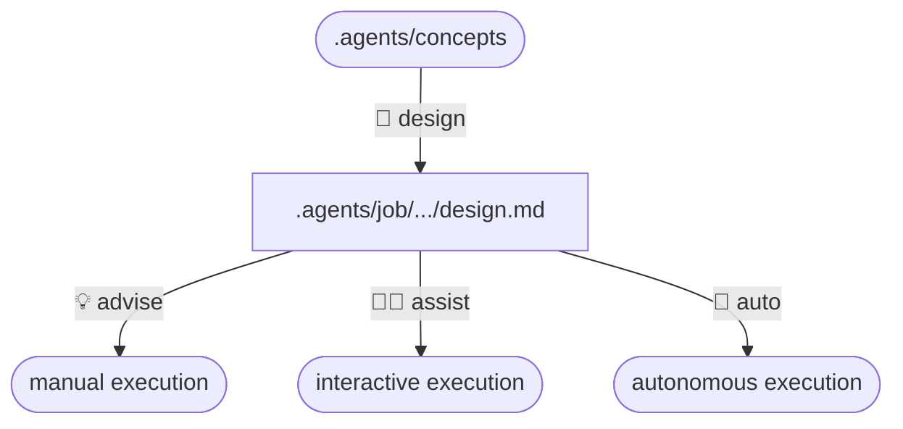

***The workflow engine for traceable autonomous job execution***


AutoCode is an OpenCode plugin that turns rough concepts into durable designs and completed solutions.

Run jobs autonomously with **Auto mode**, or stay in control with **Assist mode**, or receive guided tutorials with **Advise mode**.

No special UI required. AutoCode runs in OpenCode and keeps concepts and durable design workspaces in version-controllable text files, making it suited to remote development or server administration.

---

## Features

### Implementation Modes

- 💡 **Advise mode** — *guidance*: agent researches topics, answers questions, and guides manual implementation.
- 🧑‍💻 **Assist mode** — *interactive*: you make decisions while agent orchestration does the work and suggests next steps.
- 🤖 **Auto mode** — *autonomous*: agent executes structured design work until completion.

### Workflow Optimizations

- 📦 **Cross-project tasking** — delegate investigation or edits to isolated OpenCode sessions in external directories.
- 🪙 **Cost-saving workflows** — improve performance and reduce token usage with smart orchestration, tiered agent models, Caveman English.
- 🔒 **Secret-safe tools** — agents never see passwords or secrets; predefined keys resolve credentials at tool runtime.
- ⚠️ **Safe hand-offs** — provide a thorough manual task tutorial when an operation is unsafe.
- 📚 **Self-learning memory** — auto capture corrections, environment quirks, permissions, and user preferences as skills for future sessions.
- 🧹 **Agent cleanup** — agents remove temporary files and stop stray processes they started after debugging.

### Build-in Tools

- 🗄️ **Read-only database inspection** — discover configured database tables and read one table at a time without write access.
- 🌐 **HTTP REST client** — simulate API calls for troubleshooting.
- 🔀 **Git tools** — inspect changes and commit updates to Git repositories.
- 🔐 **SSH tools** — run remote commands and manage files through environment-keyed tools.
- 🧪 **Sandbox isolation** — agents automatically manage and experiment in their own isolated sandboxes.
- 🛠️ **Self-building tools** — agents create durable per-job Node `.mjs` tools, reconcile dependencies, run finite scripts, and manage long-running services.

As well as [OpenCode bundled tools](https://opencode.ai/docs/tools/).

## Installation

Install AutoCode as public OpenCode plugin. AI agents use [installation guide](docs/installation.md); humans use [human guide](docs/index.md#installation-for-humans).

### Prerequisites

- [OpenCode](https://opencode.ai) is required to load and use AutoCode.
- The npm package / plugin entry is `@ahumandev/autocode`.

#### Optional

- [Bubblewrap](https://github.com/containers/bubblewrap) is required only for Linux sandbox execution.
- [Bun](https://bun.sh) is required only to build the plugin from source, run tests, or install the local shim.
- [MCP servers](docs/index.md#linux-mcp-setup) MCP servers are optional integrations.

### Installation for LLM Agents

Fetch this guide and follow its OS branch.

**Windows CMD**

```cmd
curl -s https://raw.githubusercontent.com/ahumandev/autocode/refs/heads/main/docs/installation.md
```

**Linux Bash**

```bash
curl -s https://raw.githubusercontent.com/ahumandev/autocode/refs/heads/main/docs/installation.md
```

The guide detects OS at startup: use CMD for Windows agents and Bash for Linux agents.

### Installation for Humans

Use [human installation guide](docs/index.md#installation-for-humans).

Windows route uses native CMD. Linux route uses Bash and includes optional Bubblewrap setup. Both install the public plugin with:

```text
opencode plugin @ahumandev/autocode@latest -g -f
```

## Usage

AutoCode is an OpenCode plugin. It does not start a web server or expose a local URL. It registers managed agents, slash commands, generated skills, and tools.

At startup, AutoCode detects OS. Agents use CMD on Windows and Bash on Linux. Windows does not register sandbox agents or tools; Linux sandbox execution uses Bubblewrap when available. Generated skills are written to `<home>/.agents/skills`.

### Primary Agents

Agent availability uses final configured AutoCode tier: `spy` requires an explicit `spy` tier; `auto` requires an explicit `smart` tier. `balanced` does not enable `spy`.

|     | Agent    | Purpose                                                   |
| --- | -------- | --------------------------------------------------------- |
| 💡   | `advise` | Research topics, answer questions, and guide manual work. |
| 📐   | `design` | Design and propose solutions.                             |
| 🤖   | `auto`   | **Autonomously** solve problems.                          |
| 🧑‍💻   | `assist` | Assist **interactively** with problems.                   |
| 🕵️   | `spy`    | Primary, visible, read-only safety review and guidance.   |

### Behavioural Differences

| Agent    | Investigations | Next Action | Apply Changes |
| -------- | -------------- | ----------- | ------------- |
| 💡 advise | Autonomous     | Interactive | Human         |
| 🧑‍💻 assist | Autonomous     | Interactive | AI*           |
| 🤖 auto   | Autonomous     | Autonomous  | AI*           |

*Except dangerous tasks.

### Typical Workflow



Switch any time between `💡 advise` and `🧑‍💻 assist` and `🤖 auto` when work needs a different autonomy level. `🕵️ spy` cannot receive session handoff, used for special cases where private info needs to be inspected. 

## Reference

- [Installation](docs/installation.md) — AI installation guide with native CMD and Bash branches.
- [Documentation](docs/index.md) — human installation, verification, update, uninstall, and troubleshooting.

## Development

Build and local shim installation use cross-platform Bun scripts. Bun is required for source builds and tests, not public plugin installation.
