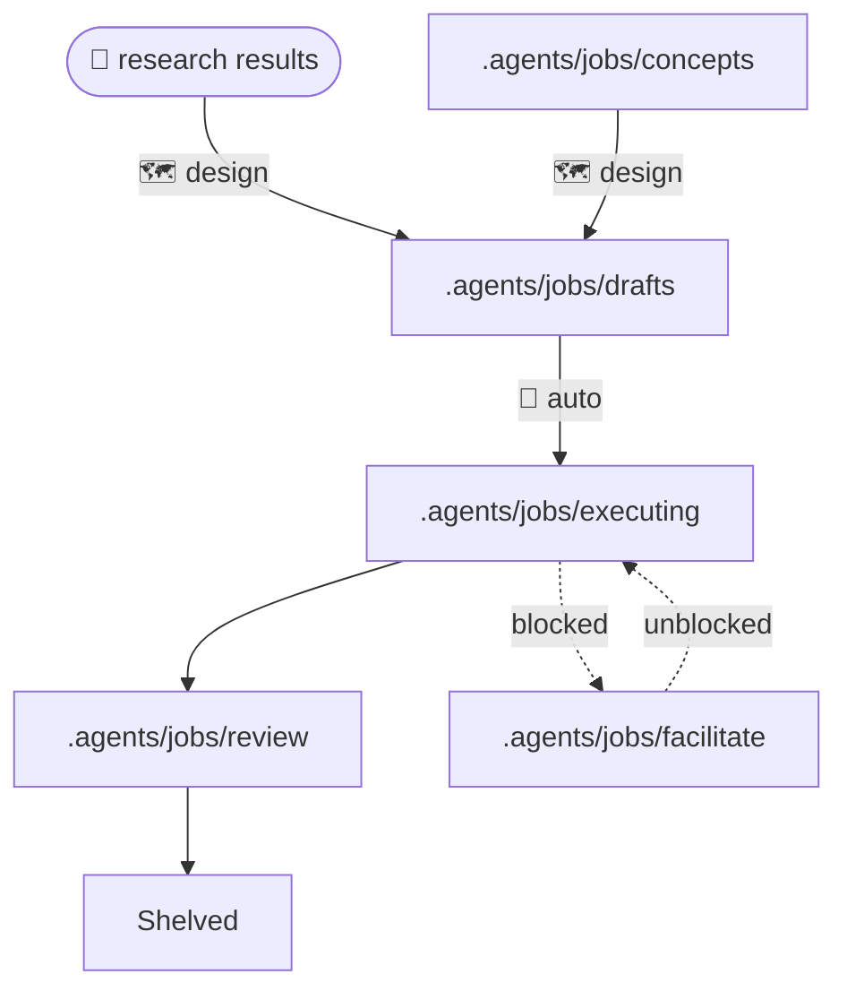
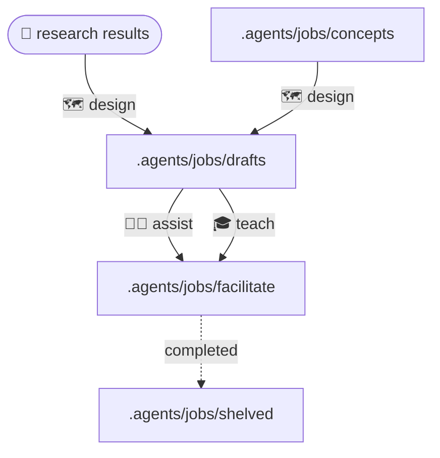

## Features

### Implementation Modes

- 🤖 **Auto mode** — *autonomous*: agent oversee full lifecycle of structured jobs until completion.
- 🧑‍💻 **Assist mode** — *interactive*: you make decisions, agent orchestration do the work, manage job lifecycle and suggest next steps.
- 🎓 **Teach mode** — *manual*: agents discover solutions, then guide manual implementation with step-by-step tutorials.

### Workflow Optimizations

- 📦 **Cross-project tasking** — delegate investigation or edits to isolated OpenCode sessions in external directories.
- 🪙 **Cost-saving workflows** — improve performance and reduce token usage with smart orchestration, tiered agent models, Caveman English.
- 🔒 **Secret-safe tools** — agents never see passwords or secrets; predefined keys resolve credentials at tool runtime.
- ⚠️ **Safe hand-offs** — provide a thorough manual task tutorial when an operation is unsafe.
- 📚 **Self-learning memory** — auto capture corrections, environment quirks, permissions, and user preferences as skills for future sessions.
- 🧹 **Agent cleanup** — agents remove temporary files and stop stray processes they started after debugging.

### Build-in Tools

- 🗄️ **Read-only database inspection** — discover configured database tables and read one table at a time without write access.
- 🌐 **HTTP REST client** — simulate API calls for troubleshooting.
- 🧪 **Sandbox isolation** — agents automatically manage and experiment in their own isolated sandboxes.
- 🔐 **SSH tools** — run remote commands and manage files through environment-keyed tools.
- 🔀 **Git tools** — inspect changes and commit updates to Git repositories.

As well as [OpenCode bundled tools](https://opencode.ai/docs/tools/).

## Installation

Install AutoCode as public OpenCode plugin. AI agents use [installation guide](docs/installation.md); humans use [human guide](docs/index.md#installation-for-humans).

### Prerequisites

- [OpenCode](https://opencode.ai) is required to load and use AutoCode.
- The npm package / plugin entry is `@ahumandev/autocode`.

#### Optional

- [Bubblewrap](https://github.com/containers/bubblewrap) is required only for Linux sandbox execution.
- [Bun](https://bun.sh) is required only to build the plugin from source, run tests, or install the local shim.
- [MCP servers](docs/index.md#linux-mcp-setup) MCP servers are optional integrations.

### Installation for LLM Agents

Fetch this guide and follow its OS branch.

**Windows CMD**

```cmd
curl -s https://raw.githubusercontent.com/ahumandev/autocode/refs/heads/main/docs/installation.md
```

**Linux Bash**

```bash
curl -s https://raw.githubusercontent.com/ahumandev/autocode/refs/heads/main/docs/installation.md
```

The guide detects OS at startup: use CMD for Windows agents and Bash for Linux agents.

### Installation for Humans

Use [human installation guide](docs/index.md#installation-for-humans).

Windows route uses native CMD. Linux route uses Bash and includes optional Bubblewrap setup. Both install the public plugin with:

```text
opencode plugin -g @ahumandev/autocode@latest
```

## Usage

AutoCode is an OpenCode plugin. It does not start a web server or expose a local URL. It registers managed agents, slash commands, generated skills, and tools.

At startup, AutoCode detects OS. Agents use CMD on Windows and Bash on Linux. Windows does not register sandbox agents or tools; Linux sandbox execution uses Bubblewrap when available. Generated skills are written to `<home>/.agents/skills`.

### Primary Agents

|     | Agent      | Purpose                                 |
| --- | ---------- | --------------------------------------- |
| 🔎   | `research` | Research topics & answer questions.     |
| 🗺️   | `design`   | Design and propose solutions.           |
| 🤖   | `auto`     | **Autonomously** solve problems.        |
| 🧑‍💻   | `assist`   | Assist **interactively** with problems. |
| 🎓   | `teach`    | Teach how to **manually** fix problems. |
| ✏️   | `edit`     | Edit files directly (fast & cheap).     |

### Autonomous Job Workflow



1. 🔎 `research` possibilities or create concept md document in `.agents/jobs/concepts`.
2. Run `/job-design` to investigate feasibility, design best approach and draft solution plan in `.agents/jobs/drafts/{job_name}/plan.md`.
3. Revise draft `plan.md` before autonomous handover.
4. Run `/job-execute` to execute `plan.md` fully autonomously.
5. The job will move automatically to `.agents/jobs/executing` while busy, `.agents/jobs/facilitate` if blocked and then to `.agents/jobs/review` when done.
6. When done, do manual testing, then:
   - *Reject* job with `/job-shelve` to shelve (clean up files) job or
   - *Accept* job with `/commit` to commit to git and shelve.

### Assisted Workflow



1. 🔎 `research` possibilities or create concept md document in `.agents/jobs/concepts`.
2. Run `/job-design` to investigate feasibility, design best approach and draft solution plan in `.agents/jobs/drafts/{job_name}/plan.md`.
3. Run one of these commands:
   - `/job-facilitate`: Execute `plan.md` semi-autonomously with assistant (you make decisions, assistant do work).
   - `/job-teach`: Execute `plan.md` manually with guiding teacher.
5. If `/job-execute` was chosen, then job will move automatically to `.agents/jobs/executing` while busy and then to `.agents/jobs/review` when done.
6. When done, do manual testing, then:
   - *Reject* job with `/job-shelve` to shelve (clean up files) job or
   - *Accept* job with `/commit` to commit to git and shelve.

### Hybrid Workflow

Combinations of Autonomous and Assisted Workflows are also possible as you can switch any time between `auto`, `assist`, `teach` agents.

For example you may start in `assist` mode and then later when you get busy, switch to `auto` mode so that agent can continue with your plan without your presence or vice versa.

## Reference

- [Installation](docs/installation.md) — AI installation guide with native CMD and Bash branches.
- [Documentation](docs/index.md) — human installation, verification, update, uninstall, and troubleshooting.

## Development

Build and local shim installation use cross-platform Bun scripts. Bun is required for source builds and tests, not public plugin installation.
