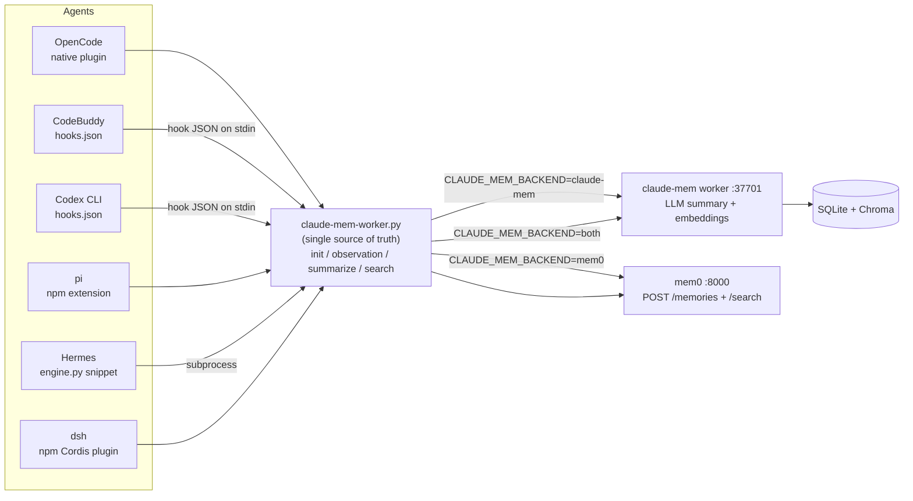

# agent-memory-bridge

**One bridge. Every AI coding agent. One shared, searchable memory.**

[English](./README.md) · [简体中文](./README.zh-CN.md)

[](./LICENSE)
[](./agents/pi/LICENSE)
[](./CONTRIBUTING.md)

**Mirrors —** [Gitee](https://gitee.com/camplus/agent-memory-bridge) · [GitHub](https://github.com/camplus360/agent-memory-bridge) · [npm: agent-memory-bridge](https://www.npmjs.com/package/agent-memory-bridge) · [npm: @camplus360/agent-memory-bridge-opencode](https://www.npmjs.com/package/@camplus360/agent-memory-bridge-opencode) · [npm: @camplus360/agent-memory-bridge-dsh](https://www.npmjs.com/package/@camplus360/agent-memory-bridge-dsh)

---

## ✨ Why you need this

Run several AI coding agents — **OpenCode, CodeBuddy, Codex CLI, pi, Hermes, DeepSeek Harness (dsh)** — and
each one invents its own memory capture: different hooks, different payloads,
different corner cases. Maintaining six separate hacks means the protocol
drifts, and one broken hook silently stops remembering anything.

**agent-memory-bridge** collapses all of that into **one source of truth** — a
single, shared, searchable memory across every agent you use.

---

## 🎯 Highlights

| 亮点 | 说明 |
|:--|:--|
| **🔄 多 Agent 适配** | OpenCode / CodeBuddy / Codex CLI / pi / Hermes / dsh 一套协议全兼容，六端共享同一记忆库 |
| **🚀 极致易用** | 一条命令安装，一条命令启用，`./install.sh --all` 搞定全部 |
| **🌍 多平台适配** | macOS / Linux / Windows(WSL) 通用，bash + curl + python3 零额外依赖 |
| **🔌 后端记忆库可拔插** | `claude-mem`（LLM 摘要 + 向量检索）/ `mem0`（服务端事实抽取）/ `both`（双写），一个环境变量切换 |
| **📥 自动捕获** | 自动记录用户提问、工具调用、助手回复、会话结束，无需手动操作 |
| **🌐 中英双语** | 完整英文 + 简体中文文档，README 双语同步 |

---

## Features

- **One repository, pick your agents** — install adapters for OpenCode, CodeBuddy, Codex CLI, pi, Hermes and/or dsh with a single `./install.sh --agent <name>`.
- **One protocol, six adapters** — session id namespacing (`<agent>-<sessionId>`) prevents cross-agent collisions; payload fields are identical everywhere.
- **npm-installable adapters** — pi (`npm:agent-memory-bridge`), opencode (`npm:@camplus360/agent-memory-bridge-opencode`) and dsh (`npm:@camplus360/agent-memory-bridge-dsh`) ship as installable npm packages; one command to add, one to enable.
- **Pluggable backends** — `claude-mem` (session-based, LLM summaries), `mem0` (flat, server-side fact extraction), or `both` (dual-write), switched with one environment variable.
- **Hook-safe by design** — short timeouts, retries with backoff, and a silent `exit 0` when the worker is down. Your editor never hangs on a memory call.
- **Correct JSON** — built with `jq` / `python3`, so quotes, backslashes and multiline tool output cannot corrupt a payload.
- **Tested** — the OpenCode plugin ships with 8 mocked tests; `test-hooks.sh` runs every shell hook against a local mock worker.
- **Cross-platform** — pure bash + curl + python3, no compiled dependencies; runs on Linux, macOS and WSL.

---

## Architecture



All six agents share **one memory store**, so something you told OpenCode can be recalled from CodeBuddy — or Codex, pi, Hermes, or dsh.

---

## Quick start

### Prerequisites

- `bash`, `curl`, [`jq`](https://jqlang.github.io/jq/), `python3`
- a running memory backend:
  - **claude-mem** (default): install and start the worker, then verify
    `curl -s http://127.0.0.1:37701/api/health` returns `"status":"ok"`;
  - **mem0** (optional): a mem0 server on port 8000.

```bash
# Gitee (faster in mainland China)
git clone https://gitee.com/camplus/agent-memory-bridge.git
# or GitHub
git clone https://github.com/camplus360/agent-memory-bridge.git
cd agent-memory-bridge
```

### Install

```bash
./install.sh --all                 # every supported agent
./install.sh --agent codebuddy     # just one
./install.sh --agent codex         # Codex CLI (merges ~/.codex/hooks.json)
./install.sh --dry-run             # preview every action without writing
```

The installer copies `claude-mem-worker.py` to `~/.local/share/claude-mem/`, writes a `.env` / `.env.example` template, and places each chosen adapter in the agent's real config location. Override the root with `--prefix` or `CLAUDE_MEM_INSTALL_ROOT`.

### Verify

```bash
python3 ~/.local/share/claude-mem/claude-mem-worker.py health   # backend reachable
./test-hooks.sh                                              # exercise every hook with a mock worker
```

Then follow the **one-time enable step** for your agent (register the plugin, merge hooks into `settings.json`, etc.) — see [docs/INSTALL.md](./docs/INSTALL.md).

---

## Supported agents

| Agent | Adapter | Integration style | Via unified script |
|---|---|---|---|
| **OpenCode** | [`agents/opencode`](./agents/opencode) | native plugin with unit tests; **npm-installable** (`@camplus360/agent-memory-bridge-opencode`); spawns the unified `.py` shim by default | **yes** (default; `CLAUDE_MEM_TRANSPORT=http` bypasses) |
| **pi** | [`agents/pi`](./agents/pi) | native TS extension, **npm-installable** (`pi install npm:agent-memory-bridge`) or local-path; spawns the unified `.py` shim by default | **yes** (default; `CLAUDE_MEM_TRANSPORT=http` bypasses) |
| **dsh (DeepSeek Harness)** | [`agents/dsh`](./agents/dsh) | native Cordis plugin, **npm-installable** (`dsh plugin --profile <name> add @camplus360/agent-memory-bridge-dsh`); talks to the worker over HTTP | **no** (native HTTP client) |
| **CodeBuddy** | [`agents/codebuddy`](./agents/codebuddy) | `hooks.json` command hooks, JSON on stdin | **yes** |
| **Codex CLI** | [`agents/codex`](./agents/codex) | `~/.codex/hooks.json` command hooks, JSON on stdin (trust once via `/hooks`) | **yes** |
| **Hermes** | [`agents/hermes`](./agents/hermes) | `engine.py` subprocess snippet | **yes** |

Agents with a native HTTP client call the worker directly; agents that can only execute external commands go through the shell wrapper. Both produce the exact same protocol.

---

## Choosing a memory backend

Set `CLAUDE_MEM_BACKEND` (default `claude-mem`):

| Backend | Behaviour |
|---|---|
| `claude-mem` | session lifecycle: `init` → `observation` → `summarize`; the worker runs LLM summarization |
| `mem0` | flat: one `observation` = one `POST /memories` (facts inferred server-side); `init`/`summarize` are no-ops |
| `both` | dual-write to both stores |

```bash
CLAUDE_MEM_BACKEND=mem0 python3 claude-mem-worker.py observation codebuddy s1 "..." /tmp user_prompt codebuddy
CLAUDE_MEM_BACKEND=both python3 claude-mem-worker.py search "keyword" 5
```

`mem0-worker.py` is a thin wrapper equivalent to `CLAUDE_MEM_BACKEND=mem0`. mem0 variables: `MEM0_HOST` (localhost), `MEM0_PORT` (8000), `MEM0_API_KEY` (optional), `MEM0_USER_ID` ($USER), `MEM0_INFER` (true), or a full `MEM0_BASE_URL`.

> **mem0 tenancy pitfall:** an API key is bound to a specific user view. Writes and searches must use the same view, or a stored memory will never show up in search.

---

## Unified script reference

```bash
python3 claude-mem-worker.py init        <agent> <sessionId> [cwd] [project] [prompt]
python3 claude-mem-worker.py observation <agent> <sessionId> <text> [cwd] [toolName] [platformSource]
python3 claude-mem-worker.py summarize   <agent> <sessionId> [lastAssistantMessage] [platformSource]
python3 claude-mem-worker.py turn        <agent> <sessionId> <transcriptPath> [cwd] [platformSource]
python3 claude-mem-worker.py search      <query> [limit]
python3 claude-mem-worker.py health
python3 claude-mem-worker.py hook        <agent>   # reads Claude Code/CodeBuddy/Codex hook JSON from stdin
```

`hook` maps stdin events automatically:

| stdin `hook_event_name` | Forwards to |
|---|---|
| `SessionStart` | accepted but not uploaded (the first real session is created on prompt, avoiding empty sessions) |
| `UserPromptSubmit` | `init` + prompt storage |
| `PostToolUse` | `observation` (`tool_name=<tool>`) |
| `Stop` | `summarize` |

Environment overrides: `CLAUDE_MEM_WORKER_HOST` (127.0.0.1), `CLAUDE_MEM_WORKER_PORT` (37701), `CLAUDE_MEM_HTTP_TIMEOUT` (8s), `CLAUDE_MEM_HTTP_RETRIES` (2), `CLAUDE_MEM_QUIET` (0).

---

## Documentation

- [docs/INSTALL.md](./docs/INSTALL.md) — full step-by-step install and per-agent enablement
- [docs/CONFIG-REFERENCE.md](./docs/CONFIG-REFERENCE.md) — copy-ready config snapshots + pitfalls per agent
- [docs/AGENT-RUNTIME-ARCH.md](./docs/AGENT-RUNTIME-ARCH.md) — the worker's two data paths (REST storage vs. Claude-CLI-based compression)
- [docs/REGRESSION-TEST-STANDARD.md](./docs/REGRESSION-TEST-STANDARD.md) — acceptance baseline: hook events, recall and summaries
- [agents/pi/DEPLOY.md](./agents/pi/DEPLOY.md) — deploying the pi memory extension

> Chinese originals of the four guides are kept under [`docs/zh/`](./docs/zh).

---

## Roadmap

- more agent adapters (Claude Code CLI, Gemini CLI, Cursor, ...)
- a packaged release with checksums
- end-to-end tests against an ephemeral worker container

---

## Contributing

Issues and PRs are welcome. A new agent adapter needs only two things: capture its lifecycle events (session start, user prompt, tool calls, assistant reply, session end) and map them to the unified script or the equivalent JSON payload. Please add a mock-based test or a `test-hooks.sh` case.

---

## License

This is a **multi-licensed** repository (see [NOTICE](./NOTICE) for the full
component inventory):

- the unified worker client, installer, tests, and the CodeBuddy / Codex / Hermes /
  OpenCode / dsh adapters are original work under the **MIT License** — [LICENSE](./LICENSE);
- the [`agents/pi/`](./agents/pi) adapter is a derivative fork kept under
  **GNU AGPL-3.0-or-later** (it derives from the AGPL-era claude-mem /
  pi-agent-memory) — [agents/pi/LICENSE](./agents/pi/LICENSE) and
  [agents/pi/NOTICE](./agents/pi/NOTICE).

The components communicate only by spawning separate processes and over local
HTTP; they are separate programs aggregated in one repository, so the AGPL
component does not propagate to the MIT-licensed parts. The claude-mem and
mem0 workers are external Apache-2.0 programs, merely interoperated with and
not bundled in this repository.
