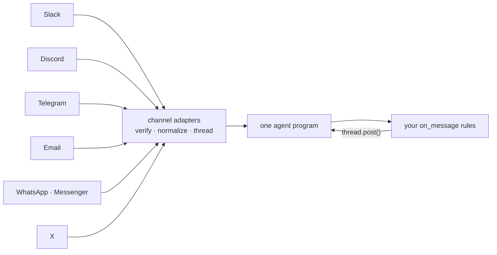

<p align="center">
  <picture>
    <source media="(prefers-color-scheme: dark)" srcset="assets/banner-dark.svg">
    
  </picture>
</p>

<p align="center">
  <a href="https://trendshift.io/repositories/91107?utm_source=trendshift-badge&utm_medium=badge&utm_campaign=badge-trendshift-91107" target="_blank" rel="noopener noreferrer"></a>
</p>

<p align="center">
  <a href="https://trycaspianai.com">Website</a>
  ·
  <a href="https://pypi.org/project/caspian-sdk/">PyPI</a>
  ·
  <a href="https://www.npmjs.com/package/caspian-sdk">npm</a>
  ·
  <a href="https://api.trycaspianai.com/SKILL.md">SKILL.md for agents</a>
  ·
  <a href="./CONTRIBUTING.md">Contributing</a>
</p>

<p align="center">
  <b>English</b> · <a href="./README.zh-CN.md">简体中文</a>
</p>

<p align="center">
  <a href="https://github.com/TryCaspian/caspian-sdk/actions/workflows/ci.yml"></a>
  <a href="https://pypi.org/project/caspian-sdk/"></a>
  <a href="https://pepy.tech/project/caspian-sdk"></a>
  <a href="https://www.npmjs.com/package/caspian-sdk"></a>
  <a href="https://pypi.org/project/caspian-sdk/"></a>
  <a href="./LICENSE"></a>
  <a href="https://github.com/TryCaspian/caspian-sdk"></a>
</p>

<p align="center">
  <strong>The largest OSS agent frameworks each built 25+ channel adapters — and still spend<br/>8–15% of their issue trackers on channel plumbing. Caspian makes it one handler.</strong>
</p>

<p align="center">
  
</p>

---

Caspian is an **agent communication** SDK. Your agent's reasoning decides **what** to say; Caspian is **how it exists** on **Slack, Discord, Telegram, email, WhatsApp, X, Linear**, and beyond — one `channels.add()` per channel, declarative rules for all of them, threading, webhook verification, and platform quirks handled.

Most agent communication work is agent-to-human, not agent-to-agent. Protocols like A2A and ACP connect agents to each other; Caspian connects your agent to the people it works for, on the channels they already use.

**Version 1.0** is a full rewrite. The public surface is `Caspian` (not the legacy `CommClient` from 0.6.x). See [Migrating from 0.6.x](#migrating-from-06x) below.

## Get started in 30 seconds

**Building in a coding agent** (Claude Code, Codex, Cursor, Kimi, …)? Paste this — it reads the live guide and does the whole integration for you:

```text
Integrate Caspian so my agent can message people on email, Slack, Discord, Telegram, and more.
Read https://api.trycaspianai.com/SKILL.md and follow it end to end.
```

That's the fastest path — the guide at [`/SKILL.md`](https://api.trycaspianai.com/SKILL.md) is always current.

**Or set it up by hand:**

```bash
pip install caspian-sdk        # Python 3.10+
npm install caspian-sdk        # TypeScript / Node 18+ / Bun
```

Get an API key from [dashboard.trycaspianai.com](https://dashboard.trycaspianai.com), then:

**Hosted** — Caspian's gateway owns inbound; your process polls for events:

```python
from caspian import Caspian

cx = Caspian(api_key="...")                          # or CASPIAN_API_KEY in .env
cx.channels.add("telegram", bot_token="...")         # Telegram is BYO BotFather token

@cx.on_message({"overlap": "queue", "ack": "On it…"})
def handle(thread, msg, ctx):
    thread.post(f"You said: {msg.text}")

cx.run()   # polls the gateway — Ctrl+C to stop
```

**Self-host** — your process, your tokens, no gateway polling:

```python
cx = Caspian()
cx.channels.add("telegram", via="self-host", bot_token="...",
                webhook_url="https://your.server/telegram")

@cx.on_message({"channel": "telegram"})
def handle(thread, msg, ctx):
    thread.post(f"You said: {msg.text}")

# from your HTTP route:
results = cx.handle("telegram", request_body, request_headers)
```

Discord and Slack can receive over a held-open socket instead of a public webhook — `cx.listen("discord")` (requires optional extra `caspian-sdk[discord]`).

**TypeScript** — same contract:

```ts
import { Caspian } from "caspian-sdk"

const cx = new Caspian()

await cx.channels.add("telegram", {
  via: "self-host",
  botToken: process.env.TELEGRAM_BOT_TOKEN!,
  webhookUrl: "https://your.server/telegram",
})

cx.onMessage({ channel: "telegram", overlap: "queue" }, async (thread, msg) => {
  await thread.post(`You said: ${msg.text}`)
})

// POST your webhook route → cx.webhooks.telegram(req)
```

Adding a channel is one more `channels.add()` call — handler rules stay the same.

### CLI

The rewrite CLI lives in [`packages/cli`](./packages/cli) (TypeScript + Bun). It is a thin client of the same SDK surface — catalog discovers, `call` invokes:

```bash
caspian init                 # mint a key → ~/.caspian/.env or project .env
caspian channels add telegram
caspian channels add telegram --via self-host --bot-token "$TG" \
  --webhook-url https://myapp.example.com/hook
caspian call post --thread telegram:123:456 --text "shipping now"
caspian threads tail telegram:123:456
```

See [`packages/cli/README.md`](./packages/cli/README.md) for the full command map.

## Delete your adapter layer

<table>
<tr>
<th>Without Caspian</th>
<th>With Caspian</th>
</tr>
<tr>
<td>

```python
# slack_bolt app + socket handler
# discord.py client + intents + reconnect
# python-telegram-bot + webhook server
# smtplib/imap polling + threading logic
# 4 auth flows, 4 payload shapes,
# 4 retry/backoff paths, 4 dedup caches,
# per-channel identity bugs...
# ~1,500 lines before your agent
# says a single word
```

</td>
<td>

```python
cx.channels.add("email", via="self-host", ...)
cx.channels.add("telegram", via="self-host", bot_token=TG, webhook_url=URL)
cx.channels.add("slack", via="self-host", bot_token=SLACK, ...)

@cx.on_message({"overlap": "queue"})
def handle(thread, msg, ctx):
    thread.post(agent(msg.text))

cx.run()          # hosted
# or cx.listen("slack") / cx.handle(channel, body, headers)
```

</td>
</tr>
</table>

> **Using a coding agent?** Point it at [`SKILL.md`](https://api.trycaspianai.com/SKILL.md) — it can do the entire integration for you.

## The problem

Every agent team ends up rebuilding the same four things — and none of them make the agent smarter.

**1. You own infrastructure you never wanted.** Writing the Slack bot is a weekend; owning it is forever. Session/auth desync, reconnect loops, silent connection failures, payload changes on every platform version bump. The pain isn't `send()` — sending is a solved call. The pain is the **lifecycle**. The largest OSS agent frameworks each maintain 25+ channel adapters in-tree and still spend 8–15% of their issue trackers on channel plumbing. (We measured 42 open-source agent projects before writing a line of this code.)

**2. Communication isn't part of your agent's decision-making.** With one-off, per-channel integrations, a developer decided at build time where and how the agent talks. The agent itself can't reason *"this deserves a quick Telegram ping now and an email summary afterwards"* — each channel is a separate bot with separate code and a separate identity. Communication stays hardcoded plumbing instead of becoming a capability the model can actually decide with.

**3. You maintain N identities for every one person.** The same human DMs your agent on Instagram today and emails it tomorrow. Now *your* database needs its own concept of "this is one person, one relationship, one running conversation" — who said what on which channel, and what should happen next in the flow. Every team rebuilds that continuity layer from scratch, per app, and it never stops needing care.

**4. A single-channel agent is a competitive disadvantage.** If a competing agent is reachable on five channels and yours on one, users go where they get answered. The open-source numbers show it: the agents people actually rely on are exactly the ones deployed across dozens of human channels — and that reach is exactly where their engineering time goes.

## Caspian's answer

**Channels are transports, not identities.** The agent is one program (`cx.app.rules` is inspectable data); every channel binds through the same adapter interface, and your handler code works against a normalized `Thread` / `Message` model. Messages arrive as kernel events regardless of transport, overlap policies (`queue` / `debounce` / `drop` / `parallel`) serialize concurrent chats, and `thread.post()` / `thread.reply()` always answer in the right place.



**Hosted or self-host, same code.** `via="hosted"` (default) uses the Caspian gateway at `https://api.trycaspianai.com` — set `CASPIAN_API_KEY` and optionally `CASPIAN_BASE_URL`. `via="self-host"` runs adapters in your process with your platform tokens. Switch modes without rewriting handlers.

## Features

<table>
<tr>
<td width="50%" valign="top">

**🧵 Declarative rules, one program**<br/>
`@cx.on_message({"channel": "telegram", "command": "help"})` — filters for channel, chat kind, command, overlap, and instant ack. Your bot is data: `cx.app.rules` is inspectable and testable offline.

</td>
<td width="50%" valign="top">

**🔐 Webhook verification, always**<br/>
Slack signing secret, Meta `X-Hub-Signature-256`, Telegram secret header, X CRC, and signed email webhooks. Mismatches rejected.

</td>
</tr>
<tr>
<td valign="top">

**☁️ Hosted or self-host**<br/>
Gateway polling with `cx.run()`, or bring your own tokens and webhooks/sockets with `via="self-host"`. Same handler rules either way.

</td>
<td valign="top">

**🧪 Offline fakes for every channel**<br/>
Adapters consume each platform's *real* payload shapes — 650+ tests across Python + TypeScript, zero network in CI.

</td>
</tr>
<tr>
<td valign="top">

**⌨️ Typing, streaming, rich sends**<br/>
`thread.typing()`, `thread.stream()` (post once, edit as it writes), `thread.send_media()`, `thread.send_blocks()`, reactions, pins, forwards, and cold DMs.

</td>
<td valign="top">

**🤖 Model tools from the same surface**<br/>
`cx.tools(thread)` exposes the Command catalog (post, react, send-photo, …) with schemas derived from the kernel — same API your handlers use.

</td>
</tr>
<tr>
<td valign="top">

**🔌 Per-channel packs (TypeScript)**<br/>
Import `caspian-sdk/telegram`, `caspian-sdk/discord`, `caspian-sdk/slack`, and the rest for parse/plan/execute without pulling the whole facade.

</td>
<td valign="top">

**📡 Socket inbound (Discord, Slack)**<br/>
No public URL required — `cx.listen("discord")` or `cx.listen("slack")` over a held-open websocket (optional extras).

</td>
</tr>
</table>

## Channels

Self-host adapters ship in the SDK for the channels below. Hosted mode covers any channel the gateway supports (including Bluesky, Instagram, and channels with no local adapter).

| Channel | Self-host (`via="self-host"`) | Hosted (`via="hosted"`) |
|---|:---:|:---:|
|  &nbsp;Telegram (bot) | ✅ webhook or poll | ✅ BYO bot token |
|  &nbsp;Discord | ✅ socket | ✅ |
|  &nbsp;Slack | ✅ socket or webhook | ✅ |
|  &nbsp;Email | ✅ | ✅ instant inbox |
|  &nbsp;WhatsApp Business | ✅ | ✅ one-click |
|  &nbsp;Facebook Messenger | ✅ | ✅ |
|  &nbsp;X / Twitter | ✅ * | ✅ |
| 📶 SMS · voice (Twilio) | ✅ | ✅ no hardware |
|  &nbsp;iMessage | ✅ | ✅ |
|  &nbsp;Linear | ✅ | — |
|  &nbsp;Bluesky | — | ✅ |
|  &nbsp;Instagram DM | — | ✅ |

<p align="center">
  <a href="https://trycaspianai.com"></a>
</p>

<details>
<summary><b>* The fine print</b> — read before you promise features</summary>
<br/>

- **X is not free**: DM send/receive needs a paid X API subscription on your X developer app (the free tier is write-only and capped).
- **GSM modem SMS**: your own modem + SIM; carrier compliance (A2P rules) is on you.

</details>

## Where to use it

If your agent needs to talk to humans, this is the layer under it:

- **Customer support agents** — answer on email, Slack, Instagram DM, or wherever the customer opened the thread; hand off to a human without dropping context.
- **Sales & lead follow-up** — first touch on the channel the lead used, follow-ups where they actually respond.
- **Personal / executive assistants** — one assistant identity across your email, Telegram, and Slack instead of three disconnected bots.
- **Community & product bots** — the same agent in your Discord, your Slack community, and members' DMs.
- **OpenClaw agents** — `clawhub install @trycaspian/caspian` ([the skill](./packages/clawhub-skill)) teaches your agent to wire itself up; [`openclaw-caspian`](./packages/openclaw) is the native channel plugin.
- **OpenCode agents** — [`caspian-opencode-plugin`](https://www.npmjs.com/package/caspian-opencode-plugin) bridges Caspian email / Telegram / Discord into OpenCode sessions. Details: [`packages/opencode`](./packages/opencode).

Start from a [runnable example](./examples) — one folder per channel, shared handlers in `app.py` / `app.ts`.

## Recipes

**Same agent, three channels:**

```python
cx.channels.add("email", display_name="Acme Support")
cx.channels.add("telegram", bot_token=BOT_TOKEN)
cx.channels.add("slack", bot_token=SLACK_TOKEN, signing_secret=SLACK_SECRET)
# the @cx.on_message rules you already wrote now answer on all three
cx.run()
```

**Filter by command and chat kind:**

```python
@cx.on_message({"channel": "telegram", "command": ["start", "help"]})
def help_menu(thread, msg, ctx):
    thread.post("Commands: /help /status /ping")

@cx.on_message({"channel": "telegram", "kind": "dm"})
def dm_only(thread, msg, ctx):
    thread.post(f"DM from {msg.sender}: {msg.text}")
```

**Streaming reply:**

```python
@cx.on_message({"channel": "telegram", "overlap": "stream"})
def stream_story(thread, msg, ctx):
    with thread.stream(min_chars=1, throttle=0.25) as out:
        for chunk in ["Once ", "upon ", "a time…"]:
            out.append(chunk)
```

**Callback buttons:**

```python
@cx.on_action({"channel": "telegram", "data": "help"})
def on_help_button(thread, action, ctx):
    thread.post("You tapped Help.")
```

## Rich messages

Send blocks through `thread.send_blocks()` — each channel renders its best native shape (Slack Block Kit, Discord embeds, Telegram keyboards) and text-only channels degrade automatically.

```python
from caspian import Button

thread.send_blocks(
    (),
    text="Order #1024 shipped — arriving Thursday.",
    actions=(
        Button(label="Track package", url="https://example.com/track/1024"),
        Button(label="Get help", data="help:1024"),
    ),
)
```

```typescript
await thread.sendBlocks([], {
  text: "Order #1024 shipped — arriving Thursday.",
  actions: [
    { label: "Track package", url: "https://example.com/track/1024" },
    { label: "Get help", data: "help:1024" },
  ],
})
```

## What's in this repo

| Package | |
|---|---|
| [`packages/python`](./packages/python) | `caspian-sdk` (PyPI) — Python client: `Caspian`, `channels.add()`, `@on_message` / `@on_action`, hosted + self-host adapters. Import: `from caspian import Caspian`. |
| [`packages/typescript`](./packages/typescript) | `caspian-sdk` (npm) — TypeScript client: same contract, camelCase API, per-channel subpath exports. |
| [`packages/cli`](./packages/cli) | `@caspian/cli` — Bun CLI: `init`, `channels add`, `catalog`, `call`, `threads tail`. |
| [`packages/openclaw`](./packages/openclaw) | `openclaw-caspian` — OpenClaw channel plugin. |
| [`packages/opencode`](./packages/opencode) | [`caspian-opencode-plugin`](https://www.npmjs.com/package/caspian-opencode-plugin) — OpenCode plugin. |
| [`packages/clawhub-skill`](./packages/clawhub-skill) | The ClawHub skill — publishes the live gateway SKILL.md. |
| [`examples`](./examples) | One self-host example per adapter; [`examples/telegram/hosted.py`](./examples/telegram/hosted.py) for hosted Telegram. |

Package READMEs have the full API surface: [`packages/python/README.md`](./packages/python/README.md), [`packages/typescript/README.md`](./packages/typescript/README.md).

## Migrating from 0.6.x

The 0.6.x `CommClient` API (`from caspian_sdk import CommClient`, `connect_*()`, `message.reply()`) is a different SDK. It remains published on PyPI/npm; its source is tagged `legacy-sdk-0.6.x` in this repository.

| 0.6.x | 1.0 |
|---|---|
| `CommClient()` | `Caspian()` |
| `client.connect_telegram(...)` | `cx.channels.add("telegram", ...)` |
| `@client.on_message` / `message.reply()` | `@cx.on_message({...})` / `thread.post()` |
| `client.listen()` | `cx.run()` (hosted) or `cx.handle()` / `cx.listen()` (self-host) |

There is no drop-in migration path — new projects should start on 1.0.

## Starter templates

Ready-to-run repos — click "Use this template", add a token, and your agent is live on the channel:

| Template | Channel | Language |
|---|---|---|
| [`telegram-ai-agent-template`](https://github.com/TryCaspian/telegram-ai-agent-template) | Telegram | Python |
| [`discord-ai-agent-template`](https://github.com/TryCaspian/discord-ai-agent-template) | Discord | Python |
| [`slack-ai-agent-template`](https://github.com/TryCaspian/slack-ai-agent-template) | Slack | Python |
| [`email-ai-agent-template`](https://github.com/TryCaspian/email-ai-agent-template) | Email (instant inbox) | Node.js |
| [`openclaw-telegram-agent`](https://github.com/TryCaspian/openclaw-telegram-agent) | OpenClaw + Telegram | guide |

## Roadmap

- **MCP server** — connect and message channels straight from any MCP-capable agent
- **Reddit & LinkedIn adapters** — next channels in the pipeline
- **Agent-native payments** — pay-as-you-go via API, x402-ready, no dashboard
- **More adapters** — the interface is small on purpose; [add one](./CONTRIBUTING.md)

## Community & support

- **Questions, ideas, show & tell** — [GitHub Discussions](https://github.com/TryCaspian/caspian-sdk/discussions)
- **Bugs** — [GitHub issues](https://github.com/TryCaspian/caspian-sdk/issues)
- **Security** — see [SECURITY.md](./SECURITY.md) (please, no public issues for vulnerabilities)
- **Hosted product & contact** — [trycaspianai.com](https://trycaspianai.com)

## Development

```bash
git clone https://github.com/TryCaspian/caspian-sdk.git
cd caspian-sdk && uv sync
uv run pytest                              # Python SDK tests (packages/python)
uv run ruff check .
cd packages/typescript && bun install && bun run ci   # typecheck + lint + 235 tests
cd ../cli && bun install && bun run ci                # CLI tests
```

Contributions welcome — see [CONTRIBUTING.md](./CONTRIBUTING.md).

**If Caspian saved you time, [a star](https://github.com/TryCaspian/caspian-sdk/stargazers) helps other agent builders find it.** ⭐

## License

Apache-2.0 for this repository. The `caspian-sdk` package on PyPI is MIT.
