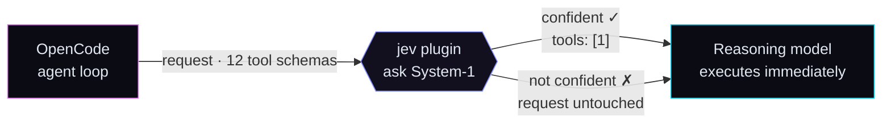

<div align="center">


<br />

[](https://www.npmjs.com/package/@danipl/opencode-jev)
[](https://github.com/danipl/opencode-jev/actions/workflows/pr.yml)
[](./LICENSE)
[](https://opencode.ai)

[](https://github.com/danipl/opencode-jev/releases/latest) <!-- x-release-please-version -->

**Your reasoning model should think about your problem — not about which of twelve tools to call.**
`opencode-jev` puts TypeSafe's cheap, fast System-1 model in front of every inference request: it picks
the next tool, trims the request to that one tool, and lets the expensive model do what you pay it for.

[How it works](./docs/HOW_IT_WORKS.md) · [Developer guide](./docs/DEVELOPMENT.md) · [CI/CD](./docs/CICD.md) · [Config example](./jev.yaml.example)

</div>

---

## Why

Every iteration of an agentic loop re-sends the whole conversation **plus every tool schema** to a
premium model, which burns tokens and latency deliberating between `read`, `grep`, `edit`, `bash`,
MCP tools… — a routing decision, repeated every turn, billed at reasoning prices.

**The fix:** this plugin observes each outbound inference request (OpenCode V2 `http.request` session
hook), asks **Jev** — a cheap, fast, *calibrated* System-1 model — which of the request's tools comes
next, and when Jev is confident enough, trims the `tools` array down to that single tool. The
reasoning model then *executes* instead of deliberating. Dropped tool schemas also shrink the
request itself.



Trimming — **not** pinning via `tool_choice` — is deliberate: providers reject forced `tool_choice`
in thinking mode (HTTP 400), while a single offered tool is always valid.

The full picture — diagrams inside the agentic loop, the token/latency math, and the trust dial —
lives in [**docs/HOW_IT_WORKS.md**](./docs/HOW_IT_WORKS.md).

## At a glance

| | |
| --- | --- |
| ⚡ **System-1 routing** | Jev answers *"which tool next, and how sure am I?"* — fast, cheap, calibrated. |
| ✂️ **Trim, don't pin** | Only the `tools` array shrinks; `tool_choice` is never touched. Always provider-valid. |
| 🛡️ **Fail-safe by design** | Low confidence, network error, timeout, parse error, bad key → original request passes through untouched. It can never break a session. |
| 🔭 **Live decision log** | Every request ends in one tagged line — `apply:` or `bypass:` with the reason. `tail -f` it. |
| 🫥 **Invisible when unconfigured** | No API key → no hook registered, no log file, zero latency. |
| 🔌 **Any compatible gateway** | Anthropic Messages (`/v1/messages`), OpenAI Chat Completions (`/chat/completions`), OpenAI Responses (`/responses`) — path-matched. |

## Quick start

**1. Register the plugin** — OpenCode installs it automatically on next start:

```jsonc
// opencode.jsonc — project-level or ~/.config/opencode/
{
  "plugins": ["@danipl/opencode-jev"]
}
```

Requires OpenCode **V2** (`Plugin.define` API; V1 hosts reject it).

The bare name tracks the **`latest`** dist-tag — every publish moves it, so a plain
`"plugins": ["@danipl/opencode-jev"]` keeps you current with zero maintenance. Pin an exact
version for reproducibility or to freeze a known-good release:

```jsonc
{ "plugins": ["@danipl/opencode-jev@1.1.0"] } // x-release-please-version — exact version, never auto-updates
```

Heads-up while pre-1.0: `feat:` releases (minor bumps) *can* change behavior. If that matters to
you, pin; otherwise `latest` is the recommended choice.

**2. Set an API key** — either method:

```bash
export TYPESAFE_API_KEY="apikey_..."
```

or copy [`jev.yaml.example`](./jev.yaml.example) to `jev.yaml` next to your OpenCode config
(or anywhere, pointed to by `JEV_CONFIG_PATH`).

**3. Watch it route:**

```bash
tail -f /tmp/opencode-jev.log
```

That's it. Run a session — you'll see `apply:` lines where Jev trimmed the tools and `bypass:`
lines (with reasons) where the request went through untouched.

## Configuration

Config sources — first defined value wins per field:

1. `$JEV_CONFIG_PATH` file (JSON or YAML)
2. `./jev.config.yaml` / `.yml` / `.json`
3. `./.opencode/jev.yaml` / `jev.json`
4. `~/.config/jev/config.yaml` / `config.json`
5. plugin options (directory-package registrations only)
6. env `TYPESAFE_API_KEY` / `JEV_API_URL` / `JEV_MIN_CONFIDENCE`

| Env var | Default | Meaning |
| --- | --- | --- |
| `JEV_MODEL` | `jev-latest` | Jev model id |
| `JEV_TIMEOUT_MS` | `2000` | Jev round-trip timeout |
| `JEV_DEBUG_FILE` | `/tmp/opencode-jev.log` | decision log path |
| `JEV_DEBUG` | — | `1` echoes the log to stdout |
| `JEV_DEBUG_MAX_BYTES` | `262144` | log rotation cap (one `.1` backup) |

## Safety

Jev must never break a session. The request passes through **untouched** on: low confidence,
`respond_to_user`, payloads with no usable tools or an already-pinned `tool_choice`, network
failure, timeout, parse errors, or an invalid API key (latched off after the first 401/403 — zero
added latency afterwards). Only primary agent-loop requests are considered
(`event.kind === "primary"`); title/compaction traffic is skipped. Responses-API built-in tools
(`type !== "function"`) are never offered to Jev and never trimmed to.

### Reading the decision log

Every decision is appended to the debug log — `tail -f /tmp/opencode-jev.log` to watch routing
live. Each request ends in one tagged line:

- **`apply:`** — Jev acted; tools trimmed to its pick.
- **`bypass:`** — request untouched, with the reason.

Line-by-line interpretation:
[docs/DEVELOPMENT.md — "Reading the decision log"](./docs/DEVELOPMENT.md#reading-the-decision-log).

## Development

Full developer guide — architecture, unit testing, local manual testing with OpenCode, PR
workflow, SDLC: [**docs/DEVELOPMENT.md**](./docs/DEVELOPMENT.md).

```bash
npm install
npm run build        # tsc -> dist/
npm pack             # inspect the tarball
```

Local trial without publishing — point OpenCode at the checkout:

```jsonc
{ "plugins": ["/absolute/path/to/opencode-jev"] }
```

## Releasing

Fully automated via release-please — the commit type picks the bump: `fix:` → patch, `feat:` →
minor, `feat!:` or a `BREAKING CHANGE:` footer → major. Merge the resulting PR and a release PR
appears; merge **that** and the version bump, tag, GitHub Release and npm publish happen on their
own. See [docs/CICD.md](./docs/CICD.md).

## License

MIT — © [danipl](https://github.com/danipl)
