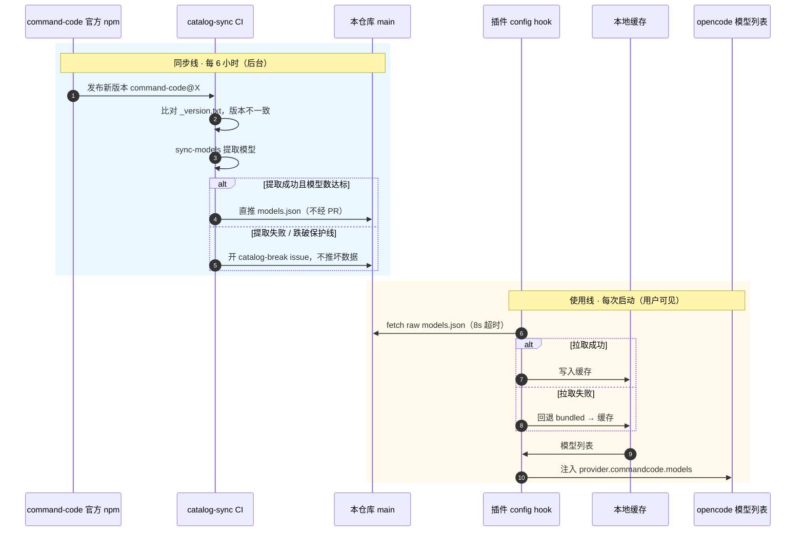

# opencode-commandcode

[](https://github.com/herouu/opencode-commandcode/actions)
[](https://www.npmjs.com/package/@herouucn/opencode-commandcode)
[](https://www.npmjs.com/package/@herouucn/opencode-commandcode)
[](https://www.npmjs.com/package/@herouucn/opencode-commandcode)
[](https://bundlephobia.com/package/@herouucn/opencode-commandcode)
[](https://www.npmjs.com/package/@herouucn/opencode-commandcode)
[](LICENSE)

[Command Code](https://commandcode.ai) API provider for [opencode](https://opencode.ai) —— 通过一个 API key 使用 Claude、GPT、Gemini、DeepSeek、Qwen、Kimi、GLM、MiniMax、Step 等 70+ 模型。

## 特性

| 特性 | 说明 |
|---|---|
| 单 key 多模型 | 通过 Command Code Provider API 聚合 70+ 模型 |
| 运行时目录拉取 | 每次启动拉取远端 `models.json`，新模型即时生效 |
| 离线兜底 | 拉取失败自动回退包内静态目录 → 本地缓存 |
| 目录自同步 | CI 每 6 小时检测上游新版本并直推 `main` |
| 安全发布 | 基于 GitHub OIDC Trusted Publishing，无需 long-lived token |

## 演示

安装插件并查看模型列表：

[](https://asciinema.org/a/ePh5yVrpNatwEQKT)

安装后运行 opencode，输入 `/models` 即可看到 Command Code 提供的 70+ 模型：

```
commandcode/claude-fable-5
commandcode/claude-fable-5-1
commandcode/claude-haiku-4-5-20251001
commandcode/claude-opus-4-7
commandcode/claude-opus-4-8
commandcode/claude-opus-5
commandcode/claude-sonnet-4-6
commandcode/claude-sonnet-5
commandcode/deepseek-v4-flash
commandcode/deepseek-v4-flash-fast
commandcode/deepseek-v4-pro
commandcode/gemini-3.5-flash
commandcode/gemini-3.6-flash
commandcode/gemini-3.7-flash
commandcode/gemini-3.8-flash
commandcode/gpt-5.4
commandcode/gpt-5.4-mini
commandcode/gpt-5.5
commandcode/gpt-5.6-luna
commandcode/gpt-5.6-sol
commandcode/gpt-5.6-terra
commandcode/qwen3.7-max
commandcode/qwen3.7-plus
commandcode/qwen3.8-max
... 共 70+ 模型
```

选择模型后直接对话，无需额外配置。

## 安装

### 方式一：opencode plugin（推荐）

```bash
opencode plugin @herouucn/opencode-commandcode
```

opencode 自动完成：
1. 安装 npm 包到缓存目录
2. 更新 `~/.config/opencode/opencode.json`，追加 plugin 和 provider 配置

重启 opencode 即可使用。

### 方式二：npm 包

```bash
npm install @herouucn/opencode-commandcode
# 或
bun add @herouucn/opencode-commandcode
```

然后在 `opencode.json` 中声明：

```jsonc
// opencode.json
{
  "$schema": "https://opencode.ai/config.json",
  "plugin": ["@herouucn/opencode-commandcode"],
  "provider": {
    "commandcode": {
      "npm": "@ai-sdk/openai-compatible",
      "name": "commandcode",
      "env": ["COMMANDCODE_API_KEY"],
      "options": {
        "baseURL": "https://api.commandcode.ai/provider/v1/"
      }
    }
  }
}
```

### 方式三：本地路径（开发用）

```bash
git clone https://github.com/herouu/opencode-commandcode.git
```

```jsonc
// opencode.json
{
  "plugin": ["file:///absolute/path/to/opencode-commandcode"]
}
```

## 工作原理



三处关键设计：

1. **目录自更新**：`.github/workflows/catalog-sync.yml` 每 6 小时比对上游 `command-code` npm 版本与 `_version.txt`，有新版本则重新提取模型并**直接推送到 main**（commit 风格：`models.json edited <UTC time> (command-code@X)`）。
2. **运行时解耦**：插件每次启动 fetch 本仓库 raw `models.json`，不再依赖 npm 发版。
3. **质量护栏**：模型数跌破保护线时触发 `catalog-break` issue 并回滚，坏数据不落库。

## 配置

### API key（三选一）

```bash
export COMMANDCODE_API_KEY="你的 key"     # 方式一：环境变量
```

```bash
opencode auth login --provider commandcode   # 方式二：交互式（/connect 搜 Command Code）
```

方式三：`~/.commandcode/auth.json`（若已用官方 CLI 登录则自动复用）。

### 目录源（可选覆盖）

默认拉取本仓库 `main` 分支的 `models.json`，一般无需配置。需要自定义时可覆盖：

```bash
export COMMANDCODE_CATALOG_URL="https://raw.githubusercontent.com/herouu/opencode-commandcode/main/models.json"
```

或写入 `~/.config/opencode/opencode-commandcode.json`：

```json
{ "catalogUrl": "https://raw.githubusercontent.com/herouu/opencode-commandcode/main/models.json" }
```

| 取值 | 行为 |
|---|---|
| URL | 每次启动拉取该地址（8s 超时），成功后写本地缓存 |
| `disabled` | 关闭远程拉取，仅用包内静态 `models.json` |

### 选择模型

opencode 内运行 `/models` 选择（如 `commandcode/deepseek-v4-flash`）。

## 发布

本仓库使用 **GitHub OIDC Trusted Publishing**，无需 long-lived npm token。

**触发方式**：

```bash
# 1. 修改版本号
npm version patch   # 或 minor / major

# 2. 推送 tag 触发发布
git push origin main --tags
```

发布流程：
1. push `v*` tag → 触发 `release.yml`
2. `check` job：lint + format + typecheck + unit test
3. `publish` job：`npm publish --provenance`（OIDC 自动认证，生成 provenance 签名）

**npm 包**：[@herouucn/opencode-commandcode](https://www.npmjs.com/package/@herouucn/opencode-commandcode)

## 开发与维护

```bash
bun install
bun run check          # CI 门槛：oxlint + oxfmt --check + bun test + tsc

bun run sync -- --remote   # 本地手动刷新 models.json / manifest.json / _version.txt
```

> ⚠️ `models.json`、`manifest.json`、`_version.txt` 由 CI / 同步脚本自动生成，**不要手改**。

CI 一览：

- **`ci.yml`** — 4 个 check（test / typecheck / lint / format），push 与 PR 触发。
- **`catalog-sync.yml`** — 每 6 小时 + 手动 dispatch，直推 main（不经 PR、不发版）。
- **`release.yml`** — push `v*` tag 或手动 dispatch，check + trusted publishing 发布。

## 常见问题

**模型列表不更新？**
先确认能访问 `https://raw.githubusercontent.com/herouu/opencode-commandcode/main/models.json`；再查本机状态 `~/.local/state/opencode/commandcode-provider/startup.json` 里的 `catalogSource` 字段（应为 `remote`）。

**离线环境能用吗？**
能。首次成功后模型已写入本地缓存；离线启动时走 `bundled → cache` 回退链，模型不缺失。

**catalog-break issue 是什么？**
CI 提取失败或模型数异常时自动创建的告警 issue，表示最近一次同步被护栏拦截，正在使用上一份完好目录。

**为什么 Trusted Publishing 而不是 long-lived token？**
Trusted Publishing 使用 OIDC 短期 token，每次发布自动轮换，无需手动管理 token，无泄露风险。

## 致谢

源自 [BrainerVirus/opencode-commandcode](https://github.com/BrainerVirus/opencode-commandcode) v0.7.54（[Brent Weatherall](https://github.com/brent-weatherall) 原始实现）。

## 许可证

MIT — 见 [LICENSE](LICENSE)。
