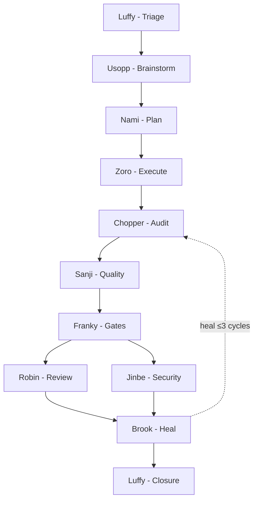

# Mugiwara

[](https://www.npmjs.com/package/@ionivetech/mugiwara)
[](https://www.npmjs.com/package/@ionivetech/mugiwara)
[](https://github.com/ionivetech/mugiwara/blob/main/LICENSE)

**Your agent writes the code. Mugiwara proves it.**

A governed engineering crew for your AI agent — evidence at every step, and a
process that sizes itself to the work. A typo costs nothing. An auth migration
gets all nine waves. No runtime, no API keys, no servers. Just markdown your
agent already knows how to read.

Works on Claude Code, opencode, Copilot, Gemini, and 8 more platforms.


## Why this exists

AI agents are fast. They're also **unverified.** No audit trail. No review. No
"who checked this?" when something breaks. Mugiwara wraps your agent in a team
structure with role boundaries, evidence gates, and cost tracking — the same
discipline you'd expect from a senior engineering team. Zero runtime overhead:
every agent, every skill, every rule is static markdown.

→ [Full pitch: why mugiwara vs just asking your agent](docs/concepts/comparison.md)

## See the evidence

A closed mission leaves a report you can actually read. This is the exact
format `scripts/mission-report.sh` produces:

    # Mission: invitation-accepted-flow . 2026-08-11

    **Lane** full . **Mode** guided . **Actor** farid . **Branch** feature/MKR-412

    ## What changed

    11 files, +340 LOC
    Sensitive paths: src/auth/

    ## Waves

    | Wave | Artifact | Verdict |
    |------|----------|---------|
    | Execute (Wave 3) | `01-execution.md` | PASS |
    | Checkpoint (Wave 4) | `02-audit.md` | PASS |
    | Quality (Wave 5) | `03-quality.md` | PASS |
    | Gates (Wave 6) | `04-gates.md` | PASS |
    | Healing (Wave 8) | `05-healing.md` | PASS |
    | Closure (Wave 9) | `06-closure.md` | GO |

    ## Review & blockers

    Review + security files: invitation-accepted-flow-review.md, invitation-accepted-flow-security.md
    Findings: 3
    Blocker ledger rows: 1

    ## State

    | Field | Value |
    |-------|-------|
    | Wave | 9 |
    | Tasks | 6/6 done |
    | Blockers open | 0 |
    | Heal cycles | 1 |
    | Tokens used | 14,200 / 20,000 |

## Lanes

Work is sized to the diff — a typo gets no pipeline, an auth migration gets
all nine waves. Mugiwara itself is free; token usage depends on the lane:

| Lane                | Waves | Typical tokens |
| ------------------- | :---: | :------------: |
| Direct (typo)       |   0   |       ~0       |
| Lean (small bug)    |   2   |      ~4k       |
| Standard (feature)  |  5–7  |      ~10k      |
| Full (architecture) | 9–11  |      ~20k      |

Usage tracked in `.mugiwara/state.json` per mission. Budget warns at 1.5×,
pauses at 3×.

→ [Full cost model](docs/concepts/cost.md)

## 30-second try

```bash
# opencode — add to opencode.json, then restart
{ "plugin": ["@ionivetech/mugiwara"] }

# Claude Code
/plugin marketplace add ionivetech/mugiwara && /plugin install mugiwara

# Any platform via npm
npx @ionivetech/mugiwara@latest install --target all --yes
```

First run: `/mugiwara onboard` for guided setup. Then ask something non-trivial:

```
> add role-based access control: admin, editor, viewer
> audit the auth middleware for security gaps
> review the last PR for breaking changes
> split this feature across the team: payment gateway, ledger, fraud
```

A Standard lane mission (~10k tokens) produces a branch with test-first
commits, an audit report, a security review, and a ready PR summary — visible
at every step in your chat.

You ask. The crew routes automatically. **No agent names to memorize, no
pipeline config to write.**

| You say                                        | What happens                                                                                                                                                                             |
| ---------------------------------------------- | ---------------------------------------------------------------------------------------------------------------------------------------------------------------------------------------- |
| `add search bar to products page`              | Luffy triages → Nami plans 3 tasks → Zoro executes TDD → Chopper audits → Sanji runs quality → Franky gates → Robin reviews → code pushed, PR summary ready                              |
| `split payment system: gateway, ledger, fraud` | Nami interviews team → writes initiative plan with sub-missions + assignees → each dev works in own branch → `mugiwara initiative status` shows progress → all done → initiative closure |
| `Brook, fix the failing login test`            | Healer reads failure ledger, root-cause fixes, proves fix ≤3 cycles                                                                                                                      |
| `Jinbe, audit auth middleware`                 | STRIDE + OWASP + dependency audit. Read-only — never touches code                                                                                                                        |
| `/mugiwara auto`                               | Switches to full autonomy from the next wave                                                                                                                                             |

- **Full pipeline** when the task is big or direction is unclear
- **Direct agent** when you know exactly what you need — say the name
- **Slash commands** when you want to drive: `/mugiwara-plan`, `/mugiwara-review`, `/mugiwara-security`, `/mugiwara-ship`, `/mugiwara onboard`

→ [Full walkthrough](docs/getting-started.md) · [Full workflow walkthrough](docs/concepts/workflow.md)

## What Mugiwara does

### All features

| Feature                  | What you get                                                                                    |
| ------------------------ | ----------------------------------------------------------------------------------------------- |
| **Lane sizing**          | Work auto-sized from `git diff`. Typo = instant fix. Auth migration = full pipeline.            |
| **Evidence trail**       | `.mugiwara/` workspace: plans, audit reports, quality reports, review findings, blocker ledger. |
| **Self-healing**         | Brook reads all failures at once, fixes root causes, re-runs verification. ≤3 cycles.           |
| **Resume from anywhere** | Session lost? Rebuilds from `.mugiwara/state.json`. Continues, never restarts.                  |
| **12 platforms**         | Claude Code, opencode, Copilot, Gemini, Codex, Cursor, Kimi, Pi, Antigravity + CLI.             |

→ All 19 features, with how-to-use + scenarios: [Every feature](docs/concepts/features.md) · [Full pipeline](docs/concepts/workflow.md) · [Lanes](docs/concepts/lanes.md) · [Modes](docs/concepts/modes.md) · [Config](docs/concepts/config.md) · [Audit trail](docs/concepts/audit-trail.md) · [Cost](docs/concepts/cost.md)

## The pipeline



→ [Full pipeline details](docs/concepts/workflow.md)

## The crew

12 agents (+3 internal). Each has role boundaries — auditors
and reviewers are read-only. Call them by name or let the pipeline auto-route.

| Agent                | Role                                                                                    |  Permission   |
| -------------------- | --------------------------------------------------------------------------------------- | :-----------: |
| `luffy-orchestrator` | Captain — triage, check-ins, closure                                                    |       —       |
| `usopp-brainstorm`   | Critical friend — interrogates, researches, recommends                                  |       —       |
| `nami-planner`       | Planner — interviews, full scan, scaled plans, team initiatives                         |       —       |
| `zoro-execution`     | Executor — TDD per task, evidence per commit                                            |       —       |
| `chopper-checkpoint` | Auditor — re-runs criteria, failure ledger                                              | **read-only** |
| `sanji-quality`      | Quality — format, lint, test, duplication, complexity, maintainability, code attributes |       —       |
| `franky-gates`       | Gates — coverage, build, DoD, per-condition sonar gate                                  |       —       |
| `robin-reviewer`     | Reviewer — breaking-change map, reliability rating, code attribute deep review          | **read-only** |
| `jinbe-security`     | Security — STRIDE, OWASP, hotspots, SCA license, secret scan, responsibility            | **read-only** |
| `brook-healing`      | Healer — reads ledger, root-cause fixes ≤3 cycles                                       |       —       |
| `onboarding-guide`   | Onboarding wizard — 9Q guided setup via host question tool, writes config               |       —       |
| `resume-coordinator` | Resumer — rebuilds state from `.mugiwara/`, continues never restarts                    |       —       |

**Internal agents** (dispatch-only):

| Agent              | Role                                                  | Used by                        |
| ------------------ | ----------------------------------------------------- | ------------------------------ |
| `skeptic-verifier` | Adversarial verifier — doubts every claim             | Wave 4.5, high-stakes missions |
| `eval-runner`      | Harness tester — task suites, judge rubric            | `bun scripts/run-evals.ts`     |
| `memory-keeper`    | Lessons ledger — surface at start, capture at closure | Wave 0 (read), Wave 9 (write)  |

→ [Agent details: summoning, boundaries, parameters](docs/concepts/agents.md)

## When not to use Mugiwara

- **Prototyping or spikes** — use Lane 4, or skip mugiwara entirely.
- **Unattended multi-hour runs** — the crew runs inline so you can interrupt it.
  If you want to walk away, superpowers' subagent-driven-development is built
  for that.
- **Solo scripts with no review path** — the audit trail has no audience.
- **Harnesses without agent dispatch** (Gemini, Codex, tier 3) — you get the
  workflow and the trail, not enforced role boundaries.

## Configuration

Switch mode any time: `/mugiwara guided | semi | auto`. Or edit `.mugiwara/config`:

| Key                 | Default                         | What                                           |
| ------------------- | ------------------------------- | ---------------------------------------------- |
| `mode`              | guided                          | guided / semi / auto                           |
| `branch`            | `feature/{type}-{issue}-{slug}` | Branch naming                                  |
| `commit`            | conventional                    | conventional / gitmoji / plain                 |
| `base`              | main                            | PR target branch                               |
| `coverage_new`      | 90                              | Coverage threshold for new files (%)           |
| `coverage_modified` | 80                              | Coverage threshold for modified files (%)      |
| `review_depth`      | full                            | full / standard / quick — Robin's review depth |
| `quality_depth`     | full                            | full / standard / quick — Sanji's check depth  |

Set via `/mugiwara onboard` or edit directly. Unknown keys ignored. Project
config (`.mugiwara/config`) overrides global (`~/.mugiwara/config`).

→ [All config keys](docs/concepts/config.md) · [Mode details](docs/concepts/modes.md)

## Quick reference

| Need                    | Command / Doc                            |
| ----------------------- | ---------------------------------------- |
| First-time setup        | `/mugiwara onboard`                      |
| Plan a feature          | `/mugiwara-plan` or just describe it     |
| Review a PR diff        | `/mugiwara-review` or "review this PR"   |
| Security audit          | `/mugiwara-security` or "Jinbe, audit X" |
| Ship gate check         | `/mugiwara-ship`                         |
| See initiative progress | `mugiwara initiative status <plan>`      |
| Resume a mission        | `/mugiwara resume plan <name>`           |
| Switch mode             | `/mugiwara guided\|semi\|auto`           |
| Check gate locally      | `bun run gate`                           |
| All docs                | [docs/](docs/)                           |

## Install

<details>
<summary><b>Claude Code</b></summary>

```bash
/plugin marketplace add ionivetech/mugiwara && /plugin install mugiwara
```

Uninstall: `/plugin uninstall mugiwara`

</details>

<details>
<summary><b>OpenCode</b></summary>

Add to `opencode.json`:

```json
{ "plugin": ["@ionivetech/mugiwara"] }
```

Update: `rm -rf ~/.cache/opencode/packages/@ionivetech/mugiwara* && opencode plugin @ionivetech/mugiwara -g` ([details](docs/install/opencode.md#update))

Uninstall: remove `"@ionivetech/mugiwara"` from `opencode.json` plugins array

</details>

<details>
<summary><b>Gemini CLI</b></summary>

```bash
gemini extensions install https://github.com/ionivetech/mugiwara
```

Uninstall: `gemini extensions uninstall mugiwara`

</details>

<details>
<summary><b>Codex</b></summary>

```bash
codex plugin marketplace add ionivetech/mugiwara && codex plugin add mugiwara@mugiwara
```

Uninstall: `codex plugin remove mugiwara@mugiwara`

</details>

<details>
<summary><b>GitHub Copilot</b></summary>

```bash
copilot plugin install https://github.com/ionivetech/mugiwara
```

Uninstall: `copilot plugin uninstall mugiwara`

</details>

<details>
<summary><b>Cursor</b></summary>

```bash
/add-plugin mugiwara
```

Uninstall: `/remove-plugin mugiwara`

</details>

<details>
<summary><b>Antigravity</b></summary>

```bash
agy plugin install https://github.com/ionivetech/mugiwara
```

Uninstall: `agy plugin uninstall mugiwara`

</details>

<details>
<summary><b>Kimi</b></summary>

```bash
/plugins install https://github.com/ionivetech/mugiwara
```

Uninstall: `/plugins uninstall mugiwara`

</details>

<details>
<summary><b>Pi</b></summary>

```bash
pi install git:github.com/ionivetech/mugiwara
```

Uninstall: `pi uninstall mugiwara`

</details>

<details>
<summary><b>Windsurf / Cline / Kilo</b> — CLI install</summary>

```bash
npx @ionivetech/mugiwara@latest install --target <id> --yes
```

Uninstall: `npx @ionivetech/mugiwara@latest uninstall`

Targets: `windsurf`, `cline`, `kilo`, `codex`.

</details>

<details>
<summary><b>Global CLI</b> — shorter commands after first install</summary>

```bash
npm i -g @ionivetech/mugiwara
mugiwara install --target all --yes
```

Uninstall: `mugiwara uninstall`

</details>

All platforms get the full crew — 12 agents (+3 internal), 26 skills.
Enforcement depth varies by harness; see the [harness matrix](docs/reference/harness-matrix.md).

→ [Per-platform guides](docs/install/index.md)

## Update

```bash
# opencode — clear the pinned cache, then reinstall (npm update alone does NOT work)
rm -rf ~/.cache/opencode/packages/@ionivetech/mugiwara* && opencode plugin @ionivetech/mugiwara -g

# Claude Code — marketplace
/plugin update mugiwara

# CLI — npm global
npm i -g @ionivetech/mugiwara@latest
```

OpenCode pins the resolved version in its own package cache, so `npm update`
never touches it. Reinstall with the same command for GitHub-based plugins
(Gemini, Codex, Copilot, Cursor, Kimi, Pi, Antigravity).

→ [Per-platform guides](docs/install/index.md)

## CLI

```bash
mugiwara install                              # wizard (interactive)
mugiwara install --target all --yes           # non-interactive
mugiwara update --target <id> --yes           # overwrite to latest
mugiwara uninstall                            # remove installed files
mugiwara list                                 # show installations
mugiwara list --check                         # health check
mugiwara reset --keep-logs                    # wipe state, keep lessons
```

## Docs

**Start here:** [Getting started](docs/getting-started.md) · [What mugiwara replaces](docs/concepts/comparison.md)

**Concepts:** [Workflow](docs/concepts/workflow.md) · [Lanes](docs/concepts/lanes.md) · [Modes](docs/concepts/modes.md) · [Execution model](docs/concepts/execution-model.md) · [Git strategy](docs/concepts/git-strategy.md) · [Config](docs/concepts/config.md) · [Cost](docs/concepts/cost.md) · [Audit trail](docs/concepts/audit-trail.md)

**Crew:** [Agents](docs/concepts/agents.md) · [Skills](docs/concepts/skills.md)

**Reference:** [Agent anatomy](docs/reference/agent-anatomy.md) · [Skill anatomy](docs/reference/skill-anatomy.md) · [Harness matrix](docs/reference/harness-matrix.md) · [Compliance matrix](docs/reference/compliance-matrix.md) · [Developer onboarding](docs/reference/developer-onboarding.md)

**Install per platform:** [Overview](docs/install/index.md) · [Claude](docs/install/claude.md) · [opencode](docs/install/opencode.md) · [Gemini](docs/install/gemini.md) · [Codex](docs/install/codex.md) · [Copilot](docs/install/copilot.md) · [CLI targets](docs/install/cli.md)

**Troubleshooting:** [Common problems](docs/troubleshooting.md)

**Roadmap:** [ROADMAP.md](ROADMAP.md)

## License

MIT. Copyright (c) 2026 ionivetech.
