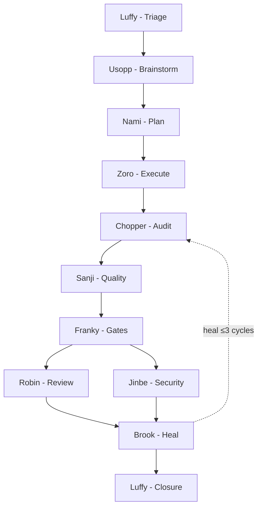

# Mugiwara

[](https://www.npmjs.com/package/@ionivetech/mugiwara)
[](https://www.npmjs.com/package/@ionivetech/mugiwara)
[](https://github.com/ionivetech/mugiwara/blob/main/LICENSE)

**Your agent writes the code. Mugiwara proves it.**

A governed engineering crew for your AI agent — evidence at every step, and a
process that sizes itself to the work. A typo costs nothing. An auth migration
gets all nine flow stages. No runtime, no API keys, no servers. Just markdown your
agent already knows how to read.

Works on Claude Code, opencode, Copilot, Gemini, and 8 more platforms.


## Why this exists

AI agents are fast. They're also **unverified.** No audit trail. No review. No
"who checked this?" when something breaks. Mugiwara wraps your agent in a team
structure with role boundaries, evidence gates, and cost tracking — the same
discipline you'd expect from a senior engineering team. Zero runtime overhead:
every agent, every skill, every rule is static markdown.

→ [Full pitch: why mugiwara vs just asking your agent](docs/concepts/comparison.md)

## See the evidence

A closed mission leaves a report you can actually read — and after `mugiwara archive <mission>`, the whole trail folds INTO it. This is the shape of `.mugiwara/missions/<mission>/report.md`:

    # Mission: invitation-accepted-flow . 2026-08-11

    **Lane** full . **Mode** guided . **Actor** john . **Branch** feature/MKR-412

    ## What changed

    11 files, +340 LOC
    Sensitive paths: src/auth/

    ## Flow stages

    | Flow stage | Artifact | Verdict |
    |------|----------|---------|
    | Execute (Flow 3) | `flows/01-execution.md` | PASS |
    | Checkpoint (Flow 4) | `flows/02-audit.md` | PASS |
    | Quality (Flow 5) | `flows/03-quality.md` | PASS |
    | Gates (Flow 6) | `flows/04-gates.md` | PASS |
    | Healing (Flow 8) | `flows/05-healing.md` | PASS |
    | Closure (Flow 9) | `flows/06-closure.md` | GO |

    ## Review & blockers

    Review + security findings: review.md, security.md
    Findings: 3
    Blocker ledger rows: 1

    ## State

    | Field | Value |
    |-------|-------|
    | Flow stage | 9 |
    | Tasks | 6/6 done |
    | Blockers open | 0 |
    | Heal cycles | 1 |
    | Tokens used | 14,200 / 20,000 |

## Lanes

Work is sized to the diff — a typo gets no pipeline, an auth migration gets
all nine flow stages. Mugiwara itself is free; token usage depends on the lane:

| Lane | Flow stages | Typical tokens | Budget |
| ------------------- | :---: | :------------: | :----: |
| Direct (typo)       |   0   |       ~0       |   —    |
| Lean (small bug)    |   2   |      ~7k       | 12k    |
| Standard (feature)  |  5–7  |      ~13k      | 25k    |
| Full (architecture) | 9–11  |      ~23k      | 50k    |

Usage tracked in `.mugiwara/missions/<mission>/[member].json` per mission. Budget warns at 1.5×,
pauses at 3×. Lane bases are measured from the skills/agents loaded per lane
by `scripts/lane-base.ts` — the constants fail CI if they drift from content
load.

→ [Full cost model](docs/concepts/cost.md)

## 30-second try

```bash
# opencode — add to opencode.json, then restart
{ "plugin": ["@ionivetech/mugiwara"] }

# Claude Code
/plugin marketplace add ionivetech/mugiwara && /plugin install mugiwara

# Any platform via npm
npx @ionivetech/mugiwara@latest install --target all --yes
```

First run: install writes `.mugiwara/config` with defaults — edit it anytime (mode, coverage, depths). Then ask something non-trivial:

```
> add role-based access control: admin, editor, viewer
> audit the auth middleware for security gaps
> review the last PR for breaking changes
> split this feature across the team: payment gateway, ledger, fraud
```

A Standard lane mission (~13k tokens) produces a branch with test-first
commits, an audit report, a security review, and a ready PR summary — visible
at every step in your chat.

You ask. The crew routes automatically. **No agent names to memorize, no
pipeline config to write.**

| You say                                        | What happens                                                                                                                                                                             |
| ---------------------------------------------- | ---------------------------------------------------------------------------------------------------------------------------------------------------------------------------------------- |
| `add search bar to products page`              | Luffy triages → Nami plans 3 tasks → Zoro executes TDD → Chopper audits → Sanji runs quality → Franky gates → Robin reviews → code pushed, PR summary ready                              |
| `split payment system: gateway, ledger, fraud` | Nami interviews → writes one plan split into sub-missions, each with its own branch and done-criteria → each dev resumes only their own sub-mission → all mergeable at the end |
| `Brook, fix the failing login test`            | Healer reads failure ledger, root-cause fixes, proves fix ≤3 cycles                                                                                                                      |
| `Jinbe, audit auth middleware`                 | STRIDE + OWASP + dependency audit. Read-only — never touches code                                                                                                                        |
| `/mugiwara auto`                               | Switches to full autonomy — all flow stages run without asking, from the next flow stage |

- **Full pipeline** when the task is big or direction is unclear
- **Direct agent** when you know exactly what you need — say the name
- **Slash commands** when you want to drive: `/mugiwara`, `/mugiwara-continue`, `/mugiwara-review`, `/mugiwara-security`

→ [Full walkthrough](docs/getting-started.md) · [Full workflow walkthrough](docs/concepts/workflow.md)

## What Mugiwara does

### All features

**Every day, on every repo:**

| Feature                  | What you get                                                                                    |
| ------------------------ | ----------------------------------------------------------------------------------------------- |
| **Lane sizing**          | Work auto-sized from `git diff`. Typo = instant fix. Auth migration = full pipeline.            |
| **Evidence trail**       | `.mugiwara/` workspace: plans, audit reports, quality reports, review findings, blocker ledger. |
| **Closure integrity**    | Archive fails on dangling links, secrets in the trail, or missing evidence.                     |
| **Provenance**           | Per-commit attribution — agent, model, lane, evidence. `mugiwara blame`.                        |
| **Rollback map**         | Executable `rollback.sh` per mission: exact revert commands. Human runs it. Under squash merges the diff is collapsed — `rollback.sh` contains `UNRESOLVED` guidance with `git log --grep="<mission>"` and `exit 1` instead of a silent "nothing to revert" (measured caveat). |
| **Review routing**       | Ranked reading order in every report: sensitive paths first, scaffolding last.                  |
| **Staleness guard**      | Resume warns when main moved past the mission's base.                                           |

**When a team scales it up:**

| Feature                  | What you get                                                                                    |
| ------------------------ | ----------------------------------------------------------------------------------------------- |
| **Policy as code**       | `mugiwara.policy.yml`: force lanes up, raise coverage gates, flag paths for human approval.     |
| **Signed attestation**   | Optional minisign signing of the report — evidence that cannot be edited after the fact.        |
| **Handoff**              | `mugiwara handoff`: engineer-to-engineer report from computed state.                            |
| **Context budget**       | Trail size measured at closure; optional ceiling fails the archive like a test.                 |
| **Team collaboration**   | One shared plan, per-(mission, member) state + resume. Zero collisions.                         |

**Always on, under the surface:**

| Feature                  | What you get                                                                                    |
| ------------------------ | ----------------------------------------------------------------------------------------------- |
| **Self-healing**         | Brook reads all failures at once, fixes root causes, re-runs verification. ≤3 cycles.           |
| **Resume from anywhere** | Rebuilds from `.mugiwara/` state. Continues, never restarts.                                    |
| **12 platforms**         | Claude Code, opencode, Copilot, Gemini, Codex, Cursor, Kimi, Pi, Antigravity + CLI.             |

→ All features, with how-to-use + scenarios: [Every feature](docs/concepts/features.md) · [Full pipeline](docs/concepts/workflow.md) · [Lanes](docs/concepts/lanes.md) · [Modes](docs/concepts/modes.md) · [Config](docs/concepts/config.md) · [Audit trail](docs/concepts/audit-trail.md) · [Cost](docs/concepts/cost.md) · [Provenance](docs/concepts/provenance.md) · [Policy](docs/concepts/policy-as-code.md) · [Closure tools](docs/concepts/closure-tools.md) · [Permissions](docs/concepts/permissions.md)

## The pipeline



→ [Full pipeline details](docs/concepts/workflow.md)

## The crew

11 agents (+3 internal), one specialist per role — auditors and reviewers are
read-only by declared tool scope. Full table, summoning syntax, and boundary
rules live in one place:

→ [Agent details: roles, scopes, summoning, boundaries](docs/concepts/agents.md)

## Team collaboration

Mugiwara is built for a team sharing one repo. Identity is **(mission, member)**,
never branch — so any number of engineers can run parallel work without
colliding, and one engineer can juggle several missions.

```
.mugiwara/
└── missions/<mission>/
    ├── plan.md                  # ONE shared plan (source of truth)
    ├── state.json               # solo state
    ├── <member>.json            # per-member state
    ├── continue.json            # solo resume point
    └── continue-<member>.json   # per-member resume point
```

Quick start for a team:

```bash
# Nami writes one plan; very-large scopes get a ## Mission split with a
# sub-mission per part, each with its own branch and done-criteria.

# Each member works on their own branch, resumes only their own work
/mugiwara continue                      # list every in-flight mission for YOU
/mugiwara continue payment-gateway      # solo → resume; team → list members
/mugiwara continue payment-gateway patty # resume exactly patty's work

# Coordination radar
mugiwara status   # computed per-mission position: flow stage, tasks, lane, blockers
```

Auto mode runs every flow stage autonomously — and never downgrades to guided
mid-mission. In a team plan, auto covers **your member scope only**: resuming
your sub-mission runs it to ship, never the other members'.

→ [Multi-actor reference](references/multi-actor.md)

## When not to use Mugiwara

- **Prototyping or spikes** — use Lane 4, or skip mugiwara entirely.
- **Unattended multi-hour runs** — the crew runs inline so you can interrupt it.
  If you want to walk away, superpowers' subagent-driven-development is built
  for that.
- **Solo scripts with no review path** — the audit trail has no audience.
- **Harnesses without agent dispatch** (Gemini, Codex, tier 3) — you get the
  workflow and the trail, not enforced role boundaries.

## Configuration

Switch mode any time: `/mugiwara guided | semi | auto`. Or edit `.mugiwara/config`:

| Key                 | Default                         | What                                           |
| ------------------- | ------------------------------- | ---------------------------------------------- |
| `mode`              | guided                          | guided / semi / auto                           |
| `branch`            | `feature/{type}-{issue}-{slug}` | Branch naming                                  |
| `commit`            | conventional                    | conventional / gitmoji / plain / template (e.g. `{issue}: {title}`) |
| `auto_commit`       | on                              | on / off — off disables commit+push in guided/semi |
| `coverage_new`      | 90                              | Coverage threshold for new files (%)           |
| `coverage_modified` | 80                              | Coverage threshold for modified files (%)      |
| `review_depth`      | full                            | full / standard / quick — Robin's review depth |
| `quality_depth`     | full                            | full / standard / quick — Sanji's check depth  |
| `verify_merged`     | off                             | on merges Flow 5+6 into one verify pass (never Lane 3) |
| `delegate_threshold`| 60                              | % of token budget at which remaining tasks dispatch to workers |
| `heal_max_cycles`   | 3                               | Max heal-loop cycles before human escalation    |
| `verbosity`         | normal                          | normal / full — how much the crew echoes. `normal` hides investigation steps (reads, greps) and file contents; edits, results, decisions stay visible. `full` echoes everything. Never suppresses decisions, questions, blockers, or lane rises |
| `context_budget_chars` | unset (optional)             | Ceiling on trail size (bytes); over fails `mugiwara archive` like a test |

Set via edit directly (`.mugiwara/config`). Unknown keys ignored. Project
config (`.mugiwara/config`) overrides global (`~/.mugiwara/config`).

**How much does the crew ask you?**

| Mode      | Plan | Execution | Ambiguities |
| --------- | ---- | --------- | ----------- |
| `guided`  | you approve every step | ask before each flow stage | ask the user |
| `semi`    | you approve the written plan | auto from Flow 3 to ship | ask the user |
| `auto`    | auto | auto all the way to ship (your member scope in a team) | resolved internally (brainstorm → Luffy decides) |

In `auto`, the crew runs every flow stage autonomously — triage, plan, execute,
quality, gates, review, heal, closure — and never downgrades to guided
mid-mission. Only a genuine blocker or the heal halt pauses.

→ [All config keys](docs/concepts/config.md) · [Mode details](docs/concepts/modes.md)

## Quick reference

| Need                    | Command / Doc                            |
| ----------------------- | ---------------------------------------- |
| Review a PR diff        | `/mugiwara-review` or "review this PR"   |
| Security audit          | `/mugiwara-security` or "Jinbe, audit X" |
| Resume a mission        | `/mugiwara continue <mission> [member]` or "where were we?" |
| See mission position    | `mugiwara status` (flow stage, tasks, lane, blockers, budget) |
| Close out a mission     | `mugiwara archive <mission>` — folds the trail into report.md |
| Tidy closed missions    | `mugiwara clean` (batch; `--all --force` includes in-flight) |
| Switch mode             | `/mugiwara guided\|semi\|auto`           |
| Check gate locally      | `bun run gate`                           |
| All docs                | [docs/](docs/)                           |

## Install

<details>
<summary><b>Claude Code</b></summary>

```bash
/plugin marketplace add ionivetech/mugiwara && /plugin install mugiwara
```

Uninstall: `/plugin uninstall mugiwara`

</details>

<details>
<summary><b>OpenCode</b></summary>

Add to `opencode.json`:

```json
{ "plugin": ["@ionivetech/mugiwara"] }
```

Update: `rm -rf ~/.cache/opencode/packages/@ionivetech/mugiwara* && opencode plugin @ionivetech/mugiwara -g` ([details](docs/install/opencode.md#update))

Uninstall: remove `"@ionivetech/mugiwara"` from `opencode.json` plugins array

</details>

<details>
<summary><b>Gemini CLI</b></summary>

```bash
gemini extensions install https://github.com/ionivetech/mugiwara
```

Uninstall: `gemini extensions uninstall mugiwara`

</details>

<details>
<summary><b>Codex</b></summary>

```bash
codex plugin marketplace add ionivetech/mugiwara && codex plugin add mugiwara@mugiwara
```

Uninstall: `codex plugin remove mugiwara@mugiwara`

</details>

<details>
<summary><b>GitHub Copilot</b></summary>

```bash
copilot plugin install https://github.com/ionivetech/mugiwara
```

Uninstall: `copilot plugin uninstall mugiwara`

</details>

<details>
<summary><b>Cursor</b></summary>

```bash
/add-plugin mugiwara
```

Uninstall: `/remove-plugin mugiwara`

</details>

<details>
<summary><b>Antigravity</b></summary>

```bash
agy plugin install https://github.com/ionivetech/mugiwara
```

Uninstall: `agy plugin uninstall mugiwara`

</details>

<details>
<summary><b>Kimi</b></summary>

```bash
/plugins install https://github.com/ionivetech/mugiwara
```

Uninstall: `/plugins uninstall mugiwara`

</details>

<details>
<summary><b>Pi</b></summary>

```bash
pi install git:github.com/ionivetech/mugiwara
```

Uninstall: `pi uninstall mugiwara`

</details>

<details>
<summary><b>Windsurf / Cline / Kilo</b> — CLI install</summary>

```bash
npx @ionivetech/mugiwara@latest install --target <id> --yes
```

Uninstall: `npx @ionivetech/mugiwara@latest uninstall`

Targets: `windsurf`, `cline`, `kilo`, `codex`.

</details>

<details>
<summary><b>Global CLI</b> — shorter commands after first install</summary>

```bash
npm i -g @ionivetech/mugiwara
mugiwara install --target all --yes
```

Uninstall: `mugiwara uninstall`

</details>

All platforms get the full crew — 11 agents (+3 internal), 21 skills.
Enforcement depth varies by harness; see the [harness matrix](docs/reference/harness-matrix.md).

→ [How the skills stay small: three-layer disclosure](docs/reference/skill-anatomy.md)

→ [Per-platform guides](docs/install/index.md)

## Update

```bash
# opencode — clear the pinned cache, then reinstall (npm update alone does NOT work)
rm -rf ~/.cache/opencode/packages/@ionivetech/mugiwara* && opencode plugin @ionivetech/mugiwara -g

# Claude Code — marketplace
/plugin update mugiwara

# CLI — npm global
npm i -g @ionivetech/mugiwara@latest
```

OpenCode pins the resolved version in its own package cache, so `npm update`
never touches it. Reinstall with the same command for GitHub-based plugins
(Gemini, Codex, Copilot, Cursor, Kimi, Pi, Antigravity).

→ [Per-platform guides](docs/install/index.md)

## CLI

```bash
mugiwara install                              # wizard (interactive)
mugiwara install --target all --yes           # non-interactive
mugiwara update --target <id> --yes           # overwrite to latest
mugiwara uninstall                            # remove installed files
mugiwara list                                 # show installations
mugiwara list --check                         # health check
mugiwara status                               # computed mission state
mugiwara continue [mission] [member]          # resume / list in-flight
mugiwara archive <mission>                    # fold the trail into report.md (integrity-gated)
mugiwara clean [--all] [--before <date>]      # batch-archive closed missions
mugiwara blame <path>                         # provenance note on the last commit touching path
mugiwara handoff <mission>                    # engineer-to-engineer handoff report
mugiwara sign <mission> [--verify]            # optional minisign attestation of report.md
mugiwara reset --keep-logs                    # wipe state, keep lessons
```

## Docs

**Start here:** [Getting started](docs/getting-started.md) · [What mugiwara replaces](docs/concepts/comparison.md)

**Concepts:** [Workflow](docs/concepts/workflow.md) · [Lanes](docs/concepts/lanes.md) · [Modes](docs/concepts/modes.md) · [Execution model](docs/concepts/execution-model.md) · [Git strategy](docs/concepts/git-strategy.md) · [Config](docs/concepts/config.md) · [Cost](docs/concepts/cost.md) · [Audit trail](docs/concepts/audit-trail.md) · [Security](docs/concepts/security.md) · [Provenance](docs/concepts/provenance.md) · [Policy as code](docs/concepts/policy-as-code.md) · [Closure tools](docs/concepts/closure-tools.md) · [Permissions](docs/concepts/permissions.md)

**Adopt:** [Adoption guide](docs/reference/adoption-guide.md) · [Adoption kit](docs/adoption.md)

**Crew:** [Agents](docs/concepts/agents.md) · [Skills](docs/concepts/skills.md)

**Reference:** [Agent anatomy](docs/reference/agent-anatomy.md) · [Skill anatomy](docs/reference/skill-anatomy.md) · [Harness matrix](docs/reference/harness-matrix.md) · [Compliance matrix](docs/reference/compliance-matrix.md) · [Developer onboarding](docs/reference/developer-onboarding.md)

**Install per platform:** [Overview](docs/install/index.md) · [Claude](docs/install/claude.md) · [opencode](docs/install/opencode.md) · [Gemini](docs/install/gemini.md) · [Codex](docs/install/codex.md) · [Copilot](docs/install/copilot.md) · [CLI targets](docs/install/cli.md)

**Troubleshooting:** [Common problems](docs/troubleshooting.md)

**Roadmap:** [ROADMAP.md](ROADMAP.md)

## What is measured, and what is not

| Claim | Status |
|---|---|
| Retrieval routing rank-1 | **94.3%**, 150 probes, offline, in CI |
| Reference pointers resolve | **66/66**, 3 tiers, in CI |
| Index size published vs measured | **doc-gated** — validator fails on drift, in CI |
| Lane constants match content load | **verified**, in CI |
| Write-scope enforcement | **opencode only** — rules-based elsewhere |
| Cross-harness mission behavior | **12/12 platforms** — 9 rules-dir installs + 3 marketplace manifests, in CI |
| Outcome vs other approaches | **not measured** — see roadmap |

Numbers here are produced by `bun run gate`. Nothing in this table is an
estimate.

## License

MIT. Copyright (c) 2026 ionivetech.
