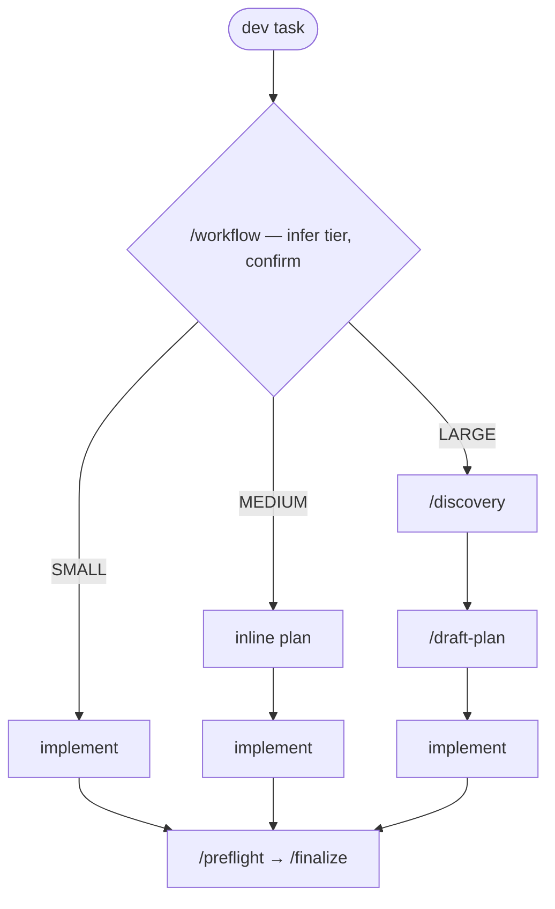

# agentic-toolkit

[](https://github.com/jabworks/agentic-toolkit/actions/workflows/ci.yml)
[](https://github.com/jabworks/agentic-toolkit/releases)
[](https://www.npmjs.com/package/@jabworks/condux)
[](./skills/toolkit-research-frontier/references/eval-trials-2026-07-09-post-foundry.md)

Personal collection of agentic coding skills. Compatible with Claude Code, Codex, OpenCode, Cursor, Gemini CLI, and [40+ other tools](https://github.com/vercel-labs/skills) via `npx skills add`.

## Contents

- [Install](#install) — [ask an agent](#ask-an-agent-to-install-it) · [conflicts](#compatibility-with-other-skill-libraries) · [Claude Code](#claude-code--plugin-marketplace) · [Codex](#codex--plugin-manifests) · [OpenCode](#opencode--condux-plugin--merged-trigger-skill-variants) · [Cursor](#cursor--merged-trigger-skill-variants) · [manual](#manual-fallback)
- [Skills](#skills) — the standalone skills table
  - [Condux](#condux) — the agentic workflow bundle
  - [Concord](#concord) — continuous memory for Codex
  - [Docket](#docket) — file-based project backlog
  - [Toolkit Ops](#toolkit-ops) — maintaining this repo
- [Where artifacts land](#where-artifacts-land) — what gets written to your project, and where
- [Evals](#evals) — how trigger routing is measured
- [Acknowledgments](#acknowledgments)
- [Structure](#structure) — repo layout and the four distribution channels

## Install

`npx skills add` auto-detects the running agent and installs to the right directory:

```bash
npx skills add jabworks/agentic-toolkit
```

This works inside Claude Code, Codex, OpenCode, Cursor, and most other agentic tools — no flags needed.

### Ask an agent to install it

The marketplace install is only half the job for `condux`, `docket` and `concord` — each finishes with a host-specific step no marketplace can perform. Every one of them ships an `INSTALL.md` written to be followed by an agent, so the shortest path is to hand the whole thing to the agent you already have open. Paste this:

```text
Install plugins from the jabworks/agentic-toolkit marketplace on this machine.

1. Detect the host you are running in — Claude Code (~/.claude), Codex
   ($CODEX_HOME or ~/.codex), or OpenCode (~/.config/opencode).

2. Add the marketplace and install the plugins I named. If I did not name any,
   ask me first — do not install all of them.
     Claude Code   /plugin marketplace add jabworks/agentic-toolkit
                   /plugin install <plugin>@jabworks-agentic-toolkit
     Codex         codex plugin marketplace add jabworks/agentic-toolkit
                   codex plugin add <plugin>@jabworks-agentic-toolkit
     OpenCode      add "@jabworks/condux" to the plugin array in opencode.json

3. Three plugins need a step the marketplace cannot do. Read the INSTALL.md
   next to each one you installed, then run its installer:
     condux    <plugin-root>/install.mjs
     docket    <plugin-root>/skills/docket/record/server/install.sh
     concord   <plugin-root>/skills/concord/remember/references/install-codex-hook.sh
   Show me the --dry-run plan before writing anything.

4. Verify rather than assume — run the doctor for each plugin and show me the
   report as it printed:
     /condux:condux-doctor    /docket:docket-doctor    /concord:concord-doctor

5. Report one row per host: what you changed, what was already correct, and
   what any doctor flagged. If one warns that another installed skill library
   conflicts, show me its removal command but do not remove anything.
```

Every step is safe to re-run, and each installer is read-modify-write on one key — none of them rewrites config another plugin owns.

### Compatibility with other skill libraries

**`condux` conflicts with [obra/superpowers](https://github.com/obra/superpowers)** — the library it reworks. Both register a `SessionStart` hook on the same matcher, each injecting a router claiming every dev task, and 11 of superpowers' 14 skills overlap 8 of condux's. Run one or the other. `install.mjs` and `/condux:condux-doctor` both detect it and print the removal command without running it; the overlap table and reasoning are in [the condux README](plugins/condux/README.md#compatibility), and the registry driving the check is [`skills/condux-doctor/conflicts.json`](skills/condux-doctor/conflicts.json).

No other conflict is currently detected. The rest of the toolkit's skills — git, release, spec, session — occupy their own ground.

### Claude Code — plugin marketplace

Alternatively, register as a plugin marketplace to install individual skills:

> Via CLI:

```bash
claude plugin marketplace add jabworks/agentic-toolkit
claude plugin install session-handoff@jabworks-agentic-toolkit # claude plugin install session-handoff
claude plugin install toolkit-ops@jabworks-agentic-toolkit # claude plugin install toolkit-ops
```

> Via Claude Code CLI:

```bash
/plugin marketplace add jabworks/agentic-toolkit
/plugin install session-handoff@jabworks-agentic-toolkit # /plugin install session-handoff
/plugin install toolkit-ops@jabworks-agentic-toolkit # /plugin install toolkit-ops
```

> Via Claude Code CLI plugin menu:

```bash
/plugin
-> Marketplaces tab -> Add Marketplace -> jabworks/agentic-toolkit
-> Discover tab -> Search plugin name
```

### Codex — plugin manifests

This repo is also Codex plugin compatible:

> Via CLI:

```bash
codex plugin marketplace add jabworks/agentic-toolkit
codex plugin add session-handoff@jabworks-agentic-toolkit
codex plugin add toolkit-ops@jabworks-agentic-toolkit
```

> Via Codex CLI plugins menu:

```bash
/plugins
-> Add Marketplace -> jabworks/agentic-toolkit
-> Select jabworks/agentic-toolkit tab to add plugins
```

### OpenCode — condux plugin + merged-trigger skill variants

For the **condux** workflow, one plugin line is the whole install. The
[`@jabworks/condux`](packages/condux-opencode/) plugin bundles the 15 condux
skills, injects the specialist agents (coder / explorer / planner / researcher),
and wires an opt-in plan-review listener:

```jsonc
// opencode.json
{
  "plugin": ["@jabworks/condux"]
}
```

The bundled skills register themselves on `config.skills.paths`, so no separate
skills install is needed for condux.

For the **rest** of the toolkit skills (git-commit, session-handoff, release,
spec-browser, coding-directive, …), install the OpenCode-facing variants. These
fold each skill's `when_to_use` trigger conditions into its `description` —
OpenCode surfaces only `description` when deciding which skill to load, so the
plain `skills/` tree would lose them:

```bash
npx skills add https://github.com/jabworks/agentic-toolkit/tree/main/dist/opencode/skills -a opencode
```

This copies skills into `~/.config/opencode/skills/`. It also includes the
condux skills, but the plugin already provides those — OpenCode dedupes by name,
so installing both is harmless.

### Cursor — merged-trigger skill variants

Cursor loads SKILL.md natively (since Cursor 2.4) but surfaces only
`description` when deciding which skill to load — it never reads
`when_to_use`. Install the Cursor-facing variants, which fold the trigger
conditions in (same transform as the OpenCode tree):

```bash
npx skills add https://github.com/jabworks/agentic-toolkit/tree/main/dist/cursor/skills -a cursor
```

Run it in your project — skills land in `.agents/skills/`, which Cursor picks
up per-project. Prefer project installs over `--global`: the CLI currently
writes global skills to `~/.agents/skills/` against its own docs
([vercel-labs/skills#421](https://github.com/vercel-labs/skills/issues/421)),
and on a WSL setup that's the WSL home while Windows-side Cursor reads
`C:\Users\<you>\.agents\skills\` — the install silently vanishes.

Most plugins are also spec-conformant [Agent Plugins](https://agent-plugins.org)
(root `plugin.json`, flat `skills/`, docket MCP via spec `mcp.json`) — Cursor
loads them directly. To try one without a marketplace: copy
`dist/plugins/<name>` into `~/.cursor/plugins/local/<name>` and fully restart
Cursor. Plugin installs ship raw skill frontmatter, so the trigger-quality
caveat below applies; the `dist/cursor/skills/` install remains the best path
for auto-triggering.

**`condux` and `concord` are not Agent Plugins** and won't load by that path.
Codex picks its plugin loader by root-manifest presence, and the Agent Plugins
loader has no hooks — shipping the manifest silently disabled every Codex hook
those two have. Hooks are the point of both, so they ship without it. On Cursor
use `dist/cursor/skills/` for them, which is the better channel there anyway.

Verified end-to-end 2026-08-14 (Cursor on Windows, WSL remote):

| | Status |
| --- | --- |
| Skills install, list, and invoke (`/workflow` etc.) | ✅ works — project scope, from `dist/cursor/skills/` |
| Plugins load as Agent Plugins (root `plugin.json`, flat `skills/`) | ✅ works — verified via `~/.cursor/plugins/local`; **excludes `condux` and `concord`** since 2026-08-21, which ship no root manifest so their Codex hooks survive |
| Docket MCP server | ✅ works — auto-imported from an existing Claude Code plugin install, or manually via `.cursor/mcp.json` (see [docket INSTALL.md](dist/plugins/docket/server/INSTALL.md)) |
| Docket CLI fallback | ✅ works as-is (dependency-free) |
| Condux `/workflow` routing | ⚠️ degrades — no SessionStart hook on Cursor, so routing relies on the skill descriptions instead of the injected routing rule |
| plan-review auto-capture, named agents (explorer/researcher/planner/coder) | ❌ absent — Cursor has no ExitPlanMode/Stop hook or custom-subagent surface |

Bonus: if Claude Code is installed on the same machine, Cursor picks up its
plugin ecosystem by itself — already-installed plugins (skills and MCP
servers, docket included) just appear, and registered marketplaces surface
in Cursor's Customize panel with one-click Add. Marketplace installs ship
the raw SKILL.md, whose `when_to_use` Cursor ignores — fine for MCP-bearing
plugins like docket, but for reliable skill triggering prefer the
`dist/cursor/skills/` install above. Cursor reads the marketplace clone on
its own side of a WSL split, which can lag — update the marketplace in
Claude Code if the listing looks stale.

### Manual fallback

If running outside an agent environment, clone and copy to your tool's skills directory:

| Tool        | Skills directory             |
| ----------- | ---------------------------- |
| Claude Code | `~/.claude/skills/`          |
| Codex       | `~/.codex/skills/`           |
| OpenCode    | `~/.config/opencode/skills/` |
| Cursor      | `~/.cursor/skills/`          |
| Gemini CLI  | `~/.gemini/skills/`          |
| Most others | `.agents/skills/`            |

```bash
git clone https://github.com/jabworks/agentic-toolkit /tmp/agentic-toolkit
cp -r /tmp/agentic-toolkit/skills/<name> <skills-directory>/
```

## Skills

<!-- catalog:begin readme-skills -->
| Skill | Description |
|---|---|
| [session-report](./skills/session-report/) | Generate an explorable HTML report of session usage — tokens, cache, cost, subagents, skills |
| [session-handoff](./skills/session-handoff/) | Preserve and restore session context across agentic coding sessions |
| [adapting-skills](./skills/adapting-skills/) | Stack and style priors for adapting skills to the jabworks conventions _(opinionated — fork the priors for your own stack)_ |
| [git-commit](./skills/git-commit/) | Conventional-commit message from the diff, run safely — review before staging, no blind `git add .` |
| [git-operations](./skills/git-operations/) | Decision router for git — pick the right operation (undo/discard/stash/merge/push) with an undo path |
| [git-worktree](./skills/git-worktree/) | Decision router for git worktrees — isolated workspaces, native-first, with cleanup and recovery paths |
| [spec-browser](./skills/spec-browser/) | Catalog and browse a specs/ tree — markdown index + folder-grouped doc site |
| [release](./skills/release/) | Cut releases safely — machinery detection (changesets/toolkit/GitHub), dry-run first, rollback paths |
| [coding-directive](./skills/coding-directive/) | House style for @jabworks repos — TypeScript, React, formatting, imports, naming, CSS _(personal)_ |
| [remember](./skills/remember/) | Continuous memory for Codex (`concord` plugin) — captures each session from the rollout, ages it into tiers, recalls it |
| [concord-doctor](./skills/concord-doctor/) | Health check for the concord plugin — probes its Codex hooks and memory store on this host |
| [condux-doctor](./skills/condux-doctor/) | Health check for the condux plugin — runs the SessionStart routing hook and checks the agents shipped |
| [docket-doctor](./skills/docket-doctor/) | Health check for the docket plugin — probes the MCP registration on every host and the CLI fallback |
<!-- catalog:end readme-skills -->

### Condux

Lean agentic workflow plugin (`condux`). Install the full workflow bundle as a unit:

```bash
/plugin install condux@jabworks-agentic-toolkit
```

> Inspired by [obra/superpowers](https://github.com/obra/superpowers) — condux reworks its skill-orchestration ideas around a lean, proportional-effort philosophy (tiered routing, lazy loading, soft gates) rather than always-on maximalism.

Installing is the whole setup: condux ships a `SessionStart` hook (Claude Code
and Codex both) that puts its routing rule in context before your first prompt,
so `/workflow` is reached as the entry point instead of being inferred from the
skill catalog. That inference sits at roughly 80% on its own, and the misses are
condux's own siblings winning the query — `root-cause-analysis` on a crash
report, `draft-plan` on "write the plan" — which no description can fix without
stealing their trigger space. The payload is ~390 tokens per session and lives
in `skills/workflow/hooks/routing.md`; delete or edit that file to change or
disable it.

#### Why condux

Most workflow frameworks are maximal — every gate runs on every task, so a typo
fix pays the same ceremony as a cross-cutting refactor. Condux inverts that with
five operating rules:

1. **Proportional, not maximal** — the process tier matches the task size.
2. **Lazy loading** — downstream skills load only when their step is reached,
   keeping context (and cost) small.
3. **Soft gates, not hard walls** — a gate can be skipped, but only consciously:
   the agent asks before bypassing, never silently.
4. **The user is in control** — explicit instructions always beat the framework;
   "treat this as LARGE" or "skip the plan" is always valid.
5. **Implement yourself by default** — subagents are the exception and need a
   concrete justification, never spawned to fill time.

The payoff: no over-engineered button changes, no under-planned refactors,
predictable checkpoints where *you* drive every transition, and a small context
footprint because only the skills a tier actually needs ever load.

#### The flow

Every dev task enters through `/workflow`. It infers a tier from the task
(file count, design clarity, boundary crossings), confirms it with you, then
runs the matching pipeline:

| Tier | Looks like | Flow |
|---|---|---|
| **SMALL** | isolated change, 1–3 files, clear requirements | implement → `/preflight` → `/finalize` |
| **MEDIUM** | multi-file, some design needed, known boundaries | inline plan → implement → `/preflight` → `/finalize` |
| **LARGE** | cross-cutting, unclear scope, multiple subsystems | `/discovery` → `/draft-plan` → implement → `/preflight` → `/finalize` |



Every tier ends with `/preflight` (an "am I actually done?" checklist) and
`/finalize` (typecheck → lint → format → test, in order, once, stopping on the
first failure) — quality checks run at the end, not scattered mid-implementation.

**Checkpoints** (MEDIUM/LARGE only): at each phase boundary the agent stops and
presents a menu — after the plan (start implementing / tests-first / spawn
agents / revise), after implementation (verify & finalize / code review / keep
building), and after everything is green (review / commit / release / done).
The agent never auto-advances past a checkpoint; SMALL runs linear with no menus.

**Named agents**: four specialists ship with the bundle — `explorer` (read-only
codebase navigation), `researcher` (external API/library verification),
`planner` (design → executable plan), and `coder` (executes a provided plan).
Pipeline: explorer/researcher gather → planner plans → coder executes →
finalize validates. The default is still to implement directly — agents are
opt-in at checkpoints or justified by genuinely parallel work.

#### The skills

| Skill | Description |
|---|---|
<!-- catalog:begin readme-condux -->
| Skill | Description |
|---|---|
| [/workflow](./skills/workflow/) | Tier router — infer Small/Medium/Large, confirm with user, load only the skills the tier needs |
| [/discovery](./skills/discovery/) | Design gate — goal-round questions, alternatives, then a post-approach detail round (contracts, mappings, edge cases); the design doc builds section by section in a live browser preview, and sign-off signs it off plus, default-on, a structured tech spec |
| [/blueprint](./skills/blueprint/) | Design-time visual clarity — fires on the question a decision turns on, not on whether a feature has a UI; HTML wireframes and full renders in the surface-kit token language (two modes, one skeleton), inline-SVG diagrams (data models, flows, architecture, state machines); dependency-free |
| [/draft-plan](./skills/draft-plan/) | Lean task-card plan (what/why/gotchas/deps), Markdown, LARGE tasks only |
| [/test-first-development](./skills/test-first-development/) | Opt-in tests-first — one upfront consent, then red-green-refactor; asks before editing existing specs |
| [/subagent-execution](./skills/subagent-execution/) | Named specialist agents for LARGE plans, only when justified, never to fill time |
| [/subagent-deployment](./skills/subagent-deployment/) | Fan out independent tasks across named agents in one message — ad-hoc, not a formal plan |
| [/finalize](./skills/finalize/) | End-of-task quality gate — typecheck → lint → format → test, once, stop on first failure |
| [/live-verification](./skills/live-verification/) | Run the change and watch it work — drives the real UI or endpoint after finalize, light mode then dark, reports claim → evidence → verdict and names what it couldn't verify |
| [/code-review](./skills/code-review/) | On-request diagnostic report (Critical/Important/Minor), never auto-triggers, never fixes |
| [/preflight](./skills/preflight/) | "Am I actually done?" checklist before finalize — catches skipped steps and regressions, and drift-checks the implementation against the task's spec |
| [/root-cause-analysis](./skills/root-cause-analysis/) | Root-cause-first bug investigation — enforces the 4-phase sequence before any fix |
| [/technical-spec](./skills/technical-spec/) | Scaffold and persist feature specs (decisions, API, fields, quirks) with a live HTML preview |
| [/plan-review](./skills/plan-review/) | Annotate a plan in a local browser with a categorized comment toolbar, then return approve/revise/deny to the agent — auto via a Claude Code ExitPlanMode hook or a Codex Stop hook, or manually. Self-contained, no egress |
<!-- catalog:end readme-condux -->

### Concord

Continuous memory for Codex (`concord`) — the `remember` skill plus its doctor:

```bash
/plugin install concord@jabworks-agentic-toolkit
```

Three Codex hooks share one idempotent operation — sync the rollout forward
from its recorded position — so capture is exactly-once regardless of hook
order, and a hard-killed session is recovered at next start rather than lost.
Memory ages through buffer, daily, recent, and archive tiers; explicitly
pinned facts are never auto-compressed. `references/install-codex-hook.sh`
wires the hooks; `concord-doctor` tells you whether they are still wired.

### Docket

File-based project backlog plugin (`docket`) — two skills plus machinery:

```bash
/plugin install docket@jabworks-agentic-toolkit
```

Open items live in `docket/DOCKET.md`, closed items move to
`docket/archive/<year>.md` with verification records, and ids are never
reused — `#N` in a commit subject refers to the docket, not GitHub. The
`record` skill captures and closes items; `groom` sweeps for stale and
ghost work and recommends what to pick next. A dependency-free CLI
(`server/docket.mjs`) keeps id allocation and archive moves byte-exact, a
bundled MCP server exposes the same ops as tools (auto-registered on Claude
Code; `server/install.sh` or the agent-followable `server/INSTALL.md`
registers it for Codex/OpenCode), and `docket.mjs browse` renders a
self-contained HTML board. Legacy root `BACKLOG.md` layouts are detected and
work in place — migration is offered, never forced.

### Toolkit Ops

Repo-maintenance bundle (`toolkit-ops`) for working on this toolkit itself:

```bash
/plugin install toolkit-ops@jabworks-agentic-toolkit
```

| Skill | Description |
|---|---|
<!-- catalog:begin readme-toolkit-ops -->
| Skill | Description |
|---|---|
| [toolkit-orientation](./skills/toolkit-orientation/) | Zero-context map of the repo — trees, bundles, manifest pairing, docs trust order |
| [toolkit-foundry](./skills/toolkit-foundry/) | Create and maintain skills — scaffold, register, sync, publish (formerly standalone `plugin-foundry`) |
| [toolkit-change-control](./skills/toolkit-change-control/) | Classify a change, pick the version bump, gate on the publish checklist |
| [toolkit-skill-standards](./skills/toolkit-skill-standards/) | Frontmatter budgets, trigger contract, progressive disclosure, collision scan |
| [toolkit-debugging-playbook](./skills/toolkit-debugging-playbook/) | Symptom → discriminating command → root cause for skill/plugin problems |
| [toolkit-failure-archaeology](./skills/toolkit-failure-archaeology/) | Git-evidenced incident ledger — don't re-fight settled battles |
| [toolkit-plugin-reference](./skills/toolkit-plugin-reference/) | Verified plugin.json / marketplace.json schema, Claude↔Codex divergences |
| [toolkit-research-frontier](./skills/toolkit-research-frontier/) | Open problems, assets, next steps, and the library-health campaign |
<!-- catalog:end readme-toolkit-ops -->

## Where artifacts land

Skills that write files into your project follow one rule: **durable output goes
to a normal project path; working state goes to `.<plugin-name>/` at the git
root, gitignored.**

```text
<git-root>/
  specs/              # durable — tech specs, committed, browsable via spec-browser
  .condux/            # working state — designs/ plans/ progress/ scratch/
  .session-handoff/   # working state — handoff docs
  .session-report/    # working state — generated HTML usage reports
```

The spec is what you keep; the design and plan are scaffolding it was built
from. Directories are named for the **owning plugin**, not the skill and not the
artifact — condux has 12 skills and one `.condux/`, so uninstalling condux tells
you exactly which directory stops appearing.

Nothing is written to your repo root or CWD, and nothing lands in `docs/` — that
belongs to your project, not to the toolkit. The first time a skill writes to a
repo it checks `git check-ignore` and asks once before adding the entry to
`.gitignore` (or `.git/info/exclude` if you'd rather not touch a tracked file).
An `AGENTS.md` path override always wins.

## Evals

The skills are eval-tested for **trigger routing** — given a user query, does
the right skill activate (and does nothing activate when nothing should)?
Latest run (2026-07-09, claude-haiku-4-5, 394 cold-trigger cases, 3 trials):

- **88.6% ± 3.8pp** mean routing accuracy (95% CI, t-distribution); per-run
  87.1% / 90.1% / 88.6%, 37 flaky cases recorded
- Per-skill breakdown and the full miss list live in the
  [trial record](./skills/toolkit-research-frontier/references/eval-trials-2026-07-09-post-foundry.md)

This measures whether skills *activate correctly* — not end-to-end workflow
quality. Structural invariants (dist mirror, manifests, frontmatter budgets,
no-egress guarantees) are separately enforced by `node --test` in CI.

## Acknowledgments

The **plan-review** skill is inspired by [Plannotator](https://github.com/backnotprop/plannotator) — its interactive plan-review workflow served as the design reference. plan-review is an independent in-house reimplementation with no shared code and no third-party runtime dependency.

**condux** reworks [obra/superpowers](https://github.com/obra/superpowers)' skill-orchestration ideas around proportional effort. Reworking a library that thoroughly makes the two direct alternatives rather than companions — see [Compatibility](#compatibility-with-other-skill-libraries) before installing both.

## Structure

```text
skills/<name>/          # Editable source — also what `npx skills add` installs
dist/plugins/<name>/    # Built plugin dirs — the plugin-marketplace install source
dist/opencode/skills/   # OpenCode-facing variants (when_to_use folded into description)
dist/cursor/skills/     # Cursor-facing variants (same fold, separate tree)
packages/condux-opencode/ # OpenCode plugin (npm) — bundles condux skills + agents + plan-review listener
.claude-plugin/
  marketplace.json      # Plugin registry (Claude Code / Codex marketplace channel)
```

Four distribution channels read different trees:

- **`npx skills add`** (`vercel-labs/skills`, 68+ agents) scans the top-level
  `skills/<name>/SKILL.md` layout — it installs straight from **`skills/`** and
  ignores `dist/`.
- **`/plugin install …@jabworks-agentic-toolkit`** (Claude Code / Codex native)
  reads `.claude-plugin/marketplace.json`, whose `source` paths point at the
  assembled plugin dirs under **`dist/`**.
- **OpenCode** gets condux from the **`@jabworks/condux`** npm plugin, which
  bundles the condux skills (under `packages/condux-opencode/skills/`) and the
  agents; the rest of the toolkit installs from **`dist/opencode/skills/`** (see
  the OpenCode install section). Both trees are generated by
  `scripts/build-opencode.mjs`, which `scripts/sync.sh` runs automatically.
- **Cursor** installs from **`dist/cursor/skills/`** (see the Cursor install
  section) — generated by `scripts/build-cursor.mjs`, which reuses the
  OpenCode fold transform; the trees are byte-identical today but kept
  separate so the channels can drift deliberately.

`dist/` is a build artifact mirrored from `skills/` via `scripts/sync.sh` — never
edit it by hand; `node --test` (run in CI) fails if it drifts from source. After
cloning, run `pnpm install` (the test suite needs it) and
`bash scripts/install-hooks.sh`, which installs a pre-commit hook that validates
SKILL.md frontmatter, then syncs and stages `dist/` automatically.

SKILL.md frontmatter follows a deliberately narrow grammar — every line is
`key: value`, values are plain when safe and double-quoted otherwise, and single
quotes are banned. Four separate releases shipped frontmatter that strict YAML
parsers reject (breaking the skill in Codex), so the grammar is enforced by
`node scripts/check-frontmatter.mjs` (which also has `--fix`) and by a real
strict parse in the test suite.
