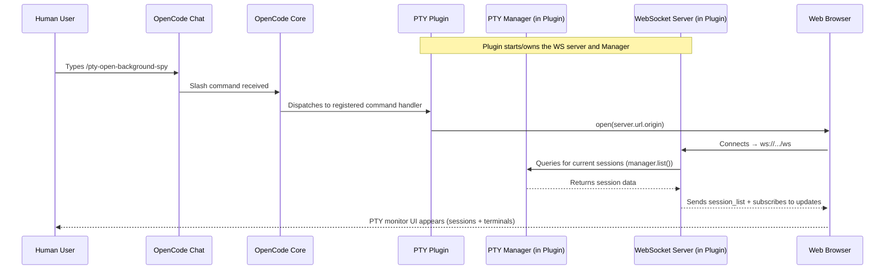
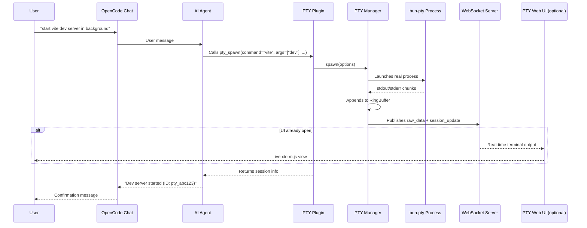
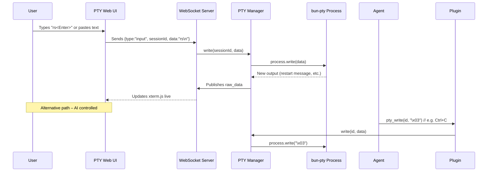
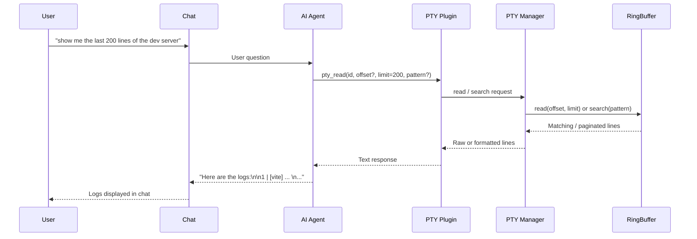
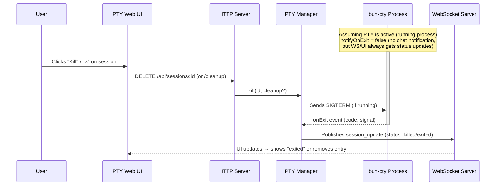
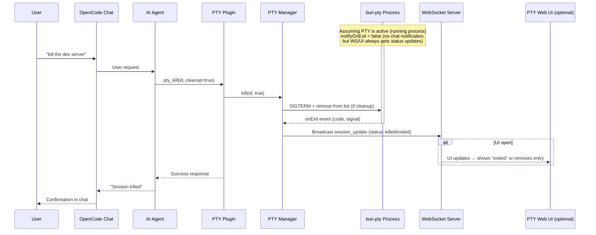
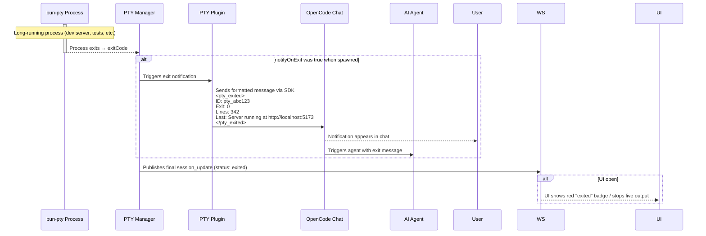

# opencode-pty

A plugin for [OpenCode](https://opencode.ai) that provides interactive PTY (pseudo-terminal) management, enabling the AI agent to run background processes, send interactive input, and read output on demand.

## Why?

OpenCode's built-in `bash` tool runs commands synchronously -- the agent waits for completion. This works for quick commands, but not for:

- **Dev servers** (`npm run dev`, `cargo watch`)
- **Watch modes** (`npm test -- --watch`)
- **Long-running processes** (database servers, tunnels)
- **Interactive programs** (REPLs, prompts)

This plugin gives the agent full control over multiple terminal sessions, like tabs in a terminal app.

## Features

- **Background Execution**: Spawn processes that run independently
- **Multiple Sessions**: Manage multiple PTYs simultaneously
- **Interactive Input**: Send keystrokes, Ctrl+C, arrow keys, etc.
- **Output Buffer**: Read output anytime with pagination (offset/limit)
- **Pattern Filtering**: Search output using regex (like `grep`)
- **Terminal Snapshots**: Capture clean, parsed terminal screen state (no ANSI noise)
- **Screen Diffing**: Seq-based history with line-level diffs between snapshots
- **Conditional Waiting**: Block until screen matches a regex or stabilizes
- **Exit Notifications**: Get notified when processes finish (eliminates polling)
- **Permission Support**: Respects OpenCode's bash permission settings
- **Session Lifecycle**: Sessions persist until explicitly killed
- **Auto-cleanup**: PTYs are cleaned up when OpenCode sessions end
- **Web UI**: Modern React-based interface for session management
- **Real-time Streaming**: WebSocket-based live output updates

## Setup

Add the plugin to your [OpenCode config](https://opencode.ai/docs/config/):

```json
{
  "$schema": "https://opencode.ai/config.json",
  "plugin": ["@josxa/opencode-pty"]
}
```

That's it. OpenCode will automatically install the plugin on next run.

## Updating

OpenCode automatically checks for and installs plugin updates on startup. You don't need to do anything manually!

If you ever need to force a clean reinstall, you can clear the cache:

```bash
rm -rf ~/.cache/opencode/packages/@josxa+opencode-pty*
opencode
```

## Tools Provided

| Tool                 | Description                                                                 |
| -------------------- | --------------------------------------------------------------------------- |
| `pty_spawn`          | Create a new PTY session (command, args, workdir, env, title, notifyOnExit) |
| `pty_write`          | Send input to a PTY (text, escape sequences like `\x03` for Ctrl+C)        |
| `pty_read`           | Read PTY output buffer as chat-safe text with pagination and regex filtering |
| `pty_snapshot`       | Capture parsed terminal screen as clean text with cursor, size, and hash    |
| `pty_snapshot_foreground_colors` | Capture rendered foreground colors as a label grid with legend |
| `pty_snapshot_background_colors` | Capture rendered background colors as a label grid with legend |
| `pty_snapshot_wait`  | Block until screen matches a regex or content stabilizes                    |
| `pty_list`           | List all PTY sessions with status, PID, line count                          |
| `pty_kill`           | Terminate a PTY, optionally cleanup the buffer                              |

## Slash Commands

This plugin provides slash commands that can be used in OpenCode chat:

| Command                    | Description                                        |
| -------------------------- | -------------------------------------------------- |
| `/pty-open-background-spy` | Open the PTY web server interface in the browser   |
| `/pty-show-server-url`     | Show the URL of the running PTY web server instance |

## Web UI

This plugin includes a modern React-based web interface for monitoring and interacting with PTY sessions.

[](https://youtu.be/wPqmTPnzvVY)

If you instruct the coding agent to run something in background, you have to name it "session",
i.e. "run xy as a background SESSION".
If you name it "task" or "process" or anything else, the agent will sometimes run it as background subprocess using `&`.

### Starting the Web UI

1. Run opencode with the plugin.
2. Run slash command `/pty-open-background-spy`.

This will start the background sessions observer cockpit server and launch the browser with web UI.

### Features

- **Session List**: View all active PTY sessions with status indicators
- **Real-time Output**: Live streaming of process output via WebSocket
- **Interactive Input**: Send commands and input to running processes
- **Session Management**: Kill sessions directly from the UI
- **Connection Status**: Visual indicator of WebSocket connection status

### REST API

The web server provides a REST API for session management:

| Method   | Endpoint                         | Description                                                                 |
| -------- | -------------------------------- | --------------------------------------------------------------------------- |
| `GET`    | `/api/sessions`                  | List all PTY sessions                                                       |
| `POST`   | `/api/sessions`                  | Create a new PTY session                                                    |
| `GET`    | `/api/sessions/:id`              | Get session details                                                         |
| `POST`   | `/api/sessions/:id/input`        | Send input to a session                                                     |
| `DELETE` | `/api/sessions/:id`              | Kill a session (without cleanup)                                            |
| `DELETE` | `/api/sessions/:id/cleanup`      | Kill and cleanup a session                                                  |
| `GET`    | `/api/sessions/:id/buffer/plain` | Get session output buffer (returns `{ plain: string, byteLength: number }`) |
| `GET`    | `/api/sessions/:id/buffer/raw`   | Get session output buffer (raw data)                                        |
| `DELETE` | `/api/sessions`                  | Clear all sessions                                                          |
| `GET`    | `/health`                        | Server health check with metrics                                            |

#### Session Creation

```bash
curl -X POST http://localhost:[PORT]/api/sessions \
  -H "Content-Type: application/json" \
  -d '{
    "command": "bash",
    "args": ["-c", "echo hello && sleep 10"],
    "description": "Test session"
  }'
```

Replace `[PORT]` with the actual port number shown in the server console output.

#### WebSocket Streaming

Connect to `/ws` for real-time updates:

```javascript
const ws = new WebSocket('ws://localhost:[PORT]/ws')

ws.onmessage = (event) => {
  const data = JSON.parse(event.data)
  if (data.type === 'raw_data') {
    console.log('New output:', data.rawData)
  } else if (data.type === 'session_list') {
    console.log('Session list:', data.sessions)
  }
}
```

Replace `[PORT]` with the actual port number shown in the browser when running the slash command output.

### Development

Future implementation will include:

#### App

- A startup script that runs the server (in the same process).
- The startup script will run `bun vite` with an environment variable set to the server URL
- The client will use this environment variable for WebSocket and HTTP requests

This will ease the development on the client.

## Usage Examples

### Start a dev server

```
pty_spawn: command="npm", args=["run", "dev"], title="Dev Server"
→ Returns: pty_a1b2c3d4
```

### Check server output

```
pty_read: id="pty_a1b2c3d4", limit=50
→ Shows last 50 lines of output
```

### Filter for errors

```
pty_read: id="pty_a1b2c3d4", pattern="error|ERROR", ignoreCase=true
→ Shows only lines matching the pattern
```

### Send Ctrl+C to stop

```
pty_write: id="pty_a1b2c3d4", data="\x03"
→ Sends interrupt signal
```

### Kill and cleanup

```
pty_kill: id="pty_a1b2c3d4", cleanup=true
→ Terminates process and frees buffer
```

### Run with exit notification

```
pty_spawn: command="npm", args=["run", "build"], title="Build", notifyOnExit=true
→ Returns: pty_a1b2c3d4
```

The AI agent will receive a notification when the build completes:

```xml
<pty_exited>
ID: pty_a1b2c3d4
Title: Build
Exit Code: 0
Output Lines: 42
Last Line: Build completed successfully.
</pty_exited>

Use pty_read to check the full output.
```

This eliminates the need for polling -- perfect for long-running processes like builds, tests, or deployment scripts. If the process fails (non-zero exit code), the notification will suggest using `pty_read` with the `pattern` parameter to search for errors.

### Capture a clean terminal snapshot

`pty_read` returns buffer lines in a chat-safe text form. Non-printable control bytes are escaped so the tool output does not break the UI, but TUI programs still remain hard to interpret because cursor movement and screen control sequences are only shown literally. For TUI apps (interactive UIs with cursor movement, colors, screen clearing), `pty_snapshot` solves this:

```
pty_snapshot: id="pty_a1b2c3d4"
→ Returns clean screen text with cursor position, size, seq number, and content hash

pty_snapshot: id="pty_a1b2c3d4", interleavedColors="background"
→ Returns the same text snapshot, but inserts a matching background-color run row under each visible text row
```

### Inspect rendered colors in TUIs

When a TUI uses highlighting, inverse video, or colored selections, plain text snapshots can miss what the user would actually see. These tools expose the rendered color layers as compact label grids, one for foreground and one for background:

```
pty_snapshot_foreground_colors: id="pty_a1b2c3d4"
→ Returns a compact whole-screen map like `01-10: 120A` with a legend such as `A=default  B=palette:12  C=#ffcc00`

pty_snapshot_background_colors: id="pty_a1b2c3d4"
→ Returns the matching background map, collapsing repeated rows into ranges so selected rows still stand out without losing layout context
```

This is especially useful for `ctrl+p` style menus where the selected item differs mostly by highlight color rather than by text. If you want the text and highlight rows together in one response, use `pty_snapshot` with `interleavedColors="background"`, which preserves horizontal alignment while making long flat spans cheaper to read.

### Track screen changes with seq-based diffs

Every snapshot gets a monotonically increasing sequence number (`seq`) that increments only when the screen content actually changes. Pass `since` to get only the lines that changed:

```
pty_snapshot: id="pty_a1b2c3d4", since=5
→ Returns only changed/added/removed lines since seq 5
```

### Wait for specific screen content

Use `pty_snapshot_wait` to block until a condition is met instead of polling:

```
pty_snapshot_wait: id="pty_a1b2c3d4", search="error|Error", timeout=30000
→ Resolves when the regex matches the full rendered screen text

pty_snapshot_wait: id="pty_a1b2c3d4", searchAbsent="esc interrupt", timeout=30000
→ Resolves when that text is no longer visible on the rendered screen

pty_snapshot_wait: id="pty_a1b2c3d4", screenStableForMs=2000, timeout=30000
→ Resolves when screen content is unchanged for 2 seconds
```

When multiple conditions are given, the first to match wins. `since` only changes the response to a diff against that seq and does not affect when the wait resolves.

### Example: Debugging OpenCode itself

One compelling use case is running OpenCode inside OpenCode to observe TUI behavior during development. The agent can interact with the inner instance, send prompts, open menus, and watch exactly how the screen updates:

```
# 1. Launch OpenCode as a background TUI process
pty_spawn: command="opencode", args=["path/to/project"], title="Inner OpenCode"
→ pty_abc123

# 2. Wait for it to render, get initial screen state
pty_snapshot_wait: id="pty_abc123", screenStableForMs=2000, timeout=15000
→ seq=2, shows OpenCode banner + input field

# 3. Type a prompt and submit
pty_write: id="pty_abc123", data="explain this codebase"
pty_write: id="pty_abc123", data="\n"

# 4. Watch the response stream in, frame by frame
pty_snapshot_wait: id="pty_abc123", screenStableForMs=300, since=2
→ seq=15, diff shows partial response text appearing

pty_snapshot_wait: id="pty_abc123", screenStableForMs=300, since=15
→ seq=28, more text streamed in

pty_snapshot_wait: id="pty_abc123", screenStableForMs=3000, since=28
→ seq=46, response complete (stable for 3s)

# 5. Open the command palette
pty_write: id="pty_abc123", data="\x10"

# 6. See all available commands
pty_snapshot: id="pty_abc123", since=46
→ Shows command palette overlay with menu items

# 7. Toggle the sidebar
pty_write: id="pty_abc123", data="show sidebar\r"
pty_snapshot: id="pty_abc123", since=48
→ Sidebar appears with session info, MCP connections, context usage
```

This works because `pty_snapshot` maintains a headless terminal emulator ([xterm.js](https://xtermjs.org/)) alongside each PTY session, producing the same parsed screen a human would see -- without any ANSI escape sequence noise.

## Configuration

### Environment Variables

| Variable               | Default    | Description                                        |
| ---------------------- | ---------- | -------------------------------------------------- |
| `PTY_MAX_BUFFER_LINES` | `50000`    | Maximum lines to keep in output buffer per session |
| `PTY_WEB_HOSTNAME`     | `::1`      | Hostname for the web server to bind to             |

### Permissions

This plugin respects OpenCode's [permission settings](https://opencode.ai/docs/permissions/) for the `bash` tool. Commands spawned via `pty_spawn` are checked against your `permission.bash` configuration.

```json
{
  "$schema": "https://opencode.ai/config.json",
  "permission": {
    "bash": {
      "npm *": "allow",
      "git push": "deny",
      "terraform *": "deny"
    }
  }
}
```

> [!IMPORTANT]
> **Limitations compared to built-in bash tool:**
>
> - **"ask" permissions are treated as "deny"**: Since plugins cannot trigger OpenCode's permission prompt UI, commands matching an "ask" pattern will be denied. A toast notification will inform you when this happens. Configure explicit "allow" or "deny" for commands you want to use with PTY.
> - **"external_directory" with "ask" is treated as "allow"**: When the working directory is outside the project and `permission.external_directory` is set to "ask", this plugin allows it (with a log message). Set to "deny" explicitly if you want to block external directories.

#### Example: Allow specific commands for PTY

```json
{
  "$schema": "https://opencode.ai/config.json",
  "permission": {
    "bash": {
      "npm run dev": "allow",
      "npm run build": "allow",
      "npm test *": "allow",
      "cargo *": "allow",
      "python *": "allow"
    }
  }
}
```

## How It Works

1. **Spawn**: Creates a PTY using [bun-pty](https://github.com/nicksrandall/bun-pty), runs command in background
2. **Buffer**: Output is captured into both a rolling line buffer (ring buffer) and a headless terminal emulator
3. **Read**: Agent can read raw buffer anytime with offset/limit pagination
4. **Snapshot**: Agent can capture the parsed visible screen (clean text, no ANSI codes) via the headless terminal
5. **Diff**: Each content change gets a sequence number; agent can request line-level diffs between any two states
6. **Wait**: Agent can block until screen content matches a regex or stabilizes (no polling needed)
7. **Filter**: Optional regex pattern filters raw buffer lines before pagination
8. **Write**: Agent can send any input including escape sequences
9. **Lifecycle**: Sessions track status (running/exited/killed), persist until cleanup
10. **Notify**: When `notifyOnExit` is true, sends a message to the session when the process exits
11. **Web UI**: React frontend connects via WebSocket for real-time updates

## Session Lifecycle

```
spawn → running → [exited | killed]
                      ↓
              (stays in list until cleanup=true)
```

Sessions remain in the list after exit so the agent can:

- Read final output
- Check exit code
- Compare logs between runs

Use `pty_kill` with `cleanup=true` to remove completely.

## Local Development

```bash
git clone https://github.com/shekohex/opencode-pty.git
cd opencode-pty
bun ci          # install packages from bun.lock
bun lint        # Runs Biome linting checks
bun format      # Runs Biome formatting checks
bun typecheck   # Runs TypeScript type checking
bun build:dev   # Build the React app for development
bun test        # Runs the unit tests
bun test:e2e    # Runs the e2e tests
```

To load a local checkout in OpenCode:

```json
{
  "$schema": "https://opencode.ai/config.json",
  "plugin": ["file:///absolute/path/to/opencode-pty/index.ts"]
}
```

## Diagrams

### Sequence

#### Use Case 1 – Opening the PTY Monitor Web UI



#### Use Case 2 – Starting a Long-Running Background Process



#### Use Case 3 – Sending Interactive Input to a Running Session



#### Use Case 4 – Reading Output / Logs On Demand



#### Use Case 5A – Killing / Cleaning Up a Session via Web UI



#### Use Case 5B – Killing / Cleaning Up a Session via Agent



#### Use Case 6 – Automatic Exit Notification



## License

MIT

## Contributing

Contributions are welcome! Please open an issue or submit a PR.

## Credits

- [OpenCode](https://opencode.ai) - The AI coding assistant this plugin extends
- [bun-pty](https://github.com/nicksrandall/bun-pty) - Cross-platform PTY for Bun
- [xterm.js](https://xtermjs.org/) - Headless terminal emulator powering `pty_snapshot`
