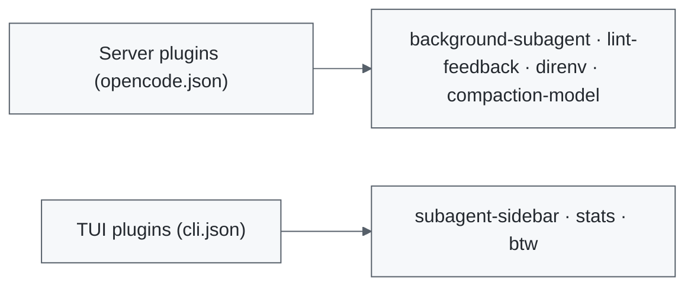

<a id="readme-top"></a>

<div align="center">

# OpenCode Plugins

**Seven focused plugins for OpenCode V2.**

Background subagents, live subagent visibility, session stats, lint feedback, direnv, and compaction, each in its own package.

[](https://github.com/madsoftwaredev/opencode-plugins/actions/workflows/ci.yml)
[](https://www.npmjs.com/package/@madsoftwaredev/opencode-background-subagent)
[](LICENSE)

[Plugins](#plugins) &nbsp;•&nbsp; [Install](#install) &nbsp;•&nbsp; [Develop](#develop)

</div>

> [!NOTE]
> Built and maintained by [MAD Software](https://github.com/madsoftwaredev).

## How It Works

OpenCode V2 loads plugins from two places. Server plugins extend sessions, tools, and shell behavior through `opencode.json`. TUI plugins extend the terminal interface through `cli.json`. Each package is independent, so install only what you want.



## Plugins

| Plugin | Surface | What It Does |
| --- | --- | --- |
| [Background subagent](packages/background-subagent/README.md) · [npm](https://www.npmjs.com/package/@madsoftwaredev/opencode-background-subagent) | Server | Runs subagents in the background by default; explicit foreground calls still wait. |
| [Subagent sidebar](packages/subagent-sidebar/README.md) · [npm](https://www.npmjs.com/package/@madsoftwaredev/opencode-subagent-sidebar) | TUI | Shows live child and nested subagent sessions; click a row to open it. |
| [Stats](packages/stats/README.md) · [npm](https://www.npmjs.com/package/@madsoftwaredev/opencode-stats) | TUI | Shows token speed and session-wide turn and step counts in the prompt footer; toggle each in the TUI. |
| [Lint feedback](packages/lint-feedback/README.md) · [npm](https://www.npmjs.com/package/@madsoftwaredev/opencode-lint-feedback) | Server | Appends project-local ESLint diagnostics after successful edits. Checks only, never fixes. |
| [direnv](packages/direnv/README.md) · [npm](https://www.npmjs.com/package/@madsoftwaredev/opencode-direnv) | Server | Applies the approved direnv environment to each shell command's working directory. |
| [Compaction model](packages/compaction-model/README.md) · [npm](https://www.npmjs.com/package/@madsoftwaredev/opencode-compaction-model) | Server | Summarizes checkpoints with a selectable model and reasoning variant. |
| [`/btw`](packages/btw/README.md) · [npm](https://www.npmjs.com/package/@madsoftwaredev/opencode-btw) | TUI | Runs a side conversation in a background fork of the current session. |

Each plugin README documents its behavior, setup, and limitations.

> [!WARNING]
> Upgrading from `0.1.0`? Background subagent, subagent sidebar, lint feedback, and direnv dropped the `local.` prefix from their plugin IDs in `0.1.1`. npm package names are unchanged, but update any config rules that reference the old IDs (`local.direnv` is now `direnv`, and so on).

## What This Looks Like

### Session Stats in the Footer

```text
44.4 tok/s · 3 turns · 8 steps
```

The `stats` plugin appends live token speed and session-wide turn and step counts to the prompt footer. Enable or disable each stat in `cli.json`, or save overrides with `/stats`.

### Background Subagents by Default

<table>
<tr>
<th align="left">Without the plugin</th>
<th align="left">With the plugin</th>
</tr>
<tr>
<td valign="top">

> A `subagent` call that omits `background` blocks the parent until the child finishes.

<em>Every delegated task pauses the parent turn.</em>

</td>
<td valign="top">

> The same call runs in the background, and the child reports back later.

<em>Explicit `background: false` still waits when the next step needs the result.</em>

</td>
</tr>
</table>

## Install

Requires OpenCode V2. Install each package you want with `opencode plugin add`:

```sh
# Server plugins (opencode.json)
opencode plugin add @madsoftwaredev/opencode-background-subagent
opencode plugin add @madsoftwaredev/opencode-lint-feedback
opencode plugin add @madsoftwaredev/opencode-direnv
opencode plugin add @madsoftwaredev/opencode-compaction-model

# TUI plugins (cli.json)
opencode plugin add @madsoftwaredev/opencode-subagent-sidebar
opencode plugin add @madsoftwaredev/opencode-stats
opencode plugin add @madsoftwaredev/opencode-btw
```

Restart the OpenCode TUI after installing a TUI plugin.

<details>
<summary><b>Managing installed packages</b></summary>

```sh
opencode plugin list
opencode plugin check
opencode plugin update
```

The CLI checks and updates installed packages; exact version pins remain pinned.

</details>

## Configure Compaction

The compaction plugin defaults to
`opencode-go/deepseek-v4.1-flash#max`. To use a different connected model, set
`options.model` in its entry in `opencode.json`. Replace the package's string
entry with the object form below, preserving your other plugins:

```jsonc
{
  "$schema": "https://opencode.ai/config.json",
  "plugins": [
    {
      "package": "@madsoftwaredev/opencode-compaction-model",
      "options": {
        "model": "provider/model#variant"
      }
    }
  ]
}
```

Use `provider/model` from a connected provider; `#variant` is optional. On
failure, the plugin logs a diagnostic and lets OpenCode use its normal session
model for compaction. See the [full compaction guide](packages/compaction-model/README.md)
for details and a working configuration example.

## Requirements

| Plugin | Requires |
| --- | --- |
| direnv | `direnv` installed where the OpenCode server runs, plus an approved `.envrc` per project (`direnv allow`). |
| Lint feedback | Node on the shell's `PATH`, project-installed ESLint 9 or 10, and a flat `eslint.config.*` file. |
| Subagent sidebar, stats, `/btw` | The OpenCode terminal UI. |

## Develop

Development and tests require Bun, Node.js 22+, and `direnv`:

```sh
git clone https://github.com/madsoftwaredev/opencode-plugins.git
cd opencode-plugins
bun install --frozen-lockfile
bun run check
```

`bun run check` runs the entrypoint build check and all package tests. Tests use
temporary projects and do not require a live OpenCode server.

To try a package directly from the latest source before a release:

```sh
opencode plugin add 'github:madsoftwaredev/opencode-plugins#main::path:packages/direnv'
```

Replace `direnv` with the package directory you want to try.

Issues and ideas are welcome in the [GitHub issue tracker](https://github.com/madsoftwaredev/opencode-plugins/issues).

<details>
<summary><b>Maintainers: Publishing Releases</b></summary>

All seven packages share one version. To prepare a release, update `version` in
the root manifest and each `packages/*/package.json`, refresh the lockfile, and
run the checks:

```sh
bun install
bun run check
npm pack --workspaces --dry-run
```

Commit the version bump and push a matching tag. For example, after changing
every package to `0.1.2`:

```sh
git add package.json packages/*/package.json bun.lock
git commit -m "release: v0.1.2"
git tag v0.1.2
git push origin main v0.1.2
```

The [release workflow](.github/workflows/release.yml) verifies the packages and
publishes them with provenance. Configure npm Trusted Publishing for **each
package** with GitHub organization `madsoftwaredev`, repository
`opencode-plugins`, workflow filename `release.yml`, and direct `npm publish`
enabled. Trusted Publishing requires Node.js 22.14.0+ and npm 11.5.1+ on the
runner.

</details>

## License

[MIT](LICENSE)
