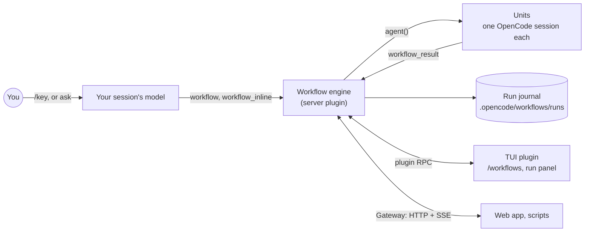

<p align="center">
  
</p>

<p align="center">
  <a href="https://www.npmjs.com/package/@malhashemi/opencode-dynamic-workflows"></a>
  <a href="https://github.com/malhashemi/opencode-dynamic-workflows/actions/workflows/ci.yml"></a>
  <a href="LICENSE"></a>
  
  
  <a href="docs/integrating.md"></a>
</p>

<p align="center">
  <b>Deterministic multi-agent Workflows for OpenCode.</b><br>
  Write the plan as a TypeScript script. It fans work out to subagents, gets typed results back, and combines them
  with plain code.
</p>

<p align="center">
  <a href="#install">Install</a> ·
  <a href="#usage">Usage</a> ·
  <a href="#configuration">Configuration</a> ·
  <a href="#writing-workflows">Writing Workflows</a> ·
  <a href="#how-it-works">How it works</a> ·
  <a href="CONTRIBUTING.md">Contributing</a>
</p>

---

A **Workflow** is a small TypeScript program for [OpenCode](https://opencode.ai) V2. Each `agent()` call in it starts
one **Unit**: a fresh OpenCode session that runs one subagent on one prompt. The script decides what fans out, what
verifies and what gets combined, using `pipeline`, `parallel`, loops and `if`. The models do only the parts that need a
model.

When one agent improvises the orchestration, it decides turn by turn how many subagents to start, whether to check
their work and when to stop, and it can decide differently on every run. A Workflow runs the same structure every time.
Units run under concurrency caps, typed Units return validated values instead of prose, a person can answer questions
and permission requests while it runs, and every Unit is journaled so a stopped or crashed Run can be resumed.

<p align="center">
  <a href="assets/web-run.webp"></a><br>
  <sub>A real Run in the web app: <code>engine-audit</code>, 9 typed Units on two models across 4 phases.</sub>
</p>

<table>
  <tr>
    <td width="44%" align="center">
      <a href="assets/web-typed-unit.webp"></a><br>
      <sub>One Unit's typed result: validated JSON, delivered through the <code>workflow_result</code> tool.</sub>
    </td>
    <td>
      <ul>
        <li><b>Plain TypeScript.</b> <code>agent()</code> starts a Unit; <code>pipeline</code>, <code>parallel</code> and ordinary code combine the results.</li>
        <li><b>Typed results.</b> Pass a zod schema (or a JSON Schema) and get a validated value back. When a model answers in prose, the engine repairs or extracts the value.</li>
        <li><b>Any model per Unit.</b> <code>model: "provider/model#variant"</code> puts different models in one Run, for example an independent verifier.</li>
        <li><b>Watch and steer.</b> A TUI panel and a web app show phases, Units and transcripts. Stop a Run, restart a Unit, answer a question.</li>
        <li><b>Build on it.</b> A versioned protocol with an OpenAPI 3.1 spec: any app can list, start, follow and answer Workflows, no TUI needed.</li>
        <li><b>Never hangs headless.</b> Questions carry a fallback answer, and permission requests are denied with a message when nobody is watching.</li>
        <li><b>Resumable.</b> Every Run is journaled. Resume replays the finished Units and runs the rest live.</li>
        <li><b>Bounded.</b> 5 Units per Run and 5 Runs at once by default, per-provider caps, token budgets and hard limits.</li>
      </ul>
    </td>
  </tr>
</table>

## A Workflow

```ts
// .opencode/workflows/review-changes.ts
import { defineWorkflow, z } from "@malhashemi/opencode-dynamic-workflows/workflow"

const Finding = z.object({ line: z.number().nullable(), claim: z.string() })
const Findings = z.object({ findings: z.array(Finding) })
const Verdict = z.object({ holds: z.boolean(), evidence: z.string() })

export default defineWorkflow({
  meta: {
    name: "review-changes",
    description: "Review each changed file, then verify every finding against the code",
    args: z.object({ base: z.string().default("main") }),
  },
  async run({ agent, pipeline, parallel, collect, $, args }) {
    const diff = await $`git diff --name-only ${args.base}`
    const files = diff.stdout.split("\n").filter(Boolean)
    const checked = await pipeline(
      files,
      (file) => agent(`Review ${file} for bugs.`, { label: file, schema: Findings }),
      (review, file) =>
        review &&
        parallel(review.findings.map((f) => async () => {
          const verdict = await agent(`Does this hold in ${file}? ${f.claim}`, {
            label: `verify:${file}`,
            schema: Verdict,
          })
          return { file, ...f, verdict }
        })),
    )
    return collect(checked).flat().filter((f) => f?.verdict?.holds)
  },
})
```

Each changed file gets a reviewer Unit, and each finding gets its own verifier as soon as that file's review is done.
Only the findings that hold come back. Save the file, then type `/review-changes` in OpenCode, or ask the model to "run
review-changes against main".

You can also let the model write the script. The tool descriptions point it to the bundled `dynamic-workflows` skill;
it writes a Workflow for the task at hand and runs it with `workflow_inline` once you approve the source.

## Requirements

- [OpenCode](https://opencode.ai) **2.0.16** or later. The plugin uses the V2 plugin API and does not work with
  OpenCode V1.
- Any model OpenCode can use. Typed results work best with models that call tools reliably; for the others the engine
  falls back to JSON in the reply, repair turns and an extraction call.
- macOS, Linux or Windows. Development and live testing happen on macOS; if something breaks on Linux or Windows,
  please [open an issue](https://github.com/malhashemi/opencode-dynamic-workflows/issues).

## Install

```sh
opencode plugin add @malhashemi/opencode-dynamic-workflows
opencode service restart
```

That adds the package to your global OpenCode config. The TUI part loads with the server part; there is nothing else
to install. `opencode plugin update` brings later releases.

Or add it to `plugins` yourself, in a project's `opencode.json` or the global one. The object form takes
[options](#configuration); a project entry for the same package overrides the global one's options:

```jsonc
{
  "$schema": "https://opencode.ai/config.json",
  "plugins": [{ "package": "@malhashemi/opencode-dynamic-workflows", "options": { "inline": "ask" } }]
}
```

To run from a checkout of this repository, see the [development guide](docs/development.md): a checkout and the
installed package are two plugins to OpenCode, so do not load both in one place.

## Usage

### Tools the model gets

| Tool | What it does |
| --- | --- |
| `workflow` | `list` the saved Workflows; run one by `name` (with `args`, optionally `background: true`); `status`, `result`, `stop` or `resume` (alias `resumeFromRunId`) a Run by id; `save_run` to keep an inline Run's script. |
| `workflow_inline` | Run model-written `source` (or a project file via `scriptPath`) after approval, or `save` it as a durable Workflow instead of running it. |
| `workflow_result`, `question` | Inside Units only: the typed-result tool, and a `question` tool the engine answers. |

The plugin also registers the **`dynamic-workflows` skill**, the full authoring guide: API, pipeline vs parallel, typed
Units, questions, resume, quality patterns and worked examples. The tool descriptions tell the model to load it before
writing a Workflow. Source: [`packages/plugin/skill/dynamic-workflows/SKILL.md`](packages/plugin/skill/dynamic-workflows/SKILL.md).

A Run started with `background: true` returns its id at once. When it ends, a notification with a summary and a result
preview arrives in the session that started it (plugin option `notify`).

### Commands

- `/workflow <key> <request>` runs a durable Workflow by key.
- Every durable Workflow also gets its own command, `/<key>`, with namespaces written with `/` (`team:review` becomes
  `/team/review`). The commands follow your Workflow files as they change. Both kinds hand the request to the model,
  which calls `workflow` with the matching `args`.

### In the TUI

`/workflows` (or <kbd>leader</kbd> <kbd>f</kbd>) opens the Run library. From there you open a Run (phases, Units,
activity, result) and a Unit (prompt, output, transcript). The session you are in also shows its Runs in a strip above
the prompt, in the sidebar and in a run panel (`/workflows panel`). The header links to the same page in the web app.

Below the Runs, **Saved** lists the project's durable Workflows with the args each one needs, so you do not have to
remember their keys. <kbd>↵</kbd> asks what you want and sends it to your session as `/<key> <request>`: the agent
builds the args and runs it. <kbd>s</kbd> starts a Workflow that needs no args at once.

<p align="center">
  <a href="assets/tui-run.webp"></a><br>
  <sub>A Run in the TUI: phases, Units, budget and the typed result.</sub>
</p>

<table>
  <tr>
    <td width="50%"><a href="assets/tui-library.webp"></a></td>
    <td width="50%"><a href="assets/tui-unit.webp"></a></td>
  </tr>
  <tr>
    <td align="center"><sub>The library: live Runs first, each with its progress.</sub></td>
    <td align="center"><sub>A Unit: its prompt, and its output as markdown.</sub></td>
  </tr>
</table>

| Where | Keys |
| --- | --- |
| Library | <kbd>↵</kbd> open (on a saved Workflow: run it in your session) · <kbd>s</kbd> start a saved Workflow that needs no args · <kbd>a</kbd> answer · <kbd>f</kbd> filter · <kbd>d</kbd> clean up finished · <kbd>b</kbd> open in the browser · <kbd>p</kbd> pair a device · <kbd>r</kbd> refresh |
| Run, while running | <kbd>↵</kbd> Unit · <kbd>o</kbd> transcript · <kbd>s</kbd> stop Run · <kbd>x</kbd> stop Unit · <kbd>r</kbd> restart Unit · <kbd>b</kbd> open in the browser · <kbd>p</kbd> parent session |
| Run, when finished | <kbd>e</kbd> resume · <kbd>w</kbd> save as a durable Workflow · <kbd>d</kbd> delete its Unit sessions |
| Approval | <kbd>↑</kbd>/<kbd>↓</kbd>, <kbd>PgUp</kbd>/<kbd>PgDn</kbd>, <kbd>Home</kbd>/<kbd>End</kbd> scroll the script · <kbd>←</kbd>/<kbd>→</kbd> choose · <kbd>↵</kbd> confirm |
| Anywhere | <kbd>j</kbd>/<kbd>k</kbd> or arrows to move · <kbd>⌫</kbd> back |

`/workflows` also takes `panel`, `answer`, `cleanup`, `pair`, `refresh`, or a Run id or Workflow name to open.

### In the browser

The web app is served by the plugin's Gateway at `http://127.0.0.1:4320` (the next free port if that one is taken).
The `/workflows` header shows its address and <kbd>b</kbd> opens the page you are on; every tool result also links to
its Run. A browser on the same machine pairs itself for control actions. For a browser on
another device (with `gateway.bind` set to `lan` or `tailscale`), run `/workflows pair` in the TUI and enter the
one-use code.

<p align="center">
  <a href="assets/web-library.webp"></a><br>
  <sub>The Run library, kept live over Server-Sent Events.</sub>
</p>

<p align="center">
  <a href="assets/web-unit.webp"></a><br>
  <sub>A Unit and its transcript, down to the <code>workflow_result</code> call that delivered its typed value (Output and Prompt panels omitted).</sub>
</p>

### Where Workflows live

`.opencode/workflows/**/*.ts` (or `workflow/`) in the project and every parent directory, the global config directory,
and `$OPENCODE_CONFIG_DIR`. A subfolder becomes a namespace: `workflows/team/review.ts` with `meta.name: "review"` has
the key `team:review`. The nearest scope wins a key collision.

## Configuration

Pass options with the object form of the plugin entry. Every option is optional, and an invalid value falls back to
its default.

```jsonc
{
  "plugins": [
    {
      "package": "@malhashemi/opencode-dynamic-workflows",
      "options": {
        "inline": "ask",
        "maxConcurrentUnits": 5,
        "providerConcurrency": { "github-copilot": 4 },
        "gateway": { "port": 4320 },
      },
    },
  ],
}
```

| Option | Default | Description |
| --- | --- | --- |
| `inline` | `"ask"` | Inline (model-written) Workflows: `ask` a person each time (or "always for this project"), `allow`, or `deny`. With `ask` and nobody attached, the Run is refused. |
| `inlineCapabilities` | `true` | Give inline Runs `ctx.$`, `ctx.file` and `ctx.fetch`. Durable Runs always have them. |
| `notify` | `true` | When a background Run started by the model ends, post a notification (summary and result preview) into that session. |
| `maxConcurrentUnits` | `5` | Units in flight per Run. A Workflow's `meta.concurrency` can lower it, not raise it. |
| `maxConcurrentRuns` | `5` | Runs executing at once in the OpenCode process. Further Runs wait, queued, until one ends. |
| `providerConcurrency` | `{}` | Caps per provider id across all Runs, e.g. `{ "github-copilot": 4 }` for a rate-limited subscription. |
| `retention` | `"keep"` | `delete-on-success` marks Runs that succeed for cleanup; `/workflows cleanup` in the TUI then deletes their Unit sessions. |
| `limits` | `{ maxUnits: 1000, maxItemsPerCall: 4096, maxUnitSteps: 250 }` | Hard limits per Run, per `parallel`/`pipeline` call and per Unit (model requests). |
| `gateway` | see below | The HTTP + SSE Gateway that serves the protocol and the web app. |

| `gateway.*` | Default | Description |
| --- | --- | --- |
| `enabled` | `true` | `false` turns the Gateway off; the TUI keeps working over plugin RPC. |
| `bind` | `"loopback"` | `loopback` (127.0.0.1), `lan` (0.0.0.0), `tailscale` (your 100.64.0.0/10 address), or an IP. |
| `port` | `4320` | The next free port is used if it is taken; the TUI and tool results show the real URL. |
| `auth` | `"token"` | Control actions need a token. `none` removes auth for loopback clients on a loopback bind only. |
| `allowedOrigins` | `[]` | Extra browser origins (CORS and CSRF allow-list). |
| `web` | `true` | Serve the web app. |

## Writing Workflows

The [`dynamic-workflows` skill](packages/plugin/skill/dynamic-workflows/SKILL.md) is the complete guide, and
[`packages/plugin/docs/examples/`](packages/plugin/docs/examples) has runnable Workflows:
[`review-files.ts`](packages/plugin/docs/examples/review-files.ts) (typed findings per file),
[`research.ts`](packages/plugin/docs/examples/research.ts) (a question to the person, a hard token budget) and
[`repo-report.ts`](packages/plugin/docs/examples/repo-report.ts) (`ctx.$` and `ctx.file`). Import everything from
`@malhashemi/opencode-dynamic-workflows/workflow`.

`run(ctx)` receives:

| Member | What it does |
| --- | --- |
| `agent(prompt, opts?)` | One Unit. Returns its final text, or with `schema` a validated value. A failed Unit returns `null` and is added to `errors`; it never throws. |
| `pipeline(items, ...stages)` | Each item runs through its stages on its own, with no barrier between items. Stages get `(previous, item, index)`. |
| `parallel(thunks)` | Runs thunks concurrently and waits for all of them (a barrier). Failures become `null`. |
| `collect(xs)` | Drops the `null`s, with the narrowed type. |
| `errors` | Every dropped Unit: `{ unit, prompt, subagent, error }`. |
| `args` | The Run's `args`, validated against `meta.args` before anything starts. |
| `log(msg)`, `phase(title)` | Progress, shown in the TUI and the web app. |
| `ask(questions, { fallback, graceMs? })` | Ask a person. The `fallback` answers at once when nobody is attached, so a Run never hangs. |
| `budget` | `{ total, spent(), remaining() }` in output tokens. |
| `signal` | The Run's `AbortSignal`. |
| `$`, `file`, `fetch` | Shell, files and HTTP, confined to the project and recorded in the Run's activity. |
| `workflow(name, args?)` | Run a saved Workflow as one step of this Run (one level deep). |
| `worktrees()` | The git worktrees kept by `isolation: "worktree"` Units that changed files. |

`agent()` options: `schema`, `label`, `phase`, `subagent` (alias `agentType`; default `general`), `model`
(`"provider/model#variant"` or `{ providerID, modelID }`), `effort` (the variant), `retries` (repair turns, default 2),
`timeoutMs`, `permissions`, `isolation: "worktree"` (a fresh git worktree, removed if unchanged) and `location` (another
directory).

`meta`: `name`, `description`, `whenToUse`, `phases`, `args` (zod), `concurrency`, `unitTimeout`, `budget` (a number,
or `{ tokens, hard: true }` to stop at the limit), `permissions` (rules for every Unit), `limits`, and
`interaction: { permissions: "ask" | "auto" | "deny", graceMs }`.

Default to `pipeline`. Use `parallel` as a barrier only when a stage needs every result of the previous one, such as
deduplicating findings across all files before verifying them.

### Typed results

A Unit with a `schema` gets a `workflow_result` tool whose input is your schema. The tool validates each call, so the
model can correct a bad call in the same turn. If the model answers in text instead, the engine tries the JSON in that
text, then sends up to `retries` repair turns in the same session, then extracts the value with one plain generation
call. Every Unit records which path produced its value (`resultPath`: `tool`, `text-json`, `extract`, `replay` or
`text`) and every attempt.

### Resume

Every Run is journaled under `.opencode/workflows/runs/<runId>/`. A plugin reload does not stop running Runs. If the
OpenCode service dies, the Run reads back as `interrupted`. `resume` starts a new Run that matches Units by start order
and prompt: each Unit whose prompt is unchanged returns its recorded result at once, answers to `ask` are replayed, and
from the first changed prompt on everything runs live. Units that failed run again.

## How it works

<p align="center">
  
</p>



- **The engine** runs inside the OpenCode server as a plugin, with no changes to OpenCode. It loads the Workflow
  module, validates `args`, and runs `run(ctx)`. Each `agent()` call waits for a slot under the Run's concurrency cap
  (and any per-provider cap), then creates a Unit session, prompts it, waits for it to finish and reads its result.
  Runs beyond `maxConcurrentRuns` wait, queued.
- **Units** are ordinary OpenCode sessions, so they use your providers, subagents and permission rules. They are not
  linked into your conversation; the TUI and web app show them.
- **The journal** records the Run, each Unit, the script source and the result, which is what resume replays.
- **Clients** talk to the engine through one versioned protocol: the TUI over plugin RPC, the web app and scripts
  over the Gateway.

## Security

Inline Workflows are model-written code that runs with your privileges, and they are not sandboxed: the approval is
the control. By default a person approves each one (**Run once**, **Always for this project** or **Reject**) after
reading the whole source, with its size and SHA-256, in the TUI (`/workflows`, a scrolling view) or the web app. The
script is not loaded, so none of its code runs, until then. Saving inline source as a durable Workflow asks the same
way. The request waits until someone answers; there is no time limit. Headless, an inline Run is refused unless the
project was approved before. The plugin option `inline` changes this: `"allow"` runs inline Workflows without asking,
`"deny"` never runs them.

<p align="center">
  <a href="assets/tui-approval.webp"></a><br>
  <sub>Approving an inline Workflow: the whole script, highlighted, before any of it runs.</sub>
</p>

Units get OpenCode's permission rules plus the engine's own: `workflow_result` and `question` allowed, `workflow` and
`workflow_inline` denied (no recursion). A Unit's permission request goes to a person when one is attached; headless,
it is denied with a message the Unit can act on.

The Gateway binds to loopback by default, checks `Host` and `Origin` headers, and needs a bearer token for every control action;
remote browsers pair with a one-use code. Read [`docs/security.md`](packages/plugin/docs/security.md) for the trust
model, capabilities, limits and data on disk, and [SECURITY.md](SECURITY.md) to report a vulnerability.

## Build on it

Your app can run Workflows too: an ADE, an editor extension, a dashboard, a bot. Everything the TUI and the web app do
goes through one versioned protocol (v1, which changes only by addition), with two transports:

- **OpenCode plugin RPC** on the OpenCode server (`POST /api/rpc/workflow/<method>`), for apps that already talk to
  OpenCode. It uses your existing OpenCode credentials; the TypeScript contract is
  `@malhashemi/opencode-dynamic-workflows/rpc`, the types `@malhashemi/opencode-dynamic-workflows/protocol`.
- **The Gateway** (HTTP + Server-Sent Events), described by an [OpenAPI 3.1 document](packages/plugin/docs/protocol/openapi.json)
  that a running Gateway also serves at `/v1/openapi.json`.

```sh
curl -s http://127.0.0.1:4320/v1/openapi.json | jq '.paths | keys'
curl -N "http://127.0.0.1:4320/v1/events?location=/my/project"
```

The [integration guide](docs/integrating.md) covers both, including how to be "attached" so that questions and
approvals reach your users. The [protocol reference](packages/plugin/docs/protocol/README.md) and
[JSON Schemas](packages/plugin/docs/protocol/schemas) have the details. If you add support to your app, tell us in an
[issue](https://github.com/malhashemi/opencode-dynamic-workflows/issues): we will list it here and help with what the
protocol is missing.

## Troubleshooting

| Symptom | Fix |
| --- | --- |
| The plugin does not load from a local directory. | OpenCode resolves a directory plugin's entry by path (`<dir>/server` or `<dir>/index`), not through `package.json` exports. Point `plugins` at `packages/plugin`, which ships `server.ts`, `rpc.ts` and a `tui` entry at its root, and run `bun run build` first. |
| Inline Workflows are refused in `opencode run`. | Nobody can approve them headless. Approve "always for this project" once from the TUI or web app, save the script as a durable Workflow, or set `inline: "allow"`. |
| A Unit fails with "exceeded its step limit". | The Unit made more model requests than `limits.maxUnitSteps` (a loop guard, 250 by default). Raise the limit for Workflows whose Units do long work. |
| The web app is not at port 4320. | Another process holds the port, so the Gateway took the next free one. Tool results and the TUI show the real URL. |

Still stuck? [Open an issue](https://github.com/malhashemi/opencode-dynamic-workflows/issues) with your OS, OpenCode
version and, if you can, the Run's journal (`.opencode/workflows/runs/<runId>/`).

## Development

```sh
git clone https://github.com/malhashemi/opencode-dynamic-workflows
cd opencode-dynamic-workflows
bun install
bun run check        # formatting, lint, types, tests (no OpenCode needed)
bun run build        # dist/tui.js, dist/web, protocol schema check
bun run pack         # build, then the publishable tarball
bun run verify:live  # real OpenCode on a private server
```

The live tests start `opencode serve` with its own database under `$TMPDIR/opencode`; it never touches your
configuration. `WF_LIVE_MODEL` picks the model (default `claude-work/claude-opus-5-5`).

The repository has two packages: [`packages/plugin`](packages/plugin) (the published package: server plugin, TUI
plugin, authoring API, protocol and Gateway) and [`packages/web`](packages/web) (the web app, built into
`packages/plugin/dist/web`). `packages/plugin/README.md` is generated from this file for npm; after editing this
README, run `bun run packages/plugin/script/sync-readme.ts`.

## Contributing

Bug reports, platform reports from Linux and Windows, example Workflows and code are all welcome. Start with
[CONTRIBUTING.md](CONTRIBUTING.md), and follow the [code of conduct](CODE_OF_CONDUCT.md). Changes are listed in the
[changelog](CHANGELOG.md).

## License

[MIT](LICENSE) © M. Adel Alhashemi

This is an independent project, not affiliated with or endorsed by the OpenCode team.
