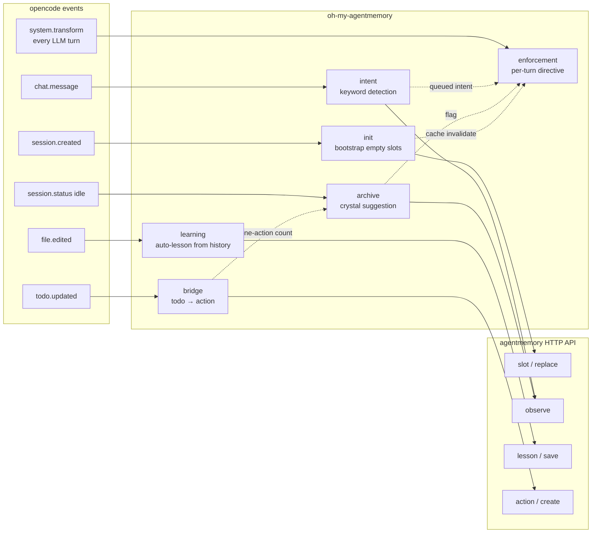

<div align="center">

# oh-my-agentmemory

**Make your opencode agent actually use [agentmemory](https://github.com/rohitg00/agentmemory).**

Companion plugin to `agentmemory-capture.ts`. Capture already works —
this plugin forces the agent to **write** to memory proactively.

[](./LICENSE)
[](https://www.npmjs.com/package/oh-my-agentmemory)
[](https://github.com/dev-hann/oh-my-agentmemory/actions/workflows/ci.yml)
[](https://opencode.ai)
[](https://github.com/rohitg00/agentmemory)
[](#how-it-works)

[English](./README.md) · [한국어](./README.ko.md)

</div>

---

## Why

agentmemory ships **54 MCP tools** and a rock-solid auto-capture plugin
(`agentmemory-capture.ts`). Sessions get recorded. Semantic memories get
generated. Insights get extracted. **The read side works.**

But the **write side stalls**:

- The agent rarely calls `memory_save` on its own
- Pinned slots (`persona`, `project_context`, `user_preferences`, `tool_guidelines`) sit empty for weeks
- `memory_lesson_save` is almost never invoked
- `memory_crystallize` never fires
- Users type "remember this" and the agent says "ok" without saving

You can write a `rules/memory.md` policy file, but the LLM may ignore it.
This plugin turns that policy into a **per-turn directive** the model
cannot miss — same pattern as caveman-mode reinforcement, applied to
memory hygiene.

### Before / after

| Metric (per session) | Without oh-my-agentmemory | With oh-my-agentmemory |
|---|---|---|
| Pinned slots filled | 0 of 4 | **4 of 4** (auto-bootstrap on session.created) |
| `memory_save` calls | 0 | **1–3** (directive reinforced every turn) |
| `memory_lesson_save` calls | 0 | **2–5** (auto-captured from file history) |
| `memory_crystallize` calls | 0 | **occasional** (suggested when ≥3 actions done) |
| "remember this" actually saved | ~30% | **~90%** (keyword detection → directive) |

Numbers are illustrative — actual lift depends on session shape. The
`learning` hook (auto-lesson) is the largest contributor; the
`enforcement` directive is the largest enabler of explicit `memory_save`
calls.

---

## How it works

Six hooks, each owning one slice of the write side. Each has a short
**purpose name** used in `OH_AM_DISABLE` and a corresponding opencode
hook. All coexist with `agentmemory-capture.ts` (which keeps doing
passive observation).



| Hook (opencode event) | Purpose | What it does |
|---|---|---|
| `experimental.chat.system.transform` | **enforcement** | Pushes a policy directive into `output.system[]` every turn. Header + recall rules + write rules + crystal rules + state flags (empty slots, pending keywords, done-action count). Cached per-session to keep the hot path HTTP-free. |
| `event: session.created` | **init** | Lists slots, finds empties among the four core pinned slots, fills them with templates derived from cwd (project map). Logs a `oh_am_bootstrap` observation. |
| `chat.message` | **intent** | Matches user text against bilingual patterns: "remember", "save this", "don't forget", "기억해", "저장해", "잊어". Queues matches for the next directive. |
| `event: session.status` (idle) | **archive** | When ≥3 actions are done, records a `oh_am_crystal_candidate` observation. The next directive surfaces the candidate IDs to the LLM. |
| `event: file.edited` | **learning** | Fetches the file's history, looks for error signals (`error`, `fail`, `bug`, `에러`, `실패`, …), skips if edit is tiny or no error pattern, dedupes against `lesson_recall`, then calls `lesson/save`. 5-min per-file history cache + 60-second per-file debounce. |
| `event: todo.updated` | **bridge** | Bridges high-priority (`priority ≥ 7`) `todowrite` entries into agentmemory actions (tags: `from-todo`). Medium/low stay session-local. Done high-priority actions feed the archive hook's crystal threshold. |

### Sample directive (what the LLM sees every turn)

```text
AGENTMEMORY POLICY ACTIVE. Use agentmemory MCP tools proactively.
Rules below override default behavior.
---
## Recall
• Need past context (recent work, decisions, prior bugs)? Call memory_recall
  or memory_smart_search BEFORE exploring files.
• Pinned slots (persona, project_context, user_preferences, tool_guidelines,
  pending_items, guidance) are auto-injected every turn — do NOT re-recall them.
• Trivial tasks (single-file read, arithmetic, grep) skip memory calls.
## Write
• After architectural or non-obvious technical decisions, call memory_save with
  the decision and concepts.
• Discovered an effective or ineffective approach? Call memory_lesson_save with
  what worked / what to avoid.
• Project structure / build pipeline / new module added? Call memory_slot_replace
  on project_context.
• Unfinished work or follow-up promised? Call memory_slot_replace on pending_items.
• Session about to end with loose ends? Call memory_slot_replace on guidance for
  the next session.
• Never claim 'memory updated' without an actual memory_* tool call in this turn.
## Crystal
• Three or more actions with status=done? Call memory_recall first to check for
  an existing crystal, then memory_crystallize with the done action IDs.
• Fewer than three done actions, or pure exploration with zero file changes →
  skip crystallize.

[STATE] Pinned slots empty: project_context, user_preferences. If session.created
bootstrap missed them, fill via memory_slot_replace before session ends.

[USER INTENT] User said: save:"remember this". Act on it via the matching memory_*
tool this turn.
---
Pinned slots are already in your context — do not re-recall them. Calling memory_*
without an actual tool call in this turn = false report (forbidden).
```

Edit `src/core/policy.ts` to retune any rule. The directive is rebuilt
automatically from data — no string-surgery required.

---

## Install

### 1. Prerequisites

- [opencode](https://opencode.ai) `≥1.14` (provides the
  `experimental.chat.system.transform` hook)
- [agentmemory](https://github.com/rohitg00/agentmemory) server running on
  `http://localhost:3111`:
  ```bash
  npx @agentmemory/agentmemory
  ```
- [Bun](https://bun.sh) only if installing from source (opencode bundles the runtime for npm plugins)

### 2. Register the plugin (alongside capture.ts)

Add `oh-my-agentmemory` to `~/.config/opencode/opencode.json` — opencode
installs it automatically from npm at startup:

```json
{
  "plugin": [
    "./plugins/agentmemory-capture.ts",
    "oh-my-agentmemory"
  ]
}
```

Keep `agentmemory-capture.ts` — this plugin is **write-side only** and
depends on capture.ts continuing to observe.

### 3. (Optional) Install slash commands

```bash
mkdir -p ~/.config/opencode/commands
for f in am-recall am-save am-bootstrap am-status; do
  curl -fsSL "https://raw.githubusercontent.com/dev-hann/oh-my-agentmemory/main/src/adapters/opencode/commands/${f}.md" \
       -o ~/.config/opencode/commands/${f}.md
done
```

### 4. (Optional) Create a config file

Defaults work out of the box (localhost agentmemory, auto mode). For
persistent settings — remote server, custom project map,
health-check tuning — create `~/.config/opencode/oh-am.jsonc`:

```jsonc
// start from the full annotated reference:
// https://github.com/dev-hann/oh-my-agentmemory/blob/main/examples/oh-am.full.jsonc
```

See [Configuration](#configuration) for the full schema.

### 5. Restart opencode

Verify with `/am-status` — it should report pinned slots filled.

<details>
<summary><b>Install from source (development)</b></summary>

```bash
git clone https://github.com/dev-hann/oh-my-agentmemory.git ~/Documents/oh-my-agentmemory
cd ~/Documents/oh-my-agentmemory && bun install
ln -sfn ~/Documents/oh-my-agentmemory/src/adapters/opencode \
        ~/.config/opencode/plugins/oh-my-agentmemory
```

Then register `"./plugins/oh-my-agentmemory/plugin.ts"` instead of the
npm package name in `opencode.json`.

</details>

---

## Slash commands

| Command | Action |
|---|---|
| `/am-recall <query>` | Search past observations + lessons via `memory_recall` |
| `/am-save <text>` | Save an insight to long-term memory via `memory_save` |
| `/am-bootstrap` | Force re-bootstrap empty slots right now (use when cwd project detection was wrong) |
| `/am-status` | Show slot fill state + recent sessions + latest lessons + crystal candidates |

---

## Configuration

Three layers, in descending precedence:

1. **Process env vars** (override everything for one-shot runs / CI)
2. **`~/.config/opencode/oh-am.jsonc`** (persistent settings, JSONC = comments allowed)
3. **Built-in defaults** (see `src/core/config-types.ts`)

### Env vars (one-shot overrides)

| Var | Default | Effect |
|---|---|---|
| `AGENTMEMORY_URL` | `http://localhost:3111` | agentmemory server base URL |
| `AGENTMEMORY_SECRET` | `""` | Bearer token if auth enabled on server |
| `OH_AM_MODE` | `auto` | `auto` \| `full` \| `mcp-only` |
| `OH_AM_DISABLE` | `""` | Comma-list of purpose names to disable: `enforcement`, `init`, `intent`, `archive`, `learning` |
| `OH_AM_DEBUG` | `0` | Set to `1` for verbose stderr logging |

Example: `OH_AM_DEBUG=1 OH_AM_DISABLE=learning opencode`

### Config file (persistent)

Create `~/.config/opencode/oh-am.jsonc`:

```jsonc
{
  // agentmemory server
  "url": "http://localhost:3111",
  "secret": "",

  // operating mode: "auto" | "full" | "mcp-only"
  "mode": "auto",

  // purpose names to disable
  "disabled": ["learning"],

  // extend built-in project map without code edit (always prepended)
  "projectMap": [
    {
      "match": "my-new-project",
      "projectId": "mnp",
      "displayName": "My New Project",
      "stack": ["Go", "Postgres"]
    }
  ],

  // health check on plugin init
  "healthCheckOnBoot": true,
  "healthCheckTimeoutMs": 2000,
  "healthCheckFatal": false,

  // verbose stderr logging
  "debug": false
}
```

Full reference with every field documented: [`examples/oh-am.full.jsonc`](./examples/oh-am.full.jsonc).

### MCP-only mode

Set `"mode": "mcp-only"` (or `OH_AM_MODE=mcp-only`) when running without
`agentmemory-capture.ts` — e.g. on Cursor, Claude Desktop, or a second
machine that only consumes a shared agentmemory instance.

In this mode:

- **`learning`** and **`archive`** hooks skip entirely (their data sources
  — file history, done actions — are empty without capture.ts)
- **`enforcement`** directive gains a stronger banner warning the LLM that
  no auto-capture is running, and the write responsibilities shift to it
  entirely

Auto-detection (`"mode": "auto"`) probes the agentmemory server on first
session.created; if recent sessions average <5 observations each it
switches to `mcp-only`. Set explicitly to skip the probe.

### Health check

By default, the plugin pings `${url}/agentmemory/health` on init. If
unreachable:

- Default (`healthCheckFatal: false`): logs a warning, continues running
  (hooks will silently fail their HTTP calls)
- `healthCheckFatal: true`: plugin returns no hooks, effectively disabled

---

## Architecture

Hexagonal (ports & adapters). The `core/` layer is pure TypeScript with
**zero I/O** — easy to unit-test, easy to port to other agents later.

```
oh-my-agentmemory/
├── src/
│   ├── core/                       # agent-agnostic, pure TS, no I/O
│   │   ├── directives.ts           # buildDirective(ctx) → string
│   │   ├── bootstrap.ts            # SLOT_TEMPLATES + detectProject(cwd)
│   │   ├── keywords.ts             # pattern loader + matchKeywords()
│   │   ├── lessons.ts              # buildLessonFromFileHistory() → LessonCandidate
│   │   ├── policy.ts               # rules/memory.md encoded as data
│   │   ├── config-types.ts         # OhAmConfig + ResolvedConfig types
│   │   └── types.ts                # shared types
│   │
│   ├── data/                       # locale-keyed keyword / signal data
│   │   ├── keywords.ts             # save / forget / recall patterns per locale
│   │   └── error-signals.ts        # error keywords per locale (lessons filter)
│   │
│   └── adapters/
│       └── opencode/               # current; claude-code/codex later
│           ├── plugin.ts           # single entry, registers all hooks
│           ├── config.ts           # JSONC parser + env/file/default merge
│           ├── mode.ts             # auto-detect full vs mcp-only
│           ├── client.ts           # agentmemory HTTP wrapper
│           ├── hooks/
│           │   ├── _shared.ts      # isPhaseDisabled / isMcpOnly helpers
│           │   ├── system-transform.ts   # enforcement
│           │   ├── session-created.ts    # init
│           │   ├── chat-message.ts       # intent
│           │   ├── session-idle.ts       # archive
│           │   └── file-edited.ts        # learning
│           └── commands/
│               ├── am-recall.md
│               ├── am-save.md
│               ├── am-bootstrap.md
│               └── am-status.md
│
├── examples/
│   └── oh-am.full.jsonc            # complete config reference
│
└── tests/
    ├── core/                       # unit tests (no network)
    │   ├── directives.test.ts
    │   ├── keywords.test.ts
    │   ├── bootstrap.test.ts
    │   └── mcp-only.test.ts
    └── adapters/
        └── config.test.ts          # JSONC parse + mergeConfig
```

### Future agents

`adapters/claude-code/` and `adapters/codex/` will reuse `core/`
unchanged — only the hook glue differs. The hexagonal split keeps the
porting cost down to "write one adapter file per agent."

---

## Testing

```bash
bun install
bun run test            # vitest, 72 tests, ~350ms
bun run typecheck       # tsc --noEmit, strict mode
```

All tests target `core/` and the JSONC config layer — pure functions,
deterministic, no network. Adapter behavior is verified manually against
a running agentmemory server.

---

## Comparison

| | Built-in (CLAUDE.md / rules/) | `agentmemory-capture.ts` | **oh-my-agentmemory** |
|---|---|---|---|
| Layer | Static policy file | Plugin (read side) | **Plugin (write side)** |
| Captures observations | No | Yes (22+ hooks) | No (capture.ts does it) |
| Forces LLM to call `memory_save` | Honor system | No | **Yes (per-turn directive)** |
| Fills empty slots | No | No | **Yes (cwd-based bootstrap)** |
| Reacts to "remember" / "기억해" | No | No | **Yes (keyword detection)** |
| Auto-saves lessons from bug history | No | No | **Yes (file.edited hook)** |
| Suggests `memory_crystallize` | No | No | **Yes (idle + done ≥3)** |
| Config file | n/a | env vars only | **`oh-am.jsonc` (JSONC) + env vars** |
| Profiles (multi-instance switch) | n/a | No | No |
| MCP-only mode branching | n/a | No | **Yes (auto-detect or explicit)** |
| Health check on init | n/a | No | **Yes (optional self-disable)** |
| Cloud dependency | None | None | None |
| Cost | $0 | $0 | $0 |

This plugin is **complementary**, not competitive, with capture.ts.
Disable either one and you lose half the loop.

### vs opencode-supermemory

[opencode-supermemory](https://github.com/supermemoryai/opencode-supermemory)
is the right choice if you want cloud-hosted memory, Notion/Drive
connectors, auto user-profiles, and a one-line install.

oh-my-agentmemory is the right choice if you:

- Already run agentmemory locally and have invested in 50+ sessions of data
- Want to keep everything self-hosted (no cloud, no API keys)
- Need agentmemory's 54-MCP-tool surface (slots, lessons, crystals, actions,
  insights, consolidation pipeline) rather than supermemory's 3
- Prefer "directive reinforcement" over "automatic API-side extraction"

Both plugins can coexist — they push to different memory systems.

---

## Troubleshooting

<details>
<summary><b>Directive doesn't appear in the system prompt</b></summary>

1. Confirm plugin loaded: check opencode logs for `[oh-am] plugin loaded` (with `OH_AM_DEBUG=1` or `debug: true` in config)
2. Confirm `opencode.json` has both entries (capture.ts AND oh-my-am/plugin.ts)
3. Confirm symlink target exists: `ls -la ~/.config/opencode/plugins/oh-my-agentmemory/plugin.ts`
4. Confirm agentmemory server is up: `curl http://localhost:3111/agentmemory/health`
   — or set `"healthCheckOnBoot": true, "healthCheckFatal": false` to see the warning on plugin init
5. Confirm `enforcement` is not disabled via `OH_AM_DISABLE=enforcement` env var or
   `"disabled": ["enforcement"]` in `oh-am.jsonc`

</details>

<details>
<summary><b>Slots stay empty after session.created</b></summary>

1. Run `/am-bootstrap` to force re-bootstrap and see proposed content
2. Check stderr with `OH_AM_DEBUG=1` (or `"debug": true` in config) for
   `[oh-am] bootstrap filled N/N slots`
3. If detection picks the wrong project, either:
   - Add your cwd to `PROJECT_MAP` in `src/core/bootstrap.ts`, or
   - Add an entry to `projectMap` in `~/.config/opencode/oh-am.jsonc`
     (no code edit needed)
4. The `init` hook may be disabled via `OH_AM_DISABLE=init` env var or
   `"disabled": ["init"]` in config

</details>

<details>
<summary><b>Too many lessons being saved (learning noise)</b></summary>

The `learning` hook is conservative by default — it requires both an error signal in
file history AND a meaningful edit size. If still too noisy:

1. Disable temporarily:
   - Env: `OH_AM_DISABLE=learning opencode`
   - Config: `"disabled": ["learning"]` in `oh-am.jsonc`
2. Tune filters in `src/core/lessons.ts`:
   - Raise `MIN_EDIT_LINES` (default 5)
   - Add exclude patterns to skip test files or generated code
   - Edit `src/data/error-signals.ts` to expand or narrow error keywords

</details>

<details>
<summary><b>Directive is too verbose / hurts token budget</b></summary>

The directive body is ~600 tokens. To shrink:

1. Edit `src/core/policy.ts` to shorten rule texts (or drop sections by
   removing entries from `RECALL_POLICY` / `WRITE_POLICY` / `CRYSTAL_POLICY`)
2. Or use compact mode by editing `system-transform.ts` to call
   `buildDirective(ctx, { compact: true })` — this drops the rule bodies
   and keeps only state/keyword lines

</details>

<details>
<summary><b>Conflict with caveman or other plugins</b></summary>

opencode runs all plugins' hooks in sequence. Multiple plugins can push
to `output.system[]` without conflict — caveman pushes its reinforcement
line, oh-my-am pushes its directive, both reach the LLM.

</details>

---

## Development

```bash
git clone https://github.com/dev-hann/oh-my-agentmemory.git
cd oh-my-agentmemory
bun install
bun run test         # 35 unit tests
bun run typecheck    # strict TS
```

The `core/` layer has no I/O — every function is testable in isolation.
Adapter tests require a running agentmemory server.

### Roadmap

- **Skill layer** — `using-agentmemory` opencode Skill (auto-loaded by opencode
  when relevant, stronger than directive)
- **Claude Code adapter** — `adapters/claude-code/` (`.claude/settings.json` hook scripts
  that invoke `core/`)
- **Codex adapter** — `adapters/codex/` (Codex hook format)

Contributions welcome. Open an issue first to discuss scope.

---

## Uninstall

```bash
# Remove "oh-my-agentmemory" from opencode.json plugin[]
rm -rf ~/.cache/opencode/node_modules/oh-my-agentmemory
rm ~/.config/opencode/commands/am-{recall,save,bootstrap,status}.md
```

Your agentmemory data is untouched — only the directive plugin is removed.

---

## License

[MIT](./LICENSE) © dev-hann

## Acknowledgments

- [agentmemory](https://github.com/rohitg00/agentmemory) — the memory engine this plugin drives
- [agentmemory-capture.ts](https://github.com/rohitg00/agentmemory/blob/main/plugin/opencode/agentmemory-capture.ts) — the canonical observer plugin this complements
- [opencode-supermemory](https://github.com/supermemoryai/opencode-supermemory) — reference implementation for keyword detection and reasoned-recall directive patterns
- [caveman](https://github.com/JuliusBrussee/caveman) — reference implementation for per-turn system.transform reinforcement
