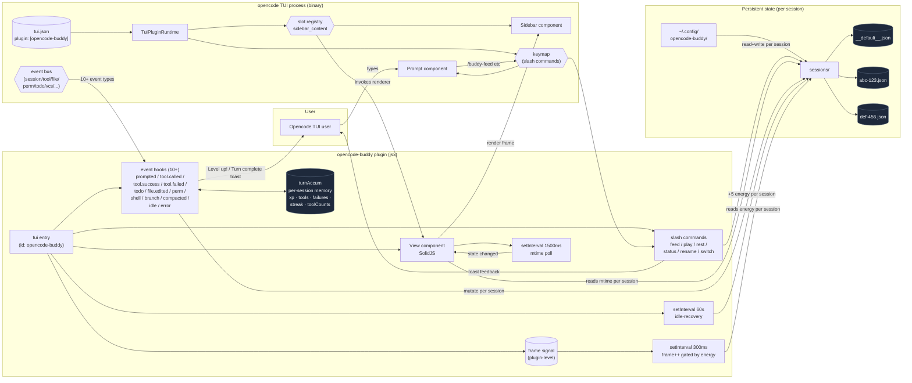

# opencode-buddy

A virtual ASCII pet companion that lives in the opencode TUI sidebar. **One buddy per opencode session** — switch sessions and you meet a different buddy; reopen the same session later and yours is exactly as you left it. Hatches, grows, and **earns xp from your actual coding** — every tool call, every completed turn, every approved permission feeds the buddy.


```
┌──────────────────────────┐
│  opencode TUI            │
│                          │
│  > your prompt here      │
│                          │
│         sidebar          │
│ ┌──────────────────────┐ │
│ │ Quack the duck       │ │
│ │       __             │ │
│ │     <(o )___         │ │
│ │      ( ._> /         │ │
│ │       `--'           │ │
│ │ ──────────────────── │ │
│ │ hunger ████████░░ 79 │ │
│ │ happy  ████████░░ 79 │ │
│ │ energy ██████████ 100│ │
│ │ idle · Lv 1 · xp 0   │ │
│ └──────────────────────┘ │
└──────────────────────────┘
```

Since v0.5.0 the buddy is **work-driven**: xp comes from the LLM calling tools, finishing turns, and you approving permissions — not from slash commands. Slash commands stay around for "I want to feed my pet right now" interactions. The buddy gets tired when you push it hard, naps to recover when you walk away, and slows down late at night.

Since v0.6.0 the buddy is **per-session**: each opencode session has its own state file at `~/.config/opencode-buddy/sessions/<sessionID>.json`, so multiple windows and projects never share or fight over a buddy. Sessions idle for 30+ days are automatically deleted by a daily LRU sweep.

## Install

Requires opencode ≥ 1.15.

```bash
npm install -g opencode-buddy
```

The `postinstall` script automatically registers the plugin in both config files using the same spec. opencode picks the right entrypoint from the package's `exports` field based on runtime kind:

- `opencode.json` (kind: `server`) → `src/server-plugin.js` via `main` (no-op since 0.3.x)
- `tui.json` (kind: `tui`) → `src/tui-plugin.jsx` via `exports["./tui"]`

Both `~/.config/opencode/opencode.json` and `~/.config/opencode/tui.json` get the same `plugin: ["opencode-buddy"]` entry. The `postinstall` is JSONC-safe — it leaves any file that contains comments alone and asks you to add the entry manually:

```jsonc
// ~/.config/opencode/opencode.json
{
  "plugin": ["opencode-buddy"]
}
```

```jsonc
// ~/.config/opencode/tui.json
{
  "$schema": "https://opencode.ai/tui.json",
  "plugin": ["opencode-buddy"]
}
```

Restart opencode. The buddy appears in the sidebar.

## Usage

### Slash commands

Type `/` in the prompt to see the slash commands. The buddy ships with seven:

| Slash command | Effect |
| --- | --- |
| `/buddy` | Show the current session buddy's stats as a toast |
| `/buddy-feed` | Feed the buddy (+25 hunger, -5 energy) |
| `/buddy-play` | Play with the buddy (+15 happiness, +1 xp, -10 energy, -5 hunger) |
| `/buddy-rest` | Let the buddy rest (+30 energy) |
| `/buddy-list` | List every active session's buddy (name, species, level) |
| `/buddy-rename` | Open a prompt to rename the buddy (max 20 chars) |
| `/buddy-switch` | Open a picker to switch to duck, cat, dragon, axolotl, robot, or ghost |

`/buddy-play` only gives +1 xp — meaningful xp comes from coding (see below). All slash commands except `/buddy-list` target the **current** opencode session's buddy (read from `api.route.current.params.sessionID`).

### Automatic reactions (work-driven xp & rewards)

The buddy listens to opencode's live session events. Every event tweaks the buddy's stats so the sidebar actually drifts in response to what you're doing:

| Trigger | Effect |
| --- | --- |
| Prompt submitted | enter `working` state, mark `lastPromptAt` |
| Tool call succeeds | +xp per tool (read=1, edit/write/bash=3, others=2), +0.2 happy |
| 3 consecutive tool successes (no failure) | +5 xp streak bonus |
| Same tool used >5 times in one turn | xp halved for that tool (anti-grind) |
| Tool call fails | -1 happy, -0.5 energy, streak reset; 2+ fails → `scared` |
| Todo marked completed | +5 xp per item |
| File edited (`file.edited`) | +1 hunger (30s global throttle) |
| Shell command finished | +1 hunger, +1 energy |
| Permission granted (once/always) | +3 hunger, +1 happy |
| Git branch switched | +3 hunger, +1 happy |
| Session history compacted | +10 energy, +2 happy |
| Idle >5 min without a prompt | +5 energy (5 min cooldown) |
| **Turn finished (`session.idle`)** | +10 base xp + accumulated (cap 30/turn), 3s `celebrating`, toast `Turn complete +N xp` or `Level up!` |
| Session error | 5s `scared` |
| **Level up** | +5 hunger, +3 energy, +3 happy |

### Passive metabolism

Between events the buddy slowly drifts on a natural clock:

| Stat | Per minute | Notes |
| --- | --- | --- |
| hunger | -0.3 | always |
| happiness | -0.2 | always |
| energy | -0.15 (×1.5 at 23:00–05:00) | drains 1.5× faster late at night |
| energy (sleeping) | **+1.0** | the buddy heals itself if you walk away |

Hard thresholds:

- **Energy < 20** → `sleeping` (animation pauses; energy recovers passively)
- **Hunger < 25** → `scared` for 30 s

State lives in `~/.config/opencode-buddy/sessions/<sessionID>.json` — one file per opencode session. Switch sessions in opencode and the sidebar swaps to the corresponding buddy. Reopen the same session later and the buddy is exactly as you left it.

### Per-session storage

```
~/.config/opencode-buddy/
└── sessions/                      # active buddies
    ├── __default__.json           # fallback for LLM tool calls with no session arg
    ├── abc-123.json               # session "abc-123"
    └── def-456.json               # session "def-456"
```

- One file per opencode session. `1000 active sessions ≈ 500 KB`.
- `__default__` is a synthetic session used when no real opencode session is in scope (e.g. the LLM tool without a `session` argument). Upgrades from v0.4/v0.5 transparently migrate the legacy global `state.json` into `sessions/__default__.json` on first read.
- A background timer runs at plugin boot and once a day, **deleting** any session file whose `idleAt` is older than 14 days. The buddy is gone for good — no archive folder to clean up later.
- `/buddy-list` shows the active roster; the current session's buddy is marked with `→`.

### What you see in the sidebar

The sidebar shows the buddy's species-specific ASCII art, plus four lines under it:

```
[BDDY]  Quack the cat        <- species + name (preceded by a rotating status dot)
<art rows>                     <- 6 rows of the species art
hunger |████░░░░░░| 79         <- hunger bar
happy  |███░░░░░░░| 60         <- happiness bar
energy |███████░░░| 70         <- energy bar
idle  Lv1  xp5/50              <- state label + level + xp progress (xp needed = level * 50)
```

The bottom state label reflects the persisted `state` field in the session's file. It changes on session events (`celebrating` / `scared` / `working`) and on energy/hunger thresholds (auto `sleeping` or `scared`). The art's idle state has 3 frames; the sidebar re-renders the current frame each time the plugin-level frame signal advances.

## Six species

```
        duck                    cat                  dragon
          __                /\_/\                  /^^\
        <(o )___          ( o.o )                (o o)  ~~
         ( ._> /           > ^ <                  >w<    ~
          `--'            /|   |\                /| |\
       ~ idle ~         (_|   |_)               (_| |_)
                           meow                   rawr

      axolotl                robot                  ghost
       ^___^              [ O . O ]              .-"-"-.
      (o . o)             /|#####|\              ( o . o )
     \|_|_|/             / |#####| \             | ~  ~ |
      \| |/               |     |                |     |
       ) (               /| | | |\               \uuuuu/
     ~ ambien              beep                   boo
```

Each species has a per-character color palette. The idle state has 3 frames; `frameCount` is exposed so the View can pick a frame to render. The buddy renders whatever frame `frame() % fc()` returns at the moment of re-render.

## Architecture



### Boot flow

1. opencode reads `~/.config/opencode/tui.json` and discovers the buddy entry under `plugin`.
2. The TUI runtime loads `tui-plugin.jsx` from `opencode-buddy` (via `exports["./tui"]` in `package.json`).
3. The `tui(api)` function runs once. It sets up:
   - A **plugin-level frame signal** + `setInterval` (300 ms) that ticks it. The View is passed the signal as a prop, so slot re-renders cannot freeze the animation.
   - The `sidebar_content` slot. The slot renderer is cached per `sessionID` so the View instance is reused across re-renders and survives session switching.
   - 7 **slash commands** on the keymap (including `/buddy-list`).
   - 10+ **event hooks** on the session bus (prompted, tool.called/success/failed, todo, file.edited, permission.replied, shell.ended, vcs.branch.updated, session.compacted, session.idle, session.error). Each hook resolves the target `sessionID` from the event payload (or `lastActiveSessionID` for events that don't carry one) and mutates that session's file in `sessions/`, updating the in-memory `turnAccum` along the way.
   - A 60-second **idle-recovery timer** that iterates all sessions in `sessions/` and grants `+5 energy` to any whose `lastPromptAt` is older than 5 min.
   - A daily **LRU sweep** that deletes session files whose `idleAt` is older than 14 days.
4. The TUI's `<Slot name="sidebar_content" />` resolves to the buddy's cached `View` (keyed by `session_id`). The View reads the frame signal and re-renders the buddy art on every tick.
5. The View also runs a 1500 ms timer that polls its **own session's** file mtime. When the file changes (slash command or event hook wrote to it), the View reloads and re-renders.
6. The animation timer advances unconditionally; per-session `sleeping` buddies just render the same static frame on every tick (cheap; the `renderFrame` is pure).
7. On `session.idle`, the event hook settles the turn atomically for that session: load → apply `onTurnDone(state, accumXp, stats)` → save. If a level-up happened, a `Level up!` toast surfaces; otherwise `Turn complete +N xp from M tool calls`.

### Why two config files with the same spec?

opencode has separate plugin registries for the **server** (LLM tools, file watching) and the **TUI** (sidebar slots, slash commands, keybindings). When the same package spec appears in both, opencode looks at the package's `exports` field to pick the right entrypoint:

- `opencode.json` → `kind: "server"` → loads `src/server-plugin.js` via `main` (no-op since 0.3.x)
- `tui.json` → `kind: "tui"` → loads `src/tui-plugin.jsx` via `exports["./tui"]`

Slash commands and event hooks update state instantly without round-tripping through the LLM, which is the right UX for both "I want to feed my pet right now" interactions and "the LLM just finished a turn, react now" reactions.

## Project layout

```
opencode-buddy/
├── package.json
├── README.md
├── LICENSE
├── scripts/
│   └── postinstall.mjs     # auto-registers plugin in opencode.json + tui.json
└── src/
    ├── tui-plugin.jsx     # TUI plugin: per-session slot + 7 slash commands + 10+ event hooks
    │                      #   + idle-recovery timer + daily LRU sweep
    ├── server-plugin.js   # Server plugin: LLM tool (accepts session arg) + action=list
    ├── species.js         # ASCII art + per-species palettes + 3-frame idle loop
    ├── state.js           # state machine: tick (night/sleep aware), feed, play, rest,
    │                      #   plus event-driven mutators (onPromptStart, onToolSuccess,
    │                      #   onToolFailure, onTurnDone, onTodoCompleted, onFileEdited,
    │                      #   onPermissionAllowed, onShellSuccess, onBranchUpdated,
    │                      #   onCompacted, onIdleRecovery, onStreak), maybeLevelUp
    └── persistence.js     # per-session load/save/mtime + sweep + listSessions + legacy migration
```

State lives at `~/.config/opencode-buddy/sessions/<sessionID>.json` (one file per opencode session, plus a `__default__` synthetic session for LLM tool calls outside a session). `~/.config` resolves via `os.homedir()` so it works on Linux, macOS, and Windows.

## Uninstall

```bash
npm uninstall -g opencode-buddy
```

Then remove `"opencode-buddy"` from `opencode.json` and from `tui.json` (the npm uninstall does not auto-edit user config).

## License

MIT
