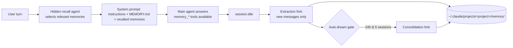

<div align="center">

# 🧠 Claude Code-compatible memory for OpenCode

**Persistent, local-first shared memory for OpenCode and Claude Code — one plugin, zero migration.**

This OpenCode plugin lets OpenCode read and write Claude Code-compatible Markdown memory files, so both CLIs share the same project context.

Claude Code writes memory → OpenCode reads it. OpenCode writes memory → Claude Code reads it.

[](https://www.npmjs.com/package/opencode-claude-memory)
[](https://www.npmjs.com/package/opencode-claude-memory)
[](https://github.com/kuitos/opencode-claude-memory/blob/main/LICENSE)

[Quick Start](#-quick-start) • [How it works](#-how-it-works) • [Configuration](#-configuration) • [Compatibility](#-compatibility-with-claude-code) • [Migrating from v1](#-migrating-from-v1) • [FAQ](#-faq)

</div>

---

## ✨ At a glance

- **Memory tools** — `memory_save` / `memory_delete` / `memory_list` / `memory_search` / `memory_read`, plus the Claude Code memory instructions injected into every system prompt.
- **LLM recall** — before each turn a hidden agent picks the memories relevant to the query; they appear in the *first* LLM call, including single-step questions.
- **Automatic extraction** — after a session goes idle, a sandboxed fork reviews only the *new* part of the conversation and saves what is worth keeping. Sessions closed before the fork ran are caught up at the next start.
- **Auto-dream** — periodic consolidation (merge / prune / rewrite) gated on time and session count, like Claude Code.
- **Claude Code-compatible** — same directory, same file format, same taxonomy, same worktree handling. `MEMORY.md` is edited line by line so hand-organised indexes stay intact.
- **Cross-platform, no shell hook** — everything runs inside the OpenCode process through the plugin SDK. No `python3`, no `jq`, no wrapper.

## 🚀 Quick Start

Requires OpenCode **≥ 1.18**.

```jsonc
// opencode.json (project) or ~/.config/opencode/opencode.json (global)
{
  "plugin": ["opencode-claude-memory"]
}
```

That's it. Start `opencode` and use it as usual. Memories live in `~/.claude/projects/<project>/memory/` (or under `$CLAUDE_CONFIG_DIR`), exactly where Claude Code keeps them.

## ⚙️ How it works



1. **Recall** — `experimental.chat.messages.transform` starts a selector prefetch for each new user turn (a hidden child session running `opencode-memory-recall`). `experimental.chat.system.transform` waits for it up to `recall.waitMs` (default 1.5 s) and injects the selected memories. Memories already in the conversation are not re-injected; after compaction they can surface again.
2. **Extraction** — every `session.idle` is debounced (`extract.debounceMs`). The plugin fetches the session's messages, slices them after the per-session watermark, and — only if there is a new user message — runs `opencode-memory-extract` in a child session restricted to `memory_save` / `memory_list` / `memory_read`. On success the watermark advances; if the main agent already saved memory in that stretch the fork is skipped.
3. **Catch-up** — on start-up the plugin lists the project's sessions and extracts the ones updated after their watermark (at most `extract.catchUpLimit`). This covers "answer, then quit immediately".
4. **Auto-dream** — after each extracted session the gate is evaluated (`autodream.minHours` since the last pass **and** `autodream.minSessions` extracted since). When it passes, `opencode-memory-dream` runs with all five memory tools. A lock file prevents two OpenCode processes from consolidating at once.
5. **Ignore memory** — "ignore memory" in a user message switches memory off for the rest of the session (no index, no recall); "use memory again" switches it back on.

State that is private to the plugin (watermarks, auto-dream gate, lock) lives in `<CLAUDE_CONFIG_DIR>/opencode-memory/<project>/`, never inside the Claude Code project directory.

## 🔧 Configuration

All behaviour is configured through OpenCode's own configuration. There are no `OPENCODE_MEMORY_*` environment variables.

```jsonc
// opencode.json
{
  "plugin": [
    ["opencode-claude-memory", {
      "extract":   { "enabled": true, "timeoutMs": 120000, "debounceMs": 10000, "maxConversationChars": 60000, "catchUpLimit": 5 },
      "autodream": { "enabled": true, "minHours": 24, "minSessions": 5, "timeoutMs": 300000 },
      "recall":    { "enabled": true, "waitMs": 1500, "timeoutMs": 30000, "maxMemories": 5 }
    }]
  ],
  "agent": {
    "opencode-memory-extract": { "model": "anthropic/claude-haiku-4-5", "steps": 20 },
    "opencode-memory-recall":  { "model": "anthropic/claude-haiku-4-5" },
    "opencode-memory-dream":   { "model": "anthropic/claude-sonnet-5" }
  }
}
```

- Every option above is optional; the values shown are the defaults. Unknown keys are rejected when the plugin loads.
- When the same plugin is listed in both the global and the project `opencode.json`, OpenCode keeps the **last** declaration (project wins); options are not merged across files.
- The three agents are registered hidden with a memory-only tool sandbox. Override any field (`model`, `steps`, `temperature`, …) under `agent.<name>`; the plugin fills in the rest.
- `CLAUDE_CONFIG_DIR` is honoured exactly like Claude Code does, and is the only environment variable the plugin reads.

Logs go to the OpenCode service log (`opencode` log directory, service `opencode-claude-memory`).

## 🤝 Compatibility with Claude Code

| Aspect | Claude Code | This plugin |
|---|---|---|
| Memory directory | `~/.claude/projects/<sanitized canonical git root>/memory/` | identical (`sanitizePath`, worktree → main repo resolution ported byte for byte) |
| File format | Markdown + `name` / `description` / `type` frontmatter | identical; frontmatter parsed only within the first 30 lines, as in Claude Code |
| Taxonomy | `user`, `feedback`, `project`, `reference` | identical |
| `MEMORY.md` | one-line pointers, hand-organisable | read with the same truncation rules; written with minimal line-level edits |
| Sub-directories | `team/x.md` etc. | scanned, recalled and addressable from every tool |
| System prompt | memory instructions + index + recalled memories | ported sections (`memoryTypes.ts`, `memdir.ts`) |
| Recall | LLM side query | LLM side query in a hidden child session (`findRelevantMemories.ts` port) |
| Extraction / auto-dream | after session, gated | after `session.idle` + start-up catch-up, gated the same way |

Memory files written by either tool need no conversion in either direction.

## 📝 Memory format

```markdown
---
name: User prefers terse responses
description: User wants concise answers without trailing summaries
type: feedback
---

Skip post-action summaries. User reads diffs directly.

**Why:** User explicitly requested terse output style.
**How to apply:** Don't summarize changes at the end of responses.
```

## 🔁 Migrating from v1

v2 removes the shell wrapper, the `opencode-memory` CLI and every `OPENCODE_MEMORY_*` environment variable. Memory files are untouched and need no conversion.

```bash
# 1. remove the v1 shell hook, then the v1 package (v2 no longer needs a global install)
opencode-memory uninstall     # or delete the ">>> opencode-memory auto-initialization >>>" block from your rc file
npm uninstall -g opencode-claude-memory

# 2. drop OPENCODE_MEMORY_* from your shell configuration
grep -n OPENCODE_MEMORY ~/.zshrc ~/.bashrc ~/.zshenv ~/.profile 2>/dev/null
```

```jsonc
// 3. pin the major in opencode.json — OpenCode caches npm plugins per specifier,
//    so a bare "opencode-claude-memory" keeps serving the v1 it installed earlier
{
  "plugin": ["opencode-claude-memory@2"]
}
```

Everything the environment variables used to control now lives under `extract`, `autodream`, `recall` and `agent.opencode-memory-*` in `opencode.json` — see [Configuration](#-configuration). The v1 documentation, including the full list of environment variables, stays available in the [v1 README](https://github.com/kuitos/opencode-claude-memory/blob/v1.7.7/README.md).

## ❓ FAQ

**Is this a new memory system?** No. It is a compatibility layer around Claude Code's memory layout and conventions.

**Do I need to migrate existing memory?** No. Existing Claude Code memory files are used as they are.

**Where is data stored?** `~/.claude/projects/<project>/memory/` (or `$CLAUDE_CONFIG_DIR/projects/...`). Plugin state lives in `$CLAUDE_CONFIG_DIR/opencode-memory/<project>/`.

**Can I disable extraction, auto-dream or recall?** Yes — `extract.enabled`, `autodream.enabled`, `recall.enabled` in the plugin options.

**Why did my first answer take a moment longer?** The system prompt waits up to `recall.waitMs` for the selector. Set it to `0` to never wait (recalled memories then appear from the second LLM call of a turn onwards).

**Does the extraction fork see my whole conversation?** Only the messages after the last extraction, capped at `extract.maxConversationChars` (newest first). The fork can only call memory tools.

## 🧪 Development

```bash
bun install
bun test            # unit, integration and eval tests
bun run evals       # readable task-eval report
bun run lint        # biome
bun run typecheck
bun run build       # emits dist/
```

Releases are cut by semantic-release on push to `main`.

## 📄 License

[MIT](LICENSE) © [kuitos](https://github.com/kuitos)
