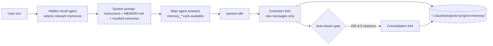

<div align="center">

# 🧠 Claude Code-compatible memory for OpenCode

**Persistent, local-first shared memory for OpenCode and Claude Code — one plugin, zero migration.**

This OpenCode plugin lets OpenCode read and write Claude Code-compatible Markdown memory files, so both CLIs share the same project context.

Claude Code writes memory → OpenCode reads it. OpenCode writes memory → Claude Code reads it.

[](https://www.npmjs.com/package/opencode-claude-memory)
[](https://www.npmjs.com/package/opencode-claude-memory)
[](https://github.com/kuitos/opencode-claude-memory/blob/main/LICENSE)

[Quick Start](#-quick-start) • [How it works](#-how-it-works) • [Configuration](#-configuration) • [OpenCode 2.x](#-differences-on-opencode-2x) • [Compatibility](#-compatibility-with-claude-code) • [Migrating from v1](#-migrating-from-v1) • [FAQ](#-faq)

</div>

---

## ✨ At a glance

- **Memory tools** — `memory_save` / `memory_delete` / `memory_list` / `memory_search` / `memory_read`, plus the Claude Code memory instructions injected into every system prompt.
- **LLM recall** — before each turn a hidden agent picks the memories relevant to the query; they appear in the *first* LLM call, including single-step questions.
- **Automatic extraction** — after a session goes idle, a sandboxed fork reviews only the *new* part of the conversation and saves what is worth keeping. Sessions closed before the fork ran are caught up at the next start.
- **Auto-dream** — periodic consolidation (merge / prune / rewrite) gated on time and session count, like Claude Code.
- **Claude Code-compatible** — same directory, same file format, same taxonomy, same worktree handling. `MEMORY.md` is edited line by line so hand-organised indexes stay intact.
- **Cross-platform, no shell hook** — everything runs inside the OpenCode process through the plugin SDK. No `python3`, no `jq`, no wrapper.
- **OpenCode 1.x and 2.x** — one package serves both plugin APIs (V1 `server`, V2 `setup`) with the same options.

## 🚀 Quick Start

Requires OpenCode **≥ 1.18.29** (V1 plugin API) or OpenCode **2.x** (`@opencode/cli`, tested on 2.0.22). The package exports one `{ id, server, setup }` object: 1.x loads `server`, 2.x loads `setup`; 1.x accepts that dual object only from 1.18.29 on.

```jsonc
// OpenCode 1.x — opencode.json (project) or ~/.config/opencode/opencode.json (global)
{
  "plugin": ["opencode-claude-memory"]
}
```

```jsonc
// OpenCode 2.x — opencode.json
{
  "plugins": [{ "package": "opencode-claude-memory" }]
}
```

OpenCode 2.x also accepts (and normalises) the 1.x `plugin` key.

That's it. Start `opencode` and use it as usual. Memories live in `~/.claude/projects/<project>/memory/` (or under `$CLAUDE_CONFIG_DIR`), exactly where Claude Code keeps them.

## ⚙️ How it works


```mermaid
graph LR
    U[User turn] --> R[Hidden recall agent<br/>selects relevant memories]
    R --> S[System prompt: instructions + MEMORY.md + recalled memories]
    S --> A[Main agent answers<br/>memory_* tools available]
    A --> I[session.idle]
    I --> E[Extraction fork<br/>new messages only]
    E --> M[(~/.claude/projects/&lt;project&gt;/memory/)]
    E --> D{Auto-dream gate}
    D -->|24h & 5 sessions| C[Consolidation fork]
    C --> M
```

The hook names below are OpenCode 1.x's; on 2.x the same steps run on the V2 plugin API, with the differences listed in [Differences on OpenCode 2.x](#-differences-on-opencode-2x).

1. **Recall** — `experimental.chat.messages.transform` starts a selector prefetch for each new user turn (a hidden child session running `opencode-memory-recall`). `experimental.chat.system.transform` waits for it up to `recall.waitMs` (default 1.5 s) and injects the selected memories. Memories already in the conversation are not re-injected; after compaction they can surface again.
2. **Extraction** — every `session.idle` is debounced (`extract.debounceMs`). The plugin fetches the session's messages, slices them after the per-session watermark, and — only if there is a new user message — runs `opencode-memory-extract` in a child session restricted to `memory_save` / `memory_list` / `memory_read`. On success the watermark advances; if the main agent already saved memory in that stretch the fork is skipped.
3. **Catch-up** — on start-up the plugin lists the project's sessions and extracts the ones updated after their watermark (at most `extract.catchUpLimit`). This covers "answer, then quit immediately".
4. **Auto-dream** — after each extracted session the gate is evaluated (`autodream.minHours` since the last pass **and** `autodream.minSessions` extracted since). When it passes, `opencode-memory-dream` runs with all five memory tools. A lock file prevents two OpenCode processes from consolidating at once.
5. **Ignore memory** — "ignore memory" in a user message switches memory off for the rest of the session (no index, no recall); "use memory again" switches it back on.

State that is private to the plugin (watermarks, auto-dream gate, lock and, on OpenCode 2.x, the log file) lives in `<CLAUDE_CONFIG_DIR>/opencode-memory/<project>/`, never inside the Claude Code project directory.

## 🔧 Configuration

All behaviour is configured through OpenCode's own configuration. There are no `OPENCODE_MEMORY_*` environment variables. The plugin options are identical on OpenCode 1.x and 2.x; only the surrounding keys differ.

```jsonc
// opencode.json — OpenCode 1.x
{
  "plugin": [
    ["opencode-claude-memory", {
      "extract":   { "enabled": true, "timeoutMs": 120000, "debounceMs": 10000, "maxConversationChars": 60000, "catchUpLimit": 5 },
      "autodream": { "enabled": true, "minHours": 24, "minSessions": 5, "timeoutMs": 300000 },
      "recall":    { "enabled": true, "waitMs": 1500, "timeoutMs": 30000, "maxMemories": 5 },
      "readOnly":  false
    }]
  ],
  "agent": {
    "opencode-memory-extract": { "model": "anthropic/claude-haiku-4-5", "steps": 20 },
    "opencode-memory-recall":  { "model": "anthropic/claude-haiku-4-5" },
    "opencode-memory-dream":   { "model": "anthropic/claude-sonnet-5" }
  }
}
```

- Every option above is optional; the values shown are the defaults. Unknown keys are rejected when the plugin loads.
- When the same plugin is listed in both the global and the project `opencode.json`, OpenCode keeps the **last** declaration (project wins); options are not merged across files.
- The three agents are registered hidden with a memory-only tool sandbox. On 1.x, override any field (`model`, `steps`, `temperature`, …) under `agent.<name>`; the plugin fills in the rest.
- `CLAUDE_CONFIG_DIR` is honoured exactly like Claude Code does, and is the only environment variable the plugin reads.
- `readOnly: true` prevents this plugin from writing to the Claude config directory: no `memory_save` / `memory_delete`, no extraction or auto-dream (whatever `extract` / `autodream` say), no plugin state or log writes, and the memory folder is not created. The index, recall and `memory_list` / `memory_search` / `memory_read` keep working, and the prompt tells the model the memory is read-only.
- This option does not restrict the host's shell or file-editing tools, or other plugins. To enforce read-only access for the entire host, also configure host permissions or filesystem access controls; the memory prompt alone does not enforce it.

```jsonc
// opencode.json — OpenCode 2.x
{
  "plugins": [
    { "package": "opencode-claude-memory", "options": { "extract": { "debounceMs": 10000 } } }
  ],
  "agents": {
    "opencode-memory-extract": {
      "model": "opencode/gpt-6-luna",
      "steps": 20,
      "permissions": [{ "action": "webfetch", "resource": "*", "effect": "allow" }]
    }
  }
}
```

- `options` takes the same keys as the 1.x example above.
- Agent overrides live under `agents.<name>` and use 2.x agent fields (`model`, `steps`, `permissions`, …). The plugin's sandbox rules (`*` deny, then allow for the agent's memory tools) come first and your own `permissions` after them; 2.x applies the last matching rule, so your rule wins.
- The main agent needs no extra permission on 2.x's default `build` agent, which allows everything. If you restrict permissions (for example `*` → `ask` or `deny`), add `{ "action": "memory_*", "resource": "*", "effect": "allow" }` to your `permissions` so the memory tools are neither blocked nor prompted for.

**Models for the memory agents.** OpenCode Zen's free models (e.g. `opencode/big-pickle`) reject every request whose tool list lacks OpenCode's `shell` tool (HTTP 403, *"OpenCode's free tier can only be used from within OpenCode"*). The sandboxed extraction and auto-dream forks are exactly such requests on both 1.x and 2.x, and so is recall on 2.x. On a free Zen model, extraction, auto-dream and (on 2.x) recall therefore fail. Configure a paid model for `opencode-memory-extract`, `opencode-memory-dream` and `opencode-memory-recall` (e.g. `opencode/gpt-6-luna`); the main agent can stay on a free model.

**Logs.** On 1.x logs go to the OpenCode service log (`opencode` log directory, service `opencode-claude-memory`). 2.x gives plugins no log API, so the plugin writes `<CLAUDE_CONFIG_DIR>/opencode-memory/<project>/opencode-memory.log` instead (rotated at about 1 MB).

## 🆕 Differences on OpenCode 2.x

The V2 plugin API exposes less than V1, so a few behaviours differ:

- **Extraction only sees messages after the last compaction.** V2 plugins cannot read the full message history. If the extraction watermark was compacted away, extraction restarts from the start of the remaining context; anything before it that was not extracted yet is lost (a warning is logged).
- **Catch-up only covers known sessions.** V2 plugins cannot list sessions, so start-up catch-up only covers sessions already recorded in `extraction-state.json`. A session created and finished while the plugin was not running is not caught up.
- **One sandbox layer instead of two.** Forks are restricted by the agents' permission rules (also passed to the fork as session permissions); V2 has no per-prompt tool map.
- **Recall is a one-shot `generate.text` call** instead of a child session with structured output. The selector's answer is parsed as JSON text, and an answer that does not parse recalls nothing. The recall agent's `model` is used if set; temperature is not configurable.
- **Logs go to a file** in the plugin state directory, not to the OpenCode log (see [Logs](#-configuration)).
- **Free Zen models break recall too**, not only extraction and auto-dream (see [Models for the memory agents](#-configuration)).

## 🤝 Compatibility with Claude Code

| Aspect | Claude Code | This plugin |
|---|---|---|
| Memory directory | `~/.claude/projects/<sanitized canonical git root>/memory/` | identical (`sanitizePath`, worktree → main repo resolution ported byte for byte) |
| File format | Markdown + `name` (kebab-case slug) / `description` / `metadata.type` frontmatter | identical; older top-level `type:` still read; frontmatter parsed only within the first 30 lines, as in Claude Code |
| Taxonomy | `user`, `feedback`, `project`, `reference` | identical |
| `MEMORY.md` | one-line pointers, hand-organisable | read with the same truncation rules; written with minimal line-level edits, hand-written pointer lines are never replaced |
| Sub-directories | `team/x.md` etc. | scanned, recalled and addressable from every tool |
| System prompt | memory instructions + index + recalled memories | ported sections (`memoryTypes.ts`, `memdir.ts`) |
| Recall | LLM side query | LLM side query (`findRelevantMemories.ts` port): a hidden child session on 1.x, a `generate.text` call on 2.x |
| Extraction / auto-dream | after session, gated | after `session.idle` + start-up catch-up, gated the same way |

Memory files written by either tool need no conversion in either direction.

## 📝 Memory format

New memories are written the way current Claude Code writes them: a kebab-case slug as `name` (normally the file name), the type under `metadata:`. This plugin also records `metadata.origin` and `metadata.modified`. `terse-responses.md`:

```markdown
---
name: terse-responses
description: User wants concise answers without trailing summaries
metadata:
  type: feedback
---

Skip post-action summaries. User reads diffs directly.

**Why:** User explicitly requested terse output style.
**How to apply:** Don't summarize changes at the end of responses.
```

Each memory has one line in `MEMORY.md`, `- [Title](file.md) — one-line hook`, for example `- [Terse responses](terse-responses.md) — no trailing summaries`. Older files with a title as `name` and a top-level `type:` are read as they are; nothing is migrated.

## 🔁 Migrating from v1

v2 removes the shell wrapper, the `opencode-memory` CLI and every `OPENCODE_MEMORY_*` environment variable. Memory files are untouched and need no conversion.

```bash
# 1. remove the v1 shell hook, then the v1 package (v2 no longer needs a global install)
opencode-memory uninstall     # or delete the ">>> opencode-memory auto-initialization >>>" block from your rc file
npm uninstall -g opencode-claude-memory

# 2. drop OPENCODE_MEMORY_* from your shell configuration
grep -n OPENCODE_MEMORY ~/.zshrc ~/.bashrc ~/.zshenv ~/.profile 2>/dev/null
```

```jsonc
// 3. pin the major in opencode.json — OpenCode caches npm plugins per specifier,
//    so a bare "opencode-claude-memory" keeps serving the v1 it installed earlier
{
  "plugin": ["opencode-claude-memory@2"]
}
```

Everything the environment variables used to control now lives under `extract`, `autodream`, `recall` and `agent.opencode-memory-*` in `opencode.json` — see [Configuration](#-configuration). The v1 documentation, including the full list of environment variables, stays available in the [v1 README](https://github.com/kuitos/opencode-claude-memory/blob/v1.7.7/README.md).

## ❓ FAQ

**Is this a new memory system?** No. It is a compatibility layer around Claude Code's memory layout and conventions.

**Do I need to migrate existing memory?** No. Existing Claude Code memory files are used as they are.

**Where is data stored?** `~/.claude/projects/<project>/memory/` (or `$CLAUDE_CONFIG_DIR/projects/...`). Plugin state lives in `$CLAUDE_CONFIG_DIR/opencode-memory/<project>/`. Memories the plugin deletes that are not purely its own (Claude Code's, another tool's, or one of its own that another tool has since edited) are copied to `trash/<timestamp>/` there first.

**Can I disable extraction, auto-dream or recall?** Yes — `extract.enabled`, `autodream.enabled`, `recall.enabled` in the plugin options.

**Can I make this plugin read Claude Code's memory without changing it?** Yes — `readOnly: true`. The plugin does not write under `CLAUDE_CONFIG_DIR`. Enforcing read-only access for the entire host also requires host permissions or filesystem access controls; see [Configuration](#-configuration).

**My recall model has no structured output.** On 1.x each selector request asks for structured output first. If the server answers with a `StructuredOutputError`, the plugin retries that request once with the schema described in the prompt and parses the text. Later requests still try structured output: a single failure does not establish that the model lacks support. A model that consistently fails structured output therefore needs two attempts per recall request. Other errors are not retried.

**Why did my first answer take a moment longer?** The system prompt waits up to `recall.waitMs` for the selector. Set it to `0` to never wait (recalled memories then appear from the second LLM call of a turn onwards).

**Does the extraction fork see my whole conversation?** Only the messages after the last extraction, capped at `extract.maxConversationChars` (newest first); on OpenCode 2.x only those after the last compaction. The fork can only call memory tools.

## 🧪 Development

```bash
bun install
bun test            # unit, integration and eval tests
bun run evals       # readable task-eval report
bun run lint        # biome
bun run typecheck
bun run build       # emits dist/
```

To try an unpublished build, run `bun run build` and point OpenCode at the checkout:

```jsonc
// OpenCode 1.x — reads package.json "main" (dist/index.js)
{ "plugin": [["file:///abs/path/to/opencode-claude-memory", { "extract": { "debounceMs": 10000 } }]] }
```

```jsonc
// OpenCode 2.x — resolves a directory as <dir>/server or <dir>/index, not via package.json
{ "plugins": [{ "package": "file:///abs/path/to/opencode-claude-memory/dist" }] }
```

Releases are cut by semantic-release on push to `main`.

## 📄 License

[MIT](LICENSE) © [kuitos](https://github.com/kuitos)
