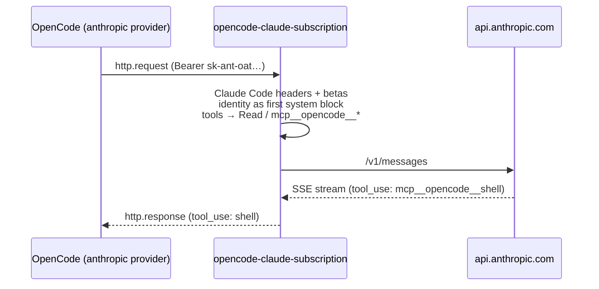

<p align="center">
  
</p>

<p align="center">
  <a href="https://www.npmjs.com/package/opencode-claude-subscription"></a>
  <a href="https://www.npmjs.com/package/opencode-claude-subscription"></a>
  <a href="https://github.com/eysenfalk/opencode-claude-subscription/actions/workflows/ci.yml"></a>
  
  <a href="https://github.com/eysenfalk/opencode-claude-subscription/blob/main/LICENSE"></a>
</p>

# opencode-claude-subscription

**Use your Claude Pro/Max subscription in OpenCode v2.** Log in once, keep OpenCode's built-in `anthropic` provider, and send your Claude requests through your plan instead of API billing.

```sh
opencode plugin add opencode-claude-subscription
opencode auth login anthropic
```

```text
$ opencode run -m anthropic/claude-haiku-4-5 "Use the shell tool to run: echo TOOL_ROUNDTRIP_$((6*7))"
$ echo TOOL_ROUNDTRIP_$((6*7))
TOOL_ROUNDTRIP_42
```

> [!WARNING]
> Anthropic's consumer terms restrict subscription OAuth tokens to Anthropic's own apps, and Anthropic actively detects and bills or blocks third-party clients. Using this plugin can get requests rejected, charged as extra usage, or your account restricted. Use it at your own risk.

## Why this plugin

- **Built for OpenCode v2.** It uses the v2 plugin API (`integration`, `session.hook("http.request")`, `session.hook("http.response")`). OpenCode keeps its own provider, transport, streaming, and model list.
- **A real login.** Three login methods appear in `opencode auth login anthropic`: browser, paste code, or reuse your Claude Code login. OpenCode stores and refreshes the tokens.
- **Changes as little as possible.** It adds the identity line, the headers, and tool names that the subscription endpoint expects. Heavier workarounds are opt-in.
- **Nothing extra to run.** No proxy, no background service, no runtime dependencies.
- **API keys are unaffected.** Only requests carrying a subscription token are touched.
- **No misleading costs.** While a subscription login is active, OpenCode shows Anthropic models at zero per-token cost, because the plan covers usage.

| | this plugin | [opencode-claude-auth](https://github.com/griffinmartin/opencode-claude-auth) | [CLIProxyAPI](https://github.com/router-for-me/CLIProxyAPI) |
|---|---|---|---|
| OpenCode plugin API | v2 hooks | v1 `fetch` wrapper | none (separate proxy) |
| Login | own OAuth login, or reuse Claude Code | reuses Claude Code only | proxy's own login |
| Extra process | none | none | proxy server |
| System prompt | stays in `system`; identity added | moved into the first user message | depends on proxy |
| Billing block signature | opt-in | always on | depends on proxy |

## How it works



OpenCode v2 already sends OAuth credentials as bearer tokens to its Anthropic provider. The plugin adds login methods to the `anthropic` integration, then shapes each outgoing request and translates tool names in the response back.

## Login methods

| Method | ID | Notes |
|---|---|---|
| Claude Pro/Max subscription (browser) | `claude-subscription-browser` | PKCE login with a local callback on port 53692. OpenCode stores and refreshes the tokens. |
| Claude Pro/Max subscription (paste code) | `claude-subscription-manual` | For remote or headless machines: authorize anywhere, paste the code. |
| Claude Code login on this machine (read-only) | `claude-subscription-claude-code` | Reuses Claude Code's stored login (`~/.claude/.credentials.json`, or the macOS Keychain). |

Pick a method directly with `opencode auth login anthropic --method <ID>`.

The Claude Code method never refreshes the token itself, because Anthropic rotates refresh tokens and refreshing from OpenCode would log Claude Code out. Claude Code has to run now and then to keep the token fresh. For unattended use, prefer one of the first two methods: they get their own token chain.

## What changes on the wire

Only requests authenticated with a subscription token (`sk-ant-oat…`) are touched.

- **Headers:** Claude Code's `user-agent` and `x-app`, plus the `claude-code-20250219` and `oauth-2025-04-20` betas, merged with the betas OpenCode already sends. OpenCode's `x-opencode-*` and session-affinity headers are removed. A subscription token stored as an API key is moved to bearer auth.
- **System prompt:** Claude Code's identity line becomes its own first system block. The rest of OpenCode's system prompt stays in place, including cache breakpoints.
- **Tool names:** tools that match a Claude Code tool keep its exact name (`read` → `Read`, `webfetch` → `WebFetch`). Every other flat tool becomes an MCP-shaped alias (`shell` → `mcp__opencode__shell`). Tool definitions, `tool_choice`, and tool calls in the history are renamed consistently. Tool calls in the response stream are translated back, so OpenCode only ever sees its own names.
- **Token counting:** `/v1/messages/count_tokens` requests are shaped the same way as `/v1/messages`.
- **Env block:** OpenCode's `<env>` block is classified as third-party usage when "Workspace root folder:" appears together with "Is directory a git repo:". The plugin renames the first line to "Workspace root:".

## Options

```jsonc
// ~/.config/opencode/opencode.json
{
  "plugins": [
    {
      "package": "opencode-claude-subscription",
      "options": {
        "toolAliases": { "apply_patch": "mcp__patch__apply" },
        "systemReplacements": [["some phrase", "replacement"]],
        "relocateSystem": false,
        "billingHeader": false,
        "claudeCodeVersion": "2.1.280",
        "debugLog": "/tmp/claude-subscription.jsonl"
      }
    }
  ]
}
```

| Option | Env var | Default | Effect |
|---|---|---|---|
| `toolAliases` | | `{}` | Explicit wire names for flat tools. Use `mcp__<server>__<tool>` names. |
| `systemReplacements` | | `[]` | Literal replacements in system prompt text, applied after the built-in one. |
| `relocateSystem` | `OPENCODE_CLAUDE_SUBSCRIPTION_RELOCATE_SYSTEM=1` | `false` | Moves all system text except the identity line into the first user message. This is the most robust fallback if Anthropic starts rejecting new prompt content, but it weakens prompt caching. |
| `billingHeader` | `OPENCODE_CLAUDE_SUBSCRIPTION_BILLING_HEADER=1` | `false` | Adds Claude Code's signed billing block as the first system entry. |
| `claudeCodeVersion` | `OPENCODE_CLAUDE_SUBSCRIPTION_CC_VERSION` | `2.1.280` | Version used in the user agent and the billing block. |
| `debugLog` | `OPENCODE_CLAUDE_SUBSCRIPTION_DEBUG_LOG` | unset | Appends each request body before and after shaping as JSON lines. Headers and tokens are never logged, but the log contains your prompts. |

## FAQ

**I get "Third-party apps now draw from your extra usage…"**
Anthropic classified the request as third-party. Set `debugLog`, reproduce the error, and compare the logged system text and tools with a request that worked. Setting `relocateSystem: true` usually unblocks you right away. Please [open an issue](https://github.com/eysenfalk/opencode-claude-subscription/issues/new?template=blocked-request.yml) with the phrase that triggers it, or add it to `systemReplacements`.

**A request fails with "…expired or was revoked. Run `opencode auth login anthropic` again…"**
Anthropic rejected the token (HTTP 401). Log in again. If you use the Claude Code login, running `claude` once refreshes the token, and OpenCode picks it up on the next request. A failed token refresh does not break OpenCode: the plugin keeps the current token and retries the refresh after 30 seconds.

**The browser login says "Port 53692 is in use" although nothing else is running.**
Starting a new login closes the callback server of an earlier, abandoned attempt. If another program uses the port, use the paste-code method.

**Does it change anything when I use an API key?**
No. Requests without a subscription token pass through unchanged.

**Are my tokens written anywhere?**
OpenCode stores the credential like any other login. The plugin never logs headers or tokens. `debugLog` records request bodies only.

**Why does the Claude Code login show a `file://` link instead of opening a browser?**
It shows where the login is read from (`~/.claude/.credentials.json`, or the macOS Keychain). There is nothing to authorize in a browser.

**How do I update or remove it?**
`opencode plugin update opencode-claude-subscription` or `opencode plugin remove opencode-claude-subscription`. Restart OpenCode afterwards, or run `opencode service restart` if you use the background service.

## Tested with

| Component | Version |
|---|---|
| OpenCode | 2.0.16 (plugin SDK 2.0.18) |
| Model | `claude-haiku-4-5`: plain replies and tool calls with aliased names. Other models are not verified yet. |
| Login | Claude Code reuse, end to end. The browser flow is verified up to the authorization URL. |

Tested another setup? Please [report it](https://github.com/eysenfalk/opencode-claude-subscription/issues/new?template=compatibility.yml) so this table can grow.

## Contributing

Issues and pull requests are welcome, especially reports of new request shapes that get rejected. See [CONTRIBUTING.md](CONTRIBUTING.md). The test suite runs offline:

```sh
npm install
npm test
npm run typecheck
```

To try a checkout, remove the npm package first (`opencode plugin remove opencode-claude-subscription`), then point OpenCode at the directory. OpenCode loads `server.js`, which re-exports `src/index.ts`, so no build is needed. If both are configured, every login method shows up twice.

```jsonc
{ "plugins": ["/path/to/opencode-claude-subscription"] }
```

## Credits

- [pi-claude-code-use](https://github.com/ben-vargas/pi-packages/tree/main/packages/pi-claude-code-use) (MIT): the approach of changing as little as possible and using MCP-shaped tool aliases.
- [opencode-claude-auth](https://github.com/griffinmartin/opencode-claude-auth) (MIT): the billing block signature (`src/billing.ts`) and the system relocation fallback.

## License

[MIT](LICENSE). Not affiliated with Anthropic or OpenCode.
