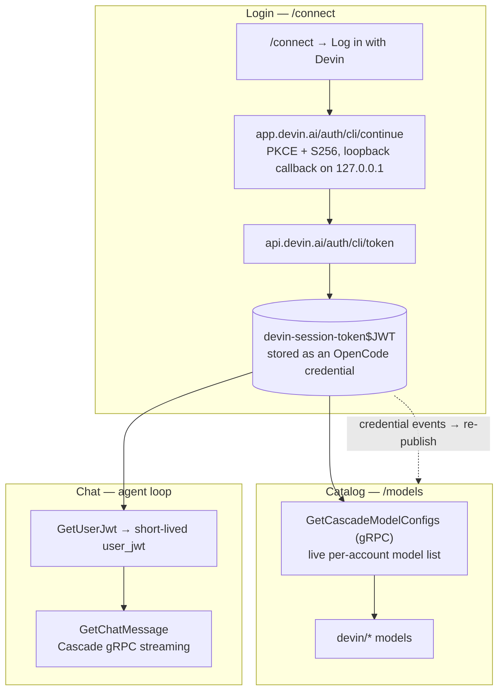

# opencode-devin

[OpenCode v2](https://opencode.ai) plugin that connects your [Devin](https://devin.ai) subscription to OpenCode:

- **Native `/connect` integration** — log in with Devin straight from the OpenCode TUI using the same browser PKCE flow as the Devin CLI. The credential is stored in OpenCode's own auth store; no config files or API keys to copy.
- **`devin/*` models in `/models`** — the live, per-account catalog (SWE, Claude Opus, GPT, Gemini, Grok, Kimi and more, with reasoning-effort and speed variants), streamed from Cognition's Cascade inference API.

> **Requires OpenCode v2.** This plugin targets the v2 plugin API (`Plugin.define`). The official [`@cognitionai/opencode-devin`](https://www.npmjs.com/package/@cognitionai/opencode-devin) plugin is v1-only at the time of writing and does not load on v2.

## Install

Add the plugin to `opencode.json` (project or `~/.config/opencode/opencode.json`):

```jsonc
{
  "$schema": "https://opencode.ai/config.json",
  "plugins": ["opencode-devin"]
}
```

OpenCode installs it automatically on the next start.

## Connect

Start OpenCode, run `/connect`, pick **Devin**, then choose a method:

| Method | How it works | Best for |
| --- | --- | --- |
| **Log in with Devin (browser)** | Opens the Devin sign-in page (PKCE + S256) and captures the authorization code through a local loopback callback. | Interactive terminals |
| **Paste code (headless)** | Opens the same login page without a redirect; the page shows a code to copy and paste back into the TUI. | Headless machines, SSH |
| **`DEVIN_LLM_API_KEY`** | Reads a `devin-session-token$...` token from the environment. | CI, scripting |

After connecting, the model list refreshes automatically and `devin/<model>` entries appear in `/models`.

### Environment variable alternative

Skip `/connect` entirely:

```sh
export DEVIN_LLM_API_KEY=devin-session-token$your_token_here
```

## Use

Pick any `devin/` model in the `/models` picker, or set a default:

```jsonc
// opencode.json
{
  "model": "devin/swe-2-max"
}
```

From the CLI:

```sh
opencode run --model devin/swe-2-max "Refactor the auth module"
```

## How it works



1. **Integration** — the plugin registers a `devin` integration with the Devin CLI login flow: PKCE (S256) against `app.devin.ai/auth/cli/continue`, a loopback callback on `127.0.0.1` (or manual code paste), and a token exchange at `api.devin.ai/auth/cli/token`.
2. **Catalog** — model families come from Cognition's Cascade API for the logged-in account (the same source the Devin CLI uses). The OpenAI-compatible REST gateway (`/api/v1`) is not provisioned for most accounts, so chat streams through Cascade gRPC instead.
3. **Provider** — the plugin publishes a `devin` provider whose package specifier self-references the plugin's own installed location (`aisdk:<this-package>`), so OpenCode's dynamic AI-SDK loader imports it directly with no registry round-trip — both from a repo checkout during development and from the npm cache once installed. Its `LanguageModelV3` implementation lives in `src/protocol/`: a short-lived `user_jwt` is minted per session (`GetUserJwt`) and chat streams through `GetChatMessage`.
4. **Reactivity** — the inventory re-publishes whenever a credential is connected, switched, or removed, so connecting mid-session updates `/models` without a restart.

## Troubleshooting

- **No `devin/` models** — the credential is missing or the catalog fetch failed. Run `/connect` again.
- **401 during chat** — the session token was revoked. Re-run `/connect`.

## Development

```sh
bun install
npm run typecheck
npm run build     # emits dist/
```

To test a local checkout without publishing, create a bridge file that re-exports the build:

```ts
// ~/.config/opencode/plugins/devin.ts
export { default } from "file:///absolute/path/to/opencode-devin/dist/index.js"
```

## Credits

- The Cascade protocol client is a **typed TypeScript port**, owned in `src/protocol/` (see `ATTRIBUTION.md`) — originally from [`ai-sdk-devin`](https://www.npmjs.com/package/ai-sdk-devin) by [karthiknish](https://github.com/karthiknish) and `pi-devin-auth` by nmzpy, both MIT. Owning the port keeps the credential path free of third-party runtime dependencies.
- [`@cognitionai/opencode-devin`](https://www.npmjs.com/package/@cognitionai/opencode-devin) — reference for the Devin CLI PKCE login flow.

## License

[MIT](LICENSE)
