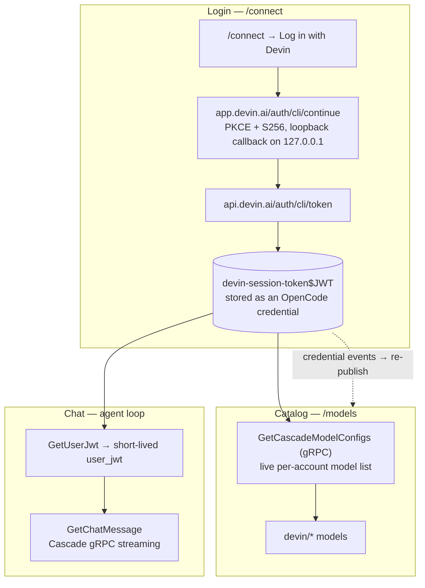

# opencode-devin

[OpenCode v2](https://opencode.ai) plugin that connects your [Devin](https://devin.ai) subscription to OpenCode:

- **Native `/connect` integration** — log in with Devin straight from the OpenCode TUI using the same browser PKCE flow as the Devin CLI. The credential is stored in OpenCode's own auth store; no config files or API keys to copy.
- **`devin/*` models in `/models`** — the live, per-account catalog (SWE, Claude Opus, GPT, Gemini, Grok, Kimi and more, with reasoning-effort and speed variants), streamed from Cognition's Cascade inference API.

> **Requires OpenCode v2.** This plugin targets the v2 plugin API (`Plugin.define`). The official [`@cognitionai/opencode-devin`](https://www.npmjs.com/package/@cognitionai/opencode-devin) plugin is v1-only at the time of writing and does not load on v2.

## Install

Add the plugin to `opencode.json` (project or `~/.config/opencode/opencode.json`):

```jsonc
{
  "$schema": "https://opencode.ai/config.json",
  "plugins": ["opencode-devin"]
}
```

OpenCode installs it automatically on the next start.

## Connect

Start OpenCode, run `/connect`, pick **Devin**, then choose a method:

| Method | How it works | Best for |
| --- | --- | --- |
| **Log in with Devin (browser)** | Opens the Devin sign-in page (PKCE + S256) and captures the authorization code through a local loopback callback. | Interactive terminals |
| **Paste code (headless)** | Opens the same login page without a redirect; the page shows a code to copy and paste back into the TUI. | Headless machines, SSH |
| **`DEVIN_LLM_API_KEY`** | Reads a `devin-session-token$...` token from the environment. | CI, scripting |

After connecting, the model list refreshes automatically and `devin/<model>` entries appear in `/models`.

### Environment variable alternative

Skip `/connect` entirely:

```sh
export DEVIN_LLM_API_KEY=devin-session-token$your_token_here
```

## Use

Pick any `devin/` model in the `/models` picker, or set a default:

```jsonc
// opencode.json
{
  "model": "devin/swe-2-max"
}
```

From the CLI:

```sh
opencode run --model devin/swe-2-max "Refactor the auth module"
```

## How it works


```mermaid
flowchart TD
    subgraph Login["Login — /connect"]
        A["/connect → Log in with Devin"] --> B["app.devin.ai/auth/cli/continue<br/>PKCE + S256, loopback callback on 127.0.0.1"]
        B --> C["api.devin.ai/auth/cli/token"]
        C --> D[("devin-session-token$JWT<br/>stored as an OpenCode credential")]
    end

    subgraph Catalog["Catalog — /models"]
        D --> E["GetCascadeModelConfigs (gRPC)<br/>live per-account model list"]
        E --> F["devin/* models"]
    end

    subgraph Chat["Chat — agent loop"]
        D --> G["GetUserJwt → short-lived user_jwt"]
        G --> H["GetChatMessage<br/>Cascade gRPC streaming"]
    end

    D -. "credential events → re-publish" .-> Catalog
```

1. **Integration** — the plugin registers a `devin` integration with the Devin CLI login flow: PKCE (S256) against `app.devin.ai/auth/cli/continue`, a loopback callback on `127.0.0.1` (or manual code paste), and a token exchange at `api.devin.ai/auth/cli/token`.
2. **Catalog** — model families come from Cognition's Cascade API for the logged-in account (the same source the Devin CLI uses). The OpenAI-compatible REST gateway (`/api/v1`) is not provisioned for most accounts, so chat streams through Cascade gRPC instead.
3. **Provider** — the plugin publishes a `devin` provider whose package specifier self-references the plugin's own installed location (`aisdk:<this-package>`), so OpenCode's dynamic AI-SDK loader imports it directly with no registry round-trip — both from a repo checkout during development and from the npm cache once installed. Its `LanguageModelV3` implementation lives in `src/protocol/`: a short-lived `user_jwt` is minted per session (`GetUserJwt`) and chat streams through `GetChatMessage`.
4. **Reactivity** — the inventory re-publishes whenever a credential is connected, switched, or removed, so connecting mid-session updates `/models` without a restart.

## Troubleshooting

- **No `devin/` models**: run `/connect` again. Failures are logged as `[opencode-devin] ...`; the log is at `~/.local/share/opencode/log/opencode.log`.
- **A model is rejected even though `/models` lists it**: the account can see a uid it is not entitled to. The error names the tier.
- **Costs look wrong or absent**: OpenCode reads cost from the pricing published to `/models`, not from the stream. Check the model has a non-zero price there.
- **A 401 during chat**: the short-lived token is refreshed automatically. Reconnect only if the session token itself was revoked.
- **`Plugin failed to load`**: rebuild and `opencode reload`. See the FAQ on atomic builds.
- **A path in `plugins` is ignored**: only `name@file:<absolute-path>` links a local build.

## Development

```sh
bun install
npm run typecheck
bun test
npm run build
```

`build` is atomic, so the plugin can be reloaded while it runs. Publishing uses
`build:clean`, which wipes `dist/` first.

### Developing against a local build

Edit `plugins` in `~/.config/opencode/opencode.json` to one of these, then run
`npm run build && opencode reload`:

```jsonc
// this repository
{ "plugins": ["opencode-devin@file:C:/path/to/opencode-devin"] }

// the published package
{ "plugins": ["opencode-devin"] }
```

The path must be absolute, and the `name@file:` form is required: a bare path
or a `file://` URL is ignored without an error.

To confirm which copy the server loaded:

```sh
opencode api provider.list   # the devin provider's "package" field
```

### Testing against the real API

`bun test` runs everything except the live suite, which skips itself without a
credential:

```sh
DEVIN_LLM_API_KEY='devin-session-token$...' bun test test/live.test.ts
```

## FAQ

**Why is `build` atomic?** OpenCode reloads a linked plugin the moment its
entrypoint changes, and a failed load is not retried. Writing `dist/` in place
lets a reload land mid-write and fail, which shows up as `ENOENT reading
dist/index.js` or `Cannot find module '.../constants.js'`. `build` compiles to a
staging directory and swaps it in.

**Why a second protobuf implementation in the tests?** The suite encodes and
decodes with the same module, which only proves the two halves agree — they
could both be wrong. `wire-conformance.test.ts` checks the framing against
`protobufjs`, which shares no code with this repository. It is a dev-only
dependency.

**What the tests cannot check.** The Cascade field numbers were recovered by
reverse-engineering the Devin CLI. Only `test/live.test.ts`, which talks to
Cognition, can notice them changing. All three RPCs have been exercised against
the live API, but nothing guards a future upstream change; a committed capture of
real responses would, and there is not one yet.

**Why doesn't a missing model fail immediately?** Because the catalog is not
guaranteed to list every uid Cascade accepts, and refusing one that works would
be worse than a vague error. Disabled models are refused outright; unknown ones
are warned about, and the likely reason is appended if the request fails.

**Why is the session token in the provider registry?** It is passed as
`settings.apiKey`, which is how the provider receives it. `opencode api
provider.list` therefore returns it in clear text. Treat that output as a
secret.

## Credits

- The Cascade protocol client is a **typed TypeScript port**, owned in `src/protocol/` (see `ATTRIBUTION.md`) — originally from [`ai-sdk-devin`](https://www.npmjs.com/package/ai-sdk-devin) by [karthiknish](https://github.com/karthiknish) and `pi-devin-auth` by nmzpy, both MIT. Owning the port keeps the credential path free of third-party runtime dependencies.
- [`@cognitionai/opencode-devin`](https://www.npmjs.com/package/@cognitionai/opencode-devin) — reference for the Devin CLI PKCE login flow.

## License

[MIT](LICENSE)
