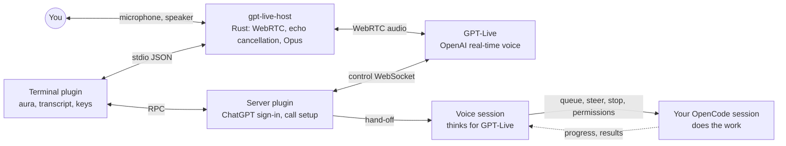

<p align="center">
  
</p>

<p align="center">
  <a href="https://www.npmjs.com/package/opencode-gpt-live"></a>
  <a href="https://github.com/malhashemi/opencode-gpt-live/actions/workflows/ci.yml"></a>
  <a href="LICENSE"></a>
  
  
</p>

<p align="center">
  <b>Real-time voice calls with your OpenCode session, on your ChatGPT subscription.</b><br>
  Say what you want. GPT-Live answers instantly, your session does the work, and you hear how it went.
</p>

<p align="center">
  <a href="#install">Install</a> ·
  <a href="#usage">Usage</a> ·
  <a href="#configuration">Configuration</a> ·
  <a href="#how-it-works">How it works</a> ·
  <a href="CONTRIBUTING.md">Contributing</a>
</p>

---

Run `/voice` and OpenCode picks up. You talk; GPT-Live, OpenAI's real-time voice model, listens and replies as you
speak. Every request goes to the OpenCode session on your screen, where your usual agent reads, edits and runs things
while you keep talking. When the work finishes, you hear the result. You can keep typing in the same session
throughout the call.

<table>
  <tr>
    <td width="42%" align="center">
      <br>
      <sub>The aura, rendered by the plugin: at rest, then you (cyan), then GPT-Live (violet).</sub>
    </td>
    <td>
      <ul>
        <li><b>Talk while it works.</b> Requests queue into your session. Ask "how's it going?", redirect it mid-task, or say "stop that".</li>
        <li><b>Approve by voice.</b> When the session asks for permission, GPT-Live reads the request out and answers with your decision.</li>
        <li><b>Picks up where you left off.</b> Each session keeps one voice conversation, so the next call remembers the last one.</li>
        <li><b>Hang up by voice.</b> Say "end the call", or press a key.</li>
        <li><b>Hands-free audio.</b> Echo cancellation and noise suppression run locally, and other apps' audio is turned down during calls.</li>
        <li><b>No API key.</b> It uses the ChatGPT sign-in you already have in OpenCode.</li>
      </ul>
    </td>
  </tr>
</table>

## Requirements

- [OpenCode](https://opencode.ai) 2.0.14 or newer.
- A ChatGPT account signed in to OpenCode: run `/connect`, choose OpenAI, then "ChatGPT Pro/Plus". Voice availability
  and usage limits depend on your ChatGPT plan.
- A microphone and speakers (or headphones).
- **Linux:** ALSA (`libasound2`), which PipeWire and PulseAudio systems already provide. Turning down other apps during
  calls uses `pactl`.

## Install

Add the plugin to your OpenCode config (`~/.config/opencode/opencode.json` for every project, or `opencode.json` in one
project):

```json
{
  "$schema": "https://opencode.ai/config.json",
  "plugins": ["opencode-gpt-live"]
}
```

Restart OpenCode. The audio helper for your platform comes with the plugin as a prebuilt package. If it is missing, the
plugin downloads it from the matching [GitHub release](https://github.com/malhashemi/opencode-gpt-live/releases) and
checks it against the release's SHA-256 checksums before running it.

On macOS, the first call asks for microphone access for your terminal app.

## Usage

1. Run `/voice`, or press <kbd>ctrl</kbd>+<kbd>x</kbd> <kbd>v</kbd>. Without a session open, the call starts in a new
   one.
2. Talk. For example:
   - "What does this project do?"
   - "Add a dark mode toggle to the settings page, then run the tests."
   - "How's it going?" · "Actually, use the existing theme hook instead." · "Stop that."
3. Hang up by saying "end the call", running `/voice` again, or pressing <kbd>ctrl</kbd>+<kbd>x</kbd> <kbd>v</kbd>.

While a call is on, the strip above the prompt shows who is talking, what OpenCode is doing and the call keys. The
transcript panel on the right shows the conversation and every task sent to your session, with the aura on top. It
opens with the call and closes when the call ends.

### Commands and keys

| Command        | Key                                       | What it does                                 |
| -------------- | ----------------------------------------- | -------------------------------------------- |
| `/voice`       | <kbd>ctrl</kbd>+<kbd>x</kbd> <kbd>v</kbd> | Start or end a call                          |
| `/voice-mute`  | <kbd>ctrl</kbd>+<kbd>y</kbd>              | Mute or unmute your microphone               |
| `/voice-panel` | <kbd>ctrl</kbd>+<kbd>s</kbd>              | Show or hide the transcript panel            |
| `/voice-stop`  |                                           | End the call (alias `/hangup`)               |
| `/voice-new`   |                                           | Start a call with a fresh voice conversation |
| `/voice-pick`  |                                           | Choose GPT-Live's voice                      |

Every command is also in the <kbd>ctrl</kbd>+<kbd>p</kbd> palette. Keys can be changed; see
[Configuration](#configuration).

### Terminal support

The aura picks the best way your terminal can draw it:

| Terminal                                                     | Aura                                       |
| ------------------------------------------------------------ | ------------------------------------------ |
| Kitty graphics protocol (Ghostty, kitty)                     | Anti-aliased image, up to 60 frames/second |
| [herdr](https://github.com/herdrdev/herdr)                   | Image through herdr's pane graphics API    |
| Anything else (tmux, iTerm2, Terminal.app, Windows Terminal) | Half-block characters in true color        |

Voice, commands and the transcript work the same everywhere.

## Configuration

Pass options with the object form of the plugin entry. Every option is optional.

```jsonc
{
  "plugins": [
    {
      "package": "opencode-gpt-live",
      "options": {
        "voice": "juniper",
        "duck": true,
        "keybinds": { "toggle": "<leader>v", "mute": ["ctrl+y", "f9"], "panel": "ctrl+s" },
      },
    },
  ],
}
```

| Option                   | Default                                                    | Description                                                                                                          |
| ------------------------ | ---------------------------------------------------------- | -------------------------------------------------------------------------------------------------------------------- |
| `voice`                  | `"cove"`                                                   | GPT-Live's voice: `cove`, `juniper`, `maple`, `spruce`, `ember`, `vale`, `breeze`, `arbor` or `sol`.                 |
| `keybinds`               | `{ toggle: "<leader>v", mute: "ctrl+y", panel: "ctrl+s" }` | Keys for `toggle`, `mute`, `panel`, `stop`, `new` and `voice`. A key, a list of keys, or `false`.                    |
| `panel`                  | `true`                                                     | Open the transcript panel when a call starts.                                                                        |
| `duck`                   | `true`                                                     | Turn other apps' audio down during calls and restore it afterwards.                                                  |
| `instructions`           |                                                            | Extra instructions appended to GPT-Live's prompt, such as a preferred language or tone.                              |
| `voiceAgentInstructions` |                                                            | Extra instructions appended to the voice agent's prompt.                                                             |
| `prompts`                |                                                            | Replace a built-in prompt: `{ "gptLive": "<path>", "voiceAgent": "<path>" }`. See [Custom prompts](#custom-prompts). |
| `voiceModel`             | `"openai/gpt-6-sol"`                                       | Model for the background agent that thinks for GPT-Live, as `provider/model`.                                        |
| `voiceVariant`           | `"medium"`                                                 | Thinking level for that model.                                                                                       |
| `log`                    | `true`                                                     | Keep a local log of each call (see [Privacy](#privacy)).                                                             |
| `visual`                 | automatic                                                  | Force the aura's drawing method: `kitty`, `herdr` or `blocks`.                                                       |

### Custom prompts

A call uses two system prompts: one for GPT-Live, which does the talking, and one for the voice agent, which thinks and
acts for it. Both live as folders of Markdown sections in [`src/server/prompts/`](src/server/prompts). To change one,
copy its folder (or write a single Markdown file), edit it, and point the plugin at it:

```jsonc
{
  "plugins": [
    {
      "package": "opencode-gpt-live",
      "options": {
        "prompts": { "gptLive": "~/.config/opencode/voice/gpt-live", "voiceAgent": ".opencode/voice-agent.md" },
      },
    },
  ],
}
```

Relative paths resolve against the project and `~` expands to your home directory. `{{project}}` and `{{directory}}`
are filled in, and HTML comments are dropped. Prompts are read at the start of every call, so edits apply to the next
call. If a custom prompt can't be read, the call uses the built-in one and says so in the transcript.

## How it works



- **gpt-live-host** is a small native program that owns the audio: WebRTC to OpenAI, the microphone and speaker,
  echo cancellation, noise suppression and Opus encoding. The plugin talks to it over newline-delimited JSON on stdio.
- **The server plugin** holds your ChatGPT credentials, creates the call, joins its control channel and bridges GPT-Live
  to OpenCode. The native helper never sees your credentials.
- **The voice session** is a separate OpenCode session per coding session. When GPT-Live needs to act or look something
  up, it hands off to this session's agent, which can only talk to your main session: queue or steer work, check on it,
  read what it did, stop it and answer its permission prompts. It cannot read files or run commands itself.
- **Your main session** does the actual work, exactly as if you had typed the request.

The [architecture guide](docs/architecture.md) covers each part in detail.

## Privacy

- Audio travels directly between your computer and OpenAI over an encrypted WebRTC connection, under your ChatGPT
  account and OpenAI's terms.
- Your ChatGPT credentials stay in OpenCode; the plugin reads them from OpenCode's ChatGPT sign-in.
- Each call writes a local log of transcripts and events to `~/.local/state/opencode-gpt-live/calls/`
  (`$XDG_STATE_HOME` if set, `%LOCALAPPDATA%` on Windows). Set `"log": false` to turn it off.
- The voice conversation is an ordinary OpenCode session, stored like any other.

## Troubleshooting

| Symptom                                              | Fix                                                                                             |
| ---------------------------------------------------- | ----------------------------------------------------------------------------------------------- |
| "GPT-Live needs your ChatGPT subscription", or a 401 | Run `/connect`, choose OpenAI, then "ChatGPT Pro/Plus".                                         |
| 403 error when the call starts                       | Your ChatGPT plan may not include voice, or the voice allowance is used up.                     |
| GPT-Live can't hear you (macOS)                      | Allow microphone access for your terminal in System Settings → Privacy & Security → Microphone. |
| No audio on Linux                                    | Install `libasound2` (Debian/Ubuntu) or `alsa-lib` (Fedora, Arch).                              |
| The aura looks blocky                                | Your terminal has no image support; the half-block version is the fallback.                     |

Still stuck? [Open an issue](https://github.com/malhashemi/opencode-gpt-live/issues/new/choose) with your OS,
terminal and the call log.

## Contributing

Contributions are welcome, from bug reports on a platform we haven't tested to new features. Start with
[CONTRIBUTING.md](CONTRIBUTING.md); the [development guide](docs/development.md) covers setup, running the plugin
locally and testing calls without a microphone.

```sh
git clone https://github.com/malhashemi/opencode-gpt-live
cd opencode-gpt-live
bun install
bun run check          # formatting, lint, types, tests
bun run build:native   # the audio helper (Rust 1.91+)
```

## Acknowledgments

Built on [OpenCode](https://opencode.ai) and [OpenTUI](https://github.com/anomalyco/opentui). The audio helper uses
[webrtc-rs](https://github.com/webrtc-rs/webrtc), [cpal](https://github.com/RustAudio/cpal),
[sonora](https://crates.io/crates/sonora) (WebRTC's audio processing in Rust), [Opus](https://opus-codec.org) and
[rubato](https://github.com/HEnquist/rubato). Third-party licenses are listed in [NOTICE](NOTICE).

## Disclaimer

This is an independent project, not affiliated with or endorsed by OpenAI or the OpenCode team. ChatGPT and GPT-Live
are trademarks of OpenAI. The plugin uses the voice service that comes with a ChatGPT subscription, which OpenAI may
change at any time.

## License

[MIT](LICENSE) © M. Adel Alhashemi
