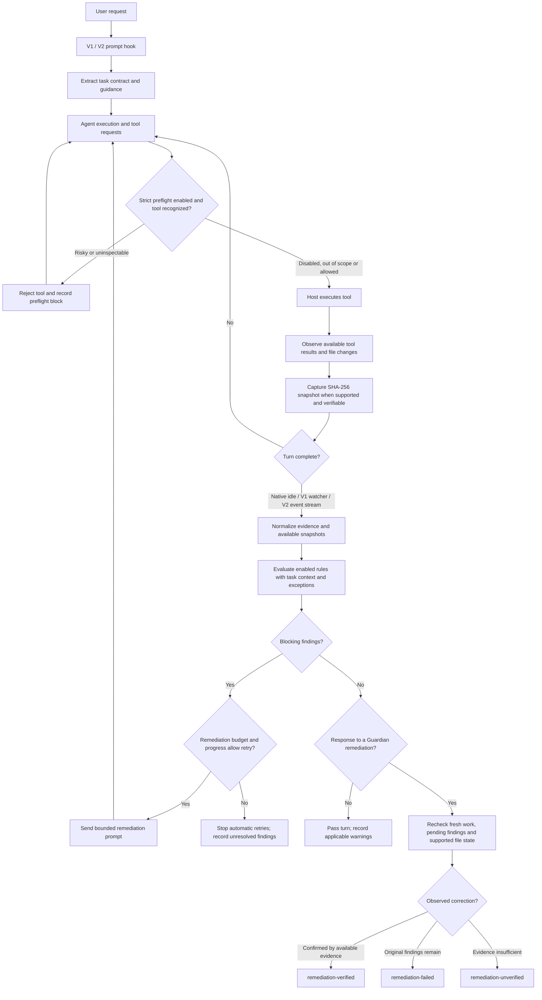

# 🛡️ OpenCode Guardian

[](https://www.npmjs.com/package/opencode-guardian)
[](https://www.npmjs.com/package/opencode-guardian)
[](https://opencode.ai)
[](docs/verification-report.md)
[](docs/verification-report.md)
[](package.json)
[](tsconfig.json)
[](LICENSE)

[Installation](#installation) · [Rules](#the-14-guardrail-rules) · [Configuration](#configuration-opencode-guardianjson) · [TUI Interface](#tui-sidebar-interface) · [Architecture](#architecture--turn-lifecycle) · [Verification](#verification--live-acceptance)

A high-performance, deterministic quality, safety, and verification plugin for **OpenCode** AI coding agents.

OpenCode Guardian continuously supervises agent turns: guiding model execution before calls, correlating tool results at session idle, intercepting recognized destructive shell actions and secret-bearing file writes, and requiring verifiable tool evidence before agents declare tasks complete.

---

## 📊 Verification & Live Acceptance


> The graphic combines the current **v0.6.1 automated verification** with the historical **v0.6.0 dual-host acceptance baseline**. The v0.6.1 source tree has 439/439 automated tests passing; the full V1/V2 live-host matrix below remains the last completed dual-host baseline.

Guardian **v0.6.1** is validated as follows:

- **Current Automated Verification:** **439 / 439** unit and regression tests passing.
- **Sandbox Scenarios:** **18 / 18** end-to-end multi-turn agent failure and recovery scenarios verified.
- **Static Analysis:** standard and strict TypeScript gates pass; Oxlint reports **0 warnings / 0 errors**.
- **Dependency Security:** **0 vulnerabilities** across production and development dependency audits.
- **Historical Dual-Host Baseline:** **4 / 4 — ACCEPTED** on real OpenCode V1 (`1.18.34`) and OpenCode V2 (`2.0.22`) for released v0.6.0. v0.6.1 adds targeted foreground-subagent handoff hardening on top of that baseline.

Read the comprehensive [Verification and Acceptance Report](docs/verification-report.md) for reproduction steps, methodology, evidence boundaries, and the historical live-host matrix.

---

## ✨ Key Highlights

- **Dual-Mode Architecture:** Seamlessly supports both **OpenCode v1** (`@opencode-ai/plugin`) and **OpenCode v2** (`@opencode/plugin`) with unified runtime adapters.
- **Compact TUI Sidebar:** A compact two-column status widget that expands to show Guardian diagnostics with a single click.
- **In-App Update Indicator:** Shows a green `(↑)` header icon and places `Update available` first in the sidebar when npm reports a newer release.
- **Guardian Commands:** Ctrl+P and slash commands display detailed status, activity, diagnostics, rules, configuration and version; confirmed statistics reset preserves audit history.
- **Project-Scoped Audit Log:** Stores safe event codes, reasons and intervention outcomes in `<project>/.opencode/guardian-events.jsonl` with `0600` POSIX permissions, a 2 MiB limit and one rotated archive. Never stores prompt or command text.
- **Evidence-Based Task Contracts:** Analyzes human requests across 13 languages to extract required verifications (tests, builds, source reviews) and detects premature completion claims. When the host provides a tool-after observation, SHA-256 evidence is tied to the observed file contents.
- **Foreground Subagent Finalization Barrier:** For synchronous delegated work, Guardian owns the handoff boundary: blocking findings are remediated on the child session before the parent receives the tool result, and the parent sees the revised final child report instead of a stale first-pass report. Background subagents keep the existing idle-remediation path.
- **14 Deterministic Rules:** Blocks shortcuts, empty stubs, unverified claims, masked errors, test weakening, leaked secrets, undeclared dependencies, and repetitive execution loops.
- **Zero Configuration:** Works instantly out of the box with production-tested defaults. Fully configurable via `opencode-guardian.json`.
- **Zero Runtime Dependencies:** Precompiled JavaScript (`dist/`) has no mandatory third-party runtime dependencies. The optional TUI utilizes the host's OpenTUI/Solid runtime.

---

## 📦 Installation

Add `opencode-guardian` to your OpenCode configuration (`opencode.json` in your project or `~/.config/opencode/opencode.json`):

### 🚀 OpenCode v1 (1.x)

To enable both the background safety engine and the interactive TUI sidebar widget, include both the engine and TUI entrypoints:

```json
{
  "plugin": [
    "opencode-guardian@latest",
    "opencode-guardian/tui"
  ]
}
```

> **Tip:** If you only need headless or background protection without mounting the sidebar UI (e.g. in CI or scripted pipelines), you can omit `"opencode-guardian/tui"`.

For local development with v1, use local file paths:

```json
{
  "plugin": [
    "file:///path/to/opencode-guardian",
    "file:///path/to/opencode-guardian/tui.js"
  ]
}
```

### ⚡ OpenCode v2 (2.x)

Use the v2 **`plugins`** key in `opencode.json` or `opencode.jsonc`:

```json
{
  "plugins": [
    "opencode-guardian@latest",
    "opencode-guardian/tui"
  ]
}
```

For local development with v2, use `"plugins": ["file:///path/to/opencode-guardian", "file:///path/to/opencode-guardian/tui.js"]`.

Refer to the [v1 plugin documentation](https://opencode.ai/docs/plugins/) and [v2 plugin documentation](https://opencode.ai/v2/docs/build/plugins/) for version-specific loading behavior.

---

## 🖥️ TUI Sidebar Interface

OpenCode Guardian includes a dedicated TUI extension that mounts into OpenCode's sidebar. It displays live status, intervention counters, and update notices.

### 🔌 Enabling the TUI Sidebar

In OpenCode, terminal UI widgets are registered via distinct entrypoints so that headless servers and interactive terminals remain modular and lightweight.

To mount the Guardian sidebar in your OpenCode terminal:
1. Add `"opencode-guardian/tui"` alongside `"opencode-guardian@latest"` in your `opencode.json` (`plugin` array for v1, `plugins` array for v2).
2. Start OpenCode as usual (`opencode`).
3. The Guardian widget appears in OpenCode's sidebar slot (`sidebar_content` in v1, `sidebar.content` in v2) without replacing existing sidebar sections.

### 🔽 Collapsed View (Default)

```text
▶ Guardian                 v0.6.1
Status                       ● Active
Interventions                 0w · 0r
```

- **Header:** Clickable header displaying the Guardian brand, current version, and an optional green `(↑)` update badge when a newer npm release is detected.
- **Status:** Most recent event, distinguishing verified, failed and unverified remediation as well as preflight decisions; counters reflect retained audit history.
- **Interventions:** Compact summary of warnings (`w`) and remediation requests (`r`); independent outcomes are available through `Guardian: Status`.

### 🔼 Expanded View (Click to Toggle)

Clicking the `▶ Guardian` header expands the widget:

```text
▼ Guardian                 v0.6.1
Preflight                  ○ disabled
Inspected                           0
Blocked                             0
Warnings                            0
Remediations                        0
```

- **Preflight:** Current shell protection mode (`○ disabled` or `● active`).
- **Inspected / Blocked:** Real-time count of commands evaluated and prevented.
- **Blocked** counts only commands denied by active preflight; post-turn remediation requests are tracked separately.
- **Warnings / Remediations:** Detailed intervention statistics for the active project.
- **Update available:** The first row immediately below the header in both views shows the newer published version; it stays hidden when there is no update.
- **Auto-Refresh:** The widget polls the project event log (`.opencode/guardian-events.jsonl`) every 2.5 seconds to reflect live metrics without reloading.
- **Hiding / Disabling:** Setting `"enabled": false` in `opencode-guardian.json` automatically unregisters and hides the TUI sidebar.

### ⌨️ Guardian Commands (Ctrl+P / Command Palette)

When Guardian's TUI component is loaded, its commands appear under **Guardian** in the Ctrl+P palette:

| Command | Slash Shortcut | Purpose |
| :--- | :--- | :--- |
| **Guardian: Status** | `/guardian-status` | Project counters and remediation outcomes |
| **Guardian: Activity** | `/guardian-activity` | Recent redacted audit events |
| **Guardian: Diagnostics** | `/guardian-doctor` | Configuration and last-reported host state |
| **Guardian: Rules** | `/guardian-rules` | Effective rule severity across all 14 rules |
| **Guardian: Configuration** | `/guardian-config` | Safe, redacted configuration overview |
| **Guardian: Version** | `/guardian-version` | Installed and available stable versions |
| **Guardian: Reset Statistics** | `/guardian-reset` | Confirmed counter reset, retaining security history |

In OpenCode V2, the general `/guardian <command>` dispatcher is also available (e.g. `/guardian status`, `/guardian rules`).

Reset appends a local `statistics-reset` event rather than wiping the audit log (normal bounded rotation still applies); it does not disable protection, change rules or undo previous findings.

---

## 🔒 Privacy-Safe Audit Events

Guardian stores a structured JSONL audit in `<project>/.opencode/guardian-events.jsonl` (or the configured state directory). Each entry has a timestamp, random event ID, event kind, action and outcome. Findings include only the **rule ID and a predefined reason code**, such as `masked-verification-failure`, `destructive-operation-not-authorized` or `missing-follow-up-review`. The session ID is reduced to a 16-character SHA-256 fingerprint. Custom tool names are replaced with a generic category.

```json
{"at":"2026-10-04T00:00:00.000Z","id":"123e4567-e89b-42d3-a456-426614174000","kind":"post-remediation","action":"remediation-requested","outcome":"unverified","rules":["task/completion-gate"],"reasons":[{"rule":"task/completion-gate","code":"missing-follow-up-review"}]}
```

- `unverified` means an instruction was sent, **not** that the agent completed it.
- A warning uses `reported`; a preflight denial uses `prevented` only when the command was actually rejected before execution.
- No prompts, assistant responses, raw commands, file contents, finding snippets, original session IDs, credentials or secrets are written.
- The active log is limited to 2 MiB, with one rotated archive (`guardian-events.jsonl.1`); TUI counters cover the latest 2 MiB of available records.
- To inspect recent events, run `tail -n 20 .opencode/guardian-events.jsonl`.

---

## 📋 The 14 Guardrail Rules

OpenCode Guardian evaluates assistant turns against 14 deterministic rules. Rules can be configured as `error`, `warn`, or `off`; remediation is bounded and post-turn findings cannot undo an already-executed command:

| Category | Rule ID | Default | What It Enforces |
| :--- | :--- | :---: | :--- |
| **Discipline** | `discipline/no-evasion` | `error` | Blocks unsupported dismissals such as claiming a test failure is "pre-existing" or "out of scope" unless verified by baseline checks. |
| **Discipline** | `discipline/no-apology` | `error` | Blocks sycophantic, defensive, or repetitive apology language across multiple languages. |
| **Quality** | `quality/no-shortcuts` | `error` | Blocks concrete deferred-work phrases (`TODO`, `FIXME`, `HACK`, "will do later"). Ambiguous hedging phrases are flagged as advisory warnings. |
| **Integrity** | `integrity/no-stubs` | `error` | Blocks `NotImplementedError`, empty function stubs, Rust `todo!()`/`unimplemented!()`, and placeholder returns. |
| **Integrity** | `integrity/no-unverified-claims` | `error` | Correlates statements like "tests pass" or "build succeeded" against recorded tool exit codes. Direct contradictions block. |
| **Integrity** | `integrity/no-silent-failure` | `error` | Blocks test, build, lint, typecheck, or audit commands masked with `\|\| true`, `exit 0`, or suppressed exit codes. |
| **Safety** | `safety/no-truncation` | `error` | Blocks lazy edit placeholders (e.g. `// ... rest of code unchanged ...`) that can accidentally truncate production code. |
| **Safety** | `safety/destructive-operations` | `warn` | Inspects hard resets, force pushes, recursive deletion (`rm -rf`), database drops, and unpublish actions. Plain `rm` requires explicit scoped user consent. |
| **Testing** | `testing/no-cheat` | `error` | Blocks malicious test tampering: targeted `describe.skip`, `it.skip`, `test.skip`, `fit`, or assertion stripping in test files. |
| **Security** | `security/no-secrets` | `error` | Blocks hardcoded API keys (OpenAI, Anthropic, Google, AWS, GitHub, Slack, Stripe, JWTs, private keys, database URLs with passwords). |
| **Manifest** | `manifest/no-ghost-deps` | `error` | Blocks undeclared third-party imports not found in `package.json`, `pyproject.toml`, `requirements.txt`, `go.mod`, or `Cargo.toml`. Local modules and stdlib are recognized. |
| **Runtime** | `runtime/circuit-breaker` | `error` | Blocks repetitive failing commands hitting identical errors 3 times consecutively without progress, breaking runaway agent loops. |
| **Task** | `task/instruction-fidelity` | `error` | Prevents historical refusals and redundant confirmation handoffs from overriding the user's current explicit action. |
| **Task** | `task/completion-gate` | `error` | Ensures requested verifications (fresh test execution, post-change source inspection) are observed before the agent declares completion. |

---

## ⚙️ Configuration (`opencode-guardian.json`)

Guardian works out of the box with zero configuration. You can customize rules and thresholds by placing `opencode-guardian.json` in your project root, `.opencode/`, or `~/.config/opencode/`:

```json
{
  "enabled": true,
  "remediationBudget": 1,
  "iterationBudget": 3,
  "updateNotice": {
    "enabled": true
  },
  "preflight": {
    "enabled": false
  },
  "rules": {
    "discipline/no-evasion": "error",
    "discipline/no-apology": "error",
    "quality/no-shortcuts": {
      "severity": "error",
      "customPhrases": ["not my job", "out of scope for me"],
      "exceptions": ["tempdir", "temporaryfile"]
    },
    "integrity/no-stubs": "error",
    "integrity/no-unverified-claims": "error",
    "integrity/no-silent-failure": "error",
    "safety/no-truncation": "error",
    "safety/destructive-operations": "warn",
    "testing/no-cheat": "error",
    "security/no-secrets": "error",
    "manifest/no-ghost-deps": "error",
    "runtime/circuit-breaker": "error",
    "task/instruction-fidelity": "error",
    "task/completion-gate": "error"
  }
}
```

### 🎛️ Severity Options:
- `"error"`: High-confidence violation triggers an automatic remediation prompt (bounded by `remediationBudget`).
- `"warn"`: Recorded in telemetry and displayed in TUI, but does not interrupt agent flow.
- `"off"`: Completely disables the rule.

---

## 🌐 Task Contracts & Multilingual Support

When a user submits an instruction, Guardian extracts a deterministic task contract before model execution. Supported intent patterns include:
- **Languages Supported:** English, Turkish, Spanish, Portuguese, French, German, Russian, Arabic, Hindi, Chinese, Japanese, Korean, and Indonesian.
- **Verification Modes:** Requires observable evidence (e.g. running tests, building, typechecking, or performing a fresh post-change file inspection).
- **Explicit Header Directive (Optional):** For deterministic contract specification regardless of natural language phrasing:

```text
@guardian-task {"mode":"iterative-review","review":"source","verify":["test"]}
Please refactor the authentication service and verify all tests pass.
```

---

## 🔒 Preflight Shell Protection (Opt-In)

By default, Guardian analyzes operations after tool execution. To block recognized destructive shell commands and hardcoded secrets in supported file writes **before execution**, explicitly enable preflight:

```json
{
  "preflight": {
    "enabled": true
  }
}
```

- Intercepts recognized destructive commands (`rm -rf /`, scoped/unscoped `git reset --hard` and forced pushes, `DROP DATABASE`, `mkfs`, common literal fork-bomb signatures, encoded base64-to-shell pipelines).
- Operates at the host hook level (`tool.execute.before` in v1, `ctx.tool.hook("execute.before")` in v2). Recognized file-writing actions (including `mcp__Node_Command__file_mutate`) also check inspectable content and replacement edits for potential hardcoded secrets.

Standard MCP tool IDs ending in recognized shell actions (for example `mcp__provider__shell_exec`) are inspected automatically. For an MCP or custom tool with an unrecognized execution action, explicitly opt it in:

```json
{
  "preflight": {
    "enabled": true,
    "shellTools": ["mcp.remote.exec_task"]
  }
}
```

---

## 📈 Telemetry & CLI Status

Guardian maintains a private, redacted log of local events:
- **Project Log:** `<project>/.opencode/guardian-events.jsonl` (mode `0600`).
- **Global Fallback:** `~/.local/state/opencode-guardian/guardian-events.jsonl`.
- **Privacy:** Contains only rule codes and SHA-256 session fingerprints. **Never** stores commands, file contents, secrets, or prompts.

### 💻 Command Line Interface

Check Guardian's status at any time from your terminal:

```bash
# Check status for the current project
opencode-guardian-status

# Or specify a target directory
opencode-guardian-status /path/to/project
```

Example output:
```text
Guardian | preflight at last start: active
Shell inspected: 14 | blocked: 2
Post-turn warnings: 2 | remediations: 1 | errors: 0
Event log: /path/to/project/.opencode/guardian-events.jsonl
```

---

## 🔄 Architecture & Turn Lifecycle



The diagram illustrates the v0.6.1 dual-mode runtime. Strict preflight is **opt-in** and evaluates recognized or configured tools; an out-of-scope tool is still governed by host permissions. Tool-after observations and SHA-256 file snapshots are captured **when the host supplies supported evidence**. After a remediation, only supported, observable follow-up evidence can establish `remediation-verified`.

For foreground delegated work (`task` on V1, `subagent` on V2), v0.6.1 adds a bounded handoff barrier. Child-session findings are inspected before the parent tool result settles; if remediation is required, Guardian resumes the child, waits for the remediation turn to finish, re-inspects it, and replaces the parent-facing tool result with the latest child report. The barrier is limited to foreground delegation and does not convert background subagents into blocking handoffs.

---

## 🔬 Scientific Foundation & Academic Research

OpenCode Guardian's architecture and security models are grounded in peer-reviewed computer science literature and industry security frameworks:

1. **"Guardians of the Agents" (Erik Meijer, Communications of the ACM, Dec 2025):**
   - In [*Guardians of the Agents*](https://doi.org/10.1145/3777544) (*Communications of the ACM*, DOI: [`10.1145/3777544`](https://doi.org/10.1145/3777544)), Erik Meijer formalized the paradigm of using independent, host-level supervisory software ("Guardians") that monitor and enforce behavioral invariants over autonomous AI agents before and after tool execution, without requiring prompt-level instructions or modifying model weights.
   - OpenCode Guardian directly realizes this paradigm through its dual-mode engine, evaluating preflight invariants before execution and correlating multi-step evidence at `session.idle`.

2. **The GuardFall Vulnerability Research (Adversa AI, June 2026):**
   - Discovered by Adversa AI in June 2026, the *GuardFall* research revealed systemic flaws across 10 out of 11 popular coding agents where string-matching blocklists failed to detect obfuscated shell commands (such as quote removal `r''m`, variable expansion `$IFS`, paired backtick substitution, and encoded Base64 pipelines).
   - OpenCode Guardian incorporates dedicated conservative shell-pattern analysis ([`src/shell-risk.ts`](src/shell-risk.ts)) and regression suites ([`tests/guardfall-regression.test.mjs`](tests/guardfall-regression.test.mjs)) to recognize documented GuardFall-style patterns during post-turn inspection and opt-in strict preflight.

3. **OWASP Top 10 for Agentic Applications (2026):**
   - OpenCode Guardian is architected to address critical vulnerabilities defined in the OWASP Agentic Top 10 framework, including **ASI01** (Agent Goal Hijacking), **ASI02** (Tool Misuse), **ASI03** (Identity & Privilege Abuse), **ASI05** (Unexpected Code Execution), and **ASI08** (Cascading Failures).
   - Detailed mapping and capability boundaries are documented in [`docs/owasp-agentic-top10-2026.md`](docs/owasp-agentic-top10-2026.md).

---

## 🧪 Verification & Testing

Run the checks locally:

```bash
npm ci
npm run typecheck
npm test
node sandbox/smoke-test.mjs
node sandbox/comprehensive-test.mjs
node scripts/check-docs.mjs
npm audit --omit=dev
node scripts/check-dev-audit.mjs
npm pack --dry-run
```

The automated suite includes both host adapters, preflight, rule regressions and lifecycle checks. Live host acceptance results across OpenCode V1 and V2 are detailed in the [Verification Report](docs/verification-report.md).

Technical documentation: [Verification Report](docs/verification-report.md) · [Security Benchmark](docs/security-benchmark.md) · [Adapter Architecture](docs/task-contract-v1-v2.md) · [Security Coverage](docs/owasp-agentic-top10-2026.md).

---

## 📄 License

MIT © [Hüseyin Hadi Çığ](https://github.com/huseyincig)
