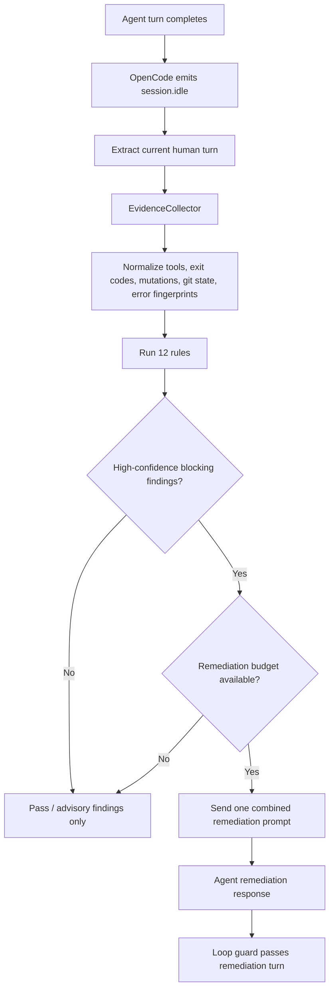

# opencode-guardian 🛡️

[](https://opensource.org/licenses/MIT)
[](https://github.com/huseyincig/opencode-guardian)
[](https://www.typescriptlang.org/)
[](tests/)

A universal, high-performance quality and safety guardian plugin for **OpenCode** AI agents.

Designed to prevent common AI agent failure modes in real time: unsupported claims, responsibility evasion, silent failure masking, test weakening, unsafe destructive operations, hardcoded secrets, undeclared dependencies, incomplete implementations, and repetitive error loops.

Works **100% out of the box** using OpenCode's native lifecycle hooks — **no manual markdown files, rules, or system prompt files required**.

---

## 🌟 Why OpenCode Guardian?

Traditional agent detectors often rely on external platform-specific binaries (Rust, Go, or Python) which introduce compile issues, glibc mismatches, and sluggish child-process invocation. 

**OpenCode Guardian** provides:
- **Native Lifecycle Integration:** Hooks directly into OpenCode's `session.idle` event — zero manual `.md` configuration, zero boilerplate.
- **Zero-Binary, Pure TypeScript:** Native in-memory execution (~0.5ms per inspection) with zero external runtime dependencies.
- **Dual-Mode Host Support:** Works with **OpenCode 1.x** (via `server`) and full **OpenCode 2.x** hosts (via `setup` and `event.subscribe`); transition builds that invoke `setup()` without the complete V2 capability surface are detected and ignored safely.
- **Pre-Built Distribution:** Pre-compiled `dist/` is included in the package and git repository — no build toolchain (`tsc`) required on target systems.
- **Evidence-Aware Inspection:** Correlates tool commands, exit codes, test/build/audit results, file mutations, git state, baseline checks, and normalized error fingerprints before deciding.
- **False-Positive Defenses:** Explicit uncertainty is allowed, stale verification after a later edit is not treated as proof, and Python local/stdlib modules are distinguished from third-party dependencies.
- **Anti-Loop Architecture:** Guardian's own marker-tagged remediation turns are skipped, other plugins' synthetic messages do not reset human-turn boundaries, duplicate finding fingerprints are suppressed, and the default remediation budget is one intervention per human turn.

---

## 📦 Installation

### Method 1: NPM Package (Recommended)

Add the package to the OpenCode configuration used by your host.

**OpenCode v1:**

```json
{
  "plugin": [
    "opencode-guardian@latest"
  ]
}
```

**OpenCode v2:**

```json
{
  "plugins": [
    "opencode-guardian@latest"
  ]
}
```

### Method 2: Local Directory / Development

If developing or testing locally:

```bash
git clone https://github.com/huseyincig/opencode-guardian.git ~/.config/opencode/vendor/opencode-guardian
```

Use the absolute `file:///` path in the matching host configuration.

**OpenCode v1:**

```json
{
  "plugin": [
    "file:///home/me/.config/opencode/vendor/opencode-guardian"
  ]
}
```

**OpenCode v2:**

```json
{
  "plugins": [
    "file:///home/me/.config/opencode/vendor/opencode-guardian"
  ]
}
```

> `OpencodeGuard` remains a JavaScript export alias for source compatibility. The npm package name `opencode-guard` is **not** an alias for this project; install `opencode-guardian`.

---

## 🛡️ The 12 Rules

| Rule | Default | What it checks |
| :--- | :---: | :--- |
| **`discipline/no-evasion`** | error | Unsupported dismissal such as pre-existing/unrelated/out-of-scope claims. A successful baseline/main check allows factual pre-existing or unrelated claims. |
| **`discipline/no-apology`** | error | Sycophantic, defensive, or excessive apology language across multiple languages. |
| **`quality/no-shortcuts`** | error | Concrete deferred-work language and `TODO`/`FIXME`/`HACK` comments block; ambiguous descriptive words such as “temporary” and “workaround” are advisory. |
| **`integrity/no-stubs`** | error | `NotImplementedError`, empty stubs, Rust `todo!/unimplemented!`, and explicit placeholder constant returns. |
| **`integrity/no-unverified-claims`** | error* | Correlates claims such as “tests pass”, “build succeeded”, “audit clean”, “pushed”, “working tree clean”, and “bug fixed” with tool evidence. Direct contradictions block; missing evidence is advisory by default. |
| **`integrity/no-silent-failure`** | error* | Blocks test/build/lint/typecheck/audit commands whose failure is masked with `|| true`, `exit 0`, etc. Empty catch/`except: pass` handlers are advisory by default. |
| **`safety/no-truncation`** | error | Lazy file-edit placeholders that can delete real code. |
| **`safety/destructive-operations`** | **warn** | Hard reset, force push, recursive force delete, database drop, Terraform destroy, registry unpublish, and similar operations unless explicitly requested by the user. |
| **`testing/no-cheat`** | error | Targeted skip/focus/todo edits block. Existing skips in whole-file writes, assertion weakening, test deletion, coverage reduction, CI test-step removal, and snapshot regeneration are advisory by default unless strict settings or failed-test evidence require blocking. |
| **`security/no-secrets`** | error | OpenAI/GitHub/AWS/Slack/npm/GitLab/Google/Stripe credentials, JWTs, private keys, registry auth, bearer tokens, and credential-bearing DB URLs. |
| **`manifest/no-ghost-deps`** | error | Undeclared imports against the nearest Node (`package.json`), Python (`pyproject.toml` / `requirements*.txt`), Go (`go.mod`), or Rust (`Cargo.toml`) manifest. Python findings are advisory by default because import names can differ from package names. |
| **`runtime/circuit-breaker`** | error | Exact repeated failures plus cosmetic command variants that keep hitting the same normalized root-cause error without successful progress. |

`*` These rules distinguish high-confidence blocking behavior from lower-confidence advisory findings.

For `git clean`, an explicit request authorizes normal cleanup; mentioning the command, forbidding it, or requesting a different command does not. Deleting ignored files with `-x` or `-X` requires separate authorization. A scoped `git -C ... clean` requires matching scope in the request, and shell substitutions or chained commands are not treated as authorized. Dry-run (`-n` / `--dry-run`) is not classified as destructive. **Guardian inspects after the tool runs:** findings are advisory at the default `warn` severity, not a pre-execution safety barrier.

---

## ⚙️ Configuration (`opencode-guardian.json`)

OpenCode Guardian works out of the box with zero configuration. `safety/destructive-operations` defaults to `warn`; the other blocking rules default to `error`.

To customize behavior, create `opencode-guardian.json` (or legacy `opencode-guard.json`) in the project root, `.opencode/`, or the global OpenCode config directory:

```json
{
  "enabled": true,
  "remediationBudget": 1,
  "rules": {
    "discipline/no-evasion": "error",
    "discipline/no-apology": "error",
    "quality/no-shortcuts": {
      "severity": "error",
      "customPhrases": ["works on my machine", "not my job"],
      "exceptions": ["temporarydirectory", "tempdir"]
    },
    "integrity/no-stubs": "error",
    "integrity/no-unverified-claims": {
      "severity": "error",
      "blockUnverified": false
    },
    "integrity/no-silent-failure": {
      "severity": "error",
      "blockEmptyHandlers": false
    },
    "safety/no-truncation": "error",
    "safety/destructive-operations": "warn",
    "testing/no-cheat": {
      "severity": "error",
      "blockSnapshotUpdates": false,
      "blockStructuralTestChanges": false
    },
    "security/no-secrets": "error",
    "manifest/no-ghost-deps": {
      "severity": "error",
      "blockPythonGhostDeps": false
    },
    "runtime/circuit-breaker": "error"
  }
}
```

### Severity Levels:
- `"error"`: a blocking rule can send one combined remediation prompt, subject to the turn remediation budget.
- `"warn"`: findings remain in the engine result but do **not** trigger remediation.
- `"off"`: disables the rule.

`remediationBudget` accepts `0..5`; `0` keeps findings but disables automatic remediation, and the default is `1`. The strict options `blockUnverified`, `blockEmptyHandlers`, `blockSnapshotUpdates`, `blockStructuralTestChanges`, and `blockPythonGhostDeps` are deliberately `false` by default to reduce false positives. Structural test changes become blocking automatically when the same turn contains failed-test evidence.

---

## 🔄 How It Works: Evidence + Remediation Flow



1. **Evidence collection:** Each completed human turn is normalized once. Tests, builds, typechecks, lint, audits, git operations, file mutations, explicit exit codes, and failure fingerprints become shared evidence.
2. **Rule evaluation:** Rules inspect both text/code and the same evidence snapshot. A successful verification that happened before a later file edit is considered stale for completion claims. Compound commands are tracked by verification kind; ambiguous failures in multi-step commands remain advisory.
3. **Conservative blocking:** Missing or ambiguous evidence is generally advisory. Direct contradictions and concrete code/tool violations are the primary blocking path.
4. **Remediation budget:** By default Guardian can intervene only once per human turn. The same finding fingerprint cannot trigger a second remediation in that turn.
5. **Loop protection:** Guardian's remediation marker is recognized on both V1 and V2 so Guardian does not re-block its own response. Synthetic messages from other plugins remain inspectable without resetting the human-turn budget.

---

## 🧪 Testing & Verification

```bash
# Build + 127 unit/regression tests
npm test

# Typecheck TypeScript sources
npm run typecheck

# Isolated plugin smoke test
node sandbox/smoke-test.mjs

# 15 end-to-end behavioral scenarios
node sandbox/comprehensive-test.mjs

# Dependency/security audit
npm audit

# Verify publish contents
npm pack --dry-run
```

CI runs the full verification sequence on Node **22** and **24**. The regression suite contains explicit false-positive cases for hypotheses/uncertainty, baseline-backed pre-existing claims, legitimate assertion changes, Python standard-library imports, successful-progress circuit-breaker resets, partial-v2 contexts, remediation budgeting, and default-warn destructive operations.

---

## 🛠️ Project Structure

```
opencode-guardian/
├── dist/                    # Pre-built ESM distribution
├── src/
│   ├── index.ts             # OpenCode v1/v2 adapters
│   ├── engine.ts            # Rule orchestration + remediation budget
│   ├── evidence.ts          # Tool/evidence normalization + error fingerprints
│   ├── state.ts             # Per-session/per-human-turn remediation state
│   ├── prose.ts             # Prose normalization
│   ├── tool-input.ts        # Common shell/file mutation extraction
│   ├── types.ts
│   └── rules/               # 12 built-in rules
├── sandbox/
│   ├── smoke-test.mjs
│   └── comprehensive-test.mjs
├── tests/
│   └── guard.test.mjs       # 127 unit/regression tests
├── index.js
├── server.js
├── package.json
└── tsconfig.json
```

---

## 📄 License

[MIT](LICENSE) © Hüseyin Hadi Çığ
