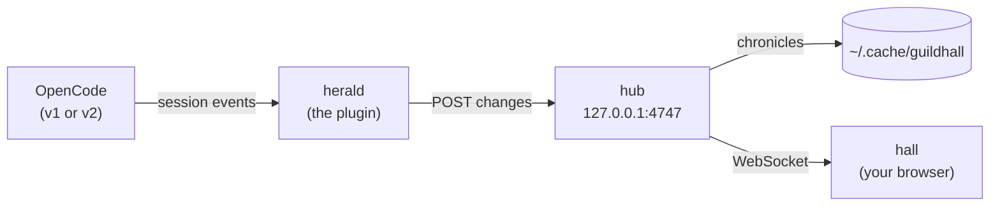

<h1 align="center">Guildhall</h1>

<p align="center">
  <strong>Your AI coding agents, working as a fantasy guild on a living island.</strong><br />
  A 3D world you can watch, and a real nine-agent harness for <a href="https://opencode.ai">OpenCode</a>.
</p>

<p align="center">
  <a href="https://guildhall.codestz.dev"><strong>Visit the guild</strong></a> ·
  <a href="#install">Install</a> ·
  <a href="packages/opencode-guildhall/README.md">Plugin docs</a>
</p>

<p align="center">
  <a href="https://www.npmjs.com/package/opencode-guildhall"></a>
  <a href="LICENSE"></a>
  
</p>

<p align="center">
  
</p>

Every session you run in OpenCode becomes an adventurer on the island. The Guildmaster posts a
quest, specialists set out to the forest, the river or the proving grounds, and they come home with
loot. Each tool call is a **deed**, with its own sigil above the hero's head. When they need you, a
**plea** goes up. Everything you see comes from a real session, played out as it happens.

The world reacts to your repo, too. The weather follows your test health: clear skies while things
pass, rain and then storms as failures pile up. A session that fails rises as a skeleton in the
graveyard. Ravens fly out when a quest begins and carry the loot home. And it all has a voice: a bard writes
the story as captions and collects it into a book of Legends, and the guild makes music as it works.

## Try it

**In your browser.** [guildhall.codestz.dev](https://guildhall.codestz.dev) runs a simulated guild.
Nothing to install.

<a id="install"></a>**With your own agents.** Add the plugin to `opencode.json`, restart OpenCode,
and open <http://127.0.0.1:4747>.

```jsonc
{ "plugin": ["opencode-guildhall"] }
```

That's OpenCode 1.18 or later. On OpenCode 2.0.18 or later, use `"plugins"`, or run
`opencode plugin add opencode-guildhall`. Pick **guild-master** with
Tab (shift+tab on v2), and the hall follows every OpenCode window you have open. Ports, options
and upgrade notes are in the [plugin README](packages/opencode-guildhall/README.md).

## Watch it work

<p align="center">
  
  <br /><sub><a href=".github/media/saga-loop.mp4">Watch the loop as MP4</a></sub>
</p>

<table>
  <tr>
    <td colspan="2">
      
      <p><strong>Real work, real places.</strong> Each role has a trade. Explorers chop wood while they
      search your code, researchers fish while they read the web, verifiers shoot at targets while your
      tests run, and implementers raise a building in the yard as they write. Logs, fish and arrows
      pile up as the deeds finish.</p>
    </td>
  </tr>
  <tr>
    <td colspan="2">
      
      <p><strong>A living island.</strong> Day and night follow your clock (or a fixed hour), and the
      weather follows the share of recent deeds that failed. A busy guild runs warm; a guild left
      quiet for a long time turns cold.</p>
    </td>
  </tr>
  <tr>
    <td width="50%">
      
      <p><strong>The graveyard.</strong> A failed session rises as a skeleton and keeps vigil until it
      recovers. Failed deeds raise minions that crumble away.</p>
    </td>
    <td width="50%">
      
      <p><strong>Captions and Legends.</strong> The bard narrates as it happens. The Legends book tells
      each quest chapter by chapter, with deeds, loot, tokens and cost, and copies out as text.</p>
    </td>
  </tr>
  <tr>
    <td colspan="2">
      
      <p><strong>Parties, pleas and the chronicle.</strong> Several conversations at once become
      separate parties, each under its own banner. A permission request shows up as a plea you can
      open. The chronicle lists every deed, and the timeline lets you scrub through the whole session.</p>
    </td>
  </tr>
</table>

**A cinematic director.** With the bard on, the camera picks its own shots: establishing views,
follows, close-ups, two-shots. It cuts to whatever matters most, and a plea outranks everything.
In replays it fast-forwards through the quiet stretches. Take the camera back any time.

**Sound.** Every deed plays a note in a key that follows the mood (minor at night), over a bed of
wind, rain, sea, fire and night insects. It is synthesized in the browser, apart from a few
recorded effects. Sound is off until you turn it on.

**Townsfolk.** Farmers, a fisher, merchants, gate guards, children and a graveyard keeper go about
their day around the guild.

**Secret events.** The island answers rare moments in your work. A clean quest earns a festival.
A long run that ends in a fall may bring a ghost ship out of the mist. There are more: a rainbow,
pirates, comets, a dragon. Each has its own trigger, and they're more fun to find than to read
about.

<p align="center">
  
</p>
<p align="center">
  
</p>

## The guild

The plugin gives OpenCode nine agents. You talk to the **Guildmaster**. It sizes your request,
briefs the specialists, has their work checked by a verifier, and reports back.

| Role | What it does | What it may do | Where it works |
|---|---|---|---|
| **Guildmaster** | Talks to you, plans, briefs specialists, reports back | Read; shell asks first; may launch the eight specialists | Quest board in the keep |
| **Architect** | Designs the structure first: boundaries, plans, task contracts | Write Markdown under `docs/` only | Drafting table in the keep |
| **Implementer** | Builds one bounded task: the code and its tests | Edit files; run the project's checks; any other command asks | Forge, then the construction yard |
| **Verifier** | Tries to prove the work wrong, returns a cited verdict | Read; run the checks; every other command is denied | Inspection bench, then the proving grounds |
| **Librarian** | Library docs at your installed version, plus the project's decisions | Read and use the web | Library, then the wizard tower |
| **Explorer** | Maps your codebase | Read only | Map table, then the forest edge |
| **Researcher** | Answers open questions from the web, with sources | Read and use the web | Map table, then the river bend |
| **Designer** | Designs and builds UI within your design system | Edit files; run the checks; any other command asks | Easel in the keep |
| **Product owner** | Turns a vague goal into a spec with testable criteria | Write Markdown under `docs/` only | Scroll desk in the keep |

Agents from outside the guild, such as OpenCode's own `general`, show up as grey wanderers working
the quarry.

- **Permissions are enforced twice.** OpenCode's own rules: every agent starts from deny-all and
  gets back only what its job needs. "Checks" means an exact list of test, lint, typecheck and
  read-only git commands. Protected paths (your OpenCode config, `AGENTS.md`, `.git/` and others)
  can't be written by any agent. Then a pre-run guard in the plugin reads every shell line a guild
  agent runs, with a real shell parser, before it runs: the Verifier may only run those exact
  checks, and no agent may redirect output into a protected path, however the line is written. The [plugin README](packages/opencode-guildhall/README.md#permissions) has
  the full rules and their known limits.
- **Models.** By default no role sets a model: everyone runs on the one you picked, with any
  provider. If you want, map the `strong`, `standard` and `fast` tiers, or a single agent, to
  models of your choice.
- **Make them yours.** Your config overrides the plugin's, field by field.
  `npx opencode-guildhall eject` writes the prompts into `.opencode/agents/` for you to edit.
  `{ "agents": false }` turns the guild off and keeps only the hall.

## How it works



The **herald** runs inside OpenCode. It adds the guild's agents and translates OpenCode's events
into a small model of sessions and deeds. It sends them to the **hub**, a tiny local server that
the herald starts the first time it's needed. Every OpenCode window shares that one hub. The hub
records each session as a chronicle on disk and serves the **hall**, a React Three Fiber app that
turns the stream into the island.

## Performance

The target is 120 fps on a Retina MacBook, and the hall measures itself against it. On a
production build at the default High tier, the party scene runs at about 121 to 131 fps. The
busiest scene, thirteen adventurers in rain at night, runs at 117 to 120 fps, with its 95th-percentile
frame at 12.5 to 13.7 ms. That is just short of the target, and the rest of the cost is fill rate at
Retina resolution. A few things keep it fast:

- Island tiles are instanced and placed props are batched per material. Each character's parts are
  merged into two skinned meshes.
- One shadow-casting sun, and its shadow map is redrawn only when something it covers changes: a
  few times every four seconds instead of every frame. Moving characters get cheap blob shadows.
- Outlines, mist, sun shafts and colour grading run in a single post-processing pass.
- Occasional layers, like the graveyard's undead and the ghost ship, load the first time they're needed.
- Quality adapts on its own across three tiers. An Ultra tier with a tilt-shift miniature look is
  there if you choose it.

## Privacy

Everything runs on your machine. The hub listens on `127.0.0.1` only and refuses events from web
pages and non-local origins. Chronicles are kept in `~/.cache/guildhall/chronicles/<project>/`.
They hold your prompts and code, so treat them like your shell history. Nothing is uploaded. The
one outside request is the hall's fonts, which your browser loads from Google Fonts. No session data
goes with that request.

## Develop

Needs [Bun](https://bun.sh) 1.3.5 or later.

```sh
bun install
bun run dev          # the hall, with simulated stories (Settings › Story)
bun test             # unit tests
bun run check        # lint, typecheck and tests
```

To watch real sessions while developing, run the hub with `bun packages/hub/src/main.ts`, then add
`?live` to the hall's URL.

| Package | What it is |
|---|---|
| [`packages/opencode-guildhall`](packages/opencode-guildhall) | The published plugin: herald, hub and a built hall in one package, plus the `eject` CLI |
| [`packages/herald`](packages/herald) | The OpenCode side: adds the agents, translates events, sends them to the hub |
| [`packages/hub`](packages/hub) | The local server: takes events, keeps chronicles, serves the hall over WebSocket |
| [`packages/hall`](packages/hall) | The 3D world and HUD: `scene/`, `guild/` (state, story, director), `hud/`, `audio/` |
| [`packages/roster`](packages/roster) | The nine roles: prompts, permissions, model tiers, and how each looks and where it works |
| [`packages/core`](packages/core) | The shared event model, and the translators for OpenCode 1 and 2 |
| [`packages/sim`](packages/sim) | Scripted demo stories (`solo`, `party`, `rush`, `parties`) and their player |

<details>
<summary><strong>Building the 3D assets</strong></summary>

The web-ready models in `packages/hall/public/assets/` are committed, so you only need this to
change them. `bun scripts/assets.ts` turns the original packs into compressed `.glb` files: it
prunes them, shares one animation rig between all the characters, merges the meshes and applies
meshopt compression.

The source packs aren't in the repo. Download the free versions from
[KayKit on itch.io](https://kaylousberg.itch.io/) (Adventurers 2.0, Character Animations 1.1,
Dungeon Pack 1.1, Furniture Bits, RPG Tools Bits, Fantasy Weapons Bits, Medieval Hexagon Pack,
Forest Nature Pack, Restaurant Bits, Skeletons 1.1, Halloween Bits) and Kenney's
[Pirate Kit](https://kenney.nl/assets/pirate-kit). Put the zips in `assets/raw/` and unzip each one
into `assets/src/<zip name>/`. Then run `bun scripts/assets.ts` for everything, or name some
outputs: `bun scripts/assets.ts forest lands`.

</details>

## Credits

- 3D models and animations by **Kay Lousberg**, [KayKit](https://kaylousberg.itch.io/), under
  [CC0 1.0](https://creativecommons.org/publicdomain/zero/1.0/). From the free tiers of Character
  Pack: Adventurers 2.0, Character Animations 1.1, Dungeon Pack 1.1, Furniture Bits, RPG Tools Bits,
  Fantasy Weapons Bits, Medieval Hexagon Pack, Forest Nature Pack, Restaurant Bits, Skeletons 1.1
  and Halloween Bits.
- Sound effects by **Kenney**, [kenney.nl](https://kenney.nl/), under
  [CC0 1.0](https://creativecommons.org/publicdomain/zero/1.0/): a curated subset of
  [RPG Audio](https://kenney.nl/assets/rpg-audio) and [Impact Sounds](https://kenney.nl/assets/impact-sounds).
  The notes and ambience are synthesized in the browser.
- Ships by **Kenney**: [Pirate Kit](https://kenney.nl/assets/pirate-kit), under
  [CC0 1.0](https://creativecommons.org/publicdomain/zero/1.0/).
- Built with [three.js](https://threejs.org), [React Three Fiber](https://r3f.docs.pmnd.rs) and the
  pmndrs ecosystem (drei, postprocessing), for [OpenCode](https://opencode.ai).
- The event translators come from opencode-cockpit, and the agent prompts are adapted from Agentry.

The full asset list is in [`packages/hall/public/assets/CREDITS.md`](packages/hall/public/assets/CREDITS.md).

## License

[MIT](LICENSE) © 2026 Codestz. The bundled assets are CC0, as credited above.
