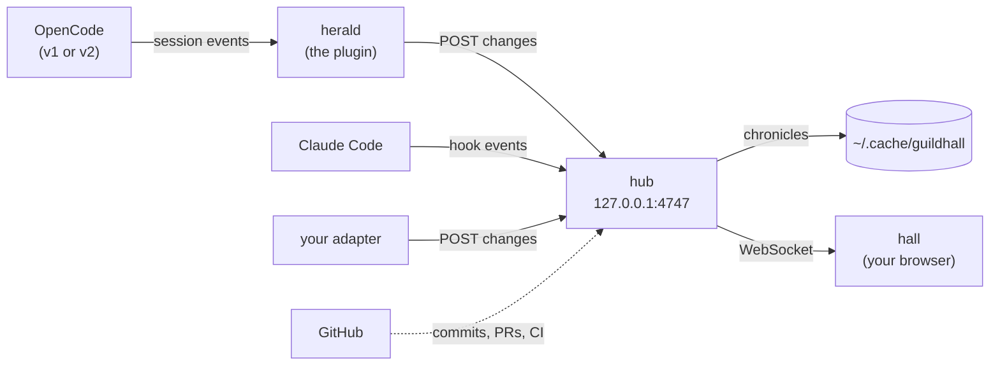

<h1 align="center">Guildhall</h1>

<p align="center">
  <strong>Events in. A living world out.</strong><br />
  Plug in any event stream (coding agents, GitHub, a repo's whole history, or your own) and watch it
  become a living 3D island: crowds, weather, ships, a director and a story. Live in your browser, at 60 fps.
</p>

<p align="center">
  <a href="https://guildhall.codestz.dev"><strong>See it live</strong></a> ·
  <a href="#what-can-feed-it">What can feed it</a> ·
  <a href="#try-it-live">Try it live</a> ·
  <a href="https://guildhall.codestz.dev/how">How&nbsp;it's&nbsp;built</a>
</p>

<p align="center">
  <a href="https://www.npmjs.com/package/opencode-guildhall"></a>
  <a href="LICENSE"></a>
  
</p>

<p align="center">
  
</p>

Guildhall is a 3D world engine for event streams. Whatever you plug in, each worker becomes an
adventurer on the island, each action a **deed** with its own sigil, and each call for help a
**plea**. The weather follows how things are going, ships sail in from GitHub, and a bard tells it
all as a story.

- **Any source.** OpenCode, Claude Code, GitHub, or your own through the open
  [world protocol](packages/core/PROTOCOL.md). A repo's whole history is next.
- **A world that tells the story.** A director picks the camera shots, captions narrate as it
  happens, the Legends book and recaps keep it, and the guild makes music as it works.
- **A repo becomes a world.** A public repo's file tree grows into an island with mountain ranges,
  rivers, lakes, forests, towns, a castle and buildings your agents walk into.
- **Built to scale.** 300 adventurers in 143 draw calls, an experimental WebGPU renderer, and
  archipelagos of repos. The numbers are on [How it's built](https://guildhall.codestz.dev/how).
- **Honest by design.** Only real events move the world, and nothing is faked. The public site
  plays recorded and simulated stories, and says so.

## What can feed it

| Source | What you see | Quick start |
|---|---|---|
| [OpenCode](#opencode) | Every session an adventurer, plus nine guild agents to work with | Add the plugin to `opencode.json` |
| [Claude&nbsp;Code](#claude-code) | Every session and subagent, in the same hall | Install once, merge the printed hooks |
| [GitHub&nbsp;seas](#github-seas) | Commits, pull requests, CI and releases as ships | Automatic when a project's remote is on GitHub |
| [Repo&nbsp;islands](#repo-islands-and-archipelagos) | A public repo's file tree grown into a world, or several as an archipelago | `?repo=owner/name` or `?archipelago` |
| Git&nbsp;history | A repo's whole history played as a story (Repo Chronicle) | Coming |
| [Your&nbsp;own](#your-own) | Anything that can POST JSON: deploys, services, jobs | The [world protocol](packages/core/PROTOCOL.md) |

The OpenCode plugin and the Claude Code hook ship in one npm package, `opencode-guildhall`. The
npm package keeps its original name for now.

<a id="install"></a>

### OpenCode

Add the plugin to `opencode.json`, restart OpenCode, and open <http://127.0.0.1:4747>.

```jsonc
{ "plugin": ["opencode-guildhall"] }
```

That's OpenCode 1.18 or later. On OpenCode 2.0.18 or later, use `"plugins"`, or run
`opencode plugin add opencode-guildhall`. Pick **guild-master** with Tab (shift+tab on v2), and the
hall follows every OpenCode window you have open. Ports, options and upgrade notes are in the
[plugin README](packages/opencode-guildhall/README.md).

### Claude Code

Install the package once, then print the hooks block and merge it into `~/.claude/settings.json`
(every project) or a project's `.claude/settings.local.json`:

```sh
npm install -g opencode-guildhall
opencode-guildhall claude-code --print
```

The command only prints; it never edits your settings. The hook runs on every Claude Code event,
says nothing back to Claude, and always lets it carry on. It starts the hub the first time it's
needed (with Bun from your PATH, or Node without it), so open <http://127.0.0.1:4747> once a
session is going. Each project is its own guild, and a project open in both OpenCode and Claude
Code shares one. A global install keeps the hook's path stable: `npx` and `bunx` run from a cache
that gets cleared.

### GitHub seas

When a project's remote is on GitHub, the hub watches it and the sea fills with ships: commits and
pull requests sail in, the lighthouse burns steady while CI passes and pulses red when it fails, and
a release arrives as a galleon. It uses `gh auth token` if the GitHub CLI is installed and logged in
(public repos are watched without a token, less often). The token is read when needed and never
stored. Set `GUILDHALL_GITHUB=0` to turn the watch off.

### Repo islands and archipelagos

Add `?repo=owner/name` to the hall's URL and your browser reads that public repo's file tree from
GitHub and grows a world from it. `?archipelago` sets several side by side, or name your own with
`?repos=a/b,c/d`. The **Your repo as an island** door in the hall does the same.

<p align="center">
  
</p>

The island is one landmass sized by the repo's files, so a big repo reads as big. What grows on it
follows the repo's shape:

- **Land and water.** Mountain ranges stand inland, with ledged flanks and rocky summits. Rivers run
  down them to valley lakes and the sea, and forests thin out to a treeline.
- **Towns and castles.** Each folder becomes a district with its own square, and big repos earn a
  castle. They are built from a catalogue of prefabs; `?lab=prefabs` is a sandbox to browse them,
  with seeded variants.
- **Places to visit.** A forge, library, tavern, mine, watchtower and market stand in their
  districts. Agents walk in to do the matching work (edit at the forge, read at the library, test at
  the watchtower, plan at the tavern), and the windows glow while someone is inside.
- **Island life.** Townsfolk keep a day: home at night, then out to work, the plaza at dusk. Guards
  walk the walls, traders push barrows, fishers cast from the quay and animals graze. Trails climb
  the mountains in switchbacks, and a Scout searching may hike to a lookout.
- **Growth film.** `?grow` replays the repo's history, and the town now builds in stages: plots,
  frames, walls, roofs, then the castle once the repo is big enough.
- **Light and distance.** Cascaded shadows, a low sun that throws the ranges' shadows across the
  land, a touch of haze in the distance, and real shadows under characters, on WebGL and WebGPU.

The world generator runs in a Web Worker, so growing React's island no longer freezes the page (a
1.1 s stall became about 95 ms). An archipelago with React and far islands around it runs at 97 fps at High.
`?gen=1` brings back the earlier, simpler islands.

### Your own

Anything that can send JSON to `127.0.0.1:4747` can be a source. The
[world protocol](packages/core/PROTOCOL.md) has the vocabulary, the wire format and an adapter in
30 lines. From a clone, run the hub with `bun packages/hub/src/main.ts`, start the hall with
`bun run dev`, and add `?live` to its URL.

## Try it live

[guildhall.codestz.dev](https://guildhall.codestz.dev) plays a simulated guild, with nothing to
install. A few links straight into a scene:

- [`?story=seas`](https://guildhall.codestz.dev/?story=seas): a party's run with its GitHub sea
  beside it, from the first push to the release.
- [`?repo=facebook/react`](https://guildhall.codestz.dev/?repo=facebook/react): a world grown
  from a public repo's file tree. Any `owner/name` works. Add `&grow` to watch it build.
- [`?archipelago`](https://guildhall.codestz.dev/?archipelago): several repos as islands, side by
  side.
- [`?story=rush&n=300`](https://guildhall.codestz.dev/?story=rush&n=300): a crowd of 300
  adventurers (1 to 500).
- [`?renderer=webgpu`](https://guildhall.codestz.dev/?renderer=webgpu): the experimental WebGPU
  renderer, where the browser has it. **Settings › Renderer** switches it in the hall.

## Watch it work

<p align="center">
  
  <br /><sub><a href=".github/media/saga-loop.mp4">Watch the loop as MP4</a></sub>
</p>

<table>
  <tr>
    <td colspan="2">
      
      <p><strong>Real work, real places.</strong> Each role has a trade. Explorers chop wood while they
      search your code, researchers fish while they read the web, verifiers shoot at targets while your
      tests run, and implementers raise a building in the yard as they write. Logs, fish and arrows
      pile up as the deeds finish.</p>
    </td>
  </tr>
  <tr>
    <td colspan="2">
      
      <p><strong>A living island.</strong> Day and night follow your clock (or a fixed hour), and the
      weather follows the share of recent deeds that failed. A busy guild runs warm; a guild left
      quiet for a long time turns cold.</p>
    </td>
  </tr>
  <tr>
    <td width="50%">
      
      <p><strong>The graveyard.</strong> A failed session rises as a skeleton and keeps vigil until it
      recovers. Failed deeds raise minions that crumble away.</p>
    </td>
    <td width="50%">
      
      <p><strong>Captions and Legends.</strong> The bard narrates as it happens. The Legends book tells
      each quest chapter by chapter, with deeds, loot, tokens and cost, and copies out as text.</p>
    </td>
  </tr>
  <tr>
    <td colspan="2">
      
      <p><strong>Parties, pleas and the chronicle.</strong> Several conversations at once become
      separate parties, each under its own banner. A permission request shows up as a plea you can
      open. The chronicle lists every deed, and the timeline lets you scrub through the whole session.</p>
    </td>
  </tr>
</table>

**A cinematic director.** With the bard on, the camera picks its own shots: establishing views,
follows, close-ups, two-shots. It cuts to whatever matters most, and a plea outranks everything.
In replays it fast-forwards through the quiet stretches. Take the camera back any time.

**Sound.** Every deed plays a note in a key that follows the mood (minor at night), over a bed of
wind, rain, sea, fire and night insects. It is synthesized in the browser, apart from a few
recorded effects. Sound is off until you turn it on.

**GitHub seas.** Ships for commits and pull requests, a lighthouse for CI and a galleon for each
release. [More above](#github-seas).

**Townsfolk.** Farmers, a fisher, merchants, gate guards, children and a graveyard keeper go about
their day around the guild.

**Secret events.** The island answers rare moments in your work. A clean quest earns a festival.
A long run that ends in a fall may bring a ghost ship out of the mist. There are more: a rainbow,
pirates, comets, a dragon. Each has its own trigger, and they're more fun to find than to read
about.

<p align="center">
  
</p>
<p align="center">
  
</p>

## How it works



Every source is turned into one small vocabulary of **changes**: sessions, deeds, pleas and
replies. The **herald** does it inside OpenCode, the Claude Code hook does it from Claude Code's
hook events, and your own adapter can do it from anything. They all send to the **hub**, a tiny
local server that the herald or the hook starts the first time it's needed. The hub records each
session as a chronicle on disk, watches GitHub for the sea, and serves the **hall**, a React Three
Fiber app that turns the stream into the island. The hall reads only changes, so it can't tell which source a
guild came from. The [world protocol](packages/core/PROTOCOL.md) has the details.

## How it's built

[How it's built](https://guildhall.codestz.dev/how) is the long read: 300 adventurers in 143 draw
calls (down from 1,226), WebGL against WebGPU measured honestly, the TSL gotchas, repos grown into
islands and GitHub as a sea. Every number is measured, and every section ends in a live link.

## The guild

For OpenCode, the plugin also gives you nine agents to work with. You talk to the **Guildmaster**.
It sizes your request, briefs the specialists, has their work checked by a verifier, and reports
back.

The world draws every actor as an **archetype**. The nine guild agents each map onto one, and so
does anyone from any other source:

| Archetype | Agent role | What it does | What it may do | Where it works |
|---|---|---|---|---|
| **Guildmaster** | Guildmaster (and the root of any party) | Talks to you, plans, briefs specialists, reports back | Read; shell asks first; may launch the eight specialists | Quest board in the keep |
| **Architect** | Architect (and Claude Code's `Plan`) | Designs the structure first: boundaries, plans, task contracts | Write Markdown under `docs/` only | Drafting table in the keep |
| **Artisan** | Implementer | Builds one bounded task: the code and its tests | Edit files; run the project's checks; any other command asks | Forge, then the construction yard |
| **Warden** | Verifier | Tries to prove the work wrong, returns a cited verdict | Read; run the checks; every other command is denied | Inspection bench, then the proving grounds |
| **Archivist** | Librarian | Library docs at your installed version, plus the project's decisions | Read and use the web | Library, then the wizard tower |
| **Scout** | Explorer (and Claude Code's `Explore`) | Maps your codebase | Read only | Map table, then the forest edge |
| **Scholar** | Researcher | Answers open questions from the web, with sources | Read and use the web | Map table, then the river bend |
| **Illuminator** | Designer | Designs and builds UI within your design system | Edit files; run the checks; any other command asks | Easel in the keep |
| **Herald** | Product owner | Turns a vague goal into a spec with testable criteria | Write Markdown under `docs/` only | Scroll desk in the keep |
| **Wanderer** | Any agent from outside the guild (OpenCode's `general`, Claude Code's `general-purpose`) | Whatever its own agent does | What its own host allows | The quarry |
| **Automaton** | A bot account (a GitHub app, `…[bot]`) | Automated work: CI, dependency updates | What its own host allows | The quarry |

The chips and the roster show the archetype, with the source's own name beneath it
(`Warden · verifier`); Settings → Names switches to the source's names alone. A source can also say
which archetype an actor is outright.

- **Permissions are enforced twice.** OpenCode's own rules: every agent starts from deny-all and
  gets back only what its job needs. "Checks" means an exact list of test, lint, typecheck and
  read-only git commands. Protected paths (your OpenCode config, `AGENTS.md`, `.git/` and others)
  can't be written by any agent. Then a pre-run guard in the plugin reads every shell line a guild
  agent runs, with a real shell parser, before it runs: the Verifier may only run those exact
  checks, and no agent may redirect output into a protected path, however the line is written. The [plugin README](packages/opencode-guildhall/README.md#permissions) has
  the full rules and their known limits.
- **Models.** By default no role sets a model: everyone runs on the one you picked, with any
  provider. If you want, map the `strong`, `standard` and `fast` tiers, or a single agent, to
  models of your choice.
- **Make them yours.** Your config overrides the plugin's, field by field.
  `npx opencode-guildhall eject` writes the prompts into `.opencode/agents/` for you to edit.
  `{ "agents": false }` turns the guild off and keeps only the hall.

## Privacy

Everything runs on your machine. The hub listens on `127.0.0.1` only and refuses events from web
pages and non-local origins. Chronicles are kept in `~/.cache/guildhall/chronicles/<project>/`.
They hold your prompts and code, so treat them like your shell history. Nothing is uploaded. The
outside requests are few: the hall's fonts, which your browser loads from Google Fonts; the GitHub
seas, where the hub asks api.github.com about your project's repo (`GUILDHALL_GITHUB=0` turns it
off); and `?repo=`, where your browser reads a public repo's file tree from GitHub. No session data
goes with any of them.

## Performance

60 fps is the bar, and the hall measures itself against it. On a Retina MacBook at the default High
tier the party scene runs well above it; the numbers, and how they're measured, are on
[How it's built](https://guildhall.codestz.dev/how). A few things keep it fast:

- Island tiles are instanced and placed props are batched per material. Mountains and far islands
  drop to coarser detail with distance, and repo worlds grow off the main thread. Each character's parts are
  merged into two skinned meshes, and big crowds draw from baked bone textures with mesh LOD.
- One shadow-casting sun, and its shadow map is redrawn only when something it covers changes: a
  few times every four seconds instead of every frame. Repo islands use cascaded maps, where the far
  cascade redraws only when the sun turns. Characters near the camera cast real shadows; the rest
  get cheap blob shadows.
- Outlines, mist, sun shafts and colour grading run in a single post-processing pass.
- Occasional layers, like the graveyard's undead, the ghost ship and a repo island's civic
  buildings, load the first time they're needed. Characters ship meshopt-compressed, 410 KB gzip
  lighter on first paint.
- Quality adapts on its own across three tiers. An Ultra tier with a tilt-shift miniature look is
  there if you choose it.
- Where the browser has WebGPU, **Settings › Renderer** switches to an experimental WebGPU
  renderer. WebGL stays the default.

## Develop

Needs [Bun](https://bun.sh) 1.3.5 or later.

```sh
bun install
bun run dev          # the hall, with simulated stories (Settings › Story)
bun test             # unit tests
bun run check        # lint, typecheck and tests
```

To watch real sessions while developing, run the hub with `bun packages/hub/src/main.ts`, then add
`?live` to the hall's URL.

| Package | What it is |
|---|---|
| [`packages/opencode-guildhall`](packages/opencode-guildhall) | The published plugin: herald, hub and a built hall in one package, plus the `eject` and `claude-code` CLI |
| [`packages/herald`](packages/herald) | The OpenCode side: adds the agents, translates events, sends them to the hub |
| [`packages/claude-code`](packages/claude-code) | The Claude Code side: a hook that translates Claude Code's events and sends them to the hub |
| [`packages/hub`](packages/hub) | The local server: takes events, keeps chronicles, serves the hall over WebSocket |
| [`packages/hall`](packages/hall) | The 3D world and HUD: `scene/`, `guild/` (state, story, director), `hud/`, `audio/` |
| [`packages/roster`](packages/roster) | The nine roles: prompts, permissions, model tiers, and how each looks and where it works |
| [`packages/core`](packages/core) | The shared event model, and the translators for OpenCode 1 and 2 |
| [`packages/sim`](packages/sim) | Scripted demo stories (`solo`, `party`, `rush`, `parties`) and their player |

<details>
<summary><strong>Building the 3D assets</strong></summary>

The web-ready models in `packages/hall/public/assets/` are committed, so you only need this to
change them. `bun scripts/assets.ts` turns the original packs into compressed `.glb` files: it
prunes them, shares one animation rig between all the characters, merges the meshes and applies
meshopt compression.

The source packs aren't in the repo. Download the free versions from
[KayKit on itch.io](https://kaylousberg.itch.io/) (Adventurers 2.0, Character Animations 1.1,
Dungeon Pack 1.1, Furniture Bits, RPG Tools Bits, Fantasy Weapons Bits, Medieval Hexagon Pack,
Forest Nature Pack, Restaurant Bits, Skeletons 1.1, Halloween Bits) and Kenney's
[Pirate Kit](https://kenney.nl/assets/pirate-kit). Put the zips in `assets/raw/` and unzip each one
into `assets/src/<zip name>/`. Then run `bun scripts/assets.ts` for everything, or name some
outputs: `bun scripts/assets.ts forest lands`.

</details>

## Credits

- 3D models and animations by **Kay Lousberg**, [KayKit](https://kaylousberg.itch.io/), under
  [CC0 1.0](https://creativecommons.org/publicdomain/zero/1.0/). From the free tiers of Character
  Pack: Adventurers 2.0, Character Animations 1.1, Dungeon Pack 1.1, Furniture Bits, RPG Tools Bits,
  Fantasy Weapons Bits, Medieval Hexagon Pack, Forest Nature Pack, Restaurant Bits, Skeletons 1.1
  and Halloween Bits.
- Sound effects by **Kenney**, [kenney.nl](https://kenney.nl/), under
  [CC0 1.0](https://creativecommons.org/publicdomain/zero/1.0/): a curated subset of
  [RPG Audio](https://kenney.nl/assets/rpg-audio) and [Impact Sounds](https://kenney.nl/assets/impact-sounds).
  The notes and ambience are synthesized in the browser.
- Ships by **Kenney**: [Pirate Kit](https://kenney.nl/assets/pirate-kit), under
  [CC0 1.0](https://creativecommons.org/publicdomain/zero/1.0/).
- Built with [three.js](https://threejs.org), [React Three Fiber](https://r3f.docs.pmnd.rs) and the
  pmndrs ecosystem (drei, postprocessing), for [OpenCode](https://opencode.ai).
- The event translators come from opencode-cockpit, and the agent prompts are adapted from Agentry.

The full asset list is in [`packages/hall/public/assets/CREDITS.md`](packages/hall/public/assets/CREDITS.md).

## License

[MIT](LICENSE) © 2026 Codestz. The bundled assets are CC0, as credited above.
