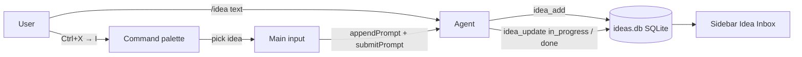

# opencode-idea-inbox

[](./LICENSE)
[](https://opencode.ai)

**English** | [Русский](./README.ru.md)

An [opencode](https://opencode.ai) plugin that gives your TUI a persistent idea
backlog: capture a stray thought mid-conversation without losing focus, watch
it live in the sidebar, then dispatch it to work from the command palette —
into the current window or a background session.

```text
mid-dialog ──/idea "add cache"──▶ ○ pending ──palette: Ctrl+X → I──▶ ◐ in_progress ──▶ ● done ──▶ ✓ archived
```

## Features

- **Frictionless capture** — `/idea <text>`, the `✚ New idea…` palette entry, or `Ctrl+X → Z` (`<leader>z`, a model-free dialog that writes straight to the backlog); you stay in your current task
- **Sidebar panel** — live `Idea Inbox (n)` slot with status glyphs `○ ◐ ● ✓`, refreshed every 2 seconds
- **Native dispatch from the palette** — `Ctrl+X → I` opens the command palette with your pending ideas first in Suggested; picking one injects a delegation mission into the main window and starts execution immediately
- **Delete mode & clear** — prune the backlog from the palette: `🗑 Delete idea…` removes items one by one, `✖ Clear list` drops all active ideas (the `documented` archive stays)
- **Agent-driven statuses** — the orchestrator marks an idea `in_progress` at launch and `done` when finished (via the `idea_update` tool), with a `session.idle` safety net
- **Background alternative** — `/ideas start <id>` runs an idea in a detached session with agent `build`
- **Persistent** — SQLite storage (WAL) per worktree, survives restarts; archived ideas stay queryable as history

## Requirements

- opencode **1.18.31** or later (plugin API: `keymap.registerLayer`, `dispatchCommand`, sidebar slots, `tui.appendPrompt`/`submitPrompt`; the `Ctrl+X → Z` capture dialog needs 1.18.31 — on 1.18.30 plugin dialogs do not receive Enter)
- Runtime dependencies (`@opencode-ai/*`, `@opentui/*`, `solid-js`) are installed automatically with the npm package

## Installation

Add the plugin to `~/.config/opencode/opencode.json` (or your project's `opencode.json`):

```json
{
  "plugin": [
    "opencode-idea-inbox"
  ]
}
```

Add the TUI part to `~/.config/opencode/tui.json` — same bare name, no subpath:

```json
{
  "plugin": [
    "opencode-idea-inbox"
  ]
}
```

opencode installs the package from npm on the next start. Slash commands are not
shipped by the plugin loader — copy the two markdown files manually:

```bash
mkdir -p ~/.config/opencode/command
curl -fsSL -o ~/.config/opencode/command/idea.md https://raw.githubusercontent.com/apilot/opencode-idea-inbox/master/commands/idea.md
curl -fsSL -o ~/.config/opencode/command/ideas.md https://raw.githubusercontent.com/apilot/opencode-idea-inbox/master/commands/ideas.md
```

<details>
<summary>Installing from a local clone (development)</summary>

```bash
git clone https://github.com/apilot/opencode-idea-inbox.git ~/opencode-idea-inbox
```

```json
{ "plugin": ["file:///home/YOU/opencode-idea-inbox"] }
```

```json
{ "plugin": ["file:///home/YOU/opencode-idea-inbox/tui"] }
```

```bash
cp ~/opencode-idea-inbox/commands/*.md ~/.config/opencode/command/
```

</details>

Add `.opencode/idea-inbox/` to your project `.gitignore` (the SQLite DB lives there).

Restart opencode — config is not hot-reloaded.

## Quick Start

1. Type `/idea add response caching for the provider` — the agent parks it: `✓ idea_ab12cd — add response caching…`
2. Press `Ctrl+X → I` — the palette opens with your pending ideas at the top of Suggested
3. Hit `Enter` on an idea — a mission lands in the main window ("delegate this, use the right skills…"), execution starts immediately and the idea becomes `◐`
4. Watch the sidebar (`Ctrl+X → B` to toggle it): `○ → ◐ → ●` as work progresses
5. When the orchestrator finishes, it marks the idea `● done`; document results with `/ideas documented <id>` and the row leaves the panel

## Usage

### Keyboard

| Action | Binding |
| ------ | ------- |
| Open palette with the backlog | `Ctrl+X → I` (`<leader>i`; ideas first in Suggested, then `✚ New idea…`) |
| Model-free capture dialog | `Ctrl+X → Z` (`<leader>z`) |
| Toggle the sidebar | `Ctrl+X → B` (`<leader>b`) |

The leader key defaults to `Ctrl+X` (`leader_timeout` 2000 ms — press the follow-up key within 2 seconds).

### Slash commands

| Command | Effect |
| ------- | ------ |
| `/idea <text>` | Capture an idea to the backlog |
| `/ideas` | Show the active backlog table |
| `/ideas run <id>` | Execute an idea in the current session |
| `/ideas start <id>` | Launch an idea in a background session (agent `build`) |
| `/ideas done <id>` · `/ideas documented <id>` | Change status; `documented` archives the row |

### Agent tools

| Tool | Purpose |
| ---- | ------- |
| `idea_add` | Add an idea from dialog context |
| `idea_list` | List active (or filtered) ideas |
| `idea_update` | Change status/text; `documented` hides from the panel |
| `idea_start` | Create a background session with a mission prompt |

### Statuses

| Status | Glyph | Meaning | Set by |
| ------ | ----- | ------- | ------ |
| `pending` | `○` | Captured, waiting for dispatch | User (capture), server (rollback) |
| `in_progress` | `◐` | Running in the current or a background session | Orchestrator (mission `idea_update`) or `idea_start` |
| `done` | `●` | Finished — the orchestrator reported completion | Orchestrator (`idea_update`) or `session.idle` |
| `documented` | `✓` | Result documented → hidden from the panel, kept in the DB | Working agent or user |

## How it works



The palette path avoids a known upstream issue: in opencode ≤ 1.18.30 dialogs
opened from TUI plugins do not receive keyboard input
([#22610](https://github.com/sst/opencode/issues/22610), closed as not planned).
On 1.18.31 `DialogPrompt` Enter works, which is what the `Ctrl+X → Z` capture
dialog builds on; everything else rides on palette commands, prompt injection,
and the sidebar slot.

## Limitations

- opencode 1.18.31 specifics: the search field of a programmatically opened palette may not accept keys — the Suggested list is the primary interface (ideas are always registered first)
- The sidebar does not auto-open on plugin content (`auto` mode is tied to native todos) — toggle it once with `Ctrl+X → B`
- Only `pending` ideas are offered in the palette

## Development

```bash
bun install
bun run typecheck   # tsc --noEmit
bun test            # store unit tests
```

Source layout: `src/store.ts` (SQLite core), `src/server/` (tools + session events), `src/tui/` (palette commands, sidebar slot, worktree resolver), `commands/` (markdown slash commands).

## Contributing

Issues and PRs are welcome at <https://github.com/apilot/opencode-idea-inbox>.

## License

[MIT](./LICENSE)
