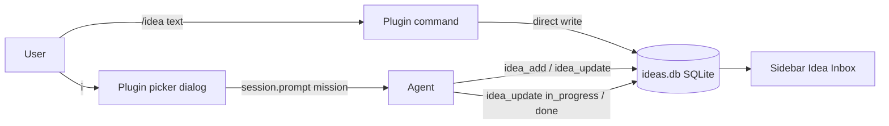

# opencode-idea-inbox

[](./LICENSE)
[](https://opencode.ai)
[](https://www.npmjs.com/package/opencode-idea-inbox)

**English** | [Русский](./README.ru.md)

You're twenty minutes deep in a refactor when a completely unrelated thought
shows up: *"...I should really try caching provider responses."*

Traditionally there are three outcomes: you type it into the chat and derail
the agent, you switch to a notes app and lose your terminal focus, or you're
sure you'll remember it later (you won't).

This plugin is a fourth option. Press `<leader>z`, type the thought, hit
Enter — it's parked in a backlog that lives in your opencode sidebar, and you
never left the task you were on. When you have a free moment, press
`<leader>i`, pick an idea, and it gets dispatched to an agent while you watch
its status tick over:

```text
○ parked  →  ◐ running  →  ● done  →  ✓ documented
```

The sidebar mid-session looks like this:


<details>
<summary>▶ Watch the full loop — capture an idea, dispatch it, watch it finish (GIF, ~10 s)</summary>


</details>

## Which version do I need?

There are two lines of this package, one per major version of opencode:

| Your opencode              | Install                            | Where it lives |
| -------------------------- | ---------------------------------- | -------------- |
| **v2** (≥ 2.0.20)         | `opencode-idea-inbox` (`latest`)   | branch [`master`](https://github.com/apilot/opencode-idea-inbox/tree/master) (default) |
| **v1**                    | `opencode-idea-inbox@legacy-v1` (currently 0.3.5) | branch [`legacy-v1`](https://github.com/apilot/opencode-idea-inbox/tree/legacy-v1) |

Not sure what you're running? Check `opencode --version`.

> **The #1 "it doesn't load" cause:** opencode **v2** reads the `plugins` key
> (plural) and silently ignores the v1 `plugin` key. If nothing shows up after
> install, look at that key first.

## Installation

Add one line to your `opencode.json` / `opencode.jsonc` — global
(`~/.config/opencode/opencode.json`) or per-project:

```jsonc
{
  "$schema": "https://opencode.ai/config.json",
  "plugins": ["opencode-idea-inbox"]
}
```

That's the whole setup. The package exports both halves — the server part
(tools, slash commands, session events) and the TUI part (palette commands,
sidebar) — and opencode v2 loads them together. There is no `tui.json` to
create; that file only existed in v1, and the `/idea`, `/ideas` commands are
registered by the plugin itself, so there's nothing to copy around either.

For opencode **v1**, the same key in the v1 format:

```jsonc
{ "plugin": ["opencode-idea-inbox@legacy-v1"] }
```

Restart opencode afterwards — the config is not hot-reloaded — and verify with
`opencode plugin list`. If the sidebar panel isn't visible yet, toggle it once
with your sidebar keybind; the plugin never force-opens it.

<details>
<summary>Installing from a local clone (development)</summary>

```bash
git clone https://github.com/apilot/opencode-idea-inbox.git ~/opencode-idea-inbox
```

Point `plugins` at the directory:

```jsonc
{ "plugins": ["file:///home/YOU/opencode-idea-inbox"] }
```

Relative paths work too (`"./plugins/idea-inbox"`); the root-level `server.ts`
/ `tui.ts` re-exports make local-directory loading work on v2.

</details>

## Your first five minutes

1. Type `/idea try caching provider responses` — the thought is parked
   instantly (a direct write, no model round-trip) and appears in the sidebar
2. Press `<leader>i` — a picker opens with your pending ideas on top
3. Hit `Enter` on one — a delegation mission lands in the current session and
   execution starts immediately; the idea turns `◐`
4. Watch the sidebar: `○ → ◐ → ●` as the work progresses
5. When the agent finishes it marks the idea `● done`; run
   `/ideas documented <id>` once you've written the results down, and the row
   leaves the panel for the archive

## Everyday use

### Keyboard

| Action | Binding |
| ------ | ------- |
| Open the backlog picker | `<leader>i` (command `idea-inbox.open`) |
| Quick capture dialog (no model involved) | `<leader>z` (command `idea-inbox.capture`) |
| Remove one idea | `idea-inbox.remove` (palette only, picker dialog) |
| Clear the visible list | `idea-inbox.clear` (palette only, asks for confirmation; the `documented` archive stays) |
| Show/hide the sidebar | your opencode sidebar toggle |

All commands have stable ids (`idea-inbox.open`, `idea-inbox.capture`,
`idea-inbox.remove`, `idea-inbox.clear`, `idea-inbox.take.<id>`) — rebind them
via `keybinds` in your `cli.json` if the defaults clash.

### Slash commands

| Command | Effect |
| ------- | ------ |
| `/idea <text>` | Park an idea (direct write; with no text, the agent asks you what to write down) |
| `/ideas` | Show the active backlog table |
| `/ideas run <id>` | Execute an idea in the current session |
| `/ideas start <id>` | Run an idea in a background session (agent `build`) |
| `/ideas done <id>` · `/ideas documented <id>` | Change status; `documented` archives the row |

### What the agent sees

The plugin registers four tools your agents can call:

| Tool | Purpose |
| ---- | ------- |
| `idea_add` | Add an idea from conversation context |
| `idea_list` | List active (or filtered) ideas |
| `idea_update` | Change status or text; `documented` hides from the panel |
| `idea_start` | Spawn a background session with a mission prompt |

### Status lifecycle

| Status | Glyph | Meaning | Who sets it |
| ------ | ----- | ------- | ----------- |
| `pending` | `○` | Parked, waiting for dispatch | You (capture) or the server (rollback) |
| `in_progress` | `◐` | Running in the current or a background session | The orchestrator (mission `idea_update`) or `idea_start` |
| `done` | `●` | The agent reported completion | The orchestrator, or the `session.idle` safety net |
| `documented` | `✓` | Results written down → hidden from the panel, kept in the DB | You or the working agent |

## FAQ

**Where is my data stored?**
In `<worktree>/.opencode/idea-inbox/` — a plain SQLite database `ideas.db`
(WAL mode) plus `diag.log`, the plugin's diagnostic log. Both live one per
git worktree and survive restarts. Add `.opencode/idea-inbox/` to your
project's `.gitignore`.

**I ran `/idea <text>` and the chat stayed silent. Did it work?**
Yes — with text present the command writes straight to the backlog without a
model round-trip, so there's no reply in the chat. Check the sidebar or run
`/ideas`.

**The sidebar is empty even though I have ideas.**
The panel refreshes every ~2 seconds and never force-opens itself — toggle it
once with your sidebar keybind.

**Something is off — where can I look for clues?**
The TUI part appends what it does to
`<worktree>/.opencode/idea-inbox/diag.log` (registrations, refresh ticks,
errors; rotated at ~128 KB). The file is safe to delete at any time.

**Can I rebind `<leader>i` / `<leader>z`?**
Yes — see the command ids above and the `keybinds` section of your `cli.json`.

**Why does the picker only show pending ideas?**
By design: `done` and `documented` rows are history. `/ideas done` /
`/ideas documented <id>` manage them.

**Is it safe to hand idea text to agents?**
Idea text is always wrapped in `<<< >>>` data guards in mission prompts, so a
note that happens to contain instructions can't hijack the delegation.

## How it works


```mermaid
flowchart LR
    U[User] -- "/idea text" --> CMD[Plugin command]
    CMD -- "direct write" --> DB[(ideas.db SQLite)]
    AG[Agent] -- "idea_add / idea_update" --> DB
    U -- "<leader>i" --> PICK[Plugin picker dialog]
    PICK -- "session.prompt mission" --> AG
    AG -- "idea_update in_progress / done" --> DB
    DB --> SB[Sidebar Idea Inbox]
```

The server half (`Plugin.define({ id: "idea-inbox" })`, exported from the
package root) registers the tools, the `/idea` + `/ideas` commands, and settles
statuses on `session.idle` / `session.deleted`. The TUI half (exported at
`./tui`) renders the sidebar slot and the reactive palette layer; both state
stores come from the host-owned solid runtime, so the panel updates live.

## Development

```bash
bun install
bun run typecheck   # tsc --noEmit (src + tests)
bun test            # full suite: store, tools, server, commands, TUI, live render
```

Source layout: `src/store.ts` (SQLite core), `src/server/` (tools, slash
commands, session events), `src/tui/` (palette commands, sidebar slot,
worktree resolver), `commands/` (legacy v1 markdown commands, kept for
reference).

Issues and PRs are welcome at
<https://github.com/apilot/opencode-idea-inbox>.

## License

[MIT](./LICENSE)
