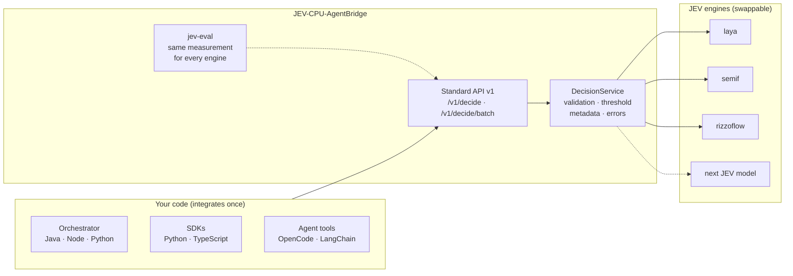

<p align="center">
  
</p>

<p align="center">
  <strong>One standard API for JEV decision models.</strong><br>
  A bridge between your agents and the JEV family of local, CPU-only decision engines:
  one contract, pluggable engines, the same way to measure them all.
</p>

<p align="center">
  
  
  
  
  <a href="https://github.com/GiskardB/jev-agentbridge/actions/workflows/ci.yml"></a>
</p>

---

## What this is

**JEV models** are small local models built to *choose* rather than *write*. Given some
evidence, a question and 2–16 options, they score the options in a single forward pass and
return a probability for each. They need no text generation, no GPU and no external API. The
family is young and moving fast: [semif](#engines) (a causal LM scored on option letters),
[Laya](https://github.com/NandhaKishorM/laya) (non-autoregressive encoders) and
[RizzoFlow](https://github.com/Rizzo-AI-Academy/rizzo-flow) (llama.cpp GGUF models) each come
with their own API, input format and definition of "confidence".

**JEV-CPU-AgentBridge is the standardization layer in front of them.** Your agents integrate
once, against one versioned REST contract (`/v1/decide`), SDKs and error model. Each JEV engine
plugs in behind it as an adapter. When a better JEV model appears, you swap the engine (an image
tag or one environment variable) and re-measure it with the bundled evaluation tools. Your code
does not change.



## What the bridge standardizes

Wiring the engines directly means handling their differences in every client. The bridge
removes them. These are real differences found while building the adapters:

| Concern | Engines as they come | Through the bridge |
|---|---|---|
| Request | Letters A–P in a prompt (semif), a `criteria` dict (Laya), a `questions` payload (RizzoFlow) | One request: `state`, `question`, `options[{id, description}]` |
| Probabilities | Keyed by letter (semif) or by option id (Laya, RizzoFlow) | Always one probability per **option id**, in request order |
| "Confidence" | Laya's `confidence` is 1 − normalized entropy; for example p = 0.64 comes back as 0.056 | `selected_probability` is always the chosen option's probability |
| Acceptance | Each engine had its own threshold logic, or none | One policy: `accepted = selected_probability ≥ threshold`, per request, per batch item or as the service default |
| Errors | Python exceptions, HTTP errors, timeouts | One envelope `{"error": {code, message, request_id}}` with stable codes (`ENGINE_UNAVAILABLE`, `INPUT_TOO_LARGE`, ...) |
| Batch | KV-cache prefix reuse (semif), multi-question calls (Laya, RizzoFlow) | One `/v1/decide/batch`; each engine uses its native shared path |
| Metadata | Engine-specific | Stable core (`engine`, `model`, `mode`, `latency_ms`); engine-specific data under `engine_details` |
| Quality | Each project publishes its own benchmark, on its own hardware | `jev-eval` and the evaluation suites measure every engine the same way, on your data |

## What it is not

The bridge does not make a JEV model smarter. Decision quality is the engine's quality, and
today's JEV models are still far from a general LLM on anything but simple choices. Measured on
this repo's [model-routing evaluation](examples/eval/model_routing/) (240 labelled requests,
choose the small / medium / large LLM tier):

| Configuration | Accuracy | English | Italian | Requests routed alone at ≥ 95% accuracy |
|---|---|---|---|---|
| LLM baseline (qwen3-32b, for reference) | **96.2%** | 95.8% | 96.7% | n/a |
| laya, English model (default engine) | 59.6% | 70.0% | 49.2% | 12.1% |
| semif, prompt v2 | 51.7% | 56.7% | 46.7% | 0% |
| semif, prompt v1 | 37.5% | 41.7% | 33.3% | 7.1% |
| laya, multilingual model | 34.6% | 37.5% | 31.7% | 0% |

On short, closed decisions (retry / rollback / escalate, ticket triage) the engines did better:
laya scored 83.3% on the 12-row English sample and 75% on the Italian one. Every figure,
with its caveats, is in [docs/performance.md](docs/performance.md#accuracy-and-threshold).

This is why the bridge exists as a separate, stable layer. Build the integration and the
measurement now, use JEV only where `jev-eval` shows it is reliable, and let each new JEV model
earn more traffic by passing the same tests.

## Engines

| Image tag | `JEV_ENGINE` | Engine | Notes |
|---|---|---|---|
| `:latest` / `:laya` | `laya` (default) | [Laya](https://github.com/NandhaKishorM/laya) non-autoregressive encoders, in-process | `JEV_LAYA_SUBFOLDER=multilingual` (measured) or `typed-decisions` (not yet measured) selects another Laya model |
| `:semif` | `semif` | Qwen3-0.6B causal LM, next-token scoring of option letters, in-process | `JEV_SEMIF_PROMPT_VERSION=direct-options-v2` scores better than the default v1 |
| `:rizzoflow` | `rizzoflow` | HTTP client to a separately run [RizzoFlow](https://github.com/Rizzo-AI-Academy/rizzo-flow) server (llama.cpp, Spark-X2.5 GGUF) | Set `JEV_RIZZOFLOW_URL`; works with any RizzoFlow-compatible server |

The engine is baked into each image, so the tag alone selects it (`-e JEV_ENGINE=...`
overrides it). Every engine runs on CPU. Latency depends heavily on hardware: measured p50 on
the routing evaluation was about 1 s for laya and 1.4 s for semif on the evaluator's machine,
and 0.35–0.5 s on a cloud CPU. Check yours with `python -m benchmarks.run --engine <name>`.

## Quick start

Requires Docker. Nothing to build:

```bash
docker run -p 8000:8000 ghcr.io/giskardb/jev-agentbridge:latest
```

The first start downloads the model (about 30–40 s with a good connection). Then:

```bash
curl -X POST http://localhost:8000/v1/decide \
  -H "Content-Type: application/json" \
  -d '{
    "state": "A deployment failed because the health check timed out.",
    "question": "What should happen next?",
    "options": [
      {"id": "retry", "description": "Retry the deployment"},
      {"id": "abort", "description": "Abort the deployment"}
    ],
    "min_selected_probability": 0.6
  }'
```

Example response (values are illustrative):

```json
{
  "decision": {"id": "retry", "description": "Retry the deployment"},
  "probabilities": {"retry": 0.81, "abort": 0.19},
  "selected_probability": 0.81,
  "accepted": true,
  "threshold": 0.6,
  "metadata": {"engine": "laya", "model": "convaiinnovations/laya", "model_revision": "main",
               "mode": "direct", "latency_ms": 340.2, "engine_details": {"...": "..."}}
}
```

The response has the same shape whatever the engine. `accepted: false` means "not confident
enough, decide yourself"; it does not mean "no". Other endpoints: `/v1/decide/batch` (several
decisions on one shared state), `/v1/info` (engine and contract version), `/health`, `/ready`.
OpenAPI is served at `/openapi.json`. Full reference: [docs/api.md](docs/api.md).

<details>
<summary>docker compose, or build from source</summary>

```bash
docker compose up          # pulls ghcr.io/giskardb/jev-agentbridge:latest
docker compose up --build  # builds from this checkout instead
```
</details>

## Using it: a gate in front of the LLM

Call the bridge from your orchestrator's code at decision points where you would otherwise call
an LLM only to pick an option. If JEV is confident, use its answer. If it is not, or if the
bridge is down, ask the LLM as before. The SDKs implement this pattern:

```python
from jev_agent_bridge import AgentBridgeClient

jev = AgentBridgeClient("http://localhost:8000", timeout=2.0)
outcome = jev.decide_or_fallback(
    state="Deployment failed because the health check timed out",
    question="What should happen next?",
    options=[{"id": "retry", "description": "Retry"}, {"id": "abort", "description": "Abort"}],
    min_selected_probability=0.85,
    fallback=lambda request: ask_llm(request),  # returns an option id
)
print(outcome.decision_id, outcome.source)  # "jev" or "fallback"
```

```ts
import { AgentBridgeClient } from "@jev-cpu/agentbridge";

const jev = new AgentBridgeClient("http://localhost:8000", 2_000);
const outcome = await jev.decideOrFallback(
  { state, question: "What should happen next?", options, min_selected_probability: 0.85 },
  async (request) => askLlm(request), // returns an option id
);
console.log(outcome.decisionId, outcome.source); // "jev" | "fallback"
```

It is plain JSON over HTTP, so Java or any other language needs no SDK; see
[docs/integration.md](docs/integration.md) for Node, Python and Java examples. Exposing JEV as a
tool that the LLM calls also works (see [Integrations](#integrations)), but it does not reduce
LLM cost: the LLM is already running when it emits the tool call.

## Measuring an engine before trusting it

The bridge ships the tools to decide, per decision type and per engine, whether JEV can be
trusted and at which threshold.

- **`jev-eval`**: runs any labelled JSONL dataset through a running bridge. For each threshold
  it reports *coverage* (the share of decisions JEV would take alone) and *accuracy* on those
  decisions, then recommends a threshold.

  ```bash
  jev-eval --dataset my-decisions.jsonl --url http://localhost:8000 --target-accuracy 0.97
  ```

- **[`examples/eval/model_routing/`](examples/eval/model_routing/)**: a complete evaluation
  suite, with 240 labelled Italian and English requests, a stdlib-only runner, an LLM-baseline
  scorer and step-by-step instructions that another agent can execute. The table in
  [What it is not](#what-it-is-not) comes from it. Use it as a template for your own decision
  types.

Run the same suite whenever you change engine, model or prompt version, and compare against
an LLM baseline.

## Adding a JEV engine

A new engine is one adapter implementing the `DecisionAdapter` port, which only has to *score*.
Validation, threshold, response shape, errors and batching are handled by the service.

1. Create `src/jev_cpu_agentbridge/adapters/<name>/adapter.py`: a config dataclass reading its
   own `JEV_<NAME>_*` variables, plus a class with `info()`, `is_ready()`, `score()` and
   `score_batch()` that returns one probability per option id.
2. Register it with one line in `adapters/registry.py`.
3. Add tests with a fake backend (see `tests/test_laya_adapter.py`).
4. Run `jev-eval` and the evaluation suites against it.

Nothing in the API, the SDKs or client code changes. Details:
[docs/architecture.md](docs/architecture.md#adding-a-new-engine).

## Integrations

| Integration | Status |
|---|---|
| Python SDK ([sdk/python](sdk/python/)) | `decide`, `decide_batch`, `decide_or_fallback` |
| TypeScript SDK ([sdk/typescript](sdk/typescript/)) | `decide`, `decideBatch`, `decideOrFallback`, typed `BridgeError` |
| OpenCode ([integrations/opencode](integrations/opencode/), npm [`opencode-jev-agentbridge`](https://www.npmjs.com/package/opencode-jev-agentbridge)) | `jev_decide` tool plus an auto-installed skill, verified against the real OpenCode CLI |
| LangChain, CrewAI, OpenAI and Anthropic tool use | Generic snippets below; not tested end to end |

<details>
<summary><strong>OpenCode</strong></summary>

1. Register the plugin in `opencode.json`: `{ "plugin": ["opencode-jev-agentbridge"] }`
2. Point it at your bridge: `JEV_CPU_AGENTBRIDGE_URL=http://localhost:8000`
3. On first load the plugin installs its skill into `.opencode/skills/`, which tells the agent
   when to use the `jev_decide` tool.

Full details, including how to install from this repo:
[integrations/opencode/README.md](integrations/opencode/README.md).
</details>

<details>
<summary><strong>LangChain / LangGraph, CrewAI</strong></summary>

```python
from langchain_core.tools import tool          # CrewAI: from crewai.tools import tool
from jev_agent_bridge import AgentBridgeClient

client = AgentBridgeClient("http://localhost:8000")

@tool
def jev_decide(state: str, question: str, options: list[dict]) -> dict:
    """Pick one of 2-16 known options with a local JEV model."""
    return client.decide(state=state, question=question, options=options)
```
</details>

<details>
<summary><strong>OpenAI function calling / Anthropic tool use</strong></summary>

Declare a `jev_decide` tool with this schema, which mirrors `POST /v1/decide`. When the model
calls it, forward the input to the bridge and return the JSON as the tool result.

```json
{
  "name": "jev_decide",
  "description": "Pick one of 2-16 known options with a local JEV model.",
  "parameters": {
    "type": "object",
    "properties": {
      "state": {"type": "string"},
      "question": {"type": "string"},
      "options": {
        "type": "array",
        "items": {"type": "object", "properties": {"id": {"type": "string"}, "description": {"type": "string"}}}
      }
    },
    "required": ["state", "question", "options"]
  }
}
```
</details>

## Releases & CI

- [SemVer](https://semver.org/) for the service; the HTTP contract is versioned separately in
  the path (`/v1`). History in [CHANGELOG.md](CHANGELOG.md).
- `ci.yml` runs lint and tests on every push and PR, and builds the image of every engine.
- `release.yml` publishes to
  [GitHub Container Registry](https://github.com/GiskardB/jev-agentbridge/pkgs/container/jev-agentbridge)
  on every `vX.Y.Z` tag. Each release produces `:X.Y.Z`, `:X.Y`, `:latest` and `:laya` for the
  default engine, and `-semif` / `-rizzoflow` suffixed tags (plus `:semif`, `:rizzoflow`) for
  the others.

## Documentation

- [Architecture](docs/architecture.md): layers, the adapter port, adding an engine
- [API reference](docs/api.md): the v1 contract and error codes
- [Integration guide](docs/integration.md): the gate pattern in Node, Python and Java
- [Performance and accuracy](docs/performance.md): latency benchmarks and every accuracy measurement

## License

MIT, see [LICENSE](LICENSE).
