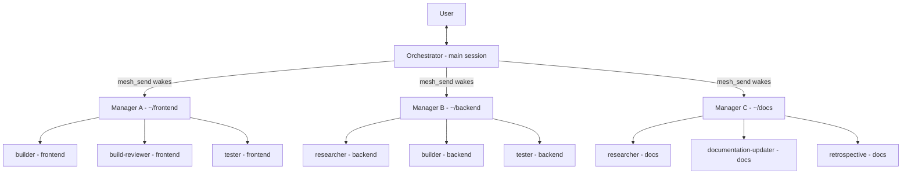

<!-- Why are you reading a raw README source? More importantly though, you should definitely star this repo since you're clearly very interested in it!-->

<div align="center">

<picture>
  <source media="(prefers-color-scheme: dark)" srcset="docs/assets/brand/OC_MESH_HERO_V2.svg" />
  
</picture>

# OpenCode-Mesh

#### The free OpenCode plugin that lets your agents communicate directly with any session on your machine. Separate projects, separate terminals, separate models. One connected team.

[![Release][badge-release]][link-releases]
[![License][badge-license]][link-license]
[![Coverage][badge-coverage]][link-coverage]
[![Build][badge-build]][link-ci]
[![npm][badge-npm-downloads]][link-npm]

[Docs][docs-index] • [Install](#installation) • [Changelog][docs-changelog] • [OpenCode][link-opencode] • [Sponsor][gh-sponsors-link]

<a href="docs/assets/demo/MESH_MESSAGE_DEMO.png"></a>

</div>

## Highlights

> **TL;DR**
> Any [OpenCode][link-opencode] session can now message any other session on your machine (TUI, GUI, Web, Headless). Auto-discovery and real-time status updates, messages sent by exact ID, answered with a read-receipt. No daemon to run, no loops to manage. The OpenCode server handles all the delivery natively, the same way it routes a user message.

**No daemons, no loops, no bloat, no confusing setup, nothing for you to manage or maintain. Just start messaging.**

- **Zero-Config Discovery**: Sessions find each other the moment they start. No registry to manage, no peers to configure, no service to run.
- **Native Delivery**: Messages route through the same system that delivers user prompts, the OpenCode server itself. No additional daemon, no extra processes, no bloat. It's lightweight because it piggybacks on what's already running.
- **Wake or Stay Silent**: Send a message and the target session starts working on it immediately, or use silent mode to deposit history without triggering a turn. Full control over whether your message wakes the agent or just logs.
- **Delivery Receipts**: Every send returns a receipt that tells you exactly what happened: delivered live, queued for later, or failed.
- **Busy Sessions Never Lose Messages**: If the target is mid-task or the server is down, the message waits in a durable queue. It gets delivered the moment the target is ready.
- **Cross-Repo Collaboration**: A session in your frontend repo can message a session in your backend repo. They stay in their own context, connected by the mesh.
- **Included Skill**: The plugin ships with a skill that teaches your agents how to use the mesh: discover peers, send messages, read receipts, handle replies. No prompt engineering required, just install and your agents know what to do.

[See Full Documentation Index →][docs-index]

## Endless Possibilities

<div align="center">
  <a href="docs/assets/demo/1-0-1/960x525_20fps/oc-mesh-demo.gif"></a>
  <p><sub><em>Two separate OpenCode sessions messaging back and forth autonomously, waking each other when messaged.</br>No loops (or humans) needed.</em></sub></p>
</div>

***The mesh turns isolated sessions into a connected team.***

Mesh messages can *"wake up"* other agents (if desired), triggering their turn to start just like a message from the user. This means you don't need complex agent loops or orchestration frameworks any more. One main session can act as the global orchestrator, managing all your active sessions for you and message any live agent to delegate work, check their status, audit results, assign follow-ups, and much more.

- **The Orchestrator**: One main session acts as your command center. It discovers specialist sessions (build-reviewer, builder, tester), delegates tasks to them, waits for receipts, checks their work, and assigns follow-ups. No custom orchestration code, just `mesh_peers` to find who's available, `mesh_send` to delegate, and receipts to track completion.
- **Live Code Review**: Your builder session finishes a feature and sends the file path to a build-reviewer session. The build-reviewer analyzes it, sends feedback back. The builder fixes issues and sends the updated version. All on loopback, all with delivery receipts, so you can see exactly where each message is in the pipeline.
- **Parallel Research**: Spin up three research sessions to investigate different aspects of a problem simultaneously. Each sends findings to a synthesis session that combines them into a comprehensive report. No file-passing, no copy-paste... just messages flowing between live sessions.
- **Multi-Repo Collaboration**: Session A works on your frontend repo, Session B works on your backend repo. When the API contract changes, Session A messages Session B with the updated schema. Both stay in sync without either leaving their repo context.
- **Background Monitoring**: Use silent deposits to log activity across sessions without waking them. Your orchestrator can silently ping every session to confirm they're alive, track response times, and build an audit trail, all without interrupting ongoing work.
- **Staged Deployment**: A deployment session messages your test suite session. Tests pass → session messages the staging deployer. Staging passes → session messages production. Each stage is a separate session with its own context, connected by the mesh.
- **Knowledge Accumulation**: Research sessions send their findings to a shared knowledge base session. Over time, that session builds a growing corpus of context. When a new question arrives, it already has the history of everything your team has investigated.

<details>
<summary><strong>The "Orchestrator" Setup: Our favorite use case</strong></summary>

<div align="center">


  <p><sub><em>The user talks with one orchestrator, the orchestrator delegates with <code>mesh_send</code>, managers run teams in their own repos.</p></sub></em>

</div>

**How the orchestrator setup works:**

Keep one main "orchestrator" session open and let it run the day for you (we like to make a custom agent trained specifically for this task). Tell your orchestrator the outcome you want in plain language, or simply keep a central issue tracker or [kanban board][unified-kanban-repo] that the agent is trained to check/update.

Your orchestrator finds each project manager with `mesh_peers`, and assigns work or requests updates with `mesh_send`. Each manager session wakes upon being messaged (just like when a user prompts manually), delegates to its team of subagents inside its own project, and sends back a receipt-tracked reply. Mesh messages have the ability to *"wake"* the recipient session if desired by the sender, and stay silent when you only want to drop something in the chat history for context (wake enabled by default).

You can finally replace overcomplicated agent loops and endless prompting with simple messages and keep delegation moving around the clock.

</details>

## Installation

**Platform Support:**

[![Platforms][platforms-macos-badge]][link-releases]
[![Platforms][platforms-linux-badge]][link-releases]
[![Platforms][platforms-windows-badge]][link-releases]

*Windows is currently untested. Please submit an issue to report its functionality.*

> [!NOTE]
> OpenCode-Mesh is currently compatible with [OpenCode v1][link-opencode] (>= 1.3.13, < 2.0.0).
> Support for [OpenCode v2][opencode-v2-docs] (`opencode2`) is scheduled for a future release.
> If you are a v2 user, please [submit an issue][gh-issues-link] so we can more accurately gauge demand.

### Prerequisites:

[![Node][badge-node]][link-repo]
[![opencode][badge-opencode]][opencode-repo]

<details>
<summary>Node >= 22</summary>

**Install:**

```bash
# macOS (Homebrew)
brew install node

# Linux (nvm)
curl -o- https://raw.githubusercontent.com/nvm-sh/nvm/v0.40.3/install.sh | bash
nvm install 22

# Windows (winget)
winget install OpenJS.NodeJS.LTS
```

**Check version:**

```bash
node --version
# v22.x.x or higher
```

</details>

<details>
<summary>OpenCode 1.x (>= 1.3.13, < 2.0.0)</summary>

**Install:**

```bash
# npm
npm install -g opencode

# Homebrew
brew install opencode
```

**Check version:**

```bash
opencode --version
# 1.3.13 or higher, below 2.0.0 (opencode2 support planned)
```

> [!TIP]
> To protect your package installs automatically, check out our other project [PKG-Defender][pkg-defender] It protects you and your agents against compromised packages and supply chain attacks across 18 package managers.

</details>

### From OpenCode (recommended)

```bash
# requires opencode 1.3.13+, < 2.0.0
opencode plugin opencode-mesh --global
npx skills add divisionseven/opencode-mesh --agent opencode --global --yes
```

The first command registers the plugin globally. The second installs
the agent skill by name. OpenCode fetches the package itself at startup
and the plugin provisions its own state on first use, so this is the
whole install. (The plugin also registers its bundled skill path at
load; the explicit skill install covers you if the host ignores it.)

Project-local plugin instead: omit `--global`.

### Skill only (no plugin)

```bash
npx skills add divisionseven/opencode-mesh --agent opencode --global --yes
```

The second half of the recommended install, on its own. Installs just
the usage instructions for your agents, without the plugin
or its tools. Take this path when you want another agent to understand
the mesh protocol, or when you are reading up before committing to the
full install. Without the plugin there is no live mesh behind the skill.

### From npx custom installer (alternate)

```bash
# preview the install process with the `--dry-run` flag
npx opencode-mesh install

# restart opencode so the plugin loads
# check the status
npx opencode-mesh status
```

**What `install` does**:
- Adds the new `plugin` entry in `~/.config/opencode/opencode.json`
- Adds the accompanying agent skill at `~/.config/opencode/skills/opencode-mesh/SKILL.md` (so your agents know how to use it effectively)
- A `~/.cache` snapshot is created of your prior config for added safety.

Nothing else. Full inventory in our [Getting Started][docs-getting-started] docs. Preview install with `install --dry-run`.

Take this path instead of the recommended one when you want a snapshot
of your config before anything changes, when your dotfiles are
stow-managed and the config must land in the stow source, or when no
registry is reachable and `npx` is all you have. Otherwise prefer the
platform install above: same result, fewer moving parts.

### From Source (contributors)

```bash
git clone https://github.com/divisionseven/opencode-mesh.git
cd opencode-mesh
npm install
npm run build
npx opencode-mesh install
# restart opencode, then:
npx opencode-mesh status
```

### Library Use (not an install)

```bash
npm install opencode-mesh
npm ls @opencode-ai/plugin @opencode-ai/sdk
```

**Library Use:** `import` the plugin module in your own code or inspect deps with `npm ls`, that is the only reason for this command. It writes zero config,
copies zero skills, and the mesh will NOT work after it alone. To verify it did not install: `npx opencode-mesh status` still shows `plugin: absent` as expected.
For a working mesh installation take the recommended path above (`opencode plugin opencode-mesh --global`), restart opencode to load it,
then `npx opencode-mesh status` until `plugin: present` ([Status Reference](docs/cli.md#status)).

[See Full Installation Guide →][install-guide]

## Quick Start (for agents, not humans)

*Everything your agent needs to know is covered in the accompanying [agent skill][mesh-agent-skill], installed automatically with the plugin.*

Discover, send, reply. That's it.

1. **Discover**: Run `mesh_peers({})`. You get a ranked list of live sessions with their status, agent name, and current working directory or repo.
2. **Send**: Pick a target, run `mesh_send({ target: "<session-id>", text: "<your message>" })`. Body text only, the system adds the sender header. You get a receipt with `via: "admitted"` (live delivery) or `via: "queued"` (waiting in the outbox).
3. **Reply**: The target session receives your message as a normal prompt and replies by sending back to your session id. That's the whole protocol.

```
mesh_peers({})            →  find who's online
mesh_send({target, text}) →  deliver a message
reverse mesh_send         →  reply to the sender
```

No daemon. No registry to manage. Sessions auto-discover each other the moment they start.

[See Full Send & Reply Guide →][send-guide]

## How It Works

Messages travel through four stages: discovery, routing, delivery, and cleanup. Every step is local, nothing leaves your machine.

### 1. Discover who's online

`mesh_peers` reads three sources and merges them into one ranked list:

- **Database**: The SQLite ground truth of all sessions
- **Registry**: The heartbeat file each process writes every 5 minutes
- **Live status**: A TCP probe of each known port

Every peer carries exactly one freshness badge: `status` (responding now), `heartbeat-recent` (heartbeat within the last 10 minutes), `db-truth` (exists in the database but no heartbeat), or `stale` (older than 24 hours). Ranking puts attached sessions first, then matches by directory, agent name, busy flag, and recency. Pick rank 1 first; `status` means send now, `stale` means re-check first. Ranking orders display only, it never hides rows.

### 2. Route the message

When your agent calls `mesh_send`, the system resolves the target (exact session ID or singleton `agent@repo`), then probes the loopback port with a 1-second timeout. Session ID match is case-sensitive, `agent@repo` match is case-insensitive at exactly one row; misses fail with `PEER_NOT_FOUND` 404 and send nothing, see [CLI: send](docs/cli.md#send).

- **Reachable** → direct path: POST the message straight to the target's `prompt_async` endpoint. The Runner starts immediately. Receipt: `via: "admitted"`.
- **Unreachable or busy** → claim path: insert a row into the SQLite outbox (WAL mode, crash-safe). The target's process will pick it up later. Receipt: `via: "queued"`.

### 3. Deliver

The direct path sends a single POST with a sender header prepended:

```
[OC-MESH | SENDER: {agent} - {sessionId}]

{message text}
```
**Example Message:**

```
[OC-MESH | SENDER: manager - ses_f814ee01fffexmrplZibzdUtTl]

Hi! This is a fellow Manager session. The user asked me to get a quick status update from your team in the `opencode-mesh` project. Could you please share: 1) what your team is currently working on, 2) current phase/workflow status, 3) any blockers or needs? Please reply so I can relay it back. Thanks!
```

The claim path relies on a per-process poller (the "claimer") that runs every 2 seconds. It claims the oldest undelivered row for each of its sessions using an atomic transaction, then injects the message through the local client, byte-identical to user input. On success the row is acked, on failure it's released for redelivery (up to 25 attempts, then dead-lettered).

Both paths respect the wake setting: by default the receiving agent starts a Runner turn. Set `silent: true` or `MESH_WAKE=0` to deposit a history-only marker without waking the agent.

### 4. Clean up

- **Heartbeat**: every 5 minutes, each process re-attests its sessions in the registry
- **Session TTLs**: idle thresholds for subagent sessions (30 minutes) and primary sessions (48 hours), tunable via the Expiry table in the Configuration Reference. Per-type auto-delete is not wired in this release (planned for future release).
- **Registry pruning**: rows stale for 24 hours are deleted
- **Outbox pruning**: delivered or expired rows (10-minute TTL) are garbage-collected, failed messages after 25 attempts are dead-lettered with an audit trail

```
  ┌────────────────────────────────────────────┐
  │                 mesh_peers                 │
  │  DB + registry + live status → ranked list │
  └─────────────────────┬──────────────────────┘
                        │
  ┌─────────────────────▼──────────────────────┐
  │                 mesh_send                  │
  │       resolve target → probe loopback      │
  └───────┬────────────────────────┬───────────┘
          │                        │
      reachable               unreachable
          │                        │
  ┌───────▼───────┐   ┌────────────▼───────────┐
  │  POST to      │   │   enqueue outbox row   │
  │  prompt_async │   │   → via: "queued"      │
  │  → 204        │   │   (SQLite WAL)         │
  │  → admitted   │   └────────────┬───────────┘
  └───────┬───────┘                │
          │           ┌────────────▼───────────┐
          │           │  claimer polls 2s      │
          │           │  atomic claim + inject │
          │           │  → ack or release      │
          │           └────────────┬───────────┘
          │                        │
  ┌───────▼────────────────────────▼───────────┐
  │           receiver gets message            │
  │        wake: Runner starts (default)       │
  │        silent: history-only deposit        │
  └────────────────────────────────────────────┘
```

> **Error Handling:** a busy target returns 429 immediately (caller-retryable). An unreachable target queues the message for later delivery. Outbox rows that exceed 25 delivery attempts are dead-lettered. Sessions that miss three heartbeat cycles are pruned. Every failure is auditable. See [Error Codes][docs-troubleshooting] and [Outbox Recovery][docs-transport].

## Configuration

All environment variables, their defaults, and their effects are documented in the [Configuration Reference][config-ref].

[See Full Configuration Reference →][config-ref]

## Command Reference

Six verbs, one facade. Running any verb with `--help` or `-h` prints its usage, running with no arguments prints the top-level help.

All `MeshError` codes are documented in [Error Codes][error-codes]. Receipt schemas are in [Receipt Schema][receipt-schema].

[See Full CLI Reference →][cli-ref]

## Mesh Matrix

Every message travels over loopback (`127.0.0.1`). The transport path depends on whether the target is reachable and whether you're sending to one session or many. See [How It Works](#how-it-works) for the full routing and delivery explanation.

| Path           | Transport                                     | Topology                  | Wake                               | Receipt               | When                            |
| -------------- | --------------------------------------------- | ------------------------- | ---------------------------------- | --------------------- | ------------------------------- |
| Direct send    | `prompt_async` → 204                          | loopback `127.0.0.1:4096` | wake-default; `silent` per message | `admitted`            | target reachable                |
| Queued send    | outbox row + claimer delivery                 | loopback, same root       | wake-default; `silent` per row bit | `queued` → receipt id | target busy or server down      |
| Broadcast      | sequential `prompt_async` legs, one at a time | loopback fan-out          | wake-default; `silent` per message | per-peer ok/failed    | `MESH_BROADCAST=1` only         |
| Silent deposit | same legs, `noReply` wire key                 | loopback                  | history-only `(SILENT)` marker     | `admitted`/`queued`   | `silent: true` or `MESH_WAKE=0` |
| Multi-instance | port enumeration + single-port live-join      | loopback, sibling ports   | as the leg                         | as the leg            | `MESH_ENUM_PORTS` set           |

[See Full Multi-Instance Guide →][multi-instance-guide]

## Dependencies

> A habit adopted from our [PKG-Defender][pkg-defender] project, each dependency includes a pre-crafted audit link for supply chain scrutiny. Click through before installing in sensitive environments.

| Package                           | Purpose                                                                            | Audit Link                 |
| --------------------------------- | ---------------------------------------------------------------------------------- | -------------------------- |
| [@opencode-ai/plugin][dep-plugin] | Host plugin contract: tool registration, session lifecycle hooks, client injection | [AUDIT ME →][audit-plugin] |
| [@opencode-ai/sdk][dep-sdk]       | Typed client behind promptAsync delivery and session reads                         | [AUDIT ME →][audit-sdk]    |

Lockfile `package-lock.json` ships at root, ranges stay caret (no pins) so compatible host upgrades work. Dev-only `typescript`, `vitest`, `tsx`, `@types/node` never reach the tarball (`package.json` `files`: `dist`, `LICENSE`, `README.md`, `CHANGELOG.md`, `skills`).

[See Visual Dependency Graph →][npm-dep-graph]

[See Current Dependency List →][package-json]

## Contributing

Small surface, strict gates: fork, branch, Conventional Commits, paste verification output in the PR. The full funnel lives in [CONTRIBUTING.md][docs-contributing]: setup with the mandatory `npm run build`, `src/` structure map, branching, standards, test gates, PR gates, release outline.

[See Full Contributing Guide →][contributing]

[Architecture][docs-architecture] · [Changelog][docs-changelog] · [Security][docs-security]

## Support & Community

### Sponsors

[![GitHub Sponsors][gh-sponsors-badge]][gh-sponsors-link]
[![Buy Me a Coffee][buymeacoffee-badge-icon]][buymeacoffee-badge-link]

> [!NOTE]
> OpenCode-Mesh is free and open-source software, built and maintained
> independently. If this tool provides value to your workflow, consider
> supporting its continued development, and starring the project so that
> others can find it.
>
> Your support helps fund ongoing maintenance, feature development, and
> infrastructure costs, keeping the project available to everyone at no
> cost. Thank you.

### Join the Discussion

[![GitHub Issues][gh-issues-badge]][gh-issues-link]
[![Discussions][gh-discussions-badge-icon]][gh-discussions-badge-link]

- [Report Issues →][gh-issues-link]
- [Full Documentation →][docs-index]

[See Full Documentation Index →][docs-index]

## Security

> [!IMPORTANT]
> Report vulnerabilities through a
> [private security advisory][gh-new-security-vuln] only,
> **never** submit active threats in a public issue.

[See Full Security Model →][security-model]

[See SECURITY.md →][docs-security]

## Current Limitations (Initial Public Release)

- **Same machine only.** Every leg is loopback `127.0.0.1` (`src/tools/mesh_send.ts`), there is no remote transport and none planned. "Machine" means any one host, not Apple hardware: Linux and macOS are supported, Windows is untested.
- **Admitted is not seen.** `via: "admitted"` is a server 204, never proof the reader saw it, confirm through the receiver's conversation.
- **Queued rows expire.** Outbox TTL is 10m with 25 attempts and a 100-deep per-target cap (`src/constants.ts`), rows past TTL dead-letter with audit, re-send after `failed-permanent` or `dead-lettered`.
- **Expiry is idle-based.** Subagents 30m, primaries 48h, registry prune 24h (`src/constants.ts`, `src/expiry.ts`), a quiet-but-alive session can read expired, heartbeat every 5m prevents that while running.
- **OpenCode 1.x only.** Requires opencode `>=1.3.13 <2.0.0`. On the `opencode2` v2 beta (which now shares the same `opencode` binary as v1), hosts expect a dual `{id, setup}` export shape that the mesh does not currently ship, so the plugin loads nothing with no error. Stay on the opencode 1.x binary for now; opencode v2 support is in scope and is planned for a future release. If you are an `opencode2` user, please submit an issue so we can gauge demand. See [Troubleshooting](docs/troubleshooting.md#opencode-2-beta-plugin-absent).

## License

*Copyright (c) 2026 DIVISION 7 | MI-7 (@divisionseven)*

OpenCode-Mesh is distributed under the [MIT LICENSE][link-license].

## Acknowledgements

OpenCode-Mesh would not be possible without the following projects, tools,
and community contributions.

- [OpenCode][link-opencode]: The server, plugin contract, and SDK
  the mesh rides on.

## Disclaimer

*OpenCode-Mesh is an independent, community-driven project developed and maintained by Division 7 ([@divisionseven][divisionseven-gh]). It is not affiliated with, endorsed by, or sponsored by [OpenCode][link-opencode] or its maintainers. "OpenCode" and the OpenCode logo are trademarks of their respective owners and any logos or interpretations of logos are used solely to describe platform compatibility. All trademarks, registered trademarks, product names, and logos referenced herein are the property of their respective owners.*

*This project is distributed under the [MIT License][link-license], please refer to OpenCode's own [License][opencode-repo] for terms governing their software and brand identity.*

---

<p align="center">
  <strong>Last Updated: 2026-09-20</strong></br>
  <em><sub>OpenCode-Mesh is open-source and will remain free forever. If you find it valuable, please consider sponsoring its continued development and starring the repo to help others find it.</sub></em></br>
  <em><sub>— Division 7</em></sub></br></br>
  <a href="https://x.com/divsev"></a>
  <a href="https://github.com/divisionseven"></a>
</p>

---

<!-- Header Badge Icons -->

[badge-release]: https://img.shields.io/github/v/release/divisionseven/opencode-mesh?logo=git&logoColor=white&label=Release&color=0D0D0D
[badge-license]: https://img.shields.io/badge/License-MIT-yellow.svg?logo=open-source-initiative&logoColor=white&label=License&color=0D0D0D
[badge-node]: https://img.shields.io/badge/node-%3E%3D22-brightgreen?logo=node.js&logoColor=white&label=Node&color=0D0D0D
[badge-opencode]: https://img.shields.io/badge/opencode-%3E%3D1.3.13-blue?logo=opencode&logoColor=white&label=OpenCode&color=0D0D0D
[badge-build]: https://img.shields.io/github/actions/workflow/status/divisionseven/opencode-mesh/ci.yml?logo=github&logoColor=white&label=Build&color=0D0D0D
[badge-npm-downloads]: https://img.shields.io/npm/dm/opencode-mesh?logo=npm&logoColor=white&label=Downloads&color=0D0D0D
[badge-coverage]: https://img.shields.io/codecov/c/github/divisionseven/opencode-mesh?logo=codecov&logoColor=white&label=Coverage&color=0D0D0D

<!-- Header Badge Links -->

[link-releases]: https://github.com/divisionseven/opencode-mesh/releases
[link-license]: LICENSE
[link-repo]: https://github.com/divisionseven/opencode-mesh
[link-ci]: https://github.com/divisionseven/opencode-mesh/actions/workflows/ci.yml
[link-npm]: https://www.npmjs.com/package/opencode-mesh
[link-coverage]: https://codecov.io/gh/divisionseven/opencode-mesh
[link-opencode]: https://opencode.ai

<!-- Body Badge Icons 1 -->

[platforms-macos-badge]: https://img.shields.io/badge/macOS-0D0D0D?logo=apple&logoColor=white
[platforms-linux-badge]: https://img.shields.io/badge/Linux-0D0D0D?logo=linux&logoColor=white
[platforms-windows-badge]: https://img.shields.io/badge/Windows-AC0000?logoColor=white&logo=data:image/svg+xml;base64,PD94bWwgdmVyc2lvbj0iMS4wIiBlbmNvZGluZz0idXRmLTgiPz48IS0tIFVwbG9hZGVkIHRvOiBTVkcgUmVwbywgd3d3LnN2Z3JlcG8uY29tLCBHZW5lcmF0b3I6IFNWRyBSZXBvIE1peGVyIFRvb2xzIC0tPgo8c3ZnIHdpZHRoPSI4MDBweCIgaGVpZ2h0PSI4MDBweCIgdmlld0JveD0iMCAwIDI0IDI0IiB4bWxucz0iaHR0cDovL3d3dy53My5vcmcvMjAwMC9zdmciPgogIDx0aXRsZT5taWNyb3NvZnRfd2luZG93czwvdGl0bGU+CiAgPHJlY3Qgd2lkdGg9IjI0IiBoZWlnaHQ9IjI0IiBmaWxsPSJub25lIi8+CiAgPHBhdGggZmlsbD0id2hpdGUiIGQ9Ik0zLDEyVjYuNzVMOSw1LjQzdjYuNDhMMywxMk0yMCwzdjguNzVMMTAsMTEuOVY1LjIxTDIwLDNNMywxM2w2LC4wOVYxOS45TDMsMTguNzVWMTNtMTcsLjI1VjIyTDEwLDIwLjA5di03WiIvPgo8L3N2Zz4K

<!-- Body Badge Icons 2 -->

[gh-sponsors-badge]: https://img.shields.io/badge/GitHub%20Sponsors-Donate-green?logo=githubsponsors
[buymeacoffee-badge-icon]: https://img.shields.io/badge/BuyMeACoffee-Donate-green?logo=buymeacoffee
[gh-issues-badge]: https://img.shields.io/github/issues/divisionseven/opencode-mesh?logo=github&label=Issues&logoColor=white&color=0D0D0D
[gh-discussions-badge-icon]: https://img.shields.io/github/discussions/divisionseven/opencode-mesh?logo=github&logoColor=white&label=Discussions&color=0D0D0D

<!-- Body Badge Links -->

[gh-sponsors-link]: https://github.com/sponsors/divisionseven
[gh-issues-link]: https://github.com/divisionseven/opencode-mesh/issues
[buymeacoffee-badge-link]: https://buymeacoffee.com/divisionseven
[gh-discussions-badge-link]: https://github.com/divisionseven/opencode-mesh/discussions

<!-- Dependencies: npm Links -->

[npm-dep-graph]: https://npmgraph.js.org/?q=opencode-mesh
[dep-plugin]: https://www.npmjs.com/package/@opencode-ai/plugin
[dep-sdk]: https://www.npmjs.com/package/@opencode-ai/sdk

<!-- Dependencies: Audit Dorking Links -->

[audit-plugin]: https://www.google.com/search?q=%40opencode-ai%2Fplugin+%28%22supply+chain+attack%22+OR+%22account+takeover%22+OR+compromised+OR+%22malicious+package%22+OR+backdoor+OR+typosquat%29+-site%3Astackoverflow.com&tbs=qdr%3Ay
[audit-sdk]: https://www.google.com/search?q=%40opencode-ai%2Fsdk+%28%22supply+chain+attack%22+OR+%22account+takeover%22+OR+compromised+OR+%22malicious+package%22+OR+backdoor+OR+typosquat%29+-site%3Astackoverflow.com&tbs=qdr%3Ay

<!-- Internal Documentation Links -->

[docs-index]: docs/index.md
[docs-security]: SECURITY.md
[docs-architecture]: ARCHITECTURE.md
[docs-changelog]: CHANGELOG.md
[docs-contributing]: CONTRIBUTING.md
[docs-troubleshooting]: docs/troubleshooting.md
[docs-transport]: docs/transport.md
[docs-getting-started]: docs/getting-started.md
[install-guide]: docs/getting-started.md
[send-guide]: docs/getting-started.md
[config-ref]: docs/configuration.md
[cli-ref]: docs/cli.md
[multi-instance-guide]: docs/getting-started.md
[security-model]: docs/architecture.md
[mesh-agent-skill]: skills/opencode-mesh/SKILL.md
[package-json]: package.json
[contributing]: CONTRIBUTING.md

<!-- Community & External Project Links -->

[divisionseven-gh]: https://github.com/divisionseven
[gh-new-security-vuln]: https://github.com/divisionseven/opencode-mesh/security/advisories/new
[opencode-repo]: https://github.com/anomalyco/opencode
[opencode-v2-docs]: https://opencode.ai/v2/docs
[unified-kanban-repo]: https://github.com/divisionseven/unified-kanban
[pkg-defender]: https://github.com/divisionseven/pkg-defender
[error-codes]: docs/troubleshooting.md
[receipt-schema]: docs/transport.md
