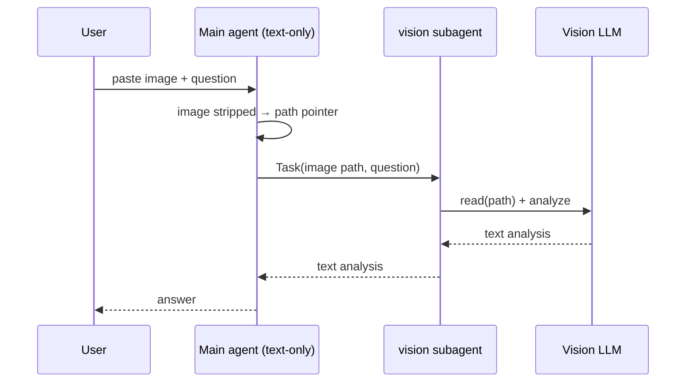

<p align="center">
  
</p>

<h1 align="center">opencode-multimodal-looker</h1>

<p align="center">
  Route pasted images to a cheap vision model in <a href="https://opencode.ai">opencode</a> so a
  text-only main agent can work from the vision model's <strong>text</strong> output.
</p>

<p align="center">
  
  
  
</p>

---

> **Origin.** This is a self-maintained rename of
> [`Chathula/opencode-vision-router`](https://github.com/Chathula/opencode-vision-router)
> (MIT), taken at upstream `0.2.0`. It is published to npm as
> `opencode-multimodal-looker` and can also be loaded by directory path.
> Changes are not sent upstream; see [Divergence](#-divergence-from-upstream).

---

opencode attaches a pasted image to the **main (text-only) model's** message and drops or errors
on it _before_ any skill or subagent runs. A skill alone cannot fix this. The only reliable fix is a
**plugin hook** that intercepts the image at the harness level, resolves it to a readable path, and
lets a cheap vision model analyze it.

`opencode-multimodal-looker` is a self-contained, zero-config plugin that does exactly that — and injects
the vision subagent for you, so there are **no separate agent or skill files** to manage.

## ✨ Features

- 🖼️ **Pasted-image routing** — `data:` URLs, `file://` paths, absolute paths, and OpenCode V2 raw media parts all supported.
- 📸 **Multiple images** — handles several pasted images in a single message, routing each one to the vision subagent.
- 💸 **Cheap vision model** — point it at any image-capable model (`provider/model`).
- 🧠 **Multimodal-aware** — if your main model already sees images, routing is skipped automatically. Set `force` to always route (e.g. to a cheaper vision model).
- 🧩 **Self-contained** — injects the vision subagent and system instruction at load time.
- 🔒 **Safe by default** — the vision subagent can read the image but is denied edit/bash/webfetch.
- ⚡ **OpenCode 1 & 2** — one default export supports both the V1 plugin API (`server()`) and the V2 plugin API (`setup()`), plus V2 model-catalog capability detection and V2 message media parts.

## 🧠 How it works

The plugin registers the following behavior at load time, in whichever API shape your
opencode version supports:

1. **Vision subagent injection** — declare the chosen model as image-capable and inject the
   `vision` subagent (V1 `config` hook / V2 `agent.transform`).
2. **Capability detection** — per model, learn whether the main model can see images
   (V1 `chat.params` learning / V2 model-catalog lookup), so multimodal main models are
   skipped unless `force` is set.
3. **Image rewrite** — strip the image from the user message and replace it with a text
   pointer containing the resolved path, so a text-only model never sees the bytes:
   - V1: `chat.message` (primary) + `experimental.chat.messages.transform` (backup).
   - V2: a `session.hook("context")` registered in `setup()`, which rewrites `media`
     parts in the assembled messages immediately before each agent model request and
     covers both fresh attachments and history.

> ⚠️ V1 relies on opencode's **experimental** `experimental.chat.messages.transform` hook,
> which may change in future opencode versions. In V2 the equivalent is the stable
> `context` session hook.

## 📦 Installation

Add it to your `opencode.json(c)` and restart opencode — plugins are not hot-reloaded.

**From npm** (recommended, per current [OpenCode plugin docs](https://opencode.ai/v2/docs/build/plugins)):

```jsonc
{
  "plugins": [
    {
      "package": "opencode-multimodal-looker",
      "options": { "model": "alibaba-coding-plan/qwen3.7-plus" }
    }
  ]
}
```

**From a local directory** (fallback for versions whose config schema only
accepts the `plugin` key — e.g. opencode `2.0.10`). Clone it, build it once,
and point a `[path, options]` tuple at the directory:

```bash
git clone https://github.com/nxxxsooo/opencode-multimodal-looker.git ~/path/to/opencode-multimodal-looker
cd ~/path/to/opencode-multimodal-looker && bun install && bun run build
```

```jsonc
{
  "plugin": [
    [
      "/absolute/path/to/opencode-multimodal-looker",
      { "model": "alibaba-coding-plan/qwen3.7-plus" }
    ]
  ]
}
```

Then restart opencode — plugins are not hot-reloaded.

> ⚠️ The directory-tuple form uses the `plugin` key with `[path, options]` tuples
> (not the `plugins` key with `{ package, options }` objects from the npm form
> above). The `https://opencode.ai/config.json` schema shipped with opencode
> `2.0.10` only accepts `plugin`, whose items are `string | [string, object]`.
> The path must be a **directory** containing `package.json`; pointing at a file
> is rejected with `configured plugin path must be a directory`.

## ⚙️ Configuration

| Option   | Required | Default       | Description                                                                                                                        |
| -------- | -------- | ------------- | ---------------------------------------------------------------------------------------------------------------------------------- |
| `model`  | yes      | —               | Vision-capable model as `provider/model` (e.g. `opencode-go/qwen3.7-plus`). If omitted, routing is disabled (a warning is logged). |
| `fallbackModels` | no | —            | Ordered fallback vision models (`provider/model`). On a quota / rate-limit failure of the current model (e.g. Bailian's "concurrency allocated quota exceeded"), the vision subagent switches to the next entry and retries immediately. V2 only. |
| `fallbackResetMs` | no | `1800000`     | How long to stay on a fallback before switching back to the primary, so a recovered quota is picked up. `0` disables the reset. |
| `agent`  | no       | `vision`        | Name of the injected vision subagent.                                                    |
| `tmpDir` | no       | `os.tmpdir()`   | Directory under which decoded images are cached (content-hashed, reused across calls).    |
| `force`  | no       | `false`         | Route images to the vision subagent even when the main model is multimodal (e.g. to use a cheaper vision model). By default the subagent is **skipped** when the main model can already see images. |

## 🚀 Usage examples

### Basic

```jsonc
{
  "plugin": [
    [
      "/Users/you/Tuning/opencode-multimodal-looker",
      { "model": "alibaba-coding-plan/qwen3.7-plus" }
    ]
  ]
}
```

### Alongside other plugins

```jsonc
{
  "plugin": [
    "opencode-metrics@0.7.0",
    [
      "/Users/you/Tuning/opencode-multimodal-looker",
      { "model": "alibaba-coding-plan/qwen3.7-plus" }
    ]
  ]
}
```

### With quota failover

```jsonc
{
  "plugin": [
    [
      "/Users/you/Tuning/opencode-multimodal-looker",
      {
        "model": "alibaba-coding-plan/qwen3.7-plus",
        "fallbackModels": [
          "tencentmaas-openai/custom-model-c4-flash",
          "tencentmaas/custom-model-a8"
        ]
      }
    ]
  ]
}
```

When the primary vision model fails with a quota / rate-limit error, the
subagent fails over to the next fallback (switching both the running child
session and the agent registry, then retrying with no delay) and logs
`vision model … hit a quota/rate limit; switched vision subagent to …`.
After `fallbackResetMs` (default 30 minutes) it switches back to the primary;
if the quota is still exhausted the hook fails over again.

### Custom subagent name and cache directory

```jsonc
{
  "plugin": [
    [
      "/Users/you/Tuning/opencode-multimodal-looker",
      {
        "model": "alibaba-coding-plan/qwen3.7-plus",
        "agent": "image-reader",
        "tmpDir": "/var/tmp/opencode-vision"
      }
    ]
  ]
}
```

### Force routing on a multimodal main model

If your main model can already see images, routing is skipped by default. Set `force: true`
to always route — e.g. to send images to a *cheaper* vision model while keeping a stronger
text model as main:

```jsonc
{
  "plugin": [
    [
      "/Users/you/Tuning/opencode-multimodal-looker",
      { "model": "alibaba-coding-plan/qwen3.7-plus", "force": true }
    ]
  ]
}
```

### Consuming the plugin

`opencode-multimodal-looker` is an opencode plugin and is wired up only through your `opencode.json`
(see Installation / Configuration above). Its helper functions (`image.ts`, `transform.ts`,
`agent.ts`) are plain, dependency-free implementation details used by the plugin itself and
covered by the test suite — they are intentionally **not** part of the package's public API, so
import them from the source tree only if you are extending the plugin, not from the published
package.

## 🖥️ Screenshots

A pasted image is intercepted and routed to the vision subagent:


Request flow:



## 🛠️ Development

```bash
bun install
bun test        # run the test suite
bunx tsc --noEmit   # type-check
```

### Project structure

```
src/
  index.ts        # plugin entrypoint — dual V1/V2 default export (no public re-exports)
  types.ts        # shared option & message types
  image.ts        # resolveImagePath / resolveMediaPath, decodeDataUrl, extForMime
  transform.ts    # transformMessages / transformV2Messages, imagePointer (pure)
  agent.ts        # buildVisionAgentConfig, applyConfig, applyAgent, delegationInstruction
  index.test.ts   # Bun tests
```

## 🔀 Divergence from upstream

Taken at `Chathula/opencode-vision-router@0.2.0`. Changes since:

- **Fixed: `force: false` never skipped a multimodal main model.** The V2 capability
  probe called `ctx.catalog.model.list()`. `@opencode/plugin` exposed the catalog at
  `ctx.catalog.model` up to `2.0.3` but renamed it to `ctx.model` by `2.0.10`, so on
  current opencode the call threw a `TypeError` that a bare `catch { return false }`
  turned into "this model cannot see images" — every model, always. Result: images
  were routed to the vision subagent even when the main model had native vision.
  Now reads `ctx.model` with a fallback to `ctx.catalog.model`, tolerates both a bare
  array and `{ data }` from `list()`, and logs the reason when the lookup genuinely
  fails instead of failing silently.
- **Regression tests for the V2 capability path** (`OpenCode V2 capability detection`),
  which upstream had none of — hence the shipped bug.
- Renamed to `opencode-multimodal-looker`; `dist/` is tracked so the plugin can
  also be loaded by directory path. npm publishing was restored at `0.3.0`
  (Trusted Publishing via `.github/workflows/publish.yml`).

## 🧰 Maintenance

```bash
bun install
bun test            # includes the capability-detection regression tests
bunx tsc --noEmit
bun run build       # rebuild dist/ — required after any src change
```

Rebuild `dist/` and restart opencode after changing `src/`; plugins are not hot-reloaded.

To check what upstream has done since the fork:

```bash
git fetch upstream && git log --oneline HEAD..upstream/main
```

## 📜 License

[MIT](./LICENSE) © opencode-multimodal-looker contributors.
