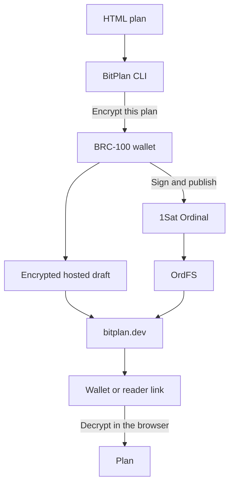
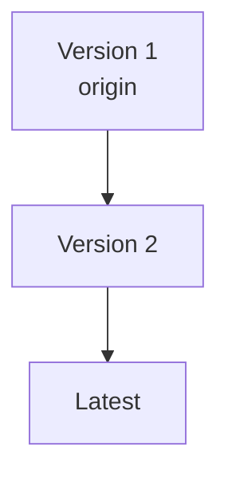
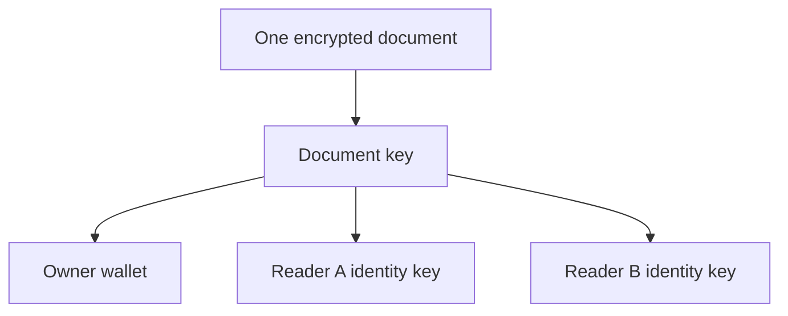

# BitPlan

Create private, versioned HTML plans. Keep them hosted while they change, then
publish them on Bitcoin when they should be permanent.

[Open BitPlan](https://bitplan.dev) · [Read the docs](https://bitplan.dev/docs) · [Install the CLI](https://www.npmjs.com/package/bitplan)

Install the agent skill directly from its owning repository:

```sh
npx skills add opldotdev/bitplan.dev --skill bitplan -g
```

The repository also includes native plugin manifests for Claude Code, Codex,
and Grok. Marketplace installations therefore load this canonical skill rather
than a copied version maintained by another plugin.

BitPlan turns a self-contained HTML file into an encrypted plan. BRC-100 is the
interface BitPlan uses to ask your wallet to encrypt and decrypt. Hosted drafts
store only ciphertext on bitplan.dev and cost no BSV. When a plan is ready, the
wallet can publish that ciphertext as a 1Sat Ordinal. Each on-chain version
moves the same satoshi forward, giving the plan one permanent origin.

## Quick start

```sh
npx bitplan auth
bunx bitplan upload ./plan.html --hosted --link
```

The command prints a reader link. Open it in a browser without connecting a
wallet. Treat the complete link like a password: anyone who has it can read.

Publish the latest hosted version on chain when it is ready:

```sh
bunx bitplan inscribe ./plan.html
```

```sh
npx bitplan list
npx bitplan fetch <origin>
npx bitplan version
```

## How it works



The CLI validates the HTML, then your wallet encrypts it. BitPlan either keeps
the sealed envelope in hosted storage or loads it through OrdFS after an
on-chain publish. Decryption happens in the browser.

The viewer shows publishing options when the connected wallet matches a hosted
version’s encryption sender, or holds the latest on-chain ordinal. These are
different: hosted updates still require the saved draft-update secret. Reading
a plan does not grant permission to replace it. The menu copies an agent/CLI
handoff using only the public plan ID; it does not sign or publish a transaction.

Versions keep the same origin:



## Share a plan

Add one or more wallet identity public keys when publishing:

```sh
npx bitplan upload ./plan.html \
  --share-with <identity-key>
```

The document is encrypted once. Its document key is wrapped separately for
the owner and each invited reader.



## Documentation

- [How BitPlan works](https://bitplan.dev/docs/how-it-works)
- [CLI setup](https://bitplan.dev/docs/cli-setup)
- [Agents and wallets](https://bitplan.dev/docs/agents)
- [CLI commands](https://bitplan.dev/docs/commands)
- [Encrypted envelope](https://bitplan.dev/docs/envelope)

## Repository

| Path | Contents |
| --- | --- |
| [`apps/web`](apps/web) | Next.js website, plan viewer, docs, and sponsorships |
| [`packages/cli`](packages/cli) | Published `bitplan` command-line package |
| [`packages/opencode-plugin`](packages/opencode-plugin) | `opencode-plugin-bitplan`: gateway.bitplan.dev as an OpenCode provider, paid from a BRC-100 wallet |

```sh
bun install --frozen-lockfile
bun run lint
bun run typecheck
bun test
bun run build
```

Compatibility tests open CLI-produced envelopes with the website
implementation. Wallet and network boundaries use mocks, so the automated
suite never publishes a transaction.

BitPlan prefers a BRC-100 wallet already installed by the user. A future 1Sat
CLI headless-wallet bridge is tracked separately; today's `1sat serve wallet`
endpoint is a wallet-storage service and is not a BitPlan wallet endpoint.

Contributions are welcome. Start with [CONTRIBUTING.md](CONTRIBUTING.md).

## License

[MIT](LICENSE) · Third-party notices are listed in
[THIRD_PARTY_NOTICES.md](THIRD_PARTY_NOTICES.md).
