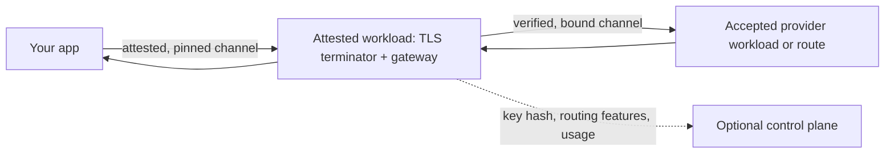

# Private AI Gateway

[](https://www.npmjs.com/package/private-ai-proxy)
[](LICENSE)

**Call the LLM APIs you already know. Verify that no one can read your data
before you send it.**

Private AI Gateway is an OpenAI- and Anthropic-compatible gateway for private
inference. It runs inside a trusted execution environment (TEE), verifies the
confidential provider path selected for the model, and gives the client
evidence it can check independently.

This repository contains the Rust reference implementation of
[Attested Confidential Inference (ACI)](spec/aci.md), first discussed in
[Dstack-TEE/dstack#694](https://github.com/Dstack-TEE/dstack/pull/694). It is a
developer preview.

## Try it

Install the Private AI Proxy CLI (macOS, Linux, or Windows):

```bash
npm install --global private-ai-proxy
```

The [install guide](docs/private-ai-proxy-install.md) covers Homebrew, the
desktop app, and the install scripts.
You also need system `curl`.

Then call Chat Completions as usual. Replace `YOUR_API_KEY` and `MODEL_ID`
with values from your provider:

```bash
pap curl https://tee.redpill.ai/v1/chat/completions -- \
  --fail-with-body \
  --no-buffer \
  --header "Authorization: Bearer YOUR_API_KEY" \
  --header "content-type: application/json" \
  --data-binary '{
    "model": "MODEL_ID",
    "messages": [{"role": "user", "content": "Why is this request private?"}],
    "stream": true,
    "provider": {"aci_verified": true}
  }'
```

Before curl sends anything, `pap` fetches a fresh attestation report and
verifies it. curl then runs pinned to the TLS key the report declares. The
verification transcript goes to stderr and the API response streams on stdout.
Abridged transcript:

```text
PASS  id-1  hardware quote verifies to TEE vendor root and binds report_data
PASS  id-4  source provenance connects workload to public code — compose-hash=7c1e…40db
SKIP  id-5  private-key custody and subject per policy — no custody policy configured
PASS  id-6  the channel actually used is bound to the attested keyset
VERIFIED (5 pass, 1 skipped: no custody policy configured)
```

The `provider.aci_verified` field covers the second hop. The gateway refuses
the request unless the selected model backend passes its own attestation and
channel-binding checks. See [Make a request fail closed](#make-a-request-fail-closed).

`tee.redpill.ai` is a live deployment operated outside this repository, and
this project does not issue its API keys. The [quickstart](docs/quickstart.md)
walks through inspecting the evidence, pinning a release, and verifying a
response receipt, which `pap curl` does not do.

## What a passing check proves

HTTPS proves that you reached a domain. The checks above prove that the report
is fresh and comes from genuine TEE hardware, which compose file that hardware
booted, and that your connection uses the TLS key that workload declares.

Two questions remain yours: whether you accept that compose and the code it
names, and where the workload's private keys live. You can settle them by
auditing and pinning a release, by trusting the operator's review, or by
auditing afterward.
[The privacy claim](docs/attested-confidential-inference.md#the-privacy-claim)
explains each option, and
[Choose what you accept](docs/quickstart.md#choose-what-you-accept) shows the
commands.

## Where your data goes



The accepted gateway, provider-router, and model workloads see plaintext
because they process it. Under the TEE threat model, their operators and the
cloud host cannot read it from protected memory. The optional control plane
never receives prompt or response bodies.
[Who receives what](docs/attested-confidential-inference.md#who-receives-what)
lists every field that leaves the request path.

## Make a request fail closed

Private inference is opt-in per request: configuring a TEE provider does not
make requests fail closed. Set `"provider": {"aci_verified": true}`, pin
accepted sessions, or use a TEE-only hostname.
[Require ACI verification](docs/api-reference.md#require-aci-verification)
defines each constraint and what happens without one.

## Choose a client

Use `pap curl`, `pap send`, or `pap serve` from the command line, the
Private AI Proxy desktop app, the TypeScript verifier and provider packages, or
the Pi and OpenCode integrations. [ACI clients](clients/README.md) says which
fits your host.

## Run your own gateway

Self-hosting needs a dstack SDK endpoint, gateway state, at least one upstream,
and your own policy for authentication, networking, measurements, and provider
credentials.

- [Local development](docs/getting-started.md) runs the gateway against a
  forwarded dstack socket.
- [Configuration reference](docs/configuration-reference.md) defines every
  gateway and upstream field.
- [Deployment guide](deploy/README.md) deploys the gateway with dstack
  git-launcher.
- [Testing guide](docs/live-e2e-test-suite.md) covers local and live-provider
  tests.

The gateway has two routing modes. Direct mode maps a public model ID to a
configured upstream. Middleware mode asks an external control plane for
authorization, pricing, and an ordered route list. Inference handling stays
inside the gateway process in both modes.

## API coverage

The gateway serves OpenAI Chat Completions, Completions, Embeddings, and
Responses, Anthropic Messages, and the ACI attestation, receipt, and session
endpoints. The [HTTP API reference](docs/api-reference.md) covers every route.

## Documentation

Start at the [documentation index](docs/README.md). It lists each guide and
reference by reader and task.

## Repository layout

| Path | Contents |
| --- | --- |
| `crates/aci-protocol/` | Shared ACI wire types and deterministic encoding rules |
| `crates/aci-verify/` | Policy-neutral ACI verification mechanisms shared by the gateway and `pap` |
| `src/aci/` | ACI types, receipts, E2EE, transports, and verifiers |
| `src/http/app/` | HTTP routes, handlers, and error envelopes |
| `apps/desktop/` | Private AI Proxy: the `pap` CLI (ACI verification, curl, send, and local proxy), the desktop app, and the per-user backend service |
| `src/aggregator/` | routing, receipt, session, and metrics services |
| `src/middleware/` | control-plane client, transforms, failover, and pricing |
| `clients/` | TypeScript verifier, provider kernel, Pi, and OpenCode adapters |
| `deploy/` | dstack git-launcher deployment example |
| `examples/control-plane/` | Reference control-plane server |
| `docs/` | guides, references, security notes, and review records |
| `scripts/` | provider verifier bridge and smoke suites |
| `spec/` | ACI specification and test vectors |
| `tests/` | Rust integration and provider-verifier tests |

## License

[Apache License 2.0](LICENSE)
