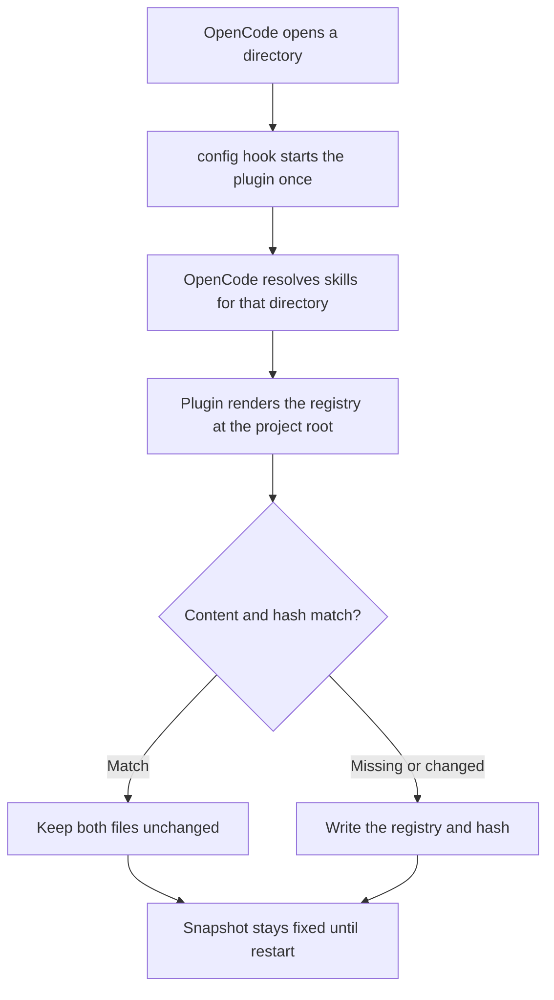

# OpenCode Skill Registry

[](https://www.npmjs.com/package/opencode-skill-registry)

Automatically generate a lightweight index of the skills active in an OpenCode project.

When OpenCode opens or restarts in a project, the plugin creates or updates:

```text
<project>/.ai/atl/skill-registry.md
<project>/.ai/atl/skill-registry.hash
```

There is no manual generation step and no `/skill` step for users. The plugin queries OpenCode's resolved skill list internally.

## Install

Requires OpenCode `>=1.17.15 <2`.

```bash
opencode plugin opencode-skill-registry --global
```

Restart OpenCode and open a project. The files appear automatically.

## Use

Consumers match a description in `skill-registry.md`, then load that skill through OpenCode's native `skill` tool. Filesystem entries can also be read at their listed location. The registry is an index, not a copy of skill bodies.

## Sources

OpenCode decides which skills are active. The registry groups that resolved list in this display order:

| Source | Includes |
| --- | --- |
| OpenCode | Built-in skills, `.opencode/{skill,skills}`, global config, `skills.paths`, and `skills.urls` |
| Agents | Project and global `.agents/skills` |
| Claude | Project and global `.claude/skills` |

OpenCode resolves duplicate names before the plugin sees them. The registry records the same winner instead of imposing separate precedence. Each entry includes the `name`, `description`, and `location` returned by OpenCode.

### Convention references

Files such as `AGENTS.md`, `CLAUDE.md`, `.cursorrules`, and `GEMINI.md` appear in a separate reference section. They are not presented as active skills or as OpenCode's active instruction set.

The plugin does not enable sources or inspect a Claude executable. OpenCode's `OPENCODE_DISABLE_CLAUDE_CODE_SKILLS` and `OPENCODE_DISABLE_EXTERNAL_SKILLS` flags are reflected unchanged. A project-level `skills/` directory appears only when OpenCode resolves it, for example through `skills.paths`.

## Automatic cycle



In Git, the project root is the root of the current worktree. Outside Git, it is the directory opened in OpenCode.

Startup failures may retry up to three times during the same session. Retries recover a failed generation; they do not refresh a successful snapshot.

## Storage details

- Store generated state under project-local `.ai/atl/`.
- Hash the exact rendered Markdown and repair a missing or corrupted registry.
- Publish the registry and hash through same-directory temporary files.
- Leave Git exclusion of `.ai/` to the surrounding harness or installer.
- Keep a stable startup snapshot; restart OpenCode to include skills added during a session.
- Query only the local OpenCode client; do not fetch configured skill URLs independently.

The package has no runtime npm dependencies. Its root and `./server` entrypoints load the same server plugin.

## Update or remove

A bare `opencode-skill-registry` entry follows npm `latest`. To pin a release:

```bash
opencode plugin opencode-skill-registry@<version> --global --force
```

To remove the plugin, delete only its matching string or tuple from the global `opencode.jsonc` or `opencode.json`, preserve every other entry, and restart OpenCode. There is no global npm installation to uninstall. Generated `.ai/atl/` files remain until removed separately.

## Develop

```bash
pnpm install --frozen-lockfile
pnpm run check
pnpm run security:check
```

See [Contributing](CONTRIBUTING.md) for local loading and review rules.

## Help

- [Report a problem](https://github.com/andresnator/opencode-skill-registry/issues)
- [Changelog](CHANGELOG.md)
- [MIT License](LICENSE)
