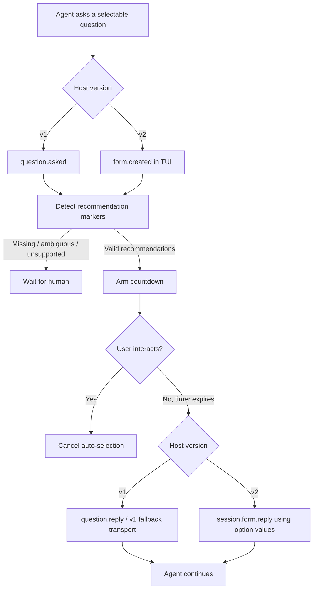

# opencode-smart-questions 💡

[](https://opensource.org/licenses/MIT)
[](https://github.com/huseyincig/opencode-smart-questions)
[](https://www.typescriptlang.org/)
[](tests/)

Safe auto-selection of agent-recommended choices for **OpenCode** question prompts, with a visible countdown and immediate cancellation when the user starts interacting.

The package contains separate adapters for **OpenCode v1** and **OpenCode v2** rather than translating one host API into the other.

---

## Features

- **Native recommendation guidance:** v1 enriches `tool.definition` and `experimental.chat.system.transform`; full v2 hosts use `ctx.tool.transform(...)` and `ctx.session.hook("context", ...)`. Transition builds that invoke `setup()` without the complete v2 capability surface are detected and ignored safely.
- **Version-native question handling:** v1 consumes `question.asked/replied/rejected`; v2 consumes `form.created/replied/cancelled` in the TUI and replies through `session.form.reply(...)`.
- **Single- and multi-select support:** recommended single choices and multiple recommended checkbox choices are both supported.
- **Human interaction guard:** any real keyboard or paste interaction disables the pending auto-selection. The plugin never injects fake key presses into stdin.
- **Fail-safe matching:** no auto-answer is sent when a selectable field has no recommendation, a single-select field is ambiguous, or a v2 form contains unsupported free-text/number/boolean/external fields.
- **Multi-language markers:** defaults to `["(Recommended)", "(Önerilen)"]` and supports custom suffix markers.
- **Safe draft lock paths:** request IDs are encoded before being used in lock filenames.
- **OpenTUI integration:** a countdown panel shows the choices that will be selected and switches to `AUTO-SELECTION DISABLED` when the user takes control.
- **Pre-built distribution:** compiled ESM, declarations, and adaptive TUI bundles are included. OpenTUI/Solid are peer runtimes rather than bundled duplicate renderer instances.
- **No configuration file required:** safe defaults are used when `smart-question.json` is absent. A malformed config disables auto-selection rather than guessing.

---

## Installation

### OpenCode v1

Add the package to the server/runtime plugin list:

```json
{
  "plugin": [
    "opencode-smart-questions@latest"
  ]
}
```

For the v1 countdown UI, also add the package to the v1 TUI plugin config:

```json
{
  "$schema": "https://opencode.ai/tui.json",
  "plugin": [
    "opencode-smart-questions@latest"
  ]
}
```

The package exposes separate `./server` and `./tui` entries so v1 can load each target independently.

### OpenCode v2

Use the v2 `plugins` key:

```json
{
  "plugins": [
    "opencode-smart-questions@latest"
  ]
}
```

OpenCode v2 loads the server plugin and automatically discovers the package's `./tui` export for the terminal client. No duplicate `tui.json` registration is needed for the package.

### Local development

```bash
git clone https://github.com/huseyincig/opencode-smart-questions.git ~/.config/opencode/vendor/opencode-smart-questions
```

v1 server example:

```json
{
  "plugin": [
    "file:///home/me/.config/opencode/vendor/opencode-smart-questions"
  ]
}
```

v2 example:

```json
{
  "plugins": [
    "file:///home/me/.config/opencode/vendor/opencode-smart-questions"
  ]
}
```

For v1 TUI loading, use the same `file:///...` package path in the v1 `tui.json` plugin list.

---

## Configuration

Configuration is discovered in this order:

1. `<project-root>/.opencode/smart-question.json`
2. `<project-root>/smart-question.json`
3. `~/.config/opencode/smart-question.json`
4. built-in defaults when no file exists

Example:

```json
{
  "enabled": true,
  "timeoutMs": 30000,
  "recommendedMarkers": [
    "(Recommended)",
    "(Önerilen)"
  ],
  "requireExactlyOneRecommendation": true,
  "debugLog": ""
}
```

| Option | Type | Default | Description |
| :--- | :--- | :--- | :--- |
| `enabled` | `boolean` | `true` | Enables or disables the plugin. |
| `timeoutMs` | `number` | `30000` | Delay before a recommended answer is sent. |
| `recommendedMarkers` | `string[]` | `["(Recommended)", "(Önerilen)"]` | Accepted recommendation suffixes. |
| `recommendedMarker` | `string` | first marker | Legacy single-marker form. |
| `requireExactlyOneRecommendation` | `boolean` | `true` | Requires exactly one recommendation for single-select questions. Multi-select may contain multiple recommendations. |
| `debugLog` | `string` | `""` | Optional file path for diagnostic logging. No debug file is written when empty. |

---

## How it works



### v1

The backend listens for `question.*` events and owns the reply timer. The TUI displays the countdown and writes a draft lock when the user interacts. Reply transport prefers the native question client, then the v1 internal client, then the v1 REST endpoint when necessary.

### v2

The backend injects recommendation guidance using native v2 transforms. The terminal plugin observes `form.created`, maps recommended option labels back to their stable form `value` fields, and owns the countdown/reply because v2 server plugin context intentionally does not expose the form reply API. Before replying, it refreshes the pending forms and confirms that the form still exists.

Global/MCP forms and forms containing unsupported non-choice fields are not auto-answered.

---

## Testing

```bash
# Build + 55 unit/regression tests
npm test

# Typecheck sources
npm run typecheck

# Build server and TUI distribution
npm run build

# Isolated v1 smoke + scenario tests
node sandbox/smoke-test.mjs
node sandbox/comprehensive-test.mjs

# Verify publish contents
npm pack --dry-run
```

The regression suite includes v1 timer/cancellation behavior, Turkish markers, draft-lock handling, v2 form label→value mapping, v2 backend transforms, v2 TUI auto-reply, partial-v2 capability detection, user-input cancellation, and path traversal protection.

---

## Project structure

```
opencode-smart-questions/
├── dist/                    # Compiled server + adaptive TUI bundles
├── src/
│   ├── index.ts             # v1 server + v2 backend entry
│   ├── backend.ts           # v1 question lifecycle/reply routing
│   ├── config.ts            # Config discovery and normalization
│   ├── detector.ts          # Shared recommendation decision engine
│   ├── draft-guard.ts       # Human draft lock management
│   ├── form-adapter.ts      # v2 form -> question/value mapping
│   ├── guidance.ts          # Shared prompt/tool guidance
│   ├── types.ts
│   └── ui.tsx               # v1 and v2 TUI adapters
├── scripts/
│   └── emit-tui.mjs         # Host-runtime + standalone TUI bundler
├── sandbox/
├── tests/
│   └── smart-question.test.mjs
├── index.js
├── server.js
├── tui.js
├── package.json
└── tsconfig.json
```

---

## License

[MIT](LICENSE) © Hüseyin Hadi Çığ
