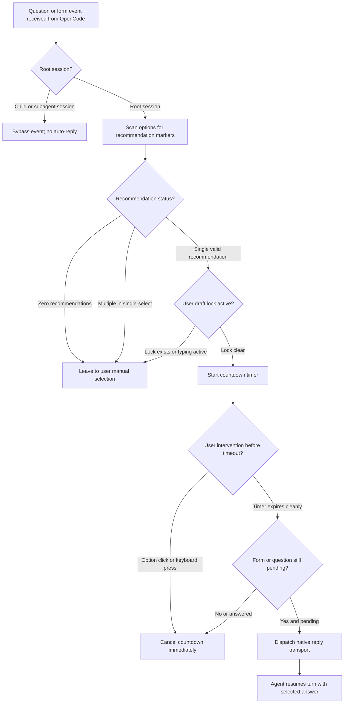

# 💡 OpenCode Smart Questions

[](https://www.npmjs.com/package/opencode-smart-questions)
[](https://www.npmjs.com/package/opencode-smart-questions)
[](https://opencode.ai)
[](docs/acceptance-v1.md)
[](docs/verification.md)
[](package.json)
[](tsconfig.json)
[](LICENSE)

[Installation](#-installation) · [How Selection Works](#-how-selection-works) · [Architecture & Flowchart](#-architecture--selection-lifecycle) · [Guardian Coordination (Optional)](#-optional-coordination-with-opencode-guardian) · [Configuration](#-configuration) · [Validation](#-validation--testing)

A high-performance, deterministic OpenCode plugin that automatically answers agent-recommended choices after a configurable countdown, unless the user intervenes. It operates completely standalone and supports single-choice and multiple-choice questions across OpenCode V1 and V2 host architectures.

**Language-independent selection:** Question text and options can be written in any language. The plugin recognizes exact configured markers such as `[SQ:recommended]`; it does not translate or alter recommendations. Alternative markers like `(Recommended)` and `(Önerilen)` are also recognized by default.

---

## 📊 Verification & Live Acceptance


> The graphic displays the current **v0.7.0 automated verification** along with real host acceptance on **OpenCode V1 (`1.18.34`)** and **OpenCode V2 (`2.0.24`)** executed with the mandatory test model `opencode-go/mimo-v2.6-flash`.

Smart Questions **v0.7.0** is validated as follows:

- **Current Automated Verification:** **148 / 148** unit, fallback, visibility, and regression tests passing.
- **Sandbox Scenarios:** **8 / 8** isolated smoke and comprehensive test suites passing.
- **Static Analysis:** Standard and strict TypeScript gates pass; Oxlint reports **0 warnings / 0 errors**.
- **Dependency Security:** **0 vulnerabilities** across production and development dependency audits.
- **Real Host Acceptance (V1 & V2):** Both OpenCode V1 (`1.18.34`) and OpenCode V2 (`2.0.24`) verified with real LLM agent sessions (`opencode-go/mimo-v2.6-flash`).

Read the detailed [V1 Acceptance Report](docs/acceptance-v1.md), [V2 Acceptance Report](docs/acceptance-v2.md), and [Technical Verification](docs/verification.md) for full reproduction steps and test harnesses.

---

## ✨ Key Highlights

- **100% Standalone Operation:** Operates independently without requiring any other plugins, external services, or background daemons.
- **Dual-Mode Host Support:** Seamlessly supports both **OpenCode v1** (`@opencode-ai/plugin`) and **OpenCode v2** (`@opencode/plugin`) with decoupled runtime adapters.
- **Flexible Recommendation Matching:** Recognizes prefix (`(Recommended)`, `(Önerilen)`), suffix (`[SQ:recommended]`), description text, case-insensitive variations, and Turkish tokens across single-choice and multi-select prompts.
- **Multi-Step & Multi-Field Fallback (Unattended Safety):** In multi-step questions (Step 1, Step 2, Step 3) or multi-field forms, steps with explicit recommendations are honored, and steps without markers fall back to the logical first option. Ensures sessions never stall or deadlock when unattended for hours.
- **Configurable Fallback & Policies:** Supports `unclassifiedQuestionPolicy: 'fallback-first' | 'remediate-then-fallback' | 'remediate' | 'ignore'`, `fallbackToFirstOption: true`, and `fallbackOnManual: true` to provide complete autonomy without human intervention when needed.
- **Comprehensive Overlay State Visibility:** Renders dedicated visual states across all handled selectable questions: **AUTO** (cyan border, green checklist, countdown timer), **MANUAL** (yellow border, manual decision required), **UNCLASSIFIED** (cyan border, agent remediation in progress), and **ERROR** (red border).
- **Fingerprint-Scoped Loop Protection:** Unclassified question loop budgets are strictly scoped to identical failure chains and question fingerprints. Chains cleanly reset upon successful AUTO selection, explicit MANUAL classification, question reply/settlement, or new user messages.
- **Transport Failure Resilience:** Failed synthetic prompt remediation preserves retry capability without exhausting duplicate or budget state.
- **Instant User Intervention:** Cancels countdown immediately upon user typing, keyboard entry, draft file locking, or manual form selection.
- **Subagent & Child Scope Isolation:** Operates strictly in the interactive root session; background child sessions and subagents are ignored without interference.
- **Zero Runtime Dependencies:** Pure TypeScript compiled to `dist/` with no heavy third-party runtime dependencies.
- **Decoupled Guardian Protocol:** Optional, zero-dependency handoff coordination when paired with [OpenCode Guardian](https://github.com/huseyincig/opencode-guardian).

---

## 📦 Installation

The current version is **0.7.0**.

### 🟢 OpenCode V1 (1.x)

Add the package to the server plugin configuration in your `opencode.json` (`~/.config/opencode/opencode.json` or project-local):

```json
{
  "plugin": ["opencode-smart-questions@latest"]
}
```

To display the countdown panel in the terminal UI, also register the package in the V1 terminal configuration (`tui.json`):

```json
{
  "$schema": "https://opencode.ai/tui.json",
  "plugin": ["opencode-smart-questions@latest"]
}
```

### 🔵 OpenCode V2 (2.x)

Use the V2 **`plugins`** array in `opencode.json` or `opencode.jsonc`:

```json
{
  "plugins": ["opencode-smart-questions@latest"]
}
```

On V2 builds, the `./tui` export provides reactive countdown and form-reply handling.

### 🛠️ Local Development

Clone the repository into your OpenCode plugins or vendor directory:

```bash
git clone https://github.com/huseyincig/opencode-smart-questions.git ~/.config/opencode/vendor/opencode-smart-questions
```

Use the `file:///` URL in `opencode.json`:

```json
{
  "plugin": ["file:///path/to/opencode-smart-questions"]
}
```

---

## ⚡ How Selection Works

1. The agent marks each recommended option by appending `[SQ:recommended]` to its label.
2. The V1 backend intercepts `question.asked`; the V2 TUI intercepts `form.created`. Both execute the shared recommendation detector.
3. Only questions with unambiguous recommendations are eligible. Single-select questions must contain exactly one recommended option.
4. A countdown timer begins (`30000 ms` default). Any keyboard typing or manual selection cancels the pending countdown immediately.
5. If the request remains eligible upon expiry, V1 issues `client.question.reply`; V2 validates the pending form and submits `session.form.reply`.

> [!IMPORTANT]
> **Selection is not permission.** The plugin cannot determine whether a recommendation is safe, reversible, or authorized. Destructive operations should always require explicit human approval.

---

## 🔄 Architecture & Selection Lifecycle

The decision flow below illustrates Smart Questions' native, standalone operation:



---

## 🤝 Optional: Coordination with OpenCode Guardian

Smart Questions is **100% standalone and has no dependencies on Guardian**.

However, when used together in the same OpenCode environment, they optionally coordinate through a decoupled, zero-dependency handoff protocol (`[OPENCODE_HANDOFF:v1]`):

- **Destructive Action Safety:** If Guardian classifies an action as destructive or high-risk, it marks `auto_select=forbidden`. Smart Questions immediately suppresses the countdown timer and locks the choice to manual user approval.
- **Safe Clarifications:** For routine choices, Guardian sets `auto_select=allowed`, allowing Smart Questions to execute its standard countdown.
- **Anti-Spoofing & Replay Protection:** Handshakes without valid provenance are rejected; handoffs expire after 120s TTL and are tombstoned once consumed.

📖 For architecture diagrams, sequence flows, and contract details, see the [Guardian + Smart Questions Coordination Guide](docs/guardian-integration.md).

---

## ⚙️ Configuration (`smart-question.json`)

Settings are resolved hierarchically from `<project>/.opencode/smart-question.json`, `<project>/smart-question.json`, or `~/.config/opencode/smart-question.json`:

```json
{
  "enabled": true,
  "timeoutMs": 30000,
  "recommendedMarkers": [
    "[SQ:recommended]",
    "(Recommended)",
    "(Önerilen)"
  ],
  "requireExactlyOneRecommendation": true,
  "uiText": {
    "recommendation": "Recommendation:",
    "disabled": "AUTO-SELECTION DISABLED",
    "autoReplyFailed": "Auto-reply failed. Please select manually.",
    "agent": "Agent:",
    "session": "Session:"
  },
  "debugLog": ""
}
```

### 🎛️ Configuration Options:

| Setting | Default | Description |
| :--- | :---: | :--- |
| `enabled` | `true` | Enables or disables the plugin. |
| `timeoutMs` | `30000` | Countdown duration in milliseconds before auto-selecting. |
| `recommendedMarkers` | `["[SQ:recommended]", ...]` | Accepted suffix markers indicating an agent recommendation. |
| `requireExactlyOneRecommendation` | `true` | Enforces unambiguous recommendation matching for single-choice questions. |
| `uiText` | English labels | Localized TUI text strings for labels and warning notices. |
| `debugLog` | `""` | File path for append-only diagnostic logging (`0600` permissions). |

---

## 🧪 Validation & Testing

Run the full verification suite locally:

```bash
npm ci
npm run typecheck
npm test
node sandbox/smoke-test.mjs
node sandbox/comprehensive-test.mjs
npm run lint
npm audit
npm pack --dry-run
```

- **CI Matrix:** Runs on Node 22, 24, and 26 with strict typechecking and Oxlint verification.
- **Acceptance Reports:** See [V1 Acceptance](docs/acceptance-v1.md) and [V2 Acceptance](docs/acceptance-v2.md) for live host benchmarks.
- **Technical Specifications:** Detailed boundaries and limitations are documented in [Technical Verification](docs/verification.md).

---

## 🏗️ Project Layout

- `src/backend.ts`: V1 event hooks, question auto-reply dispatch, and handoff coordination.
- `src/ui.tsx`: V1 and V2 interactive TUI countdown panel with reactive Solid state.
- `src/detector.ts`: Pure recommendation parser enforcing single/multi-choice invariants.
- `src/handoff.ts`: `[OPENCODE_HANDOFF:v1]` protocol parser, provenance checks, and TTL/replay tracking.
- `src/form-adapter.ts`: OpenCode V2 form schema adapter and field value mapper.
- `src/draft-guard.ts`: POSIX file-based draft locks preventing auto-reply during user typing.
- `src/config.ts`: Configuration resolver and JSON schema validator.
- `src/session-scope.ts`: V1/V2 session hierarchy analyzer ensuring root-agent isolation.
- `src/index.ts`: Dual-mode plugin entrypoint exporting V1 and V2 plugin definitions.

---

## 📄 License

MIT © [Hüseyin Hadi Çığ](https://github.com/huseyincig)
