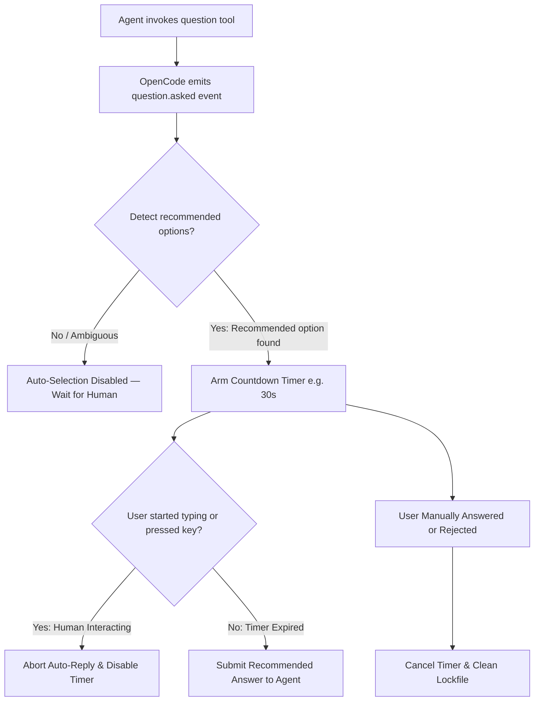

# opencode-smart-questions 💡

[](https://opensource.org/licenses/MIT)
[](https://github.com/huseyincig/opencode-smart-questions)
[](https://www.typescriptlang.org/)
[](tests/)

Intelligent auto-selection of recommended options for **OpenCode** AI agent question prompts with safe human-draft detection, automated native prompt injection, and terminal UI countdown.

Dual-Mode compatible: works seamlessly out of the box with both **OpenCode 1.x** and **OpenCode 2.x**.

Works **100% out of the box** using OpenCode's native lifecycle hooks — **no manual markdown rules or prompt files required**.

---

## 🌟 Features

- **Automated Native Injection (Zero Manual Setup):** Automatically enriches the `question` tool definition and agent system prompt using OpenCode's native `tool.definition` and `experimental.chat.system.transform` hooks. Agents naturally know to format recommendations with `(Recommended)` without any manual rule configuration.
- **Unattended Auto-Selection:** Automatically selects recommended choices after a configurable countdown (default: 30s) when an agent asks a question.
- **Single-Select & Multi-Select Support:** Seamlessly handles standard single-select questions as well as multiple-selection checkboxes (`multiple: true`).
- **Safe Human-Draft Detection:** If the human operator focuses the input, navigates options, or starts typing a custom answer, auto-selection is immediately aborted (`AUTO-SELECTION DISABLED`). Human input is never overwritten.
- **Fail-Safe Decision Engine:** Auto-selection only triggers when accepted recommendation markers are present. If 0 options match, auto-selection safely disables itself to wait for manual human decision.
- **Multi-Language Support:** Defaults to `["(Recommended)", "(Önerilen)"]` and is easily extensible for any language or custom marker suffix.
- **OpenTUI / Terminal UI Integration:** Features a live terminal countdown panel with status indicators and recommended choice badges (`✓ ÖNERİLEN` / `RECOMMENDED`).
- **Multi-Path Transport:** Robust multi-tier fallback architecture:
  1. Native v2 SDK: `client.question.reply(...)`
  2. Internal v1 client: `client._client.post(...)`
  3. Direct REST endpoint: `POST /question/{id}/reply` via `serverUrl`
- **Pre-Built Distribution:** Pre-compiled ESM distribution (`dist/`) is included in the package and git repository for zero-build, zero-dependency instant installation.

---

## 📦 Installation

### Method 1: NPM Package (Recommended)

1. Install the backend plugin via OpenCode CLI or add to `~/.config/opencode/opencode.json`:

```bash
opencode plugin opencode-smart-questions
```

```json
{
  "plugin": [
    "opencode-smart-questions@latest"
  ]
}
```

2. Register the terminal countdown panel in `~/.config/opencode/tui.json`:

```json
{
  "$schema": "https://opencode.ai/tui.json",
  "plugin": [
    "opencode-smart-questions@latest"
  ]
}
```

> **Note:** `opencode.json` runs the backend auto-selection engine. `tui.json` renders the interactive countdown bar and status badges in OpenTUI. Adding it to both ensures the full visual and automated experience.

### Method 2: Local Directory / Development

If developing or testing locally:

```bash
git clone https://github.com/huseyincig/opencode-smart-questions.git ~/.config/opencode/vendor/opencode-smart-questions
```

Add the absolute `file:///` path to both `opencode.json` and `tui.json`:

```json
{
  "plugin": [
    "file:///root/.config/opencode/vendor/opencode-smart-questions"
  ]
}
```

---

## ⚙️ Configuration (`smart-question.json`)

Configuration is auto-discovered in the following priority order:
1. `<project-root>/.opencode/smart-question.json`
2. `<project-root>/smart-question.json`
3. `~/.config/opencode/smart-question.json`

Example `smart-question.json`:

```json
{
  "enabled": true,
  "timeoutMs": 30000,
  "recommendedMarkers": [
    "(Recommended)",
    "(Önerilen)"
  ],
  "requireExactlyOneRecommendation": true,
  "debugLog": "/tmp/smart-question.log"
}
```

### Configuration Options:

| Option | Type | Default | Description |
| :--- | :--- | :--- | :--- |
| `enabled` | `boolean` | `true` | Master switch to enable or disable the plugin. |
| `timeoutMs` | `number` | `30000` | Countdown duration in milliseconds before auto-replying. |
| `recommendedMarkers` | `string[]` | `["(Recommended)", "(Önerilen)"]` | Accepted suffix markers for recommended options. |
| `requireExactlyOneRecommendation` | `boolean` | `true` | Fail-safe requiring exactly one recommended option per single-select question. |
| `debugLog` | `string` | `""` | Optional file path for audit logs (avoids cluttering TUI stderr). |

---

## 🔄 How It Works: Lifecycle & Human-Draft Guard



1. **Automatic Prompt Injection:** The plugin hooks into OpenCode's tool definition and system prompt pipelines (`tool.definition` and `experimental.chat.system.transform`). When the agent asks questions, it automatically knows to append `(Recommended)` to preferred options.
2. **Detection:** When `question.asked` arrives, the detector inspects option labels. If options end with an accepted marker (e.g. `Blue-Green (Recommended)`), a countdown timer is armed.
3. **Draft / Focus Guard:** If the user presses keys, navigates options, or starts typing, auto-reply is aborted immediately (`AUTO-SELECTION DISABLED`).
4. **Cancellation:** If the user selects any option manually or rejects the prompt before the timer fires, the pending timer is cancelled immediately.

---

## 🧪 Testing & Verification

```bash
# Run 45/45 unit tests (~940ms)
npm test

# Typecheck TypeScript sources
npm run typecheck

# Build and emit TUI assets
npm run build
```

---

## 🛠️ Project Structure

```
opencode-smart-questions/
├── dist/                # Pre-compiled ESM distribution & OpenTUI runtime bundles
├── src/
│   ├── index.ts         # Dual-Mode entry point (OpenCode v1 server & v2 setup)
│   ├── types.ts         # TypeScript interfaces & types
│   ├── config.ts        # Configuration discovery & marker normalization
│   ├── detector.ts      # Pure recommendation detection engine
│   ├── draft-guard.ts   # Human draft detection & lockfile management
│   ├── backend.ts       # Event handlers, prompt injection & reply routing
│   └── ui.tsx           # Solid Universal OpenTUI presentation component
├── scripts/
│   └── emit-tui.mjs     # Adaptive TUI loader & OpenTUI virtual module builder
├── tests/
│   └── smart-question.test.mjs   # 45 Unit test cases
├── index.js             # Root module export for universal module loaders
├── server.js            # Root server export for OpenCode plugin discovery
├── tui.js               # Root TUI export for OpenCode TUI renderer
├── package.json
├── tsconfig.json
├── LICENSE              # MIT License
└── README.md
```

---

## 📄 License

[MIT](LICENSE) © Hüseyin Hadi Çığ
