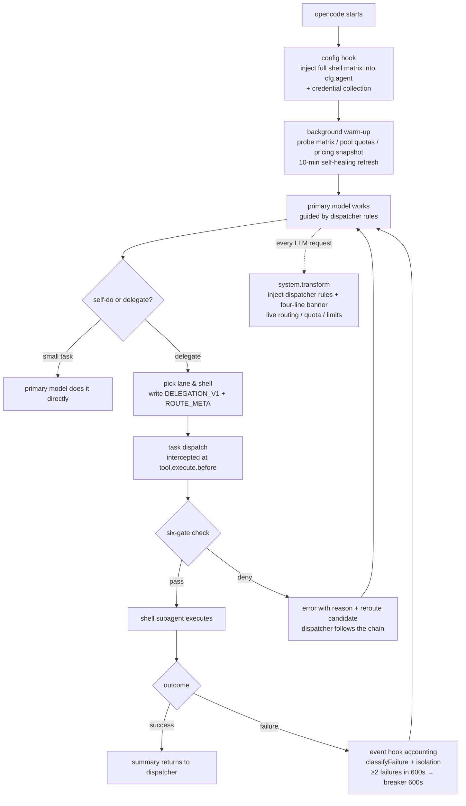

# opencode-switchman

**English** | [中文](./README.zh.md)

> ### 🎯 Fully-automated model matrix ＋ autonomous decisions ＝ every token lands exactly where it matters. Not one wasted.

> **🎬 [Live Presentation Deck](https://mrzturn.github.io/opencode-switchman/)**(GitHub Pages, works on desktop & mobile)
>
> [](https://mrzturn.github.io/opencode-switchman/)

A six-lane shell-matrix orchestration plugin for OpenCode — turns your primary model into a dispatcher that delegates tasks by cognitive tier to bare subagent shells across any opencode provider, while the plugin layer enforces deterministic gating, weighted model scoring, traceable routing decisions, and self-healing failure isolation; glm / deepseek / copilot additionally get quota-aware routing.

If you hold multiple model subscriptions (GitHub Copilot premium credits, Zhipu GLM Coding Plan, DeepSeek pay-as-you-go balance) but keep burning a single model forever, blind to water levels and peak pricing — opencode-switchman is built for you.

## Installation & Usage

### Prerequisites

- [opencode](https://opencode.ai) (desktop app or CLI)
- Any opencode provider works out of the box; the following three additionally get quota control (any combination, all optional):
  - **GitHub Copilot**: just sign in via GitHub in opencode (`/connect`)
  - **GLM**: custom provider (`zhipuai-coding-plan`, baseURL `https://open.bigmodel.cn/api/coding/paas/v4` + apiKey)
  - **DeepSeek**: custom provider (`deepseek` + apiKey)
- Zero-config credentials: the plugin reads them **read-only** from opencode's auth layer (auth.json / provider options / env vars) — it never stores secrets or refreshes tokens itself

### Install / update (two one-command paths)

Both commands cover first install and later updates (idempotent, safe to re-run): they rewrite the `plugin` entry in your opencode config and `tui.jsonc` to the exact latest version `opencode-switchman@x.y.z` (JSONC comments preserved), prune stale plugin caches (`~/.cache/opencode/packages/opencode-switchman*`), and on upgrade flag the "upgraded, restart required" banner — **restart opencode to take effect**.

**One-line script (recommended)**

```bash
curl -fsSL https://raw.githubusercontent.com/mrzturn/opencode-switchman/main/scripts/setup.sh | bash
```

**npx / bunx**

```bash
npx -y opencode-switchman@latest    # or: bunx opencode-switchman@latest
```

> The npx path is available once ≥0.2.1 is published (the package ships an `update` bin entry).

> **Why the entry is an exact version instead of a bare name / `@latest`**: OpenCode ≤1.18.x pins its plugin cache to a per-spec directory (e.g. `~/.cache/opencode/packages/opencode-switchman`) and never re-queries npm after the first install — bare names and `@latest` keep reusing the stale cache (observed pinned at 0.0.1). Exact versions get their own cache directory, so the updater rewrites the version instead.

The in-plugin `/switchman-update` command now invokes the same updater (the old `npm install` approach never affected the path OpenCode actually loads).

### Option 1: npm (manual)

Add to your opencode config (`~/.config/opencode/opencode.json` or project `opencode.json`):

```json
{
  "plugin": ["opencode-switchman"]
}
```

opencode installs and loads the npm package automatically via Bun at startup, no other steps needed. For later updates use the one-liner above or `/switchman-update` inside opencode.

> **Nothing else goes into your opencode config**: all plugin configuration (water levels, billing, peaks, thresholds, banner, matrix, custom lanes, etc.) lives in the standalone `opencode-switchman.jsonc` file (see below) — auto-generated on first start with inline comments. The legacy tuple-options form (`["opencode-switchman", {...}]`) is deprecated and kept compatible for one release (explicit values still win; `/switchman-doctor` flags them as SWM044 and suggests migrating).

### Option 2: from source

```bash
git clone https://github.com/mrzturn/opencode-switchman.git
cd opencode-switchman
bun install
bun run build   # produces dist/opencode-switchman.js
```

Then pick one of two loading methods:

**a) Config reference (recommended, follows the repo)** — point the `plugin` array at the repo directory via `file://`:

```json
{
  "plugin": ["file:///absolute/path/to/opencode-switchman"]
}
```

The plugin loads the repo's `dist` bundle directly; after `git pull`, re-run `bun run build` and restart opencode to upgrade. **Choose either this or the plugins-directory deployment** — using both double-loads the plugin.

**b) Single-file deploy** — `bun run deploy` builds and copies into the global plugin directory `~/.config/opencode/plugins/opencode-switchman.js`, which is auto-loaded. The desktop app's embedded core runs on Node, which is exactly what the single-file `deploy` bundle targets.

> **Note**: a `file://` entry in the `plugin` array and a plugins-directory deployment must not coexist (the same plugin loads twice). Once published to npm, replace the `file://...` entry with `"opencode-switchman"` to switch to npm installation. Restart opencode to take effect.

> **Upgrading from the pre-rename plugin (switchman.js)**: delete the old `~/.config/opencode/plugins/switchman.js` to avoid double injection. The state directory has moved to `~/.config/opencode/opencode-switchman/` (the old one can be removed; all state self-heals).

### Configuration: opencode-switchman.jsonc

**Apart from the plugin registration itself (the `plugin` array in your opencode config), every plugin setting lives in the standalone `opencode-switchman.jsonc`** — auto-created on first startup in the OpenCode config directory (`OPENCODE_CONFIG_DIR`, then `$XDG_CONFIG_HOME/opencode`, then `~/.config/opencode`) with a `$schema` for editor hints and per-key comments; invalid values fail open to defaults. Edit the file and re-run config (or restart opencode) to apply; `/switchman-doctor` produces a local, credential-free diagnostic report.

**providers — per-provider policy**: it ships with the stable provider keys `deepseek`, `zhipuai-coding-plan`, and `github-copilot` (matching OpenCode's own official provider IDs), but **any opencode official or custom provider key is legal** — unknown keys are treated as custom providers (routed with generic defaults; near-miss spellings of the built-in keys get a doctor warning). `observe` controls quota lookup/banner display; `enabled` independently opts a provider into routing water-level, peak, and exhaustion rules (both default to `true`/`false` respectively). `billing` declares the cost structure — `subscription` (score boost 1.0) or `api` (0.85, sinks within its capability tier); it is the only source of billing priority (never inferred from models.dev or auth). `peak` ranges use ISO weekdays (`1`–`7`) and `[start,end)` `HH:mm` ranges; defaults are GLM weekdays 14:00–18:00 and DeepSeek weekdays 09:00–12:00 plus 14:00–18:00.

**Behavior sections** (`quota` / `cost` / `capability` / `matrix` / `banner` / `rules` / `lanes`): see the Options table below — same file, nowhere else.

### Verify the installation

After starting opencode, every system prompt of the primary model carries a live four-line banner (the dispatcher's ground truth):

```
[路由] economy: glm-53-low→claude5-low→gem31pro-low | mechanical: claude5-medium→gem31pro-medium→gem37f-medium | main: glm-53-high→ds-v4p-high→claude5-high | ...
[水位] GLM 5h 20% weekly 7% (refreshed 09-04 10:00) | Copilot unlimited credits, used 3885 (since 2026-09-01) | advice: ...
[限制] down: none | retired: 0 models | reviewer must be hetero-family (producer family ≠ shell family) | api-billed & unknown models sink by coefficient (billing=subscription takes priority)
[更新] new version available: /switchman-update or /switchman-ignore
```

The log also shows `[opencode-switchman] injected N model shells (agents)` — N varies dynamically with the model surface of credentialed providers. Lane candidates are generated algorithmically from capability score × effort affinity × billing/unknown coefficients, with vision/review structural gates and no vendor-specific seats; runtime health, quota, and cost rules then select the current first candidate.

### Sidebar status panel (TUI plugin, optional)

v0.2.0 adds a live `switchman` panel at the bottom of the OpenCode TUI sidebar. It turns routing state into an at-a-glance operational view: observed provider water levels with peak-period and gradient warnings, the best current candidate for each of the six lanes, restart-required badges for newly detected models/providers, and the most recent status notice. The panel polls local state every 2 seconds; non-banner notices no longer flood `stderr` or cover the input box. It is a separate TUI Slot plugin (`src/tui.tsx`, exported at `opencode-switchman/tui`) and is independent of the server-side hook plugin above.


Since TUI plugins have no directory auto-discovery, add the same package spec to your **`tui.jsonc`/`tui.json`** `plugin` array (npm install and `opencode plugin <spec>` do this automatically; only needed manually if you hand-edit config or use `mode:local`/`mode:prod` from source):

```json
{
  "plugin": ["opencode-switchman"]
}
```

## Manual overrides: /poolConfig and /modelRank (new in v0.2.5)

Two manual commands let your configuration beat system defaults. All state is persisted to editable files with mtime hot-reload and instant effect — edits trigger an immediate banner/sidebar refresh via a directory watcher. The conversational (AI-driven) variants are the same names with a `-chat` suffix:

### /poolConfig — per-lane model assignment (manual dialog; conversational: /poolConfig-chat)

- **TUI (/poolConfig)**: a native select dialog (same interaction as the model/thinking-level pickers) — pick a task pool (economy / mechanical / main / hard / vision / review), then toggle models up and down the list: select to include, select again to exclude, with a capability tier shown per model. Changes are written through immediately with a toast receipt.
- **Non-TUI / in-session (/poolConfig-chat)**: a conversational flow — it injects a per-pool assignment overview (use a pool name to get the full `[x]/[ ]` list); reply "main: keep only 3 5" or "economy: add 1, drop 2" and the agent calls the bundled `switchman-config.js` CLI to persist.
- **Semantics**: assignment = making each task pool's candidate models **deliberately different** (e.g. lightweight models only for economy, heavy thinkers only for hard) — a pool's manual list **overrides the system default candidate set**, and models inside it are still recommended by capability level; **the same model may join multiple pools**; pools without a configured (or with an empty) list keep the system default. "Clear config" restores the system default for that pool.
- **Config file**: `~/.config/opencode/opencode-switchman/pool-config.json` (key = task pool name, value = array of participating modelIds).

### /modelRank — model capability ranking (manual dialog; conversational: /modelRank-chat)

- **TUI (/modelRank)**: a dialog listing models by effective capability; select a model to pin it to top, move it up/down, or remove it from the ranking.
- **Non-TUI / in-session (/modelRank-chat)**: a conversational flow — it injects the current ranking and a reference ordering; reply "pin glm-5.3 to top" or "clear the ranking" and the agent translates that into `rank` CLI calls to persist.
- **Semantics**: manual ranking **takes priority over the base capability score** (realtime index → bundled snapshot → curated table all yield) — matched models (including their prefix variants) get a rank-position score and S/A/B/C tier: rankings with ≤4 entries map positions to S/A/B/C in order; ≥5 entries use quantile buckets (top 20% S / next 20% A / next 20% B / rest C, same semantics as the OpenRouter rank source); within a tier, the linear rank position breaks ties. Unranked models are unaffected. The ranking feeds every decision surface: lane chains, effort affinity, capability-level gates, and deny hints.
- **Config file**: `~/.config/opencode/opencode-switchman/capability-rank.json` (`models` array order = strongest first).

Both commands can also be driven directly via the bundled CLI: `node <pkg>/dist/switchman-config.js pool list|add|remove|set|clear` (pool name = economy/mechanical/main/hard/vision/review) / `rank list|set|add|remove|clear` (numbers refer to the `list` output). The `[限制]` banner line reports active overrides ("manual rank: N models / task-pool assignment: M pools").

## What's New in v0.2.0

v0.2.0 evolves switchman from a fixed multi-provider dispatcher into a live, capability-aware orchestration layer.

- **TUI operations view**: optional sidebar panel for water levels, peak windows, the six lane leaders, restart-required state, and the latest runtime notice.
- **Dynamic activation matrix**: synchronizes desktop visible models and CLI/TUI favorites, falls back to active session models, and refreshes probes immediately when the model surface changes.
- **Capability-aware routing**: dynamically classifies models into capability tiers, keeps stronger tiers ahead of weaker tiers, then uses effort fit, health, water level, peak timing, explicit billing, and unknown-model confidence as transparent tie-breakers.
- **Provider-neutral policy**: any official or custom OpenCode provider can participate. Explicit `billing: "subscription" | "api"` replaces vendor-specific routing preferences.
- **Safer live operations**: real-dispatch isolation, retirement of repeatedly missing models, route-decision audit logs, and clearer restart/update guidance make routing failures observable and self-healing.
- **Simpler configuration and upgrades**: all plugin settings now live in generated `opencode-switchman.jsonc`; legacy tuple options are diagnosed and supported for one compatibility release. `/handover` runs directly (no AI round-trip): it forks the full current session into a `[backup]`-titled backup and compacts the current session in place, staying in the same session (unlike the built-in `/fork`, which switches to the forked session). Crossing the force watermark also fires it automatically (`context.autoHandover`, default on), letting an unfinished task continue on the compacted context.

See the complete, user-facing release notes and migration guide in [CHANGELOG.md](./CHANGELOG.md).

### Options (opencode-switchman.jsonc)

| Key | Default | Description |
|---|---|---|
| `providers.<id>.enabled / observe / billing / peak` | `false / true / factory / factory` | Provider policy: routing participation, quota observation, cost structure (subscription=1.0 / api=0.85), peak windows (see above) |
| `quota.glmFiveHourReservePct` | `90` | GLM 5-hour window reserve water level (%): hard-block GLM shells once reached (avoid 429); weekly still only blocks at 100% |
| `quota.deepseekLowBalanceWarnCny` | `10` | DeepSeek balance warning threshold (CNY): the banner water-level line warns below it (warning only, no hard block, pay-as-you-go) |
| `cost.enabled` | `true` | models.dev pricing snapshot as one coefficient in weighted model scoring |
| `capability.enabled / source / apiKey / tierThresholds / lmarenaCheck` | `true / auto / – / built-in quantile / false` | Dynamic capability tiers: `auto` = Artificial Analysis first when apiKey present, otherwise OpenRouter; key may also come from `ARTIFICIAL_ANALYSIS_API_KEY` env |
| `matrix.mode / watch` | `auto / true` | Activation matrix: `auto` by host (desktop = visible models / CLI/TUI = favorites), `app`/`tui` force a mode, `legacy` restores the static matrix; `watch` recomputes and fully refreshes probes on surface changes (mode/watch are startup-level; restart to apply) |
| `banner.enabled` | `true` | Four-line banner injection |
| `rules.enabled / delegationFloor` | `true / 3000` | Bundled dispatcher rules (AGENTS.md) injection; `delegationFloor` is the self-do token floor interpolated into the rules (dispatch by default below it is a violation) |
| `context.gates / softTokens / hardTokens / forceTokens / autoHandover` | `true / 60000 / 80000 / 100000 / true` | **Measured session watermark gate**: the plugin tracks each main session's context size from message token usage and injects a live `[水位·会话]` line every turn. Past `softTokens`, read-class tools (read/glob/grep/list/bash) get a one-time deny nudge pointing at the economy chain head; past `hardTokens` they are denied outright (bash only lets verification and delivery commands through: git, test/lint/typecheck, build); past `forceTokens` the banner demands immediate compaction. With `autoHandover: true` (default), crossing `forceTokens` also triggers `/handover` automatically after the next tool completes: full fork backup + compaction of the current session, and the running task continues automatically on the summarized context (host loop re-reads compacted messages each step). Shell subagent sessions are exempt |
| `builtinAgents.mode` | `deny` | Built-in `explore`/`general` subagents compete with shell routing and were previously fail-open; `deny` blocks them with an economy/main re-dispatch hint (the task-tool description from opencode core actively advertises them), `allow` restores the old pass-through |
| `injection.mode` | `chain` | Shell injection face: `chain` = six lane chains ∪ favorites/visible models (saves ~6-10k tokens of task-tool description per session; naming an off-chain model gets a `denyUninjected` hint to enable it in model management), `all` = every usable model (old behavior). Startup-level: restart to apply |
| `lanes` | built-in chains | Custom per-lane shell chains (override built-in preference order); keys = economy/mechanical/main/hard/vision/review |

> **Migrating legacy tuple options**: `quota.*.enabled` → `providers.<id>.observe` (SWM042), `billingWindow.*` → `providers.<id>.peak` (SWM043), and the remaining behavior sections (`quota` thresholds / `cost` / `capability` / `matrix` / `banner` / `rules` / `lanes`) → same-named jsonc sections (SWM044); `providers.glm/deepseek` (credential-collection lists) never took effect and have been removed. Explicit tuple values stay honored for one compatibility release, then will be dropped.

## Dynamic Activation Matrix

The shell matrix is no longer a static list — it is built at runtime and updated in real time:

- **Desktop app** visible models and **CLI/TUI** favorites are bidirectionally synchronized. `mtime` decides the fresher side; a same-millisecond tie does not write either side, and the default CLI path is used as fallback when needed.
- With neither surface configured, it falls back to "the models your live sessions are actually using"; concurrent sessions are unioned, and any model switch is followed in real time on the next request.
- Model-management / favorites changes are watched live (fs.watch + mtime polling fallback). Any surface change recomputes the active matrix and triggers a **full probe refresh immediately** instead of waiting for TTL; the 10-minute periodic refresh still keeps the matrix self-healing.
- Newly added providers are detected in real time with a banner notice (the agent registry is immutable at runtime, so their shells are **registered automatically after restarting opencode** — zero manual maintenance).
- A superset of shells (every conversation-capable model of credentialed providers × models.dev tiers) is injected at startup; `matrix.mode=legacy` fully restores the old static behavior.

## Model Scoring Engine

Routing is now an explicit, traceable score rather than a hidden preference list:

- **Base capability dominates**: curated S/A/B/C capability grades are matched by exact model id → prefix → family → global fallback, and the match route is recorded for audit. Tier groups are irreversible: a lower tier can never outrank a higher tier.
- **Weighted coefficients**: final score multiplies `effortFit × health × water × costBias × peak × billingBoost × unknownPenalty`. Health is `ok=1.0` / `strained=0.6`; water uses the tighter of the two windows and can boost Copilot when surplus credits are near expiry; peak applies `×0.93` to any provider whose configured peak window is active, as a same-tier yield that never ejects a stronger model across capability tiers. `billingBoost` is driven solely by the explicit `billing` field in `opencode-switchman.jsonc` (`subscription=1.0`, `api=0.85`) — no vendor is hardcoded in the routing rules. `unknownPenalty=0.75` applies to models that miss the whole classification cascade (exact → prefix → family), sinking them behind known models within the same tier.
- **Hard gates do not score**: down, breaker-open, pool-exhausted, retired, and real-dispatch-isolated combos are removed before scoring. `immediate` urgency sorts by probe latency instead of economics.
- **Decision log**: every banner rebuild writes lane candidates and the six-factor score breakdown to `state/routing-decisions.jsonl` as a 200-line ring buffer.

## Core Ideas

### The problem

Real pain points of juggling multiple subscriptions:

1. **Cognitive mismatch**: flagship models doing scan-and-count chores (tokens wasted), or lightweight models doing architecture design (rework is the most expensive token of all)
2. **Flying blind on water levels**: hammering GLM after the 5-hour window is exhausted, letting Copilot premium credits expire unused at month's end, discovering an empty DeepSeek balance only at failure
3. **Single-family blind spots**: reviewing with the same model family that produced the code — same blind spots, nothing found
4. **Loose delegation**: "hey, take a look at this" prompts carry no structure and no validation

### The solution: dispatcher + shell matrix + deterministic gating

opencode-switchman splits orchestration into three layers:

| Layer | Vehicle | Responsibility |
|---|---|---|
| **Cognitive** | Primary model (dispatcher) + bundled dispatcher rules | Four-dimension task profiling (cognitive intensity × mechanicalness × context size × urgency), self-do vs. delegate, lane & shell choice, writing DELEGATION_V1 prompts |
| **Execution** | "model × effort" bare shells (e.g. `glm-mx-53-high`) | Bind only model and reasoning effort; roles are assigned dynamically by the delegation prompt (14 roles: programmer/tester/reviewer/…) |
| **Deterministic** | The plugin | Six-gate interception, ROUTE_META hard validation, weighted model scoring, quota/cost-aware chain computation, probe / breaker / real-dispatch isolation, live four-line banner |

**Token economics is the first principle**: rework is the most expensive token. Hence six cognitive lanes:

| Lane | Typical roles | Uses |
|---|---|---|
| economy | clerk / scouter scanning | cheapest lightweight model, low→medium→high effort |
| mechanical | tester / ops regression & scripts | lightweight model, medium→high→xhigh→max effort |
| main | programmer / uiux / data-analyst | workhorse model, medium→high→xhigh→max effort |
| hard | planner, core architecture | strongest model, high→xhigh→max effort |
| vision | observer image reading | vision-capable models, medium→high→xhigh→max effort |
| review | reviewer / expert panel | **forced hetero-family** (against same-family blind spots), high→xhigh→max effort |

Effort preference is a routing layer of its own: each lane prefers the thinking levels listed above (first supported level is the default), and `off`-effort shells serve only as lane-level fallback — they enter a chain only when no thinking-level candidate is available (e.g. models that only support on/off), never ahead of one. Shells are likewise partitioned by capability face before ranking: the review lane draws only from `ro` (read-only) shells, all other lanes only from `rw` shells, with cross-face fallback only when a lane's own pool is empty.

Water levels only affect ordering (use it, don't waste it); the only hard block is "this call cannot possibly succeed" (quota definitively exhausted or hard gate hit). Pay-as-you-go (`billing: "api"`) providers are never denied for auto routing — they sink within their capability tier via the 0.85 coefficient, and unknown-provider models sink via the 0.75 penalty, so no vendor-specific tail-seat or deny rule is needed.

## How It Works

### Lifecycle



### The six gates (order = priority)

On every subagent dispatch, the plugin runs deterministic checks before the task tool executes; any hit denies with a reroute candidate:

| Gate | Check | Meaning |
|---|---|---|
| 1 Registry | shell not enabled / unprobed | unregistered surfaces cannot be dispatched |
| 2 Probe matrix | combo measured down / retired | block the clearly unavailable; consecutive 404 retires a vanished model |
| 3 Breaker / isolation | ≥2 failures within 600s or real-dispatch isolation active | "tripping, auto-recovers in ~10 min" / "isolated after real dispatch failure" |
| 4 Pool exhausted | quota says the call must fail | human-readable reason (GLM 100% / Copilot definitively out / DS overdrawn) |
| 5 Protocol | ROUTE_META missing / illegal | deny with sample & legal values |
| 6 Semantics | same-family review / rw→ro shell / image→non-vision | "review needs a hetero-family lens", etc. |

ROUTE_META is a single-line protocol embedded in the delegation prompt, six keys, validated field by field:

```
ROUTE_META {"lane":"main","role":"programmer","producer_family":"glm","capability":"rw","modality":"text","source":"auto"}
```

### Data plane (fully automatic, fail-open)

- **Probe**: fires real requests against the three quota pools (other providers fail open), persists a matrix (TTL 600s). A surface change triggers a full refresh immediately; otherwise the 10-minute cycle self-heals.
- **Quotas**: direct queries — GLM monitor / DeepSeek balance / Copilot `copilot_internal/user` — no proxy, tiered TTL caches.
- **Failure classification**: vendor-neutral `classifyFailure` normalizes `rate_limit / quota / auth / not_found / server / network / unknown`. Probe 429 becomes `strained` (score down, still in chain); real 429 no longer marks Copilot exhausted, while 402 or 403 with quota wording does. Three consecutive 404s in a 1-hour window retire the model: chain excluded, gate denied, and banner marked.
- **Real-dispatch isolation**: if a combo probes OK but actual delegation fails, it is isolated in memory for 30 minutes (10 minutes for `rate_limit`), immediately visible to all sessions and cleared on restart. This runs alongside the existing 600s breaker.
- **Costs and scoring**: models.dev pricing and curated capability grades feed the weighted score; hard-gated candidates are excluded before scoring.
- **Decision log**: each banner rebuild writes candidate chains plus factor scores to `state/routing-decisions.jsonl` (ring buffer, 200 lines).
- **Banner**: `[路由][水位][限制][更新]` four lines injected into every system prompt, keeping the dispatcher informed. `[限制]` includes retired-model counts and downgrade marks; `[更新]` exposes upgrade / ignore commands when a new version is detected.
- **Self-update**: startup checks are cached for 24h. Production installs compare against npm registry and can run `/switchman-update` for silent upgrade, then show "upgraded, restart required"; `/switchman-ignore` suppresses the notice for the current session only. Local mode compares against `origin/main`, shows manual update guidance, and only registers `/switchman-ignore`.
- **Fail-open iron law**: any hook error only writes to stderr and never blocks the main flow; unknown quotas never hard-block — breaker, probe, and dispatch isolation are independent sources of truth.

### State directory

`~/.config/opencode/opencode-switchman/`: `shells.json` (optional custom override; the bundled matrix is the default), `model-matrix.json` (probe), `routing.json` (breaker), `routing-decisions.jsonl` (200-line scoring audit ring), `failures.log` (accounting), `*-quota.json` / `ds-balance.json` (quota caches), `costs.json` (pricing), `delegation-template.md` (full DELEGATION_V1 template).

## Maintaining the model matrix

By default (`matrix.mode=auto`) the matrix is built at runtime: desktop visible models and TUI favorites synchronize automatically, session models fill the gap, and any surface change triggers a full probe recomputation — zero upkeep. Temporary model outages self-heal via probes (10-minute background refresh, automatic degradation/breaking), while repeated 404s retire vanished models until the surface changes again.

The superset floor is **opencode's built-in free models** (OpenCode Zen: models under the models.dev `opencode` provider with the `-free` suffix plus the `big-pickle` exception, excluding those marked `status=deprecated` — i.e. the "available today" set), rolling with the catalog every 24h — no manual upkeep. If the catalog is unreachable (offline cold start), it fail-opens back to the bundled static list.

The bundled static matrix serves only `legacy` mode and the offline fallback. To customize that legacy surface:

```bash
# 1. Sync the authoritative enabled surface (models visible in opencode model management, one provider/model-id per line)
$EDITOR scripts/visible-models.txt
# 2. Regenerate the bundled matrix (fetches effort tiers from models.dev)
bun run gen:shells
# 3. Restart opencode (takes effect in legacy mode)
```

## Development & Verification

```bash
bun install
bun test            # 174 behavioral contract fixtures (META / gates / chains / scoring / breaker / quota / update)
bunx tsc --noEmit   # type check
bun run build       # regenerate matrix and bundle the single-file build
```

For local plugin development versus the published package, use the idempotent mode switchers and restart opencode after switching:

```bash
bun run mode:local                 # build + switch all three configs to file:// this repo (root auto-detected)
bun run mode:prod                  # fetch npm latest, switch to a pinned version entry + prune old caches + upgrade banner
bun run mode:prod --version 0.2.0  # pin a specific version (no network needed)
```

Both commands sync three configs (line-level surgery that preserves comments and third-party plugins; idempotent):

- the `plugin` arrays in `opencode.jsonc`/`opencode.json` and `tui.jsonc`/`tui.json` (tui is created if missing, so the sidebar status panel switches sources together with the hook plugin)
- the `$schema` in the main config `opencode-switchman.jsonc` (local points at the in-repo schema, prod at GitHub main)

`prod` shares the rewrite/cache-prune logic with the one-shot installer (`scripts/update-cli.mjs`); for long-term production use prefer `npx -y opencode-switchman@latest`.

## Documentation

- [Technical spec (contracts / algorithms / field-test notes)](./docs/2026-08-28-opencode-switchman-技术方案.md) (Chinese)
- [Dispatcher rules AGENTS.md](./AGENTS.md) (bundled and injected via system prompt; no manual install needed)
- DELEGATION_V1 template: see `delegation-template.md` in the state directory after installation

## License

[MIT](./LICENSE)
