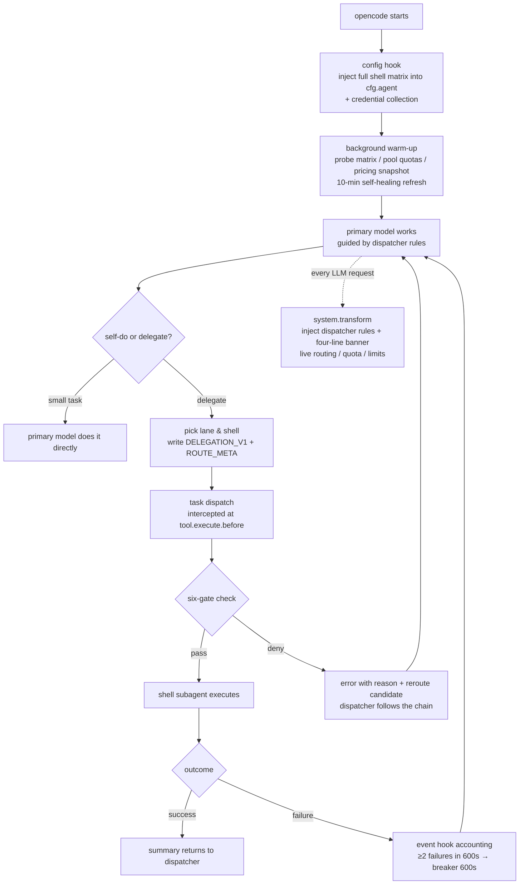

# opencode-switchman

**English** | [中文](./README.zh.md)

> ### 🎯 Fully-automated model matrix ＋ autonomous decisions ＝ every token lands exactly where it matters. Not one wasted.

> **🎬 [Live Presentation Deck](https://mrzturn.github.io/opencode-switchman/)**(GitHub Pages, works on desktop & mobile)
>
> [](https://mrzturn.github.io/opencode-switchman/)

A six-lane shell-matrix orchestration plugin for OpenCode — turns your primary model into a dispatcher that delegates tasks by cognitive tier to bare subagent shells across any opencode provider, while the plugin layer enforces deterministic gating; glm / deepseek / copilot additionally get quota-aware routing.

If you hold multiple model subscriptions (GitHub Copilot premium credits, Zhipu GLM Coding Plan, DeepSeek pay-as-you-go balance) but keep burning a single model forever, blind to water levels and peak pricing — opencode-switchman is built for you.

## Installation & Usage

### Prerequisites

- [opencode](https://opencode.ai) (desktop app or CLI)
- Any opencode provider works out of the box; the following three additionally get quota control (any combination, all optional):
  - **GitHub Copilot**: just sign in via GitHub in opencode (`/connect`)
  - **GLM**: custom provider (`zhipuai-coding-plan`, baseURL `https://open.bigmodel.cn/api/coding/paas/v4` + apiKey)
  - **DeepSeek**: custom provider (`deepseek` + apiKey)
- Zero-config credentials: the plugin reads them **read-only** from opencode's auth layer (auth.json / provider options / env vars) — it never stores secrets or refreshes tokens itself

### Option 1: npm (recommended, available after first release)

Add to your opencode config (`~/.config/opencode/opencode.json` or project `opencode.json`):

```json
{
  "plugin": ["opencode-switchman"]
}
```

opencode installs and loads the npm package automatically via Bun at startup, no other steps needed.

Use the tuple form to pass options:

```json
{
  "plugin": [
    ["opencode-switchman", { "billingWindow": { "glmPeakHours": [14, 18] } }]
  ]
}
```

### Option 2: from source

```bash
git clone https://github.com/mrzturn/opencode-switchman.git
cd opencode-switchman
bun install
bun run build   # produces dist/opencode-switchman.js
```

Then pick one of two loading methods:

**a) Config reference (recommended, follows the repo)** — point the `plugin` array at the repo directory via `file://`:

```json
{
  "plugin": ["file:///absolute/path/to/opencode-switchman"]
}
```

The plugin loads the repo's `dist` bundle directly; after `git pull`, re-run `bun run build` and restart opencode to upgrade. **Choose either this or the plugins-directory deployment** — using both double-loads the plugin.

**b) Single-file deploy** — `bun run deploy` builds and copies into the global plugin directory `~/.config/opencode/plugins/opencode-switchman.js`, which is auto-loaded. The desktop app's embedded core runs on Node, which is exactly what the single-file `deploy` bundle targets.

> **Note**: a `file://` entry in the `plugin` array and a plugins-directory deployment must not coexist (the same plugin loads twice). Once published to npm, replace the `file://...` entry with `"opencode-switchman"` to switch to npm installation. Restart opencode to take effect.

> **Upgrading from the pre-rename plugin (switchman.js)**: delete the old `~/.config/opencode/plugins/switchman.js` to avoid double injection. The state directory has moved to `~/.config/opencode/opencode-switchman/` (the old one can be removed; all state self-heals).

### Verify the installation

After starting opencode, every system prompt of the primary model carries a live four-line banner (the dispatcher's ground truth):

```
[路由] economy: glm-53f-low→ds-v4fv-off | mechanical: glm-53f-high→ds-v4fv-off | main: glm-53-high→ds-v4p-high | ...
[水位] GLM 5h 20% weekly 7% (refreshed 09-04 10:00) | Copilot unlimited credits, used 3885 (since 2026-09-01) | advice: ...
[限制] down: none | reviewer must be hetero-family (producer family ≠ shell family) | DeepSeek tail-only fallback
```

The log also shows `[opencode-switchman] injected N model shells (agents)` — N varies dynamically with the model surface of credentialed providers.

### Options

| Option | Default | Description |
|---|---|---|
| `quota.glm / quota.deepseek / quota.copilot.enabled` | `true` | Per-pool quota probing switches (skipped without credentials) |
| `quota.glm.fiveHourReservePct` | `90` | GLM 5-hour window reserve water level (%): hard-block GLM shells once reached (avoid 429); weekly still only blocks at 100% |
| `quota.deepseek.lowBalanceWarnCny` | `10` | DeepSeek balance warning threshold (CNY): banner [水位] warns below it (warning only, no hard block) |
| `cost.enabled` | `true` | models.dev pricing snapshot as chain tiebreaker |
| `billingWindow.glmPeakHours / dsPeakRanges` | GLM weekdays 14–18 | Peak window definitions (affect pool ordering) |
| `providers.glm / providers.deepseek` | `["zhipuai-coding-plan","glm","zai"]` / `["deepseek"]` | Provider-id lists per pool (for credential collection) |
| `matrix.mode` | `auto` | Dynamic activation mode: `auto` by host (desktop = visible models / cli = favorites), `app`/`tui` force a mode, `legacy` restores the static matrix |
| `matrix.watch` | `true` | Watch visible-model / favorites changes live; recompute the active matrix and probe incrementally |
| `banner.enabled` | `true` | Four-line banner injection |
| `rules.enabled` | `true` | Bundled dispatcher rules (AGENTS.md) injection |
| `lanes` | built-in chains | Custom per-lane shell chains (override built-in preference order) |

## Dynamic Activation Matrix

The shell matrix is no longer a static list — it is built at runtime and updated in real time:

- **Desktop app**: active matrix = visible models from model management; **CLI/TUI**: active matrix = favorites
- With neither configured, it falls back to "the models your live sessions are actually using"; concurrent sessions are unioned, and any model switch is followed in real time on the next request
- Model-management / favorites changes are watched live (fs.watch + mtime polling fallback), recomputing the active matrix with **incremental probing** — fail-open throughout
- Newly added providers are detected in real time with a banner notice (the agent registry is immutable at runtime, so their shells are **registered automatically after restarting opencode** — zero manual maintenance)
- A superset of shells (every conversation-capable model of credentialed providers × models.dev tiers) is injected at startup; `matrix.mode=legacy` fully restores the old static behavior

## Core Ideas

### The problem

Real pain points of juggling multiple subscriptions:

1. **Cognitive mismatch**: flagship models doing scan-and-count chores (tokens wasted), or lightweight models doing architecture design (rework is the most expensive token of all)
2. **Flying blind on water levels**: hammering GLM after the 5-hour window is exhausted, letting Copilot premium credits expire unused at month's end, discovering an empty DeepSeek balance only at failure
3. **Single-family blind spots**: reviewing with the same model family that produced the code — same blind spots, nothing found
4. **Loose delegation**: "hey, take a look at this" prompts carry no structure and no validation

### The solution: dispatcher + shell matrix + deterministic gating

opencode-switchman splits orchestration into three layers:

| Layer | Vehicle | Responsibility |
|---|---|---|
| **Cognitive** | Primary model (dispatcher) + bundled dispatcher rules | Four-dimension task profiling (cognitive intensity × mechanicalness × context size × urgency), self-do vs. delegate, lane & shell choice, writing DELEGATION_V1 prompts |
| **Execution** | "model × effort" bare shells (e.g. `glm-mx-53-high`) | Bind only model and reasoning effort; roles are assigned dynamically by the delegation prompt (14 roles: programmer/tester/reviewer/…) |
| **Deterministic** | The plugin | Six-gate interception, ROUTE_META hard validation, quota/cost-aware chain computation, probe & circuit-breaker self-healing, live four-line banner |

**Token economics is the first principle**: rework is the most expensive token. Hence six cognitive lanes:

| Lane | Typical roles | Uses |
|---|---|---|
| economy | clerk / scouter scanning | cheapest lightweight model, low effort |
| mechanical | tester / ops regression & scripts | lightweight model, high effort |
| main | programmer / uiux / data-analyst | workhorse model, normal effort |
| hard | planner, core architecture | strongest model, max effort |
| vision | observer image reading | vision-capable models |
| review | reviewer / expert panel | **forced hetero-family** (against same-family blind spots) |

Water levels only affect ordering (use it, don't waste it); the only hard block is "this call cannot possibly succeed" (quota definitively exhausted). DeepSeek pay-as-you-go always sits at the chain tail as fallback — automatic routing never picks it; it requires explicit nomination.

## How It Works

### Lifecycle



### The six gates (order = priority)

On every subagent dispatch, the plugin runs deterministic checks before the task tool executes; any hit denies with a reroute candidate:

| Gate | Check | Meaning |
|---|---|---|
| 1 Registry | shell not enabled / unprobed | unregistered surfaces cannot be dispatched |
| 2 Probe matrix | combo measured down | block the clearly unavailable |
| 3 Breaker | ≥2 failures within 600s | "tripping, auto-recovers in ~10 min" |
| 4 Pool exhausted | quota says the call must fail | human-readable reason (GLM 100% / Copilot definitively out / DS overdrawn) |
| 5 Protocol | ROUTE_META missing / illegal | deny with sample & legal values |
| 6 Semantics | same-family review / rw→ro shell / image→non-vision / auto picking paid fallback | "review needs a hetero-family lens", etc. |

ROUTE_META is a single-line protocol embedded in the delegation prompt, six keys, validated field by field:

```
ROUTE_META {"lane":"main","role":"programmer","producer_family":"glm","capability":"rw","modality":"text","source":"auto"}
```

### Data plane (fully automatic, fail-open)

- **Probe**: fires real requests against the three quota pools (other providers fail open), persists a matrix (TTL 600s); down combos drop out of chains automatically
- **Quotas**: direct queries — GLM monitor / DeepSeek balance / Copilot `copilot_internal/user` — no proxy, tiered TTL caches
- **Costs**: models.dev pricing snapshot; on equal water-level scores the cheaper shell sorts first (weak tiebreaker)
- **Banner**: `[路由][水位][限制][更新]` four lines injected into every system prompt, keeping the dispatcher informed
- **Fail-open iron law**: any hook error only writes to stderr and never blocks the main flow; unknown quotas never hard-block — the breaker and probe are the second source of truth

### State directory

`~/.config/opencode/opencode-switchman/`: `shells.json` (optional custom override; the bundled matrix is the default), `model-matrix.json` (probe), `routing.json` (breaker), `failures.log` (accounting), `*-quota.json` / `ds-balance.json` (quota caches), `costs.json` (pricing), `delegation-template.md` (full DELEGATION_V1 template).

## Maintaining the model matrix

By default (`matrix.mode=auto`) the matrix is built at runtime: visible models / favorites / session models are activated automatically — zero upkeep. Temporary model outages self-heal via probes (10-minute background refresh, automatic degradation/breaking).

The bundled static matrix (13 models → 52 shells) serves only `legacy` mode and runtime metadata fallback. To customize the static surface:

```bash
# 1. Sync the authoritative enabled surface (models visible in opencode model management, one provider/model-id per line)
$EDITOR scripts/visible-models.txt
# 2. Regenerate the bundled matrix (fetches effort tiers from models.dev)
bun run gen:shells
# 3. Restart opencode (takes effect in legacy mode)
```

## Development & Verification

```bash
bun install
bun test            # 33 behavioral contract fixtures (META / gates / chains / breaker / quota)
bunx tsc --noEmit   # type check
bun run build       # regenerate matrix and bundle the single-file build
```

## Documentation

- [Technical spec (contracts / algorithms / field-test notes)](./docs/2026-08-28-opencode-switchman-技术方案.md) (Chinese)
- [Dispatcher rules AGENTS.md](./AGENTS.md) (bundled and injected via system prompt; no manual install needed)
- DELEGATION_V1 template: see `delegation-template.md` in the state directory after installation

## License

[MIT](./LICENSE)
