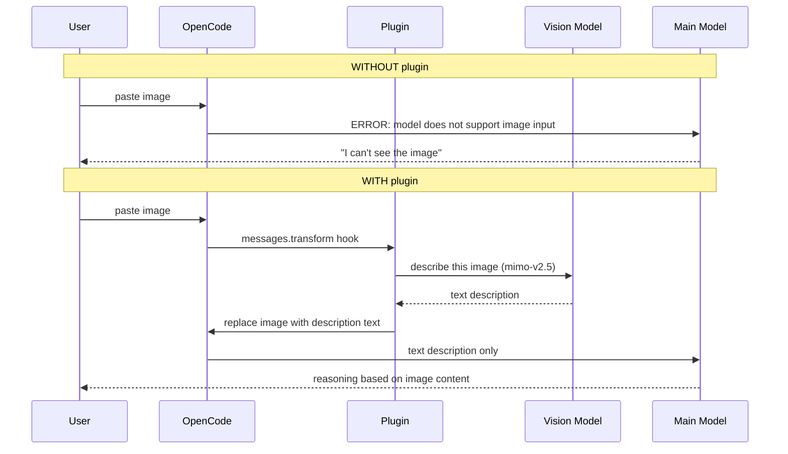

# opencode-vision-fallback

<p align="center">
  
</p>

Auto-describe images via a vision model when the active model lacks vision support.

When you paste/drop an image into an OpenCode session whose active model can't read images (e.g. `deepseek-v4-flash`), this plugin transparently:

1. Detects the image part in the message
2. Calls a vision-capable model (e.g. `mimo-v2.5`)
3. Replaces the image with a text description
4. Main model receives the description as plain text

No manual model switching. No "this model does not support image input" errors.

## Pipeline

```
┌─────────────┐
│  User        │
│  paste/drop  │
│  image       │
└──────┬──────┘
       ▼
┌─────────────┐     ┌──────────────────────────┐
│  OpenCode   │     │  Plugin                   │
│             │     │                           │
│  message    │────▶│  hook: messages.transform │
│  with image │     │                           │
│  FilePart   │     │  image part found?        │
└──────┬──────┘     └────────────┬─────────────┘
       │                         │ yes
       │                         ▼
       │              ┌──────────────────────────┐
       │              │  call vision model       │
       │              │  (mimo-v2.5)             │
       │              └────────────┬─────────────┘
       │                           ▼
       │              ┌──────────────────────────┐
       │              │  get text description    │
       │              └────────────┬─────────────┘
       │                           ▼
       │              ┌──────────────────────────┐
       │              │  replace image part      │
       │              │  with description text   │
       │              └────────────┬─────────────┘
       │                           │
       ▼                           ▼
┌──────────────────────────────────────────────┐
│  messages converted → no images left to strip │
└──────────────────────┬───────────────────────┘
                       ▼
┌──────────────────────────────────────────────┐
│  main model (deepseek-v4-flash)               │
│  receives text description                    │
└──────────────────────────────────────────────┘
```

### Step-by-step

```
┌─────────────────────────────────────────────────────────────┐
│ 1. User pastes image → OpenCode adds FilePart (image/png)   │
│ 2. Hook fires (experimental.chat.messages.transform)        │
│ 3. Plugin detects image part                                 │
│ 4. Plugin calls vision model (mimo-v2.5) via API             │
│ 5. Vision model returns text description                     │
│ 6. Plugin replaces image part with [Image: ...] text part    │
│ 7. Messages converted → no images left to strip              │
│ 8. Main model (deepseek-v4-flash) receives text description  │
└─────────────────────────────────────────────────────────────┘
```

### With vs without the plugin



## Why

Many strong coding models (`deepseek-v4-flash`, GLM, Haiku) don't support image input. Without a fallback, OpenCode replaces pasted images with an error string (`ERROR: Cannot read image...`), and the model has no idea what you showed it.

This plugin solves that by giving the model a **text description** of the image instead — so the main model can reason about the image without needing vision capability.

## Install

Add the plugin to your `opencode.json`:

```json
{
  "plugin": ["./opencode-vision-fallback/src/index.ts"]
}
```

Or via npm (once published):

```json
{
  "plugin": ["opencode-vision-fallback"]
}
```

## Configuration

All options are optional. Configure via the plugin options array:

```json
{
  "plugin": [["opencode-vision-fallback", {
    "vision_model": "mimo-v2.5",
    "base_url": "https://opencode.ai/zen/go/v1",
    "api_key_env": "OPENCODE_API_KEY",
    "auth_provider": "opencode-go",
    "max_tokens": 1000,
    "timeout_ms": 30000,
    "mime_prefix": "image/",
    "prompt": "Describe this image in detail. Focus on: text, UI elements, code, diagrams."
  }]]
}
```

| Option | Default | Description |
|--------|---------|-------------|
| `vision_model` | `mimo-v2.5` | Vision-capable model id |
| `base_url` | `https://opencode.ai/zen/go/v1` | OpenAI-compatible base URL |
| `api_key_env` | `OPENCODE_API_KEY` | Env var holding the API key |
| `auth_provider` | `opencode-go` | Key in `auth.json` to fall back to |
| `max_tokens` | `1000` | Description length cap |
| `timeout_ms` | `30000` | Per-image request timeout |
| `mime_prefix` | `image/` | Which file mimes to process |
| `prompt` | *(default)* | Description prompt |

## API key resolution

The plugin looks for the key in this order:

1. Env var (`api_key_env`, default `OPENCODE_API_KEY`)
2. `auth.json` under `auth_provider` key (default `opencode-go`)

The `auth.json` path is `~/.local/share/opencode/auth.json`, overridable via `OPENCODE_AUTH_FILE`.

## How it works

### The problem in OpenCode

OpenCode's provider transform (`packages/opencode/src/provider/transform.ts`) has an `unsupportedParts()` function. When the active model's `capabilities.input` doesn't include `image`, it **replaces image parts with error text** before the request reaches the LLM:

```
ERROR: Cannot read "clipboard" (this model does not support image input). Inform the user.
```

This happens at the provider layer — so by the time the model sees the message, the image is already gone.

### The fix: intercept before the transform

This plugin hooks into OpenCode's `experimental.chat.messages.transform` plugin hook. In the session pipeline (`packages/opencode/src/session/prompt.ts`), this hook runs:

```
messages prepared
  → plugin.trigger("experimental.chat.messages.transform", ...)   ← plugin runs here
  → MessageV2.toModelMessagesEffect(msgs, model)                  ← images get stripped here
```

The plugin mutates `output.messages` **in place** — replacing each image `FilePart` with a text `Part` that carries the vision model's description. When `unsupportedParts()` later runs, there are no image parts left to strip.

### Message format

OpenCode v2 message parts use the `FilePart` schema for attachments:

```ts
type FilePart = {
  type: "file"
  mime: string        // e.g. "image/png"
  filename?: string
  url: string         // data: URL or file path
  source?: FilePartSource
}
```

The plugin matches parts where `type === "file"` and `mime` starts with the configured `mime_prefix` (default `image/`).

### Vision call

For each matched image, the plugin makes an OpenAI-compatible chat completion request:

```
POST {base_url}/chat/completions
{
  "model": "mimo-v2.5",
  "messages": [{
    "role": "user",
    "content": [
      { "type": "text", "text": "<prompt>" },
      { "type": "image_url", "image_url": { "url": "<image url>" } }
    ]
  }],
  "max_tokens": 1000
}
```

The returned description replaces the image part:

```ts
msg.parts[idx] = {
  type: "text",
  text: `[Image: ${description}]`
}
```

The main model then receives the description as plain text.

## OpenCode features used

| Feature | Where |
|---------|-------|
| **Plugin hook** `experimental.chat.messages.transform` | `packages/opencode/src/session/prompt.ts` — runs after messages are prepared, before LLM dispatch |
| **Plugin options** (`PluginOptions` second arg) | `packages/opencode/src/plugin/index.ts` — `server(input, load.options)` |
| **Message V2 schema** (`FilePart`) | `packages/schema/src/v1/session.ts` — `type: "file"`, `mime`, `url` fields |
| **Structured logging** (`client.app.log`) | `client.app.log({ body: { service, level, message } })` — goes to `opencode.log`, not the TUI |
| **Auth storage** | `~/.local/share/opencode/auth.json` — provider key lookup |

## Logging

Logs go to OpenCode's structured log (`~/.local/share/opencode/log/opencode.log`) tagged `service: "vision-fallback"` — nothing prints into the TUI chat.

```
level=INFO message="detected 1 image(s), routing to vision model"
level=INFO message="image replaced with text description"
level=INFO message="processed 1 image(s) via vision model"
```

## Failure behavior

- **No API key** → image left for main model (degrades to current OpenCode behavior, logs a warning)
- **Vision API error** → image left untouched, error logged
- **Timeout** → aborts after `timeout_ms`, image left untouched
- **Unknown mime** → not processed

The plugin never breaks the main pipeline — all failures degrade gracefully.

## License

MIT
