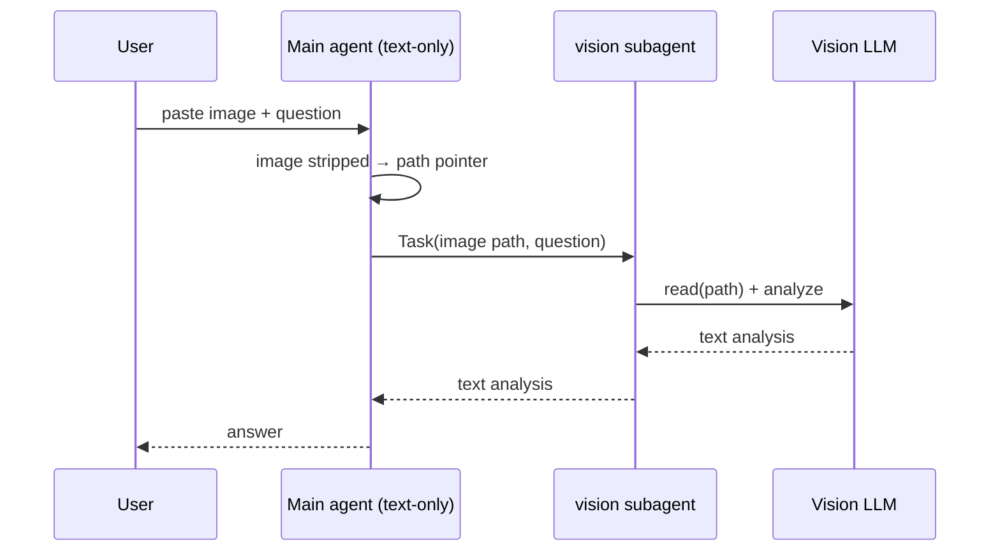

<p align="center">
  
</p>

<h1 align="center">opencode-vision-router</h1>

<p align="center">
  Route pasted images to a cheap vision model in <a href="https://opencode.ai">opencode</a> so a
  text-only main agent can work from the vision model's <strong>text</strong> output.
</p>

<p align="center">
  <a href="https://www.npmjs.com/package/opencode-vision-router"></a>
  <a href="https://www.npmjs.com/package/opencode-vision-router"></a>
  <a href="https://www.npmjs.com/package/opencode-vision-router"></a>
  <a href="https://www.npmjs.com/package/opencode-vision-router"></a>
  
</p>

---

opencode attaches a pasted image to the **main (text-only) model's** message and drops or errors
on it _before_ any skill or subagent runs. A skill alone cannot fix this. The only reliable fix is a
**plugin hook** that intercepts the image at the harness level, resolves it to a readable path, and
lets a cheap vision model analyze it.

`opencode-vision-router` is a self-contained, zero-config plugin that does exactly that — and injects
the vision subagent for you, so there are **no separate agent or skill files** to manage.

## ✨ Features

- 🖼️ **Pasted-image routing** — `data:` URLs, `file://` paths, absolute paths, and OpenCode V2 raw media parts all supported.
- 📸 **Multiple images** — handles several pasted images in a single message, routing each one to the vision subagent.
- 💸 **Cheap vision model** — point it at any image-capable model (`provider/model`).
- 🧠 **Multimodal-aware** — if your main model already sees images, routing is skipped automatically. Set `force` to always route (e.g. to a cheaper vision model).
- 🧩 **Self-contained** — injects the vision subagent and system instruction at load time.
- 🔒 **Safe by default** — the vision subagent can read the image but is denied edit/bash/webfetch.
- ⚡ **OpenCode 1 & 2** — one default export supports both the V1 plugin API (`server()`) and the V2 plugin API (`setup()`), plus V2 model-catalog capability detection and V2 message media parts.

## 🧠 How it works

The plugin registers the following behavior at load time, in whichever API shape your
opencode version supports:

1. **Vision subagent injection** — declare the chosen model as image-capable and inject the
   `vision` subagent (V1 `config` hook / V2 `agent.transform`).
2. **Capability detection** — per model, learn whether the main model can see images
   (V1 `chat.params` learning / V2 model-catalog lookup), so multimodal main models are
   skipped unless `force` is set.
3. **Image rewrite** — strip the image from the user message and replace it with a text
   pointer containing the resolved path, so a text-only model never sees the bytes:
   - V1: `chat.message` (primary) + `experimental.chat.messages.transform` (backup).
   - V2: a `session.hook("context")` registered in `setup()`, which rewrites `media`
     parts in the assembled messages immediately before each agent model request and
     covers both fresh attachments and history.

> ⚠️ V1 relies on opencode's **experimental** `experimental.chat.messages.transform` hook,
> which may change in future opencode versions. In V2 the equivalent is the stable
> `context` session hook.

## 📦 Installation

Add it to your `opencode.json(c)` and restart opencode — plugins are not hot-reloaded.

**OpenCode 2** uses the `plugins` key with a package/options object:

```json
{
  "plugins": [
    { "package": "opencode-vision-router", "options": { "model": "opencode-go/qwen3.7-plus" } }
  ]
}
```

**OpenCode 1** uses the `plugin` key with a package/options tuple
(OpenCode `1.18.29` or newer is required for the object-form entrypoint this plugin ships):

```json
{
  "plugin": [
    ["opencode-vision-router", { "model": "opencode-go/qwen3.7-plus" }]
  ]
}
```

## ⚙️ Configuration

| Option   | Required | Default       | Description                                                                                                                        |
| -------- | -------- | ------------- | ---------------------------------------------------------------------------------------------------------------------------------- |
| `model`  | yes      | —               | Vision-capable model as `provider/model` (e.g. `opencode-go/qwen3.7-plus`). If omitted, routing is disabled (a warning is logged). |
| `agent`  | no       | `vision`        | Name of the injected vision subagent.                                                    |
| `tmpDir` | no       | `os.tmpdir()`   | Directory under which decoded images are cached (content-hashed, reused across calls).    |
| `force`  | no       | `false`         | Route images to the vision subagent even when the main model is multimodal (e.g. to use a cheaper vision model). By default the subagent is **skipped** when the main model can already see images. |

## 🚀 Usage examples

### Basic

OpenCode 2:

```json
{
  "plugins": [
    { "package": "opencode-vision-router", "options": { "model": "opencode-go/qwen3.7-plus" } }
  ]
}
```

OpenCode 1 (>= 1.18.29):

```json
{
  "plugin": [
    ["opencode-vision-router", { "model": "opencode-go/qwen3.7-plus" }]
  ]
}
```

### Multiple plugins

```json
{
  "plugins": [
    "@dodopayments/opencode-plugin",
    { "package": "opencode-vision-router", "options": { "model": "opencode-go/qwen3.7-plus" } }
  ]
}
```

### Custom subagent name and cache directory

```json
{
  "plugins": [
    {
      "package": "opencode-vision-router",
      "options": {
        "model": "anthropic/claude-3-5-haiku",
        "agent": "image-reader",
        "tmpDir": "/var/tmp/opencode-vision"
      }
    }
  ]
}
```

### Force routing on a multimodal main model

If your main model can already see images, routing is skipped by default. Set `force: true`
to always route — e.g. to send images to a *cheaper* vision model while keeping a stronger
text model as main:

```json
{
  "plugins": [
    {
      "package": "opencode-vision-router",
      "options": { "model": "openai/gpt-4o-mini", "force": true }
    }
  ]
}
```

### Consuming the plugin

`opencode-vision-router` is an opencode plugin and is wired up only through your `opencode.json`
(see Installation / Configuration above). Its helper functions (`image.ts`, `transform.ts`,
`agent.ts`) are plain, dependency-free implementation details used by the plugin itself and
covered by the test suite — they are intentionally **not** part of the package's public API, so
import them from the source tree only if you are extending the plugin, not from the published
package.

## 🖥️ Screenshots

A pasted image is intercepted and routed to the vision subagent:


Request flow:



## 🛠️ Development

```bash
bun install
bun test        # run the test suite
bunx tsc --noEmit   # type-check
```

### Project structure

```
src/
  index.ts        # plugin entrypoint — dual V1/V2 default export (no public re-exports)
  types.ts        # shared option & message types
  image.ts        # resolveImagePath / resolveMediaPath, decodeDataUrl, extForMime
  transform.ts    # transformMessages / transformV2Messages, imagePointer (pure)
  agent.ts        # buildVisionAgentConfig, applyConfig, applyAgent, delegationInstruction
  index.test.ts   # Bun tests
```

## 🤝 Contributing

Contributions welcome! This is a small, single-purpose plugin, so the bar for patches is low.

1. Fork the repo and create a branch: `git checkout -b fix/my-change`.
2. Install deps and run the checks: `bun install && bun test && bunx tsc --noEmit`.
3. Add tests for any new behavior.
4. Keep the plugin self-contained — prefer extending the injected subagent over adding new files
   users must wire up.
5. Open a PR with a clear description of the problem and the fix.

Please file issues for bugs, hook-contract changes in opencode, or model-compatibility reports.

## 🚀 Releasing

Publishing, OIDC/Trusted-Publisher setup, and the build→`dist/` flow are documented in
[`release.md`](./release.md).

## 📜 License

[MIT](./LICENSE) © opencode-vision-router contributors.
