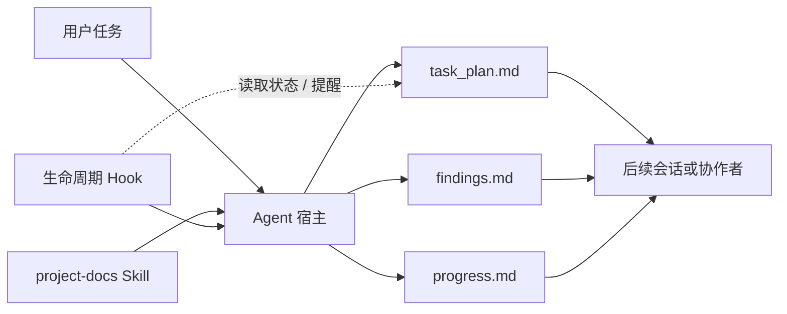

[简体中文](README.md) | [English](README.en.md)

# PlanWeft

让编程 Agent 的任务在会话结束后仍然有可读、可接续、可核验的项目记录。

PlanWeft 把任务计划、调查发现和验证结果保存到项目文件中。后续会话或协作者可以从这些记录继续工作，而不依赖旧聊天。

## 为什么需要 PlanWeft

Agent 的对话上下文会结束，但任务不会因此结束。PlanWeft 提供一套由项目文件承载的工作记录：Skill 指导 Agent 如何使用这些记录，Hook 在宿主支持的生命周期事件中读取状态或提供提醒，项目文件保存真正需要接续的内容。

## 安装

需要 Node.js 22 或更高版本。以 Codex 完整集成为例：

```bash
npx planweft@0.5.1 add -a codex --global
npx planweft@0.5.1 doctor -a codex --global
```

安装后创建新会话，显式调用 `$project-docs`，再确认宿主已发现并启用了相应资源。其他宿主、scope 和 Skill-only 用法见[安装指南](docs/installation.md)。

## 一次任务怎么使用

例如，在新的 Codex 会话中：

```text
$project-docs
修复 CSV 导入空行导致的崩溃，补回归测试，并更新受影响的使用说明。
```

对于需要持续规划的复杂任务，PlanWeft 会选择已有计划或在授权范围内初始化任务记录。命名计划通常位于：

```text
your-project/
└── .planning/
    └── <date>-fix-csv-import/
        ├── task_plan.md
        ├── findings.md
        └── progress.md
```

Agent 在任务过程中维护这些记录；后续会话或协作者可以从目标、当前阶段、调查结果、实际验证和下一步继续工作。只读请求和简单修改不要求创建新计划。

## 安装后 Agent 得到什么

各宿主的目录略有不同，下面是自包含插件包的简化示意：

```text
planweft/
├── skills/
│   └── project-docs/
│       ├── SKILL.md              # 核心工作规则
│       ├── references/           # 按需读取的详细规则
│       ├── scripts/              # 计划选择、检查和交接辅助脚本
│       └── templates/            # 任务记录模板
├── hooks/                        # 宿主生命周期适配
├── extensions/ or commands/      # 宿主原生入口（如适用）
└── package metadata              # 宿主发现和版本信息
```

这棵树说明包的组成，不证明某台机器已经安装、信任、启用插件，也不证明模型已经读取 Skill。

## Skill、Hook 和项目记录如何串起来



Skill 决定 Agent 如何在授权范围内工作和维护记录；Hook 只能在宿主实际支持且启用的事件中读取状态、注入上下文或返回宿主允许的控制结果；三份项目记录保存任务的持久状态。

## 关键文件的职责

| 文件或组件 | Agent 什么时候接触 | 作用 |
| --- | --- | --- |
| `skills/project-docs/SKILL.md` | 宿主选中 Skill 后 | 指导计划、调查、实施、验证和交接 |
| `references/*.md` | Skill 按任务需要 | 提供计划选择、证据、控制和文档导航细则 |
| `scripts/resolve-plan-dir.*` | 开始或恢复复杂任务时 | 定位当前任务的计划目录 |
| `scripts/init-session.*` | 需要建立新任务记录时 | 初始化 `task_plan.md`、`findings.md` 和 `progress.md` |
| `templates/*.md` | 初始化或扩展记录时 | 提供记录结构，不代表一定会被复制 |
| 宿主 Hook 或原生扩展 | 会话、提示词、工具、压缩或结束事件 | 读取计划状态并提供上下文或提醒 |
| `task_plan.md` | 任务全生命周期 | 保存目标、阶段、下一步、阻塞和交接判断 |
| `findings.md` | 调查和设计阶段 | 保存来源、观察、假设和候选决定 |
| `progress.md` | 实施和验证阶段 | 保存实际动作、错误和 `Passed` / `Failed` / `Not Run` |

## 一个任务会留下什么

复杂任务通常会在项目中留下三份记录。它们属于用户项目，不属于插件安装目录；更新或卸载 PlanWeft 不会删除它们。已有的需求、设计和复现文档仍由项目自己的目录管理。

```text
your-project/
├── <selected task directory>/
│   ├── task_plan.md
│   ├── findings.md
│   └── progress.md
└── <existing project documents>/
```

Skill、Hook 和文档都不会绕过项目规则、用户授权或宿主权限。

## 支持的宿主

当前 npm 包包含 15 个宿主分发目标。其中 `codex`、`claude`、`pi`、`opencode` 和 `dsh` 是主要支持集成，其余目标目前按实验性适配处理。分发存在不等于宿主已经加载或模型已经使用；事件、原生入口和能力边界见[宿主说明](docs/hosts.md)。

## 文档入口

- [安装、更新、回退与卸载](docs/installation.md)
- [架构、生命周期与文件职责](docs/architecture.md)
- [宿主分发与能力边界](docs/hosts.md)

维护者资料： [开发与生成约定](docs/development.md) · [发布与证据维护](docs/releasing.md)。历史计划、复现、审查和参考资料从[文档导航](docs/README.md)进入。
