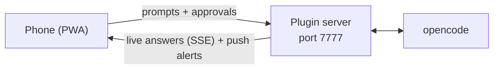
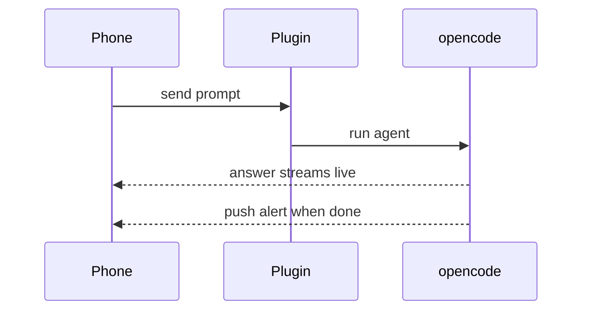

# Pocketpilot

Control any [opencode](https://opencode.ai) session from your phone. Scan a QR code, send prompts, watch answers stream in live, approve permission requests, and get push alerts when the agent finishes or needs you.

No app install — it's a PWA served directly by the plugin. Everything runs on your machine; your phone talks to opencode over your own network.

## Features

- **QR pairing** — type `/remote` in the opencode TUI (or run `qr.sh`) and scan with your phone camera
- **Full session control** — list sessions, create new ones, send prompts, abort runs
- **Live answers** — responses stream to your phone in real time (SSE), with an accurate busy indicator
- **Permission approvals** — approve/reject tool permission requests (Once / Always / Reject) from the phone
- **Alerts** — web push notifications on `session.idle` (agent finished), permission requests, and session errors
- **Works with every opencode instance** — the plugin auto-starts with each one; the TUI and your phone share the same session state
- **Secure by default** — 48-hex random token, timing-safe comparison, all API routes gated; token lives only on your machine and in the QR

## Install

### Option A — npm plugin (one line)

Add to `~/.config/opencode/opencode.json`:

```json
{
  "plugin": ["pocketpilot"]
}
```

Restart opencode. This installs the phone server + PWA + alerts.

For the instant `/remote` QR command in the TUI, also add to `~/.config/opencode/tui.json`:

```json
{
  "$schema": "https://opencode.ai/tui.json",
  "plugin": ["pocketpilot/tui"]
}
```

### Option B — install script

```sh
git clone https://github.com/AnkitPorwal04/pocketpilot.git
cd pocketpilot
./install.sh
```

Copies the plugins into `~/.config/opencode/` and wires up `tui.json` for you.

## Usage

1. Restart opencode (any project).
2. Type `/remote` (alias `/qr`) in the TUI — a QR dialog appears instantly.
3. Scan it with your phone camera and open the link.
4. You're in: pick a session, prompt it, watch the answer arrive.

Other ways to connect:

- `~/.config/opencode/remote-control/qr.sh` — opens the QR page in your browser
- `~/.config/opencode/remote-control/last-url.txt` — plain-text connect URL + ASCII QR

## Alerts / push notifications

In-app alerts work out of the box over your LAN.

Browser **push** notifications (screen-off alerts) require HTTPS. Install [cloudflared](https://developers.cloudflare.com/cloudflare-tunnel/) and the plugin automatically opens a tunnel, upgrades the QR to an HTTPS URL, and enables push — plus you can then control sessions from anywhere, not just your WiFi:

```sh
brew install cloudflared   # macOS
```

Then tap the bell icon on the phone UI to subscribe.

## How it works

- A tiny HTTP server (Node `http`, ports 7777–7787) starts inside each opencode process via the plugin API
- It proxies to opencode's own server API (`prompt_async`, messages, permissions, `/event` SSE)
- The phone UI is a single embedded PWA — dark theme, chat bubbles, tool chips, typing indicator
- State (token, VAPID keys, push subscriptions) lives in `~/.config/opencode/remote-control/state.json`

### Architecture



### Sending a prompt



## Security

- Every API route requires the token (`?key=` or `Bearer`), compared with SHA-256 + `timingSafeEqual`
- The QR code *is* the password — only show it to yourself
- To rotate the token: delete `~/.config/opencode/remote-control/state.json` and restart opencode
- Without cloudflared, traffic is plain HTTP on your LAN — fine at home, use the tunnel on untrusted networks

## Troubleshooting

| Symptom | Fix |
| --- | --- |
| Phone can't connect | Phone and computer must be on the same WiFi (or use cloudflared) |
| 401 unauthorized | Re-scan the QR; token may have rotated |
| `/remote` not found | Restart opencode; check `tui.json` has the plugin entry |
| No push notifications | Push needs HTTPS — install cloudflared and re-subscribe via the bell |
| Port already in use | The plugin tries 7777–7787 automatically; each instance gets its own port |

## License

MIT
