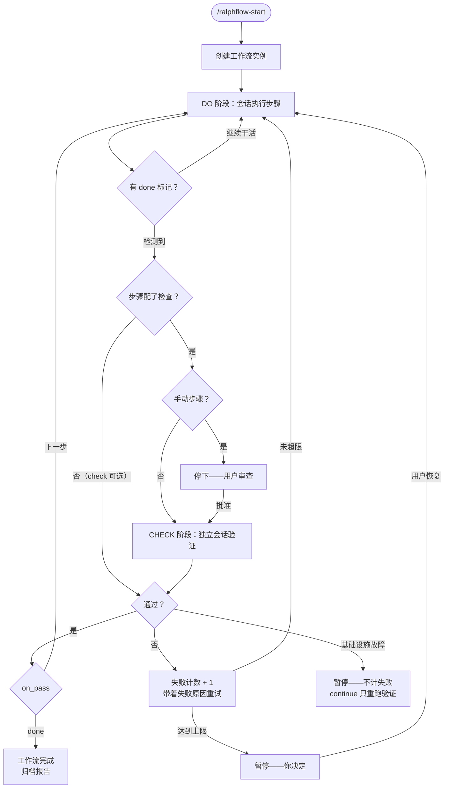
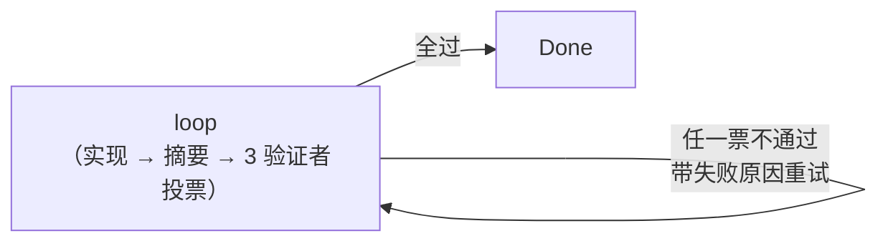
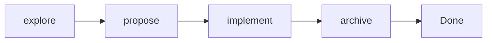

<div align="center">

# ralph-flow

**opencode 工作流自动化插件——把"执行、独立验证、重试"变成插件级强制**

[](https://www.npmjs.com/package/@yibener/ralph-flow)
[](LICENSE)
[](https://opencode.ai)

</div>

---

## 这是什么

你让 AI"实现认证模块、写测试、更新文档、确认全绿"，它常常写了代码就停——测试没跑、文档没写。ralph-flow 把这类多步骤承诺变成必须遵循的状态机：每步做完，由独立的验证会话检查，通过才放行。它不是提示词技巧，是插件级强制。

## 怎么工作的



CHECK 不是同一个会话再问一遍"你做完了吗"。它是一个独立的验证者会话——没看过 DO 阶段的对话、没有实现上下文、不认识你——只按检查依据判断工作有没有真的完成。AI 对自己的工作过度自信，验证者不会，它要求独立的证据。

`check` 不是必填。步骤不写 `check` / `check_voting` 时，DO 完成后直接按 `on_pass` 推进，不跑对抗验证。适合文档整理、纯编排这类不需要独立复核的步骤。需要人审的步骤用 `manual_step`——人工审查门本身就算通过。

## 能力

| 类别 | 能力 |
|------|------|
| 独立验证 | CHECK 阶段独立会话评判（`edit: deny` 硬约束；可配 agent / 模型 / 超时） |
| 多验证者投票 | `check_voting`：1-5 个验证者并行独立检查（各自检查依据 / 模型），全过才放行；失败聚合多角度反馈、infra 自动重试、每票实时进度推送 |
| 检查可选 | 步骤不写 `check` / `check_voting` 就跳过对抗验证，DO 完成后直接走 `on_pass`；`manual_step` 默认由人工审查替代验证（显式写了 check 才叠加）；doctor 对非 manual 的无 check 步骤醒目告警 |
| 自动重试 | CHECK 不通过，带着失败原因回到 DO——不是盲目重来 |
| 多实例并行 | 同一项目里每会话跑自己的实例，互不干扰 |
| 人工审查门 | `manual_step` 做完停下让你审查，`continue` 放行（显式写了 check 才叠加验证） |
| 中途回退与上下文重置 | `/ralphflow-rewind` 倒退状态机到上游已通过 CHECK 的步骤（`reason` 必填、跨会话注入）；`/ralphflow-reset` 换新会话重做当前步（可选 `reason`）；`reset: true` / `auto_reset: true` 在步骤边界自动换干净上下文，换入载体默认应用内换会话（`isNewOpen: true` 可选开启物理新窗口交接） |
| 分支与恢复 | `on_fail` 路由到特定恢复步骤，不只是一个劲重试 |
| 子工作流 | 组合可复用组件，最多 5 层嵌套 |
| 诊断与创建 | `/ralphflow-doctor` 提前抓定义错误；`/ralphflow-create` 交互式设计 |
| 日志与报告 | JSONL 执行日志 + 逐步骤追踪的归档报告 |

## 快速开始

### 安装

```json
// ~/.config/opencode/opencode.json 或项目 opencode.json
{ "plugin": ["@yibener/ralph-flow"] }
```

重启 opencode，输入 `/` 就能看到 `loop`、`spec` 和你的自定工作流。更详细的安装说明（含本地克隆）见下方安装一节。

### 跑起来

```
/loop "用 JWT + refresh token 实现用户认证模块"
```

工作流自动执行、自动验证、自动推进，绝大多数时间你只需等。只有两类时刻会提示"轮到你了"：手动审查步骤、连续失败暂停。

### 定义你自己的工作流

```yaml
# .opencode/ralph-flow/workflows/my-flow.yaml
description: 实现、测试并文档化一个功能

steps:
  - id: analyze
    desc: 任务分析
    do: 分析需求，产出 design.md
    input: 用户需求
    output: "design.md"
    check: 打开 design.md，核对覆盖数据模型、API、错误处理
    on_pass: execute
    on_fail: analyze
    max_fail_count: 3

  - id: execute
    desc: 实现
    do: 按设计实现，跑全量测试到全绿
    input: design.md
    output: 测试通过的可工作代码
    check: 自己跑测试套件；核对代码与 design.md 一致
    on_pass: done
    on_fail: execute
    max_fail_count: 5
```

每个步骤必须有 `id`、`desc`、`do`、`input`、`output`、`on_pass`、`on_fail`、`max_fail_count`。`check` 是可选字段——不写就跳过对抗验证（见上文）。缺必填项的步骤会被静默跳过，用 `/ralphflow-doctor` 抓出来。完成标记：`<promise>done</promise>`。

## 核心概念

**DO → CHECK → 推进**。每个步骤分两个阶段：

- DO（工作会话）执行任务，最后一行输出 `<promise>done</promise>` 表示完成
- CHECK（独立验证会话）严格对照检查依据评判，不和 DO 阶段共享记忆

**独立验证不是自问自答。** CHECK 阶段是一个新会话——它没看过你的实现过程、不知道你的意图、不受你的产出报告影响。它的铁律：不能改文件（`edit: deny` 硬约束）、必须自己看代码跑命令找证据。AI 说"做过"不算数——验证者要看到文件在、命令跑通。

**上下文会脏，你能救。** 长工作流跑到后半段，会话里塞满探索、试错、验证记录——模型开始丢需求、跑偏。三种方式解决：

| 场景 | 方式 | 效果 |
|------|------|------|
| 当前步的上下文脏了 | `/ralphflow-reset`（可选带 `reason`） | 换新会话重做当前步 |
| 前面某步方向错了 | `/ralphflow-rewind <步骤> "原因"` | 倒退状态机、重做该步及后续 |
| 进入某个重步骤前 | 步骤标 `reset: true` 或工作流级 `auto_reset: true` | 进入该步时自动换新会话（含失败重试） |

换新会话的载体由工作流级 `isNewOpen` 决定：缺省 `false`，保持应用内换会话（与 2.9.x 行为一致）；设 `isNewOpen: true` 才物理开一个终端窗口 attach 新会话，开窗失败自动降级为应用内跳转。rewind 的 `reason` 必填且跨会话注入新会话首条 DO 提示前——新会话冷启动时靠它知道"这次重做要纠正什么"。

**随时接管。** 实例属主是状态里的 `session_id` 字段。任何会话都可以 `/ralphflow-continue` 接管一个实例继续（项目里只有一个实例时自动），不管原先的会话是否还在。

## 命令一览

| 命令 | 作用 |
|------|------|
| `/ralphflow-start` | 启动工作流实例 |
| `/ralphflow-continue` | 批准审查 · 恢复暂停 · 接管实例 |
| `/ralphflow-rewind <步> "原因"` | 回退到上游已通过 CHECK 的步骤重做 |
| `/ralphflow-reset` | 换干净会话重做当前步（可选 `reason`） |
| `/ralphflow-status` | 当前进度或全部实例概览 |
| `/ralphflow-cancel` | 取消并归档报告 |
| `/ralphflow-list` | 列出工作流 + 活跃实例 |
| `/ralphflow-doctor` | 诊断所有工作流定义 |
| `/ralphflow-create` | 交互式设计自定义工作流 |

每个工作流自动注册成同名 slash 命令（`/loop`、`/spec` 等），输入 `/` 即可补全。

## 内置工作流

### loop——多验证者对抗驱动的单步循环

开放式任务、Bug 修复、范围明确的功能开发。一个步骤内完成「实现 → 执行摘要 → 3 个验证者并行投票 → 修复」的迭代闭环，直到验证者全过。每个验证者独立检查一条需求完成度标准（每一条要求都已落实 / 行为符合预期真实可用 / 没有遗漏的需求与边界情况），互不共享记忆，全过才放行。每轮结束把执行摘要追加到 `summary.md`（多轮累积、跨会话可查）。默认 `reset: true`：每轮失败重试换干净上下文，失败原因随 retryContext 带入；用默认载体（应用内换会话），不物理开窗。

```
/loop "用 JWT + refresh token 实现用户认证模块"
```



想让 loop 用更多或更少的验证者，改 `check_voting` 数组即可（1-5 条，写几个就几个）。

### spec——四步开发流水线

需要需求 → 方案 → 实现 → 归档的结构化开发。每步产出后独立验证。

```
/spec "添加 OAuth2 用户认证功能"
```



## 文档

| 想了解 | 看这个 |
|--------|--------|
| 创建自己的工作流（YAML 字段、check 可选、重置门、分支、嵌套、多验证者投票） | [自定义工作流指南](docs/custom-workflows.md) |
| 架构、事件、状态管理、多实例模型 | [工作原理](docs/how-it-works.md) |
| 所有命令、工具、日志事件、实例目录结构 | [命令参考](docs/commands.md) |
| 与 Claude Code 姊妹插件的结构映射 | [SYNC.md](SYNC.md) |
| 重置门与回退的技术设计（abort 顺序、parentID 决策、会话交接简报等） | [设计文档](docs/reset-gate-design.md) |
| reset 新窗口化（`isNewOpen`）设计 | [设计文档](docs/reset-window-design.md) |
| check_voting 完整设计（聚合语义、infra 重试、进度持久化、提示词场景） | [多验证者投票设计](docs/multi-agent-design.md) |
| 完整导航（阅读顺序、分类索引） | [文档主页](docs/README.md) |

## 安装

### npm（推荐）

```json
{ "plugin": ["@yibener/ralph-flow"] }
```

### 本地克隆

```bash
git clone https://github.com/534529531/ralph-flow.git ~/.config/opencode/plugins/ralph-flow
cd ~/.config/opencode/plugins/ralph-flow && npm install && npm run build
```

本地克隆是 file 形态——需要两个入口文件：

```ts
// ~/.config/opencode/plugins/ralph-flow.ts（server 入口，必须）
export { default } from "./ralph-flow/dist/index.js";
```

```ts
// ~/.config/opencode/plugins/ralph-flow-tui.ts（TUI 入口，可选）
export { default } from "./ralph-flow/dist/tui.js";
```

首次加载时插件会注册命令、写入 `ralph-check` 验证者 agent 到 `~/.config/opencode/agent/`，并同步自带 skills 到 `~/.config/opencode/skills/`。

### 升级

```bash
npm update @yibener/ralph-flow
```

## 致谢

ralph-flow 的名字和核心理念（执行 → 验证 → 重试）来自 [ralph-loop](https://github.com/charfeng1/opencode-ralph-loop) 提示词模板。内置的 `loop` 工作流是其工作流化实现，`spec` 受 [OpenSpec](https://github.com/Fission-AI/OpenSpec) 启发重新设计。

多步骤状态机、独立验证、session 驱动、重置门等架构经验从 gsd2（现 [gsd-pi](https://github.com/open-gsd/gsd-pi)）吸取了大量工程教训——尤其是上下文管理、跨会话状态传递、会话交接简报与 abort 时序这几个易踩坑的设计决策。

与 ralph-loop 的关键差异：ralph-flow 是插件级状态机而非提示词——具备独立验证（不依赖"自己审查自己"）、多步骤流水线、暂停/恢复、中途回退、可组合子工作流和完整日志记录。

---

<div align="center">

MIT · [GitHub](https://github.com/534529531/ralph-flow) · [npm](https://www.npmjs.com/package/@yibener/ralph-flow)

</div>